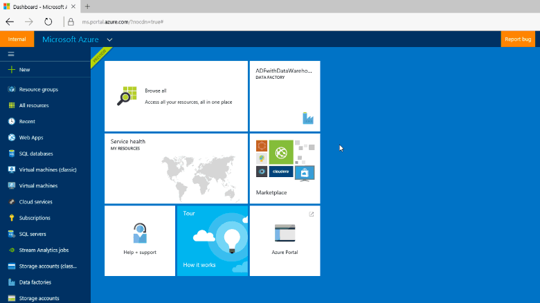
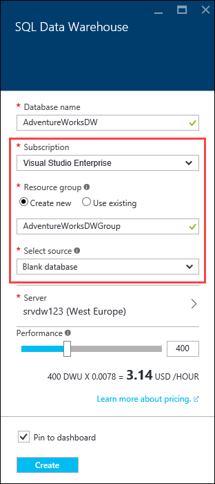
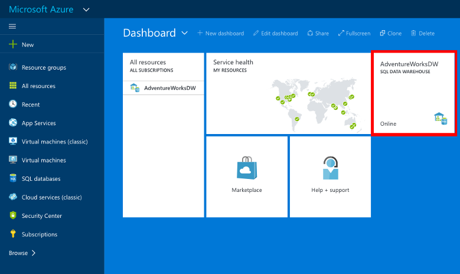

<properties
   pageTitle="Create a SQL Data Warehouse in the Azure Portal | Microsoft Azure"
   description="Learn how to create an Azure SQL Data Warehouse in the Azure Portal"
   services="sql-data-warehouse"
   documentationCenter="NA"
   authors="barbkess"
   manager="jhubbard"
   editor=""
   tags="azure-sql-data-warehouse"/>

<tags
   ms.service="sql-data-warehouse"
   ms.devlang="NA"
   ms.topic="get-started-article"
   ms.tgt_pltfrm="NA"
   ms.workload="data-services"
   ms.date="07/20/2016"
   ms.author="barbkess;lodipalm;sonyama"/>

# Create an Azure SQL Data Warehouse

> [AZURE.SELECTOR]
- [Azure Portal](sql-data-warehouse-get-started-provision.md)
- [TSQL](sql-data-warehouse-get-started-create-database-tsql.md)
- [PowerShell](sql-data-warehouse-get-started-provision-powershell.md)

In this tutorial you will use the Azure Portal to create a SQL Data Warehouse that contains an AdventureWorksDW sample database.

## Prerequisites

Before starting, be sure you have met the following prerequisites.

- **Azure Account**: See [Azure Free Trial][] or [MSDN Azure Credits][] to create an account.
- **V12 Azure SQL Server**:  See [Create an Azure SQL Database logical server with the Azure Portal][] or 
[Create an Azure SQL Database logical server with PowerShell][].

> [AZURE.NOTE] Creating a new SQL Data Warehouse may result in a new billable service.  See [SQL Data Warehouse pricing][] for more details on pricing.

## Create a SQL Data Warehouse

1. Sign in to the [Azure Portal](https://portal.azure.com).

2. Click **+ New** > **Data + Storage** > **SQL Data Warehouse**.

    

3. In the **SQL Data Warehouse** blade, fill in the information needed, then press 'Create' to create.

    

	- **Server**: We recommend you select your server first.  You can select an existing server or [create a new one](./sql-data-warehouse-get-started-new-server.md). 

	- **Database name**:The name that will be used to reference the SQL Data Warehouse.  It must be unique to the server.
	
    - **Performance**: We recommend starting with 400 DWUs. You can move the slider to the left or right to adjust the performance of your data warehouse, or scale up or down after creation.  To learn more about DWUs see our documentation on [scaling](./sql-data-warehouse-manage-compute-overview.md) or our [pricing page][SQL Data Warehouse pricing]. 

    - **Subscription**: Select the subscription that this SQL Data Warehouse will bill to.

    - **Resource group**: Resource groups are containers designed to help you manage a collection of Azure resources. Learn more about [resource groups](../resource-group-overview.md).

    - **Select source**: Click **Select source** > **Sample**. Since there is only one sample database available at this time, when you select Sample Azure automatically populates the **Select sample** option with AdventureWorksDW.

4. Click **Create** to create your SQL Data Warehouse.

5. Wait for a few minutes and your SQL Data Warehouse will be ready. When finished, you should be returned to the [Azure portal](https://portal.azure.com). You can find your SQL Data Warehouse on your dashboard, listed under your SQL Databases, or in the resource group that you used to create it. 

    

[AZURE.INCLUDE [SQL DataBase create server](../../includes/sql-database-create-new-server-firewall-portal.md)] 

## Next steps

Now that you have created a SQL Data Warehouse, you are ready to [Connect](./sql-data-warehouse-connect-overview.md) and begin querying.

To load data into SQL Data Warehouse, see the [loading overview](./sql-data-warehouse-overview-load.md).

If you are trying to migrate an existing database to SQL Data Warehouse, see the [Migration overview](./sql-data-warehouse-overview-migrate.md) or use [Migration Utility](./sql-data-warehouse-migrate-migration-utility.md).

It's also a great idea to take a look at our [Best practices][].

<!--Article references-->
[Create an Azure SQL Database logical server with the Azure Portal]: ../sql-database/sql-database-get-started.md#create-an-azure-sql-database-logical-server
[Create an Azure SQL Database logical server with PowerShell]: ../sql-database/sql-database-get-started-powershell.md#database-setup-create-a-resource-group-server-and-firewall-rule
[resource groups]: ../resource-group-template-deploy-portal.md
[Best practices]: ./sql-data-warehouse-best-practices.md

<!--MSDN references-->

<!--Other Web references-->
[SQL Data Warehouse pricing]: https://azure.microsoft.com/pricing/details/sql-data-warehouse/
[Azure Free Trial]: https://azure.microsoft.com/pricing/free-trial/?WT.mc_id=A261C142F
[MSDN Azure Credits]: https://azure.microsoft.com/pricing/member-offers/msdn-benefits-details/?WT.mc_id=A261C142F
