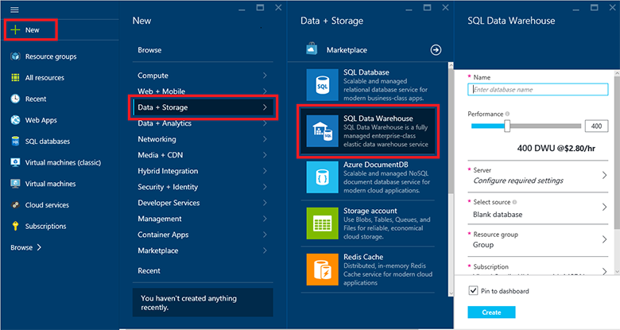
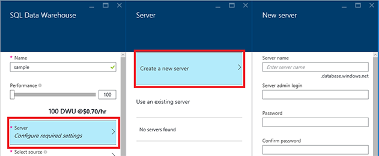
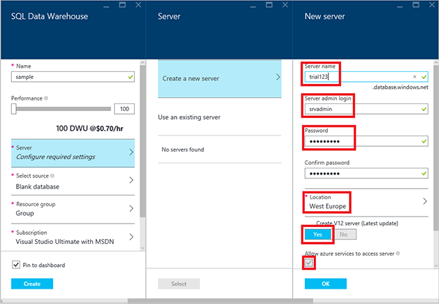
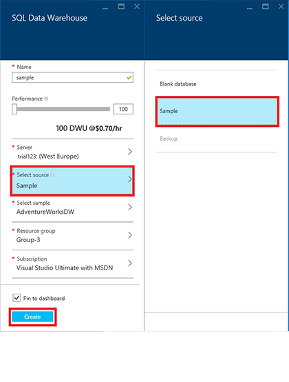
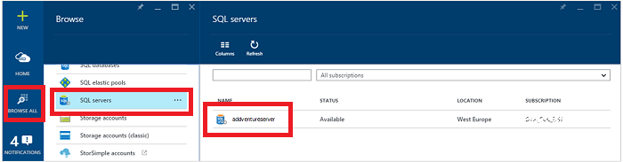

<properties
	pageTitle="Create a SQL Data Warehouse database in the Azure preview portal | Microsoft Azure"
	description="Learn how to create an Azure SQL Data Warehouse in the Azure preview portal"
	services="sql-data-warehouse"
	documentationCenter="NA"
	authors="barbkess"
	manager="jhubbard"
	editor=""
	tags="azure-sql-data-warehouse"/>
<tags
   ms.service="sql-data-warehouse"
   ms.devlang="NA"
   ms.topic="get-started-article"
   ms.tgt_pltfrm="NA"
   ms.workload="data-services"
   ms.date="10/01/2015"
   ms.author="lodipalm;barbkess"/>

# Create a SQL Data Warehouse in the Azure preview portal#

This tutorial shows you how to create an Azure SQL Data Warehouse database in just a few minutes in the Azure preview portal. 

In this walkthrough you will:

- Create a server for your database and assign it to a geographical location.
- Create a database and load it with AdventureWorksDW sample database.
- Configure a firewall for connecting to your server.

[AZURE.INCLUDE [free-trial-note](../../includes/free-trial-note.md)]

## Step 1: Sign in and get started

1. Sign in to the [preview portal](https://portal.azure.com).

2. On the Hub menu, click **New** > **Data + Storage** > **SQL Data Warehouse**.

	

1. The SQL Data Warehouse blade is where you will configure the database and assign the database to an Azure server.

## Step 2: Choose server settings
In Azure, a database is assigned to a server, and a server is assigned to a data center. The Azure server provides a consistent way to configure cloud-based databases that are physically stored in the same geographical location. 

You can assign multiple SQL Database and SQL Data Warehouse databases to the same Azure server. In fact, this can improve performance when you will be transferring data between the databases. 

As you create your database, you can also create a new Azure server to track your database, or you can use one that was created earlier. We'll set up a new one.

3. Click **Server** > **Create a new server**. If you already have a V12 server that you want to use, choose your existing server and go to the next step.

    

    >[AZURE.NOTE] We do not charge extra for the server. In Azure, even though a server is tied to a single data center, it is not physical hardware like it is for an on-premises server that hosts a database; it is part of the service software. This is why we sometimes call it a logical server. 
    > 
    >[AZURE.NOTE] Since the Azure server is a logical server, there is no impact on performance when you assign several databases to the same server. 

1. In the **New server** window, fill in the requested information. 

    Be sure to store the server name, admin name, and password somewhere.  You will need this information to log on to the server.
	- **Server Name**. Enter a name for your logical server.
	- **Server Admin Name**. Enter a user name for the server administrator account.
	- **Password**. Enter the server admin password. 
	- **Location**. Choose a geographical location that is close to you or your other Azure resources. This will reduce network latency since all databases and resources that belong to your logical server will be physically located in the same region. 

    

1. Click **OK** to save the server configuration settings.

## Step 3: Configure and create the database

In the **SQL Data Warehouse** blade, fill in the remaining fields. 

1. **Database name**: Enter a name for your SQL Data Warehouse database. In this example, we use sqldwdb.

2. **Performance**: We recommend starting with 400 DWU. If You can move the slider to the left or right to adjust the performance level for your database, both now and after the database is created. 

    > [AZURE.NOTE] Performance is measured in Data Warehouse Units (DWUs). As you increase DWUs, SQL Data Warehouse increases the computing resources available for your database operations. As you run your workload, you will be able to see how DWUs relate to your workload performance. 

	> [AZURE.NOTE] You can quickly and easily change the performance level after the database is created.  For example, if you are not using the database, move the slider to the left to reduce costs.  Or, increase performance when more resources are needed. This is the scalable power of SQL Data Warehouse.
	
1. **Select source**. You can create a blank database, or populate your database with a sample database. In this example we choose **Sample**. Since there is only one sample database available at this time, when you select Sample, Azure automatically populates the **Select sample** setting with AdventureWorksDW. 

    

2. **Resource group**. Keep the default values.Resource groups are containers designed to help you manage a collection of Azure resources. Learn more about [resource groups](../azure-portal/resource-group-portal.md).

3. **Subscription**. Select the subscription to bill for this database.

1. Click **Create** to create your SQL Data Warehouse database. 

1. Now, simply wait for a few minutes.  When finished, you will see your sample database on your home page.

    

## Step 4: Configure the firewall

You need to set up a firewall rule on the server that allows connections from your client computer'sIP address so you can work with the database. This not only helps make sure you can connect, it's a great way to see the area where you can get other details about your SQL servers in Azure. 

1. Click **Browse all**, scroll down and then click **SQL servers**, and then click the name of the server you created earlier from the list of **SQL servers**.

	

	
3. In the database properties blade that appears to the right, click **Settings** and then click **Firewall** from the list.

	

	The **Firewall settings** show your current **Client IP address**. 

	

4. Click **Add Client IP** to have Azure create a rule for that IP address, and then click **Save**.

	

	>[AZURE.IMPORTANT] You're IP address is likely to change from time to time, and you may not be able to access your server until you create a new firewall rule. You can check your IP address using [Bing](http://www.bing.com/search?q=my%20ip%20address), and then add a single IP address or a range of IP addresses. See [How to configure firewall settings](../sql-database/sql-database-configure-firewall-settings.md) for details.

## Next steps

Now that you have created a sample database for SQL Data Warehouse, learn about how to use SQL Data Warehouse in [Connect and query](./sql-data-warehouse-get-started-connect-query.md).

>[AZURE.NOTE] We want to make this article better. If you choose to answer "no" to the "Was this article helpful?" question, please include a brief suggestion about what is missing or how to improve the article. Thanks in advance!!

