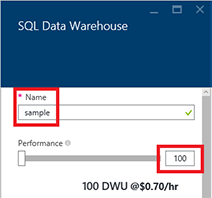

<properties
	pageTitle="Create a SQL Data Warehouse database in the Azure preview portal | Microsoft Azure"
	description="Learn how to create an Azure SQL Data Warehouse in the Azure preview portal"
	services="sql-data-warehouse"
	documentationCenter="NA"
	authors="lodipalm"
	manager="barbkess"
	editor=""
	tags="azure-sql-data-warehouse"/>
<tags
   ms.service="sql-data-warehouse"
   ms.devlang="NA"
   ms.topic="article"
   ms.tgt_pltfrm="NA"
   ms.workload="data-services"
   ms.date="09/29/2015"
   ms.author="lodipalm;barbkess"/>

# Create a SQL Data Warehouse in the Azure preview portal#

This tutorial shows you how easy it is to create an Azure SQL Data Warehouse in just a few minutes in the Azure preview portal. 

In this walkthrough you will:

- Create a new SQL data warehouse database.
- Create a server for your database
- Load AdventureWorksDW into your new database.

[AZURE.INCLUDE [free-trial-note](../../includes/free-trial-note.md)]

## Sign in and find SQL Data Warehouse

1. Sign in to the [preview portal](https://portal.azure.com).

2. On the Hub menu, click **New** > **Data + Storage** > **SQL Data Warehouse**.

	

## Configure performance and other basic settings

In the **SQL Data Warehouse** pane, fill in the following fields. **Server** and **Source** is configured in the next sections.

1. **Database name**: Enter a name for your SQL Data Warehouse database.

2. **Performance**: You can adjust the performance that your instance will start with while you are provisioning.  We recommend starting with 400 DWU as it will let you see more of the MPP benefits that SQL Data Warehouse offers. 
     
    

    > [AZURE.NOTE] We measure performance in Data Warehouse Units (DWUs). As you increase DWUs, SQL Data Warehouse increases the computing resources available for your data warehouse database operations. 

	> [AZURE.NOTE] You can quickly and easily change the performance level after the database is created.  For example, if you are not using the database, move the slider to the left to reduce costs.  Or, increase performance when more resources are needed. This is the scalable power of SQL Data Warehouse.
	

2. **Resource group**. Keep the default values.Resource groups are containers designed to help you manage a collection of Azure resources. Learn more about [resource groups](../azure-portal/resource-group-portal.md).
3. **Subscription**. Select the subscription to bill for this database.

## Configure a logical server

3. Click **Server** > **Create a new server**. This creates a logical server that your database will be associated with. If you already have a V12 server that you want to use, choose your existing server and go to the next section.

    

    >[AZURE.NOTE]  In SQL Data Warehouse and SQL Database, a server provides a consistent way to configure cloud-based databases. In Azure, even though a server is tied to a single data center, it is not physical hardware like it is for an on-premises instance of SQL Server; it is part of the service software. This is why we call it a logical server.  Please note that, unlike the real world, workloads running databases and data warehouses on the same server will not have a performance impact on each other.

1. In the **New server** window, fill in the requested information. 

    Be sure to store the server name, admin name, and password somewhere.  You will need this information to log on to the server.
	- **Server Name**. Enter a name for your logical server.
	- **Server Admin Name**. Enter a user name for the server administrator account.
	- **Password**. Enter the server admin password. 
	- **Location**. Choose a geographical location that is close to you or your other Azure resources. This will reduce network latency since all databases and resources that belong to your logical server will be physically located in the same region. 

    

1. Click **OK** to save the server configuration settings.

## Load sample database

1. Choose **Source** > **Sample** to initialize your new database with the sample database AdventureWorksDW. 

    

## Finish creating the database

1. Click **Create** to create your SQL Data Warehouse database. 

1. Now, all you have to do is wait for a few minutes.  When finished, you will see your sample database on your home page.

    

## Next steps

Now that you have created a sample database for SQL Data Warehouse, learn about how to use SQL Data Warehouse in this next walkthrough.

- [Connect and query](./sql-data-warehouse-get-started-connect-query.md).

	> [AZURE.NOTE] We want to make this article better. If you choose to answer "no" to the "Was this article helpful?" question, please include a brief suggestion about what is missing or how to improve the article. Thanks in advance!!

