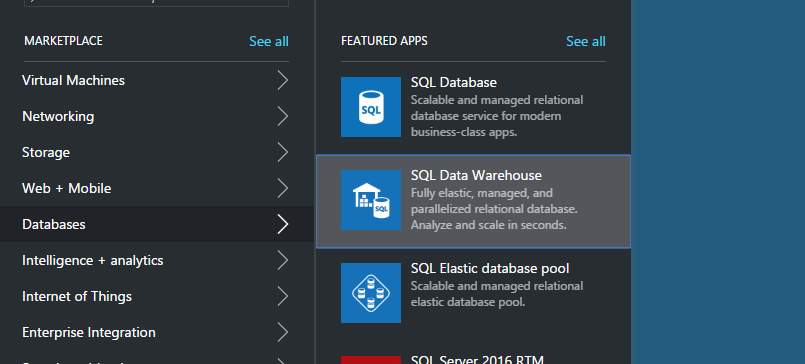
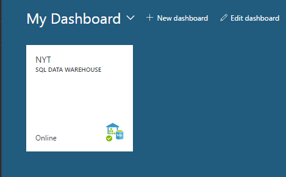
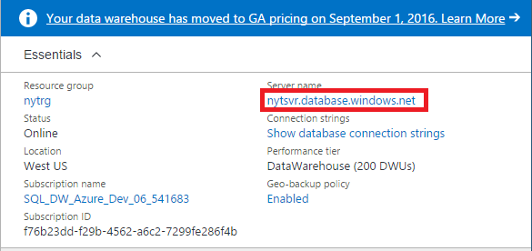
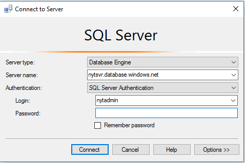
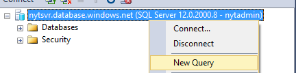
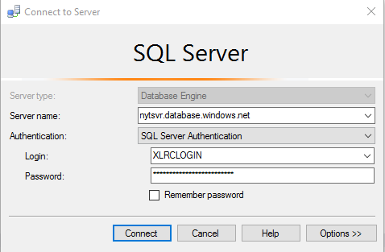
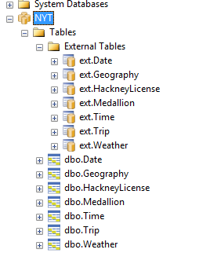
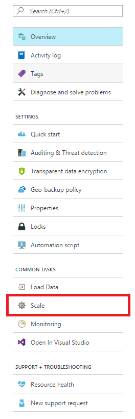
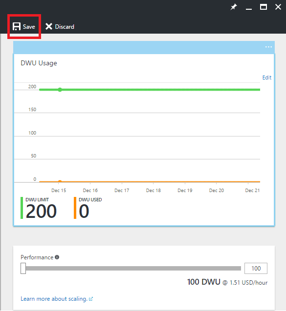

# Get started with SQL Data Warehouse

This tutorial shows how to provision and load data into Azure SQL Data Warehouse. You’ll also learn the basics about scaling, pausing, and tuning. When you’re finished, you’ll be ready to query and explore your data warehouse.

**Estimated time to complete:** This is an end-to-end tutorial with example code that takes about 30 minutes to complete once you have met the prerequisites. 

## Prerequisites

The tutorial assumes you are familiar with SQL Data Warehouse basic concepts. If you need an introduction, see [What is SQL Data Warehouse?](sql-data-warehouse-overview-what-is.md) 

### Sign up for Microsoft Azure
If you don't already have a Microsoft Azure account, you need to sign up for one to use this service. If you already have an account, you may skip this step. 

1. Navigate to the account pages [https://azure.microsoft.com/account/](https://azure.microsoft.com/account/)
2. Create a free Azure account, or purchase an account.
3. Follow the instructions

### Install appropriate SQL client drivers and tools

Most SQL client tools can connect to SQL Data Warehouse by using JDBC, ODBC, or ADO.NET. Due to the large number of T-SQL features that SQL Data Warehouse supports, some client applications are not fully compatible with SQL Data Warehouse.

If you are running a Windows operating system, we recommend using either [Visual Studio] or [SQL Server Management Studio].

[!INCLUDE [Create a new logical server](../../includes/sql-data-warehouse-create-logical-server.md)] 

[!INCLUDE [SQL Database create server](../../includes/sql-database-create-new-server-firewall-portal.md)]

## Create a SQL Data Warehouse

A SQL Data Warehouse is a special type of database that is designed for massively parallel processing. The database is distributed across multiple nodes and processes queries in parallel. SQL Data Warehouse has a control node that orchestrates the activities of all the nodes. The nodes themselves use SQL Database to manage your data.  

> [!NOTE]
> Creating a SQL Data Warehouse might result in a new billable service.  For more information, see [SQL Data Warehouse pricing](https://azure.microsoft.com/pricing/details/sql-data-warehouse/).
>

### Create a data warehouse

1. Sign into the [Azure portal](https://portal.azure.com).
2. Click **New** > **Databases** > **SQL Data Warehouse**.

    
    

3. Fill out deployment details

    **Database Name**: Pick anything you'd like. If you have multiple data warehouses, we recommend your names include details such as the region, environment, for example *mydw-westus-1-test*.

    **Subscription**: Your Azure subscription

    **Resource Group**: Create a resource group or use an existing resource group.
    > [!NOTE]
    > Resource groups are useful for resource administration such as scoping access control and templated deployment. Read more about Azure resource groups and best practices [here](https://docs.microsoft.com/azure/azure-resource-manager/resource-group-overview#resource-groups)

    **Source**: Blank Database

    **Server**: Select the server you created in [Prerequisites].

    **Collation**: Leave the default collation SQL_Latin1_General_CP1_CI_AS.

    **Select performance**: We recommend starting with the standard 400DWU.

4. Choose **Pin to dashboard**
    

5. Sit back and wait for your data warehouse to deploy! It's normal for this process to take several minutes. 
The portal notifies you when your data warehouse is ready to use. 

## Connect to SQL Data Warehouse

This tutorial uses SQL Server Management Studio (SSMS) to connect to the data warehouse. You can connect to SQL Data Warehouse through these supported connectors: ADO.NET, JDBC, ODBC, and PHP. Remember, functionality might be limited for tools that are not supported by Microsoft.


### Get connection information

To connect to your data warehouse, you need to connect through the logical SQL server you created in [Prerequisites].

1. Select your data warehouse from the dashboard or search for it in your resources.

    

2. Find the full name for the logical SQL server.

    

3. Open SSMS and use object explorer to connect to this server using the server admin credentials you created in [Prerequisites]

    

If all goes correctly, you should now be connected to your logical SQL server. Since you logged in as the server admin, you can connect to any database hosted by the server, including the master database. 

There is only one server admin account and it has the most privileges of any user. Be careful not to allow too many people in your organization to know the admin password. 

You can also have an Azure active directory admin account. We don't provide the details here. If you want to learn more about using Azure Active Directory authentication, see [Azure AD authentication](https://docs.microsoft.com/azure/sql-database/sql-database-aad-authentication).

Next, we explore creating additional logins and users.


## Create a database user

In this step, you create a user account to access your data warehouse. We also show you how to give that user the ability to run queries with a large amount of memory and CPU resources.

### Notes about resource classes for allocating resources to queries

- To keep your data safe, don't use the server admin to run queries on your production databases. It has the most privileges of any user and using it to perform operations on user data puts your data at risk. Also, since the server admin is meant to perform management operations, it runs operations with only a small allocation of memory and CPU resources. 

- SQL Data Warehouse uses pre-defined database roles, called resource classes, to allocate different amounts of memory, CPU resources, and concurrency slots to users. Each user can belong to a small, medium, large, or extra-large resource class. The user's resource class determines the resources the user has to run queries and load operations.

- For optimal data compression, the user may need to load with large or extra large resource allocations. Read more about resource classes [here](./sql-data-warehouse-develop-concurrency.md#resource-classes):

### Create an account that can control a database

Since you are currently logged in as the server admin you have permissions to create logins and users.

1. Using SSMS or another query client, open a new query for **master**.

    

    

2. In the query window, run this T-SQL command to create a login named MedRCLogin and user named LoadingUser. This login can connect to the logical SQL server.

    ```sql
    CREATE LOGIN MedRCLogin WITH PASSWORD = 'a123reallySTRONGpassword!';
    CREATE USER LoadingUser FOR LOGIN MedRCLogin;
    ```

3. Now querying the *SQL Data Warehouse database*, create a database user based on the login you created to access and perform operations on the database.

    ```sql
    CREATE USER LoadingUser FOR LOGIN MedRCLogin;
    ```

4. Give the database user control permissions to the database called NYT. 

    ```sql
    GRANT CONTROL ON DATABASE::[NYT] to LoadingUser;
    ```
    > [!NOTE]
    > If your database name has hyphens in it, be sure to wrap it in brackets! 
    >

### Give the user medium resource allocations

1. Run this T-SQL command to make it a member of the medium resource class, which is called mediumrc. 

    ```sql
    EXEC sp_addrolemember 'mediumrc', 'LoadingUser';
    ```
    > [!NOTE]
    > Click [here](sql-data-warehouse-develop-concurrency.md#resource-classes) to learn more about concurrency and resource classes! 
    >

2. Connect to the logical server with the new credentials

    


## Load data from Azure blob storage

You are now ready to load data into your data warehouse. This step shows you how to load New York City taxi cab data from a public Azure storage blob. 

- A common way to load data into SQL Data Warehouse is to first move the data to Azure blob storage, and then load it into your data warehouse. To make it easier to understand how to load, we have New York taxi cab data already hosted in a public Azure storage blob. 

- For future reference, to learn how to get your data to Azure blob storage or to load it directly from your source into SQL Data Warehouse, see the [loading overview](sql-data-warehouse-overview-load.md).


### Define external data

1. Create a master key. You only need to create a master key once per database. 

    ```sql
    CREATE MASTER KEY;
    ```

2. Define the location of the Azure blob that contains the taxi cab data.  

    ```sql
    CREATE EXTERNAL DATA SOURCE NYTPublic
    WITH
    (
        TYPE = Hadoop,
        LOCATION = 'wasbs://2013@nytpublic.blob.core.windows.net/'
    );
    ```

3. Define the external file formats

    The ```CREATE EXTERNAL FILE FORMAT``` command is used to specify the
    format of files that contain the external data. They contain text separated by one or more characters called delimiters. For demonstration purposes, the taxi cab data is stored both as uncompressed data and as gzip compressed data.

	Run these T-SQL commands to define two different formats: uncompressed and compressed.

    ```sql
    CREATE EXTERNAL FILE FORMAT uncompressedcsv
    WITH (
        FORMAT_TYPE = DELIMITEDTEXT,
        FORMAT_OPTIONS ( 
            FIELD_TERMINATOR = ',',
            STRING_DELIMITER = '',
            DATE_FORMAT = '',
            USE_TYPE_DEFAULT = False
        )
    );

    CREATE EXTERNAL FILE FORMAT compressedcsv
    WITH ( 
        FORMAT_TYPE = DELIMITEDTEXT,
        FORMAT_OPTIONS ( FIELD_TERMINATOR = '|',
            STRING_DELIMITER = '',
	    DATE_FORMAT = '',
            USE_TYPE_DEFAULT = False
        ),
        DATA_COMPRESSION = 'org.apache.hadoop.io.compress.GzipCodec'
    );
    ```

4.  Create a schema for your external file format. 

    ```sql
    CREATE SCHEMA ext;
    ```
5. Create the external tables. These tables reference data stored in Azure blob storage. Run the following T-SQL commands to create several external tables that all point to the Azure blob we defined previously in our external data source.

```sql
    CREATE EXTERNAL TABLE [ext].[Date] 
    (
        [DateID] int NOT NULL,
        [Date] datetime NULL,
        [DateBKey] char(10) COLLATE SQL_Latin1_General_CP1_CI_AS NULL,
        [DayOfMonth] varchar(2) COLLATE SQL_Latin1_General_CP1_CI_AS NULL,
        [DaySuffix] varchar(4) COLLATE SQL_Latin1_General_CP1_CI_AS NULL,
        [DayName] varchar(9) COLLATE SQL_Latin1_General_CP1_CI_AS NULL,
        [DayOfWeek] char(1) COLLATE SQL_Latin1_General_CP1_CI_AS NULL,
        [DayOfWeekInMonth] varchar(2) COLLATE SQL_Latin1_General_CP1_CI_AS NULL,
        [DayOfWeekInYear] varchar(2) COLLATE SQL_Latin1_General_CP1_CI_AS NULL,
        [DayOfQuarter] varchar(3) COLLATE SQL_Latin1_General_CP1_CI_AS NULL,
        [DayOfYear] varchar(3) COLLATE SQL_Latin1_General_CP1_CI_AS NULL,
        [WeekOfMonth] varchar(1) COLLATE SQL_Latin1_General_CP1_CI_AS NULL,
        [WeekOfQuarter] varchar(2) COLLATE SQL_Latin1_General_CP1_CI_AS NULL,
        [WeekOfYear] varchar(2) COLLATE SQL_Latin1_General_CP1_CI_AS NULL,
        [Month] varchar(2) COLLATE SQL_Latin1_General_CP1_CI_AS NULL,
        [MonthName] varchar(9) COLLATE SQL_Latin1_General_CP1_CI_AS NULL,
        [MonthOfQuarter] varchar(2) COLLATE SQL_Latin1_General_CP1_CI_AS NULL,
        [Quarter] char(1) COLLATE SQL_Latin1_General_CP1_CI_AS NULL,
        [QuarterName] varchar(9) COLLATE SQL_Latin1_General_CP1_CI_AS NULL,
        [Year] char(4) COLLATE SQL_Latin1_General_CP1_CI_AS NULL,
        [YearName] char(7) COLLATE SQL_Latin1_General_CP1_CI_AS NULL,
        [MonthYear] char(10) COLLATE SQL_Latin1_General_CP1_CI_AS NULL,
        [MMYYYY] char(6) COLLATE SQL_Latin1_General_CP1_CI_AS NULL,
        [FirstDayOfMonth] date NULL,
        [LastDayOfMonth] date NULL,
        [FirstDayOfQuarter] date NULL,
        [LastDayOfQuarter] date NULL,
        [FirstDayOfYear] date NULL,
        [LastDayOfYear] date NULL,
        [IsHolidayUSA] bit NULL,
        [IsWeekday] bit NULL,
        [HolidayUSA] varchar(50) COLLATE SQL_Latin1_General_CP1_CI_AS NULL
    )
    WITH
    (
        LOCATION = 'Date',
        DATA_SOURCE = NYTPublic,
        FILE_FORMAT = uncompressedcsv,
        REJECT_TYPE = value,
        REJECT_VALUE = 0
    );
    
    CREATE EXTERNAL TABLE [ext].[Geography]
    (
        [GeographyID] int NOT NULL,
        [ZipCodeBKey] varchar(10) COLLATE SQL_Latin1_General_CP1_CI_AS NOT NULL,
        [County] varchar(50) COLLATE SQL_Latin1_General_CP1_CI_AS NULL,
        [City] varchar(50) COLLATE SQL_Latin1_General_CP1_CI_AS NULL,
        [State] varchar(50) COLLATE SQL_Latin1_General_CP1_CI_AS NULL,
        [Country] varchar(50) COLLATE SQL_Latin1_General_CP1_CI_AS NULL,
        [ZipCode] varchar(50) COLLATE SQL_Latin1_General_CP1_CI_AS NULL
    )
    WITH
    (
        LOCATION = 'Geography',
        DATA_SOURCE = NYTPublic,
        FILE_FORMAT = uncompressedcsv,
        REJECT_TYPE = value,
        REJECT_VALUE = 0 
    );
        
    
    CREATE EXTERNAL TABLE [ext].[HackneyLicense]
    (
        [HackneyLicenseID] int NOT NULL,
        [HackneyLicenseBKey] varchar(50) COLLATE SQL_Latin1_General_CP1_CI_AS NOT NULL,
        [HackneyLicenseCode] varchar(50) COLLATE SQL_Latin1_General_CP1_CI_AS NULL
    )
    WITH
    (
        LOCATION = 'HackneyLicense',
        DATA_SOURCE = NYTPublic,
        FILE_FORMAT = uncompressedcsv,
        REJECT_TYPE = value,
        REJECT_VALUE = 0
    )
    ;
        
    
    CREATE EXTERNAL TABLE [ext].[Medallion]
    (
        [MedallionID] int NOT NULL,
        [MedallionBKey] varchar(50) COLLATE SQL_Latin1_General_CP1_CI_AS NOT NULL,
        [MedallionCode] varchar(50) COLLATE SQL_Latin1_General_CP1_CI_AS NULL
    )
    WITH
    (
        LOCATION = 'Medallion',
        DATA_SOURCE = NYTPublic,
        FILE_FORMAT = uncompressedcsv,
        REJECT_TYPE = value,
        REJECT_VALUE = 0
    )
    ;
        
    CREATE EXTERNAL TABLE [ext].[Time]
    (
        [TimeID] int NOT NULL,
        [TimeBKey] varchar(8) COLLATE SQL_Latin1_General_CP1_CI_AS NOT NULL,
        [HourNumber] tinyint NOT NULL,
        [MinuteNumber] tinyint NOT NULL,
        [SecondNumber] tinyint NOT NULL,
        [TimeInSecond] int NOT NULL,
        [HourlyBucket] varchar(15) COLLATE SQL_Latin1_General_CP1_CI_AS NOT NULL,
        [DayTimeBucketGroupKey] int NOT NULL,
        [DayTimeBucket] varchar(100) COLLATE SQL_Latin1_General_CP1_CI_AS NOT NULL
    )
    WITH
    (
        LOCATION = 'Time',
        DATA_SOURCE = NYTPublic,
        FILE_FORMAT = uncompressedcsv,
        REJECT_TYPE = value,
        REJECT_VALUE = 0
    )
    ;
    
    
    CREATE EXTERNAL TABLE [ext].[Trip]
    (
        [DateID] int NOT NULL,
        [MedallionID] int NOT NULL,
        [HackneyLicenseID] int NOT NULL,
        [PickupTimeID] int NOT NULL,
        [DropoffTimeID] int NOT NULL,
        [PickupGeographyID] int NULL,
        [DropoffGeographyID] int NULL,
        [PickupLatitude] float NULL,
        [PickupLongitude] float NULL,
        [PickupLatLong] varchar(50) COLLATE SQL_Latin1_General_CP1_CI_AS NULL,
        [DropoffLatitude] float NULL,
        [DropoffLongitude] float NULL,
        [DropoffLatLong] varchar(50) COLLATE SQL_Latin1_General_CP1_CI_AS NULL,
        [PassengerCount] int NULL,
        [TripDurationSeconds] int NULL,
        [TripDistanceMiles] float NULL,
        [PaymentType] varchar(50) COLLATE SQL_Latin1_General_CP1_CI_AS NULL,
        [FareAmount] money NULL,
        [SurchargeAmount] money NULL,
        [TaxAmount] money NULL,
        [TipAmount] money NULL,
        [TollsAmount] money NULL,
        [TotalAmount] money NULL
    )
    WITH
    (
        LOCATION = 'Trip2013',
        DATA_SOURCE = NYTPublic,
        FILE_FORMAT = compressedcsv,
        REJECT_TYPE = value,
        REJECT_VALUE = 0
    )
    ;
    
    CREATE EXTERNAL TABLE [ext].[Weather]
    (
        [DateID] int NOT NULL,
        [GeographyID] int NOT NULL,
        [PrecipitationInches] float NOT NULL,
        [AvgTemperatureFahrenheit] float NOT NULL
    )
    WITH
    (
        LOCATION = 'Weather2013',
        DATA_SOURCE = NYTPublic,
        FILE_FORMAT = uncompressedcsv,
        REJECT_TYPE = value,
        REJECT_VALUE = 0
    )
    ;
```

### Import the data from Azure blob storage.

SQL Data Warehouse supports a key statement called CREATE TABLE AS SELECT (CTAS). This statement creates a new table based on the results of a select statement. The new table has the same columns and data types as the results of the select statement.  This is an elegant way to import data from Azure blob storage into SQL Data Warehouse.

1. Run this script to import your data.

    ```sql
    CREATE TABLE [dbo].[Date]
    WITH
    ( 
        DISTRIBUTION = ROUND_ROBIN,
        CLUSTERED COLUMNSTORE INDEX
    )
    AS SELECT * FROM [ext].[Date]
    OPTION (LABEL = 'CTAS : Load [dbo].[Date]')
    ;
    
    CREATE TABLE [dbo].[Geography]
    WITH
    ( 
        DISTRIBUTION = ROUND_ROBIN,
        CLUSTERED COLUMNSTORE INDEX
    )
    AS
    SELECT * FROM [ext].[Geography]
    OPTION (LABEL = 'CTAS : Load [dbo].[Geography]')
    ;
    
    CREATE TABLE [dbo].[HackneyLicense]
    WITH
    ( 
        DISTRIBUTION = ROUND_ROBIN,
        CLUSTERED COLUMNSTORE INDEX
    )
    AS SELECT * FROM [ext].[HackneyLicense]
    OPTION (LABEL = 'CTAS : Load [dbo].[HackneyLicense]')
    ;
    
    CREATE TABLE [dbo].[Medallion]
    WITH
    (
        DISTRIBUTION = ROUND_ROBIN,
        CLUSTERED COLUMNSTORE INDEX
    )
    AS SELECT * FROM [ext].[Medallion]
    OPTION (LABEL = 'CTAS : Load [dbo].[Medallion]')
    ;
    
    CREATE TABLE [dbo].[Time]
    WITH
    (
        DISTRIBUTION = ROUND_ROBIN,
        CLUSTERED COLUMNSTORE INDEX
    )
    AS SELECT * FROM [ext].[Time]
    OPTION (LABEL = 'CTAS : Load [dbo].[Time]')
    ;
    
    CREATE TABLE [dbo].[Weather]
    WITH
    ( 
        DISTRIBUTION = ROUND_ROBIN,
        CLUSTERED COLUMNSTORE INDEX
    )
    AS SELECT * FROM [ext].[Weather]
    OPTION (LABEL = 'CTAS : Load [dbo].[Weather]')
    ;
    
    CREATE TABLE [dbo].[Trip]
    WITH
    (
        DISTRIBUTION = ROUND_ROBIN,
        CLUSTERED COLUMNSTORE INDEX
    )
    AS SELECT * FROM [ext].[Trip]
    OPTION (LABEL = 'CTAS : Load [dbo].[Trip]')
    ;
    ```

2. View your data as it loads.

   You’re loading several GBs of data and compressing it into highly performant clustered columnstore indexes. Run the following query that uses a dynamic management views (DMVs) to show the status of the load. After starting the query, grab a coffee and a snack while SQL Data Warehouse does some heavy lifting.
    
    ```sql
    SELECT
        r.command,
        s.request_id,
        r.status,
        count(distinct input_name) as nbr_files,
        sum(s.bytes_processed)/1024/1024 as gb_processed
    FROM 
        sys.dm_pdw_exec_requests r
        INNER JOIN sys.dm_pdw_dms_external_work s
        ON r.request_id = s.request_id
    WHERE
        r.[label] = 'CTAS : Load [dbo].[Date]' OR
        r.[label] = 'CTAS : Load [dbo].[Geography]' OR
        r.[label] = 'CTAS : Load [dbo].[HackneyLicense]' OR
        r.[label] = 'CTAS : Load [dbo].[Medallion]' OR
        r.[label] = 'CTAS : Load [dbo].[Time]' OR
        r.[label] = 'CTAS : Load [dbo].[Weather]' OR
        r.[label] = 'CTAS : Load [dbo].[Trip]'
    GROUP BY
        r.command,
        s.request_id,
        r.status
    ORDER BY
        nbr_files desc, 
        gb_processed desc;
    ```

3. View all system queries.

    ```sql
    SELECT * FROM sys.dm_pdw_exec_requests;
    ```

4. Enjoy seeing your data nicely loaded into your Azure SQL Data Warehouse.

    


## Improve query performance

There are several ways to improve query performance and to achieve the high-speed performance that SQL Data Warehouse is designed to provide.  

### See the effect of scaling on query performance 

One way to improve query performance is to scale resources by changing the DWU service level for your data warehouse. Each service level costs more, but you can scale back or pause resources at any time. 

In this step, you compare performance at two different DWU settings.

First, let's scale the sizing down to 100 DWU so we can get an idea of how one compute node might perform on its own.

1. Go to the portal and select your SQL Data Warehouse.

2. Select scale in the SQL Data Warehouse blade. 

    

3. Scale down the performance bar to 100 DWU and hit save.

    

4. Wait for your scale operation to finish.

    > [!NOTE]
    > Queries cannot run while changing the scale. Scaling **kills** your currently running queries. You can restart them when the operation is finished.
    >
    
5. Do a scan operation on the trip data, selecting the top million entries for all the columns. If you're eager to move on quickly, feel free to select fewer rows. Take note of the time it takes to run this operation.

    ```sql
    SELECT TOP(1000000) * FROM dbo.[Trip]
    ```
6. Scale your data warehouse back to 400 DWU. Remember, each 100 DWU is adding another compute node to your Azure SQL Data Warehouse.

7. Run the query again! You should notice a significant difference. 

> [!NOTE]
> Since SQL Data Warehouse uses massively parallel processing. Queries that scan or perform analytic functions on millions of rows experience the true power of
> Azure SQL Data Warehouse.
>

### See the effect of statistics on query performance

1. Run a query that joins the Date table with the Trip table

    ```sql
    SELECT TOP (1000000) 
        dt.[DayOfWeek],
        tr.[MedallionID],
        tr.[HackneyLicenseID],
        tr.[PickupTimeID],
        tr.[DropoffTimeID],
        tr.[PickupGeographyID],
        tr.[DropoffGeographyID],
        tr.[PickupLatitude],
        tr.[PickupLongitude],
        tr.[PickupLatLong],
        tr.[DropoffLatitude],
        tr.[DropoffLongitude],
        tr.[DropoffLatLong],
        tr.[PassengerCount],
        tr.[TripDurationSeconds],
        tr.[TripDistanceMiles],
        tr.[PaymentType],
        tr.[FareAmount],
        tr.[SurchargeAmount],
        tr.[TaxAmount],
        tr.[TipAmount],
        tr.[TollsAmount],
        tr.[TotalAmount]
    FROM [dbo].[Trip] as tr
        JOIN dbo.[Date] as dt
        ON  tr.DateID = dt.DateID
    ```

    This query takes a while because SQL Data Warehouse has to shuffle data before it can perform the join. Joins do not have to shuffle data if they are designed to join data in the same way it is distributed. That's a deeper subject. 

2. Statistics make a difference. 
3. Run this statement to create statistics on the join columns.

    ```sql
    CREATE STATISTICS [dbo.Date DateID stats] ON dbo.Date (DateID);
    CREATE STATISTICS [dbo.Trip DateID stats] ON dbo.Trip (DateID);
    ```

    > [!NOTE]
    > SQL DW does not automatically manage statistics for you. Statistics are important for query
    > performance and it is highly recommended you create and update statistics.
    > 
    > **You gain the most benefit by having statistics on columns involved in joins, columns
    > used in the WHERE clause and columns found in GROUP BY.**
    >

3. Run the query from Prerequisites again and observe any performance differences. While the differences in query performance will not be as drastic as scaling up, you should notice a  speed-up. 

## Next steps

You're now ready to query and explore. Check out our best practices or tips.

If you're done exploring for the day, make sure to pause your instance! In production, you can experience enormous 
savings by pausing and scaling to meet your business needs.


## Useful readings

[Concurrency and Workload Management][]

[Best practices for Azure SQL Data Warehouse][]

[Query Monitoring][]

[Top 10 Best Practices for Building a Large Scale Relational Data Warehouse][]

[Migrating Data to Azure SQL Data Warehouse][]

[Concurrency and Workload Management]: sql-data-warehouse-develop-concurrency.md#change-a-user-resource-class-example
[Best practices for Azure SQL Data Warehouse]: sql-data-warehouse-best-practices.md#hash-distribute-large-tables
[Query Monitoring]: sql-data-warehouse-manage-monitor.md
[Top 10 Best Practices for Building a Large Scale Relational Data Warehouse]: https://blogs.msdn.microsoft.com/sqlcat/2013/09/16/top-10-best-practices-for-building-a-large-scale-relational-data-warehouse/
[Migrating Data to Azure SQL Data Warehouse]: https://blogs.msdn.microsoft.com/sqlcat/2016/08/18/migrating-data-to-azure-sql-data-warehouse-in-practice/


[!INCLUDE [Additional Resources](../../includes/sql-data-warehouse-article-footer.md)]

<!-- Internal Links -->
[Prerequisites]: sql-data-warehouse-get-started-tutorial.md#prerequisites

<!--Other Web references-->
[Visual Studio]: https://www.visualstudio.com/
[SQL Server Management Studio]: https://msdn.microsoft.com/en-us/library/mt238290.aspx
