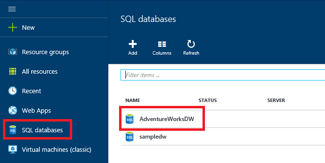
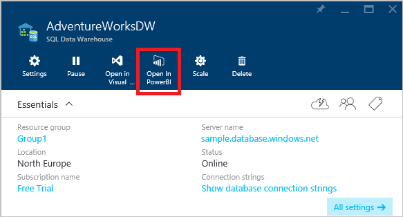
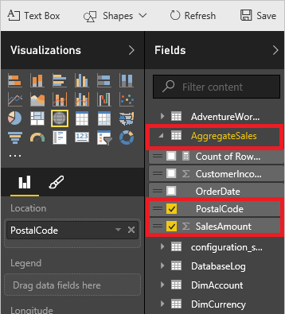
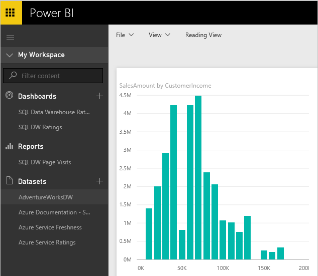

# Visualize data with Power BI
This tutorial shows you how to use Power BI to connect to SQL Data Warehouse and create a few basic visualizations.

> [!VIDEO https://channel9.msdn.com/Blogs/Azure/Azure-SQL-Data-Warehouse-Sample-Data-and-PowerBI/player]
> 
> 

## Prerequisites
To step through this tutorial, you need:

* A SQL Data Warehouse pre-loaded with the AdventureWorksDW database. To provision a data warehouse, see [Create a SQL Data Warehouse](create-data-warehouse-portal.md) and choose to load the sample data. If you already have a data warehouse but do not have sample data, you can [load WideWorldImportersDW](load-data-wideworldimportersdw.md).

## 1. Connect to your database
To open Power BI and connect to your AdventureWorksDW database:

1. Sign into the [Azure portal](https://portal.azure.com/).
2. Click **SQL databases** and choose your AdventureWorks SQL Data Warehouse database.
   
    
3. Click the 'Open in Power BI' button.
   
    
4. You should now see the SQL Data Warehouse connection page displaying your database web address. Click next.
   
    
5. Enter your Azure SQL server username and password.
   
    
6. To open the database, click the AdventureWorksDW dataset on the left blade.
   
    

## 2. Create a report
You are now ready to use Power BI to analyze your AdventureWorksDW sample data. To perform the analysis, AdventureWorksDW has a view called AggregateSales. This view contains a few of the key metrics for analyzing the sales of the company.

1. To create a map of sales amount according to postal code, in the right-hand fields pane, click the AggregateSales view to expand it. Click the PostalCode and SalesAmount columns to select them.
   
    
   
    Power BI automatically recognized geographic data and put it in a map for you.
   
    

2. This step creates a bar graph that shows amount of sales per customer income. To create the bar graph, go to the expanded AggregateSales view. Click the SalesAmount field. Drag the Customer Income field to the left and drop it into Axis.
   
    
   
    The bar chart over the left.
   
    
3. This step creates a line chart that shows sales amount per order date. To create the line chart, go to the expanded AggregateSales view. Click SalesAmount and OrderDate. In the Visualizations column, click the Line Chart icon, which is the first icon in the second line under visualizations.
   
    
   
    You now have a report that shows three different visualizations of the data.
   
    

You can save your progress at any time by clicking **File** and selecting **Save**.

## Using Direct Connect
As with Azure SQL Database, SQL Data Warehouse Direct Connect allows  logical pushdown alongside the analytical capabilities of Power BI. With Direct Connect, queries are sent back to your Azure SQL Data Warehouse in real-time as you explore the data.  This feature, combined with the scale of SQL Data Warehouse, enables you to create dynamic reports in minutes against terabytes of data. In addition, the introduction of the Open in Power BI button allows users to directly connect Power BI to their SQL Data Warehouse without collecting information from other parts of Azure.

When using Direct Connect:

* Specify the fully qualified server name when connecting.
* Ensure firewall rules for the database are configured to Allow access to Azure services.
* Every action such as selecting a column, or adding a filter, directly queries the data warehouse.
* Tiles are refreshed automatically and approximately every 15 minutes.
* Q&A is not available for Direct Connect datasets.
* Schema changes are incorporated automatically.
* All Direct Connect queries will time out after 2 minutes.

These restrictions and notes may change as the experiences improve.

## Next steps
Now that we've given you some time to warm up with the sample data, see how to [develop](sql-data-warehouse-overview-develop.md) or [load](design-elt-data-loading.md). Or take a look at the [Power BI website](https://www.powerbi.com/).
