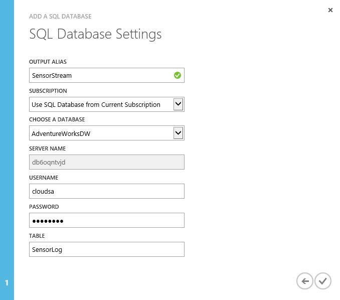

# Use Azure Stream Analytics with Azure Synapse Analytics
Azure Stream Analytics is a fully managed service providing low-latency, highly available, scalable complex event processing over streaming data in the cloud. You can learn the basics by reading [Introduction to Azure Stream Analytics](../stream-analytics/stream-analytics-introduction.md). You can then learn how to create an end-to-end solution with Stream Analytics by following the [Get started using Azure Stream Analytics](../stream-analytics/stream-analytics-real-time-fraud-detection.md) tutorial.

In this article, you will learn how to use your data warehouse database as an output sink for your Stream Analytics jobs.

## Prerequisites
First, run through the following steps in the [Get started using Azure Stream Analytics](../stream-analytics/stream-analytics-real-time-fraud-detection.md) tutorial.  

1. Create an Event Hub input
2. Configure and start event generator application
3. Provision a Stream Analytics job
4. Specify job input and query

Then, create an Azure SQL Data Warehouse database

## Specify job output: Azure SQL Data Warehouse database
### Step 1
In your Stream Analytics job click **OUTPUT** from the top of the page, and then click **ADD**.

### Step 2
Select SQL Database.

### Step 3
Enter the following values on the next page:

* *Output Alias*: Enter a friendly name for this job output.
* *Subscription*:
  * If your SQL Data Warehouse database is in the same subscription as the Stream Analytics job, select Use SQL Database from Current Subscription.
  * If your database is in a different subscription, select Use SQL Database from Another Subscription.
* *Database*: Specify the name of a destination database.
* *Server Name*: Specify the server name for the database you just specified. You can use the Azure portal to find this.

* *User Name*: Specify the user name of an account that has write permissions for the database.
* *Password*: Provide the password for the specified user account.
* *Table*: Specify the name of the target table in the database.

### Step 4
Click the check button to add this job output and to verify that Stream Analytics can successfully connect to the database.

When the connection to the database succeeds, you will see a notification in the portal. You can click Test to test the connection to the database.

## Next steps
For an overview of integration, see [Integrate other services](sql-data-warehouse-overview-integrate.md).
For more development tips, see [ Design decisions and coding techniques for data warehouses](../synapse-analytics/sql-analytics/development-overview.md).

