---

title: Load data into Azure SQL Data Warehouse – Data Factory | Microsoft Docs
description: This tutorial loads data into Azure SQL Data Warehouse by using Azure Data Factory, and uses a SQL Server database as the data source.
services: sql-data-warehouse
documentationcenter: NA
author: linda33wj
manager: jhubbard
editor: ''
tags: azure-sql-data-warehouse;azure-data-factory

ms.service: sql-data-warehouse
ms.workload: data-management
ms.tgt_pltfrm: na
ms.devlang: na
ms.topic: article
ms.custom: loading
ms.date: 02/08/2017
ms.author: jingwang;kevin;barbkess

---

# Load data into SQL Data Warehouse with Data Factory

You can use Azure Data Factory to load data into Azure SQL Data Warehouse from any of the [supported source data stores](../data-factory/data-factory-data-movement-activities.md#supported-data-stores-and-formats). For example, you can load data from an Azure SQL database or an Oracle database into a SQL data warehouse by using Data Factory. Tutorial in this article shows you how to load data from an on-premises SQL Server database into a SQL data warehouse.

**Time estimate**: This tutorial takes about 10-15 minutes to complete once the prerequisites are met.

## Prerequisites

- You need a **SQL Server database** with tables that contain the data to be copied over to the SQL data warehouse.  

- You need an online **SQL Data Warehouse**. If you do not already have a data warehouse, learn how to [Create an Azure SQL Data Warehouse](sql-data-warehouse-get-started-provision.md).

- You need an **Azure Storage Account**. If you do not already have a storage account, learn how to [Create a storage account](../storage/storage-create-storage-account.md). For best performance, locate the storage account and the data warehouse in the same Azure region.

## Configure a data factory
1. Log in to the [Azure portal][].
2. Locate your data warehouse and click to open it.
3. In the main blade, click **Load Data** > **Azure Data Factory**.

    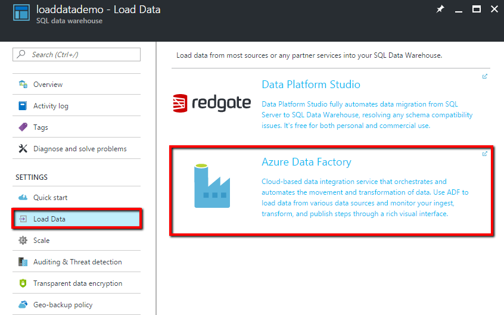

4. If you do not have a data factory in your Azure subscription, you see a **New Data Factory** dialog box in a separate tab of the browser. Fill in the requested information, and click **Create**. After the data factory is created, the **New Data Factory** dialog box closes, and you see the **Select Data Factory** dialog box.

	If you have one or more data factories already in the Azure subscription, you see the **Select Data Factory** dialog box. In this dialog box, you can either select an existing data factory or click **Create new data factory** to create a new one.

    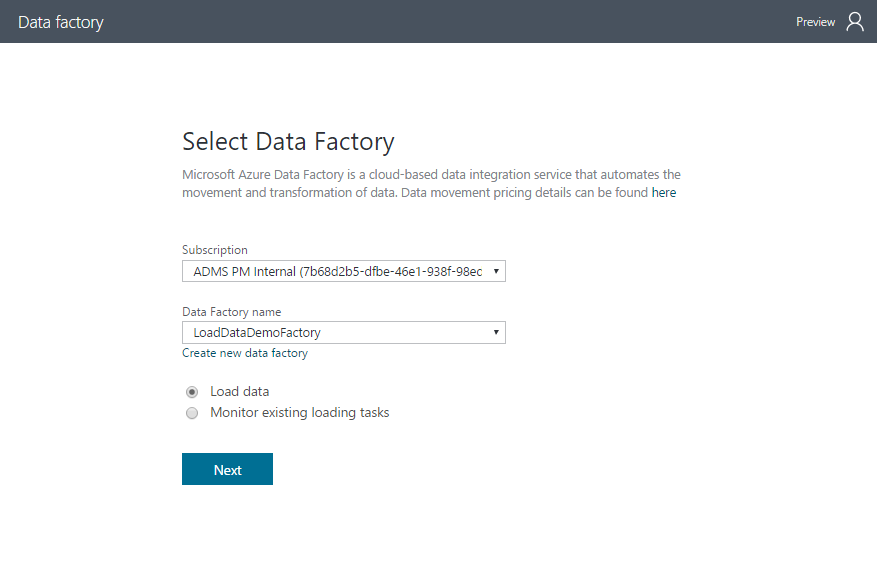

5. In the **Select Data Factory** dialog box, the **Load data** option is selected by default. Click **Next** to start creating a data loading task.

## Configure the data factory properties
Now that you have created a data factory, the next step is to configure the data loading schedule.

1. For **Task name**, enter **DWLoadData-fromSQLServer**.
2. Use the default **Run once now** option, click **Next**.

	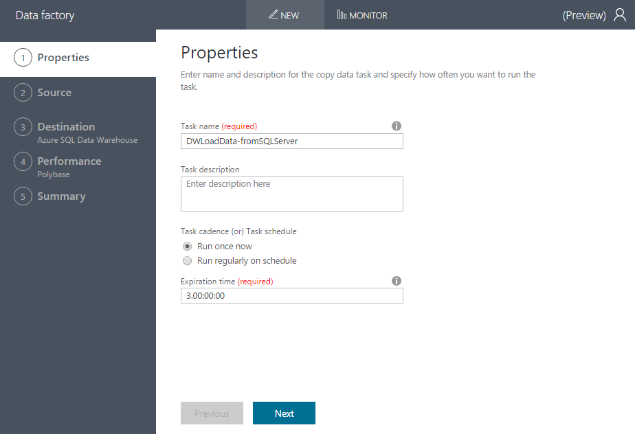

## Configure the source data store and gateway
Now you tell Data Factory about the on-premises SQL Server database from which you want to load data.

1. Choose **SQL Server** from the supported source data store catalog, and click **Next**.

	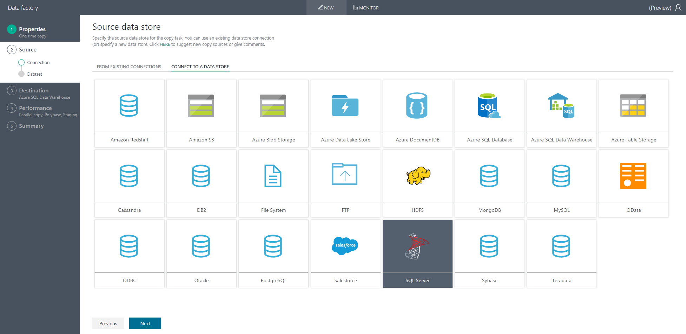

2. A **Specify the on-premises SQL Server database** dialog appears. The first  **Connection name** field is auto filled in. The second field asks for the name of the **Gateway**. If you are using an existing data factory that already has a gateway, you can reuse the gateway by selecting it from the drop-down list. Click the **Create Gateway** link to create a Data Management Gateway.  

	> [!NOTE]
	> If the source data store is on-premises or in an Azure IaaS virtual machine, a Data Management Gateway is required. A gateway has a 1-1 relationship with a data factory. It cannot be used from another data factory, but it can be used by multiple data loading tasks with in the same data factory. A gateway can be used to connect to multiple data stores when running data loading tasks.
	>
	> For detailed information about the gateway, see [Data Management Gateway](../data-factory/data-factory-data-management-gateway.md) article.

3. A **Create Gateway** dialog box appears. For Name, enter **GatewayForDWLoading**, and click **Create**.

4. A **Configure Gateway** dialog box appears. Click **Launch express setup on this computer** to automatically download, install, and register Data Management Gateway on your current machine. The progress is shown in a pop-up window. If the machine cannot connect to the data store, you can manually [download and install the gateway](https://www.microsoft.com/download/details.aspx?id=39717) on a machine that can connect to the data store, and then use the key to register.
	> [!NOTE]
	> The express setup works natively with Microsoft Edge and Internet Explorer. If you are using Google Chrome, first install the ClickOnce extension from Chrome web store.

    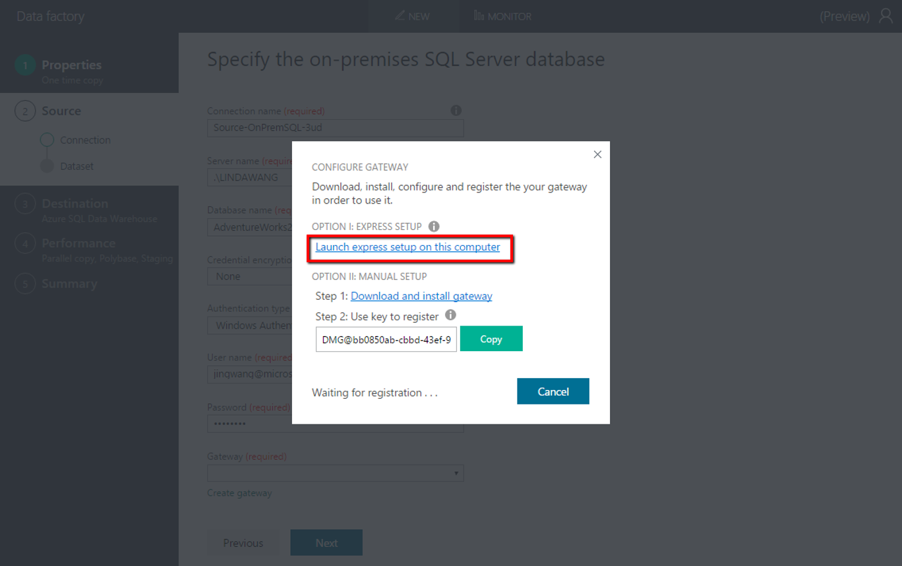

5. Wait for the gateway setup to complete. Once the gateway is successfully registered and is online, the pop-up window closes and the new gateway appears in the gateway field. Then fill in the rest required fields as follows, then click **Next**.
    - **Server name**: Name of the on-premises SQL Server.
    - **Database name**: SQL Server database.
    - **Credential encryption**: Use the default "By web browser".
    - **Authentication type**: Choose the type of authentication you are using.
    - **User name** and **password**: Enter the user name and password for a user who has permission to copy the data.

    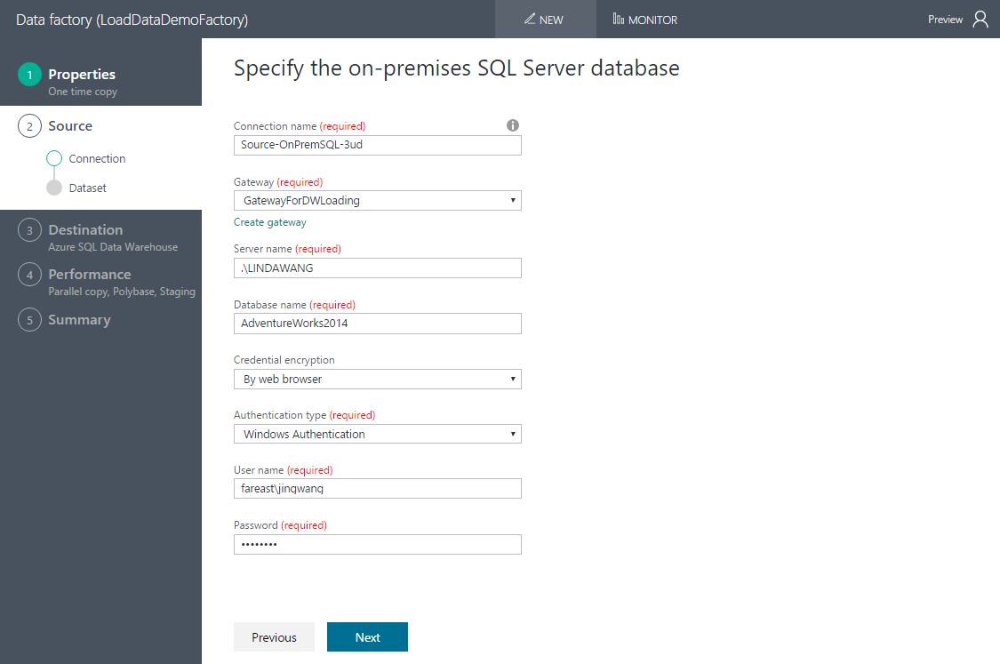

6. The next step is to choose the tables from which to copy the data. You can filter the tables by using keywords. And you can preview the data and table schema in the bottom panel. After you finish your selection, click **Next**.

	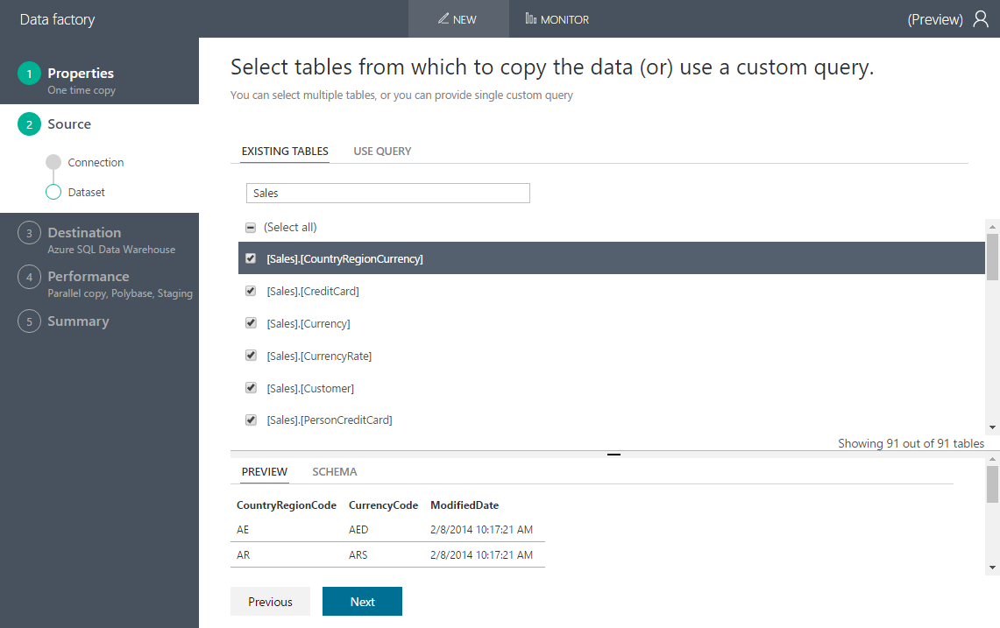

## Configure the destination, your SQL Data Warehouse

Now you tell Data Factory about the destination information.

1. Your SQL Data Warehouse connection information is filled in automatically. Enter the password for the user name. and click **Next**.

	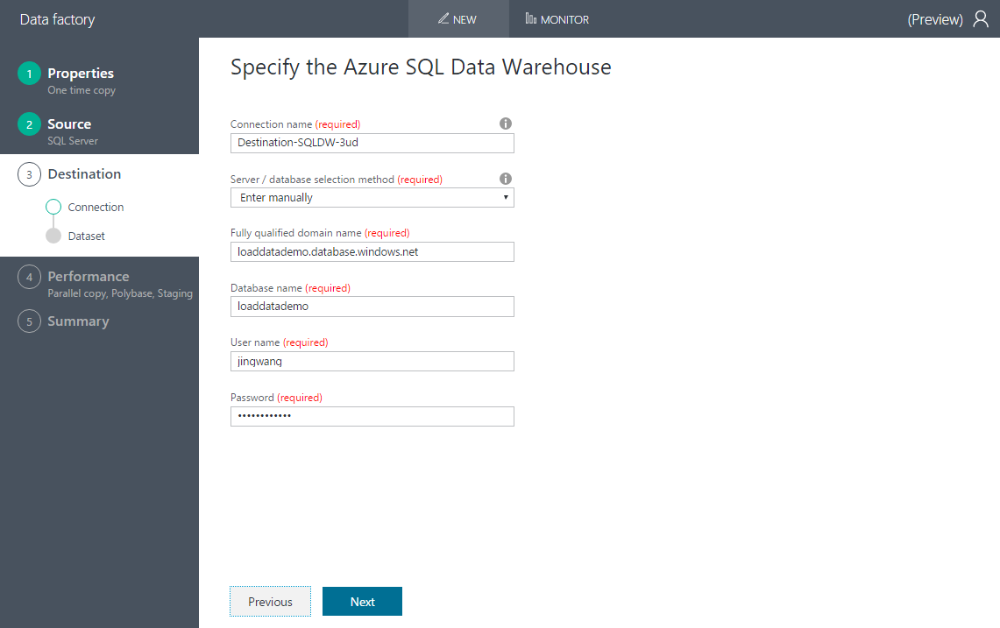

2. An intelligent table mapping appears that maps source to destination tables based on table names. If the table does not exist in the destination, by default ADF will create one with the same name (this applies to SQL Server or Azure SQL Database as source). You can also choose to map to an existing table. Review and click **Next**.

	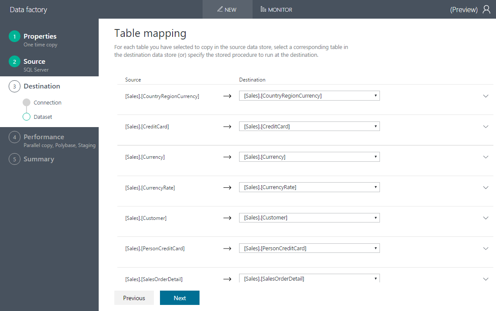

3. Review the schema mapping and look for error or warning messages. Intelligent mapping is based on column name. If there is an unsupported data type conversion between the source and destination column, you see an error message alongside the corresponding table. If you choose to let Data Factory auto create the tables, proper data type conversion may happen if needed to fix the incompatibility between source and destination stores.

	

4. Click **Next**.

## Configure the performance settings
In the Performance configurations, you configure an Azure storage account used for staging the data before it loads into SQL Data Warehouse performantly using [PolyBase](sql-data-warehouse-best-practices.md#use-polybase-to-load-and-export-data-quickly). After the copy is done, the interim data in storage will be cleaned up automatically.

Select an existing Azure Storage account, and click **Next**.

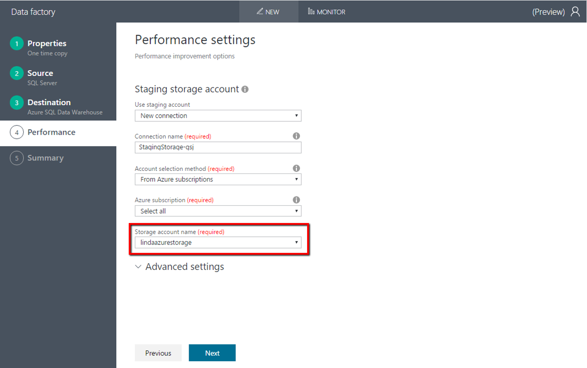

## Review summary information and deploy the pipeline

Review the configuration and click **Finish** button to deploy the pipeline.

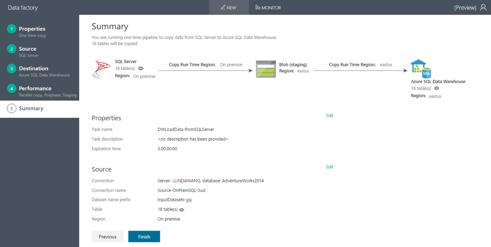

## Monitor data loading progress

You can see the deployment progress and results in the **Deployment** page.

1. Once the deployment is done, click the link that says **Click here to monitor copy pipeline** to monitor data loading progress.

	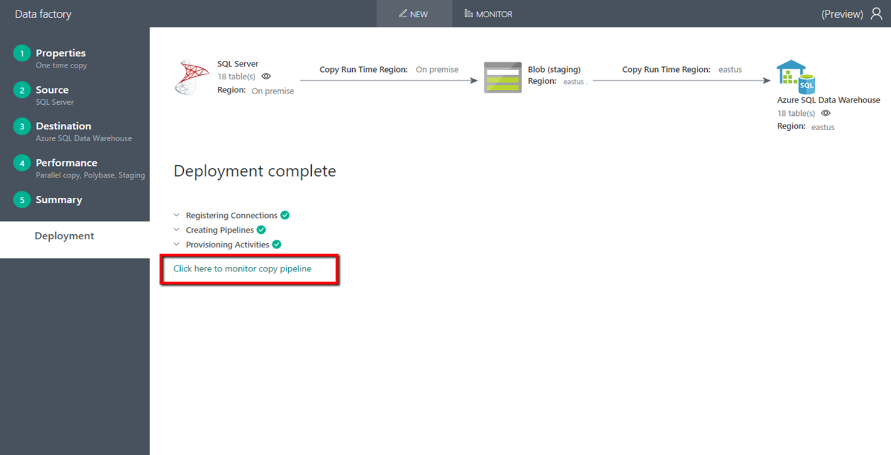

2. The newly created **DWLoadData-fromSQLServer** data loading pipeline is auto selected from the left-hand **Resource Explorer**.

	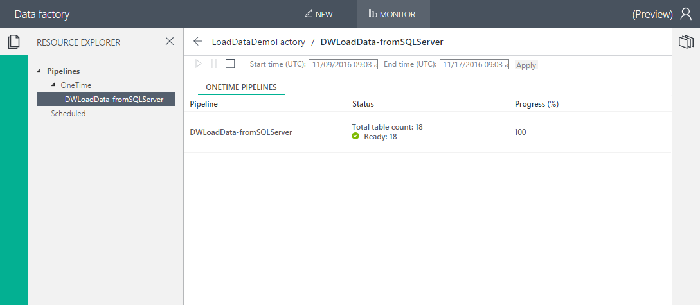

3. Click into the pipeline in the middle panel to see the detailed status for each table that maps to an Activity.

	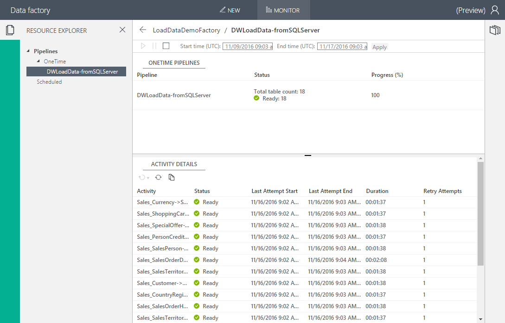

4. Further click into an activity and you see the data loading details in the right panel including data size, rows, throughput, etc.

	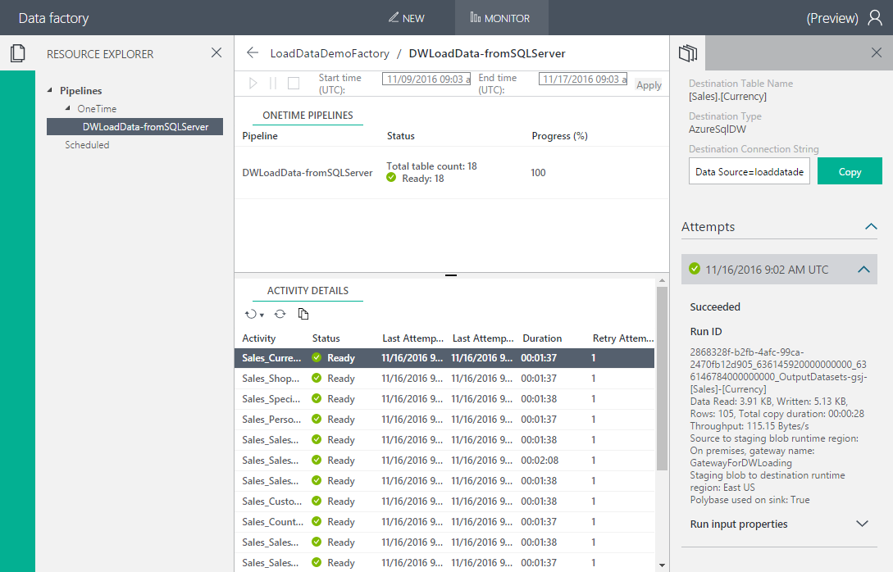

5. To launch this monitoring view later, go to your SQL Data Warehouse, click **Load Data > Azure Data Factory**, select your factory, and choose **Monitor existing loading tasks**.

## Next steps

To migrate your database to SQL Data Warehouse, see [Migration overview](sql-data-warehouse-overview-migrate.md).

To learn more about Azure Data Factory and its data movement capabilities, see the following articles:

- [Introduction to Azure Data Factory](../data-factory/data-factory-introduction.md)
- [Move data by using Copy Activity](../data-factory/data-factory-data-movement-activities.md)
- [Move data to and from Azure SQL Data Warehouse using Azure Data Factory](../data-factory/data-factory-azure-sql-data-warehouse-connector.md)

To explore your data in SQL Data Warehouse, see the following articles:

- [Connect to SQL Data Warehouse with Visual Studio and SSDT](sql-data-warehouse-query-visual-studio.md)
- [Visual data with Power BI](sql-data-warehouse-get-started-visualize-with-power-bi.md).

<!-- Azure references -->
[Azure portal]: https://portal.azure.com
