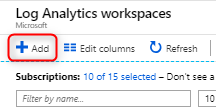
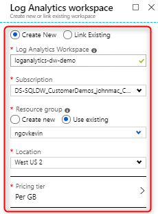
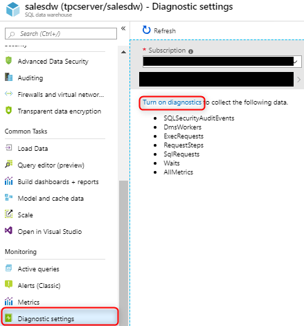
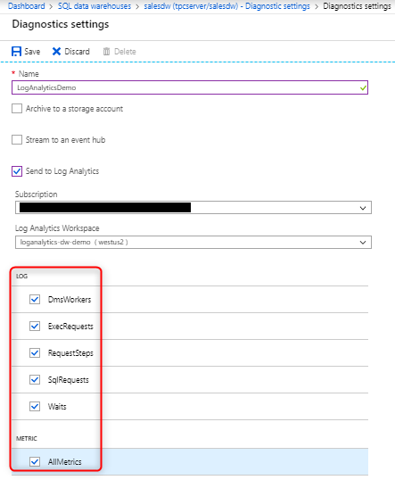
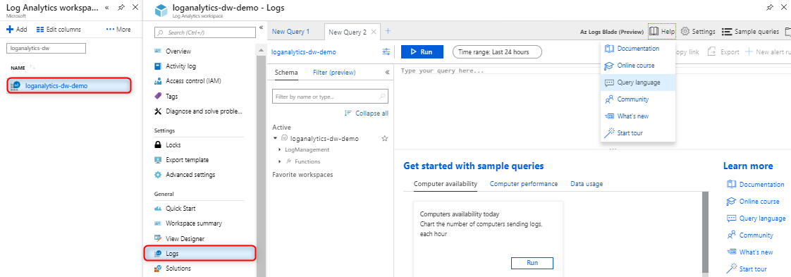

# Monitor workload - Azure portal

This article describes how to use the Azure portal to monitor your workload. This includes setting up Azure Monitor Logs to investigate query execution and workload trends using log analytics for [Azure SQL Data Warehouse](https://azure.microsoft.com/blog/workload-insights-with-sql-data-warehouse-delivered-through-azure-monitor-diagnostic-logs-pass/).

## Prerequisites

- Azure subscription: If you don't have an Azure subscription, create a [free account](https://azure.microsoft.com/free/) before you begin.
- Azure SQL Data Warehouse: We will be collecting logs for a SQL data warehouse. If you don't have a SQL data warehouse provisioned, see the instructions in [Create a SQL Data Warehouse](https://docs.microsoft.com/azure/sql-data-warehouse/sql-data-warehouse-get-started-tutorial).

## Create a Log Analytics workspace

Navigate to the browse blade for Log Analytics workspaces and create a workspace 






For more details on workspaces, visit the following [documentation](https://docs.microsoft.com/azure/azure-monitor/platform/manage-access#create-a-workspace).

## Turn on Diagnostic logs 

Configure diagnostic settings to emit logs from your SQL data warehouse. Logs consist of telemetry views of your data warehouse equivalent to the most commonly used performance troubleshooting DMVs for SQL Data Warehouse. Currently the following views are supported:

- [sys.dm_pdw_exec_requests](https://docs.microsoft.com/sql/relational-databases/system-dynamic-management-views/sys-dm-pdw-exec-requests-transact-sql?view=aps-pdw-2016-au7)
- [sys.dm_pdw_request_steps](https://docs.microsoft.com/sql/relational-databases/system-dynamic-management-views/sys-dm-pdw-request-steps-transact-sql?view=aps-pdw-2016-au7)
- [sys.dm_pdw_dms_workers](https://docs.microsoft.com/sql/relational-databases/system-dynamic-management-views/sys-dm-pdw-dms-workers-transact-sql?view=aps-pdw-2016-au7)
- [sys.dm_pdw_waits](https://docs.microsoft.com/sql/relational-databases/system-dynamic-management-views/sys-dm-pdw-waits-transact-sql?view=aps-pdw-2016-au7)
- [sys.dm_pdw_sql_requests](https://docs.microsoft.com/sql/relational-databases/system-dynamic-management-views/sys-dm-pdw-sql-requests-transact-sql?view=aps-pdw-2016-au7)




Logs can be emitted to Azure Storage, Stream Analytics, or Log Analytics. For this tutorial, select Log Analytics.



## Run queries against Log Analytics

Navigate to your Log Analytics workspace where you can do the following:

- Analyze logs using log queries and save queries for reuse
- Save queries for reuse
- Create log alerts
- Pin query results to a dashboard

For details on the capabilities of log queries, visit the following [documentation](https://docs.microsoft.com/azure/azure-monitor/log-query/query-language).




## Sample log queries


```Kusto
//List all queries 
AzureDiagnostics
| where Category contains "ExecRequests"
| project TimeGenerated, StartTime_t, EndTime_t, Status_s, Command_s, ResourceClass_s, duration=datetime_diff('millisecond',EndTime_t, StartTime_t)
```
```Kusto
//Chart the most active resource classes
AzureDiagnostics
| where Category contains "ExecRequests"
| where Status_s == "Completed"
| summarize totalQueries = dcount(RequestId_s) by ResourceClass_s
| render barchart 
```
```Kusto
//Count of all queued queries
AzureDiagnostics
| where Category contains "waits" 
| where Type_s == "UserConcurrencyResourceType"
| summarize totalQueuedQueries = dcount(RequestId_s)
```
## Next steps

Now that you have set up and configured Azure monitor logs, [customize Azure dashboards](https://docs.microsoft.com/azure/azure-portal/azure-portal-dashboards) to share across your team.
