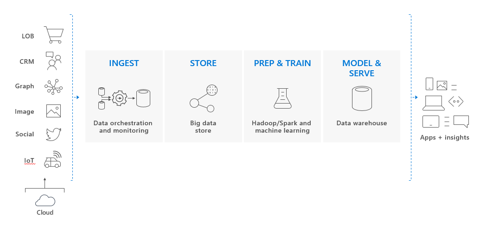

# What is Azure Synapse Analytics (formerly SQL DW)?

Azure Synapse is a limitless analytics service that brings together enterprise data warehousing and Big Data analytics. It gives you the freedom to query data on your terms, using either serverless on-demand or provisioned resources—at scale. Azure Synapse brings these two worlds together with a unified experience to ingest, prepare, manage, and serve data for immediate BI and machine learning needs

Azure Synapse has four components:
- SQL Analytics: Complete T-SQL based analytics – Generally Available
    - SQL pool (pay per DWU provisioned) 
    - SQL on-demand (pay per TB processed) – (Preview)
- Spark: Deeply integrated Apache Spark (Preview) 
- Data Integration: Hybrid data integration (Preview)
- Studio: Unified user experience.  (Preview)

> [!NOTE]
> To access the preview features of Azure Synapse, request access [here](https://aka.ms/synapsepreview). Microsoft will triage all requests and respond as soon as possible.

## SQL Analytics and SQL pool in Azure Synapse

SQL Analytics refers to the enterprise data warehousing features that are generally available with Azure Synapse. 

SQL pool represents a collection of analytic resources that are being provisioned when using SQL Analytics. The size of SQL pool is determined by Data Warehousing Units (DWU).

Import big data with simple [PolyBase](/sql/relational-databases/polybase/polybase-guide?view=sql-server-2017&viewFallbackFrom=azure-sqldw-latest) T-SQL queries, and then use the power of MPP to run high-performance analytics. As you integrate and analyze, SQL Analytics will become the single version of truth your business can count on for faster and more robust insights.  

## Key component of a big data solution

Data warehousing is a key component of a cloud-based, end-to-end big data solution.

 

In a cloud data solution, data is ingested into big data stores from a variety of sources. Once in a big data store, Hadoop, Spark, and machine learning algorithms prepare and train the data. When the data is ready for complex analysis, SQL Analytics uses PolyBase to query the big data stores. PolyBase uses standard T-SQL queries to bring the data into SQL Analytics tables.
 
SQL Analytics stores data in relational tables with columnar storage. This format significantly reduces the data storage costs, and improves query performance. Once data is stored, you can run analytics at massive scale. Compared to traditional database systems, analysis queries finish in seconds instead of minutes, or hours instead of days. 

The analysis results can go to worldwide reporting databases or applications. Business analysts can then gain insights to make well-informed business decisions.

## Next steps

- Explore [Azure Synapse architecture](/azure/sql-data-warehouse/massively-parallel-processing-mpp-architecture)
- Quickly [create a SQL pool](create-data-warehouse-portal.md)
- [Load sample data][load sample data].
- Explore [Videos](/azure/sql-data-warehouse/sql-data-warehouse-videos)

Or look at some of these other Azure Synapse resources.  
* Search [Blogs]
* Submit a [Feature requests]
* Search [Customer Advisory Team blogs]
* [Create a support ticket]
* Search [MSDN forum]
* Search [Stack Overflow forum]

<!--Image references-->
[1]: ./media/sql-data-warehouse-overview-what-is/dwarchitecture.png

<!--Article references-->
[Create a support ticket]: ./sql-data-warehouse-get-started-create-support-ticket.md
[load sample data]: ./sql-data-warehouse-load-sample-databases.md
[create a data warehouse]: ./sql-data-warehouse-get-started-provision.md
[Migration documentation]: ./sql-data-warehouse-overview-migrate.md
[Azure Synapse Analytics solution partners]: ./sql-data-warehouse-partner-business-intelligence.md
[Integrated tools overview]: ./sql-data-warehouse-overview-integrate.md
[Backup and restore overview]: ./sql-data-warehouse-restore-database-overview.md
[Azure glossary]: ../azure-glossary-cloud-terminology.md

<!--MSDN references-->

<!--Other Web references-->
[Blogs]: https://azure.microsoft.com/blog/tag/azure-sql-data-warehouse/
[Customer Advisory Team blogs]: https://blogs.msdn.microsoft.com/sqlcat/tag/sql-dw/
[Feature requests]: https://feedback.azure.com/forums/307516-sql-data-warehouse
[MSDN forum]: https://social.msdn.microsoft.com/Forums/azure/en-US/home?forum=AzureSQLDataWarehouse
[Stack Overflow forum]: https://stackoverflow.com/questions/tagged/azure-sqldw
[Twitter]: https://twitter.com/hashtag/SQLDW
[Videos]: https://azure.microsoft.com/documentation/videos/index/?services=sql-data-warehouse
[SLA for Azure Synapse Analytics]: https://azure.microsoft.com/support/legal/sla/sql-data-warehouse/v1_0/
[Volume Licensing]: https://www.microsoftvolumelicensing.com/DocumentSearch.aspx?Mode=3&DocumentTypeId=37
[Service Level Agreements]: https://azure.microsoft.com/support/legal/sla/
