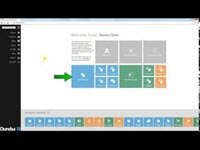
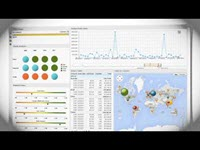
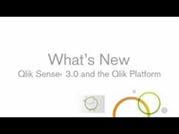
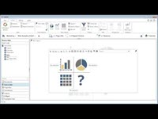
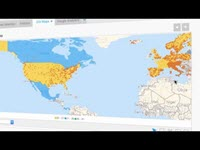

# SQL Data Warehouse business intelligence partners
To create your end-to-end data warehouse solution, choose from a wide variety of industry-leading tools.  This article highlights Microsoft partner companies with business intelligence (BI) solutions supporting Azure SQL Data Warehouse.

## Our business intelligence partners
| Partner | Description | Links | Videos |
| --- | --- | --- | --- |
| ![Birst][1] |**Birst** Birst is a global leader in Cloud BI and Analytics. Enterprises can create a trusted source of data within the context of each key business user. Then, business users throughout the organization can report and analyze information with world-class BI tools. |[Marketplace][birst_marketplace] [Website][birst_website] [Twitter][birst_twitter] [YouTube][birst_youtube] | |
| ![ClearStory Data][2] |**ClearStory Data** ClearStory Data enables fast-cycle analysis across disparate data stored in SQL Data Warehouse. ClearStory’s integrated Spark-based platform and analytics application speed data access and harmonization of disparate data sets. They enable fast, collaborative exploration that empowers business users to be self-reliant to gain insights. |[Website][clearstory_website] [Datasheet][clearstory_datasheet] [Twitter][clearstory_twitter] [YouTube][clearstory_youtube] | |
| ![Dell Statistica][3] |**Dell Statistica** Dell Statistica is an advanced analytics platform that allows organizations to make predictions about the future, optimize processes, reduce costs and increase revenue.  Dell Statistica simplifies big data analytics, streamlines implementation & deployment, extracts actionable insights from text, and empowers your business. |[Website][dell_statistica_website] [Datasheet][dell_statistica_datasheet] [Twitter][dell_statistica_twitter] | |
| ![Dundas][4] |**Dundas BI** Dundas Data Visualization is a leading, global provider of Business Intelligence and Data Visualization software.  Dundas dashboards, reporting, and visual data analytics provide seamless integration into business applications, enabling better decisions and faster insights. |[Marketplace][dundas_bi_marketplace] [Website][dundas_bi_website] [Datasheet][dundas_bi_datasheet] [Twitter][dundas_bi_twitter] [YouTube][dundas_bi_youtube] | |
| ![Jinfonet][5] |**JReport** JReport is an embeddable BI solution for the enterprise. The solution empowers users to create reports, dashboards, and data analysis on cloud, big data, and transactional data sources. By visualizing data, you can perform your own reporting and data discovery for agile, on-the-fly decision making. |[Website][jinfonet_website] [Datasheet][jinfonet_datasheet] [Twitter][jinfonet_twitter] [YouTube][jinfonet_youtube] | |
| ![LogiAnalytics][6] |**Logi Analytics** Together, Logi Analytics and Azure SQL Data Warehouse enables your organization to collect, analyze, and immediately act on the largest and most diverse data sets in the world. |[Website][logianalytics_website] [Datasheet][logianalytics_datasheet] [Twitter][logianalytics_twitter] [YouTube][logianalytics_youtube] | |
| ![Looker][7] |**Looker BI** Looker gives everyone in your company the ability to explore and understand the data that drives your business. Looker also gives the data analyst a flexible and reusable modeling layer to control and curate that data.  Companies have fundamentally transformed their culture using Looker as the catalyst. |[Marketplace][looker_marketplace] [Website][looker_website] [Datasheet][looker_datasheet] [Twitter][looker_twitter] [YouTube][looker_youtube] | |
| ![Qlik][8] |**Qlik Sense Enterprise** Drive insight discovery with the data visualization app that anyone can use. With Qlik Sense, everyone in your organization can easily create flexible, interactive visualizations and make meaningful decisions. |[Website][qlik_website] [Twitter][qlik_twitter] [YouTube][qlik_youtube] | |
| ![SiSense][9] |**SiSense** SiSense is a full-stack Business Intelligence software that comes with tools that a business needs to analyze and visualize data: a high-performance analytical database, the ability to join multiple sources, simple data extraction (ETL), and web-based data visualization. Start to analyze and visualize large data sets with SiSense BI and Analytics today. |[Website][sisense_website] [Datasheet][sisense_datasheet] [Twitter][sisense_twitter] [YouTube][sisense_youtube] | |
| ![Tableau][10] |**Tableau** Tableau’s self-service analytics help anyone see and understand their data, across many kinds of data from flat files to databases. Tableau has a native, optimized connector to Microsoft Azure SQL Data Warehouse that supports both live data and in-memory analytics. |[Marketplace][tableau_marketplace] [Website][tableau_website] [Datasheet][tableau_datasheet] [Twitter][tableau_twitter] [YouTube][tableau_youtube] | |
| ![Targit][11] |**Targit** Targit Decision Suite provides BI and Analytics platform that delivers real-time dashboards, self-service analytics, user-friendly reporting, stunning mobile capabilities, and simple data-discovery technology in a single, cohesive solution. Targit gives companies the courage to act. |[Marketplace][targit_marketplace] [Website][targit_website] [Twitter][targit_twitter] [YouTube][targit_youtube] | |
| ![Yellowfin][12] |**Yellowfin** Yellowfin is a top rated Cloud BI vendor for ad-hoc Reporting and Dashboards by BARC; The BI Survey. Connect to Azure SQL Data Warehouse, then create and share beautiful reports and dashboards with award winning collaborative BI and location intelligence features. |[Marketplace][yellowfin_marketplace] [Website][yellowfin_website] [Datasheet][yellowfin_datasheet] [Twitter][yellowfin_twitter] [YouTube][yellowfin_youtube] | |

<!--https://img.youtube.com/vi/0b8sPW2UHrU/0.jpg-->

## Next Steps
To learn more about some of our other partners, see [Data Integration partners][di_partners] and [Data Management partners][dm_partners].

<!--Image references-->
[1]: ./media/sql-data-warehouse-partner-business-intelligence/birst_logo.png
[2]: ./media/sql-data-warehouse-partner-business-intelligence/clearstory_data_logo.png
[3]: ./media/sql-data-warehouse-partner-business-intelligence/dell_statistica_logo.png
[4]: ./media/sql-data-warehouse-partner-business-intelligence/dundas_software_logo.png
[5]: ./media/sql-data-warehouse-partner-business-intelligence/jinfonet_logo.png
[6]: ./media/sql-data-warehouse-partner-business-intelligence/logianalytics_logo.png
[7]: ./media/sql-data-warehouse-partner-business-intelligence/looker_logo.png
[8]: ./media/sql-data-warehouse-partner-business-intelligence/qlik_logo.png
[9]: ./media/sql-data-warehouse-partner-business-intelligence/sisense_logo.png
[10]: ./media/sql-data-warehouse-partner-business-intelligence/tableau_sparkle_logo.png
[11]: ./media/sql-data-warehouse-partner-business-intelligence/targit_logo.png
[12]: ./media/sql-data-warehouse-partner-business-intelligence/yellowfin_logo.png

<!--Article links-->
[bi_partners]: ./sql-data-warehouse-partner-business-intelligence.md
[dm_partners]: ./sql-data-warehouse-partner-data-management.md
[di_partners]: ./sql-data-warehouse-partner-data-integration.md

<!--Website links -->
[birst_website]:https://www.birst.com/
[clearstory_website]:http://www.clearstorydata.com/
[dell_statistica_website]:http://software.dell.com/MSFT_Stat_ref/
[dundas_bi_website]:http://www.dundas.com/dundas-bi
[jinfonet_website]:http://www.jinfonet.com/product/jreport-designer
[logianalytics_website]:http://www.logianalytics.com/
[looker_website]:https://looker.com/partners/microsoft-azure/
[qlik_website]:http://www.qlik.com/us/products/qlik-sense/enterprise
[sisense_website]:https://www.sisense.com/product/
[tableau_website]:http://www.tableau.com/
[targit_website]:https://www.targit.com/en/software/deployment/targitonazure
[yellowfin_website]:http://www.yellowfinbi.com/

<!--Get Started Links-->
[qlik_getstarted]:http://www.qlik.com/us/products/qlik-sense/getting-started

<!--Datasheet Links-->
<!--[birst_datasheet]:-->
[clearstory_datasheet]:http://www.clearstorydata.com/wp-content/uploads/2016/05/ClearStoryData-PO01-062015-01-2.pdf
[dell_statistica_datasheet]:http://www.statsoft.com/Portals/0/Support/Download/Brochures/STATISTICA_Data_Miner.pdf
[dundas_bi_datasheet]:http://www.dundas.com/resource/getwhitepaper?whitePaperName=27-05-2016-Dundas-BI-Product-Brief-_-Embedded-Analytics%2FEckerson-Group-EBI-Report-DundasProduct-Brief.pdf
[jinfonet_datasheet]:http://www.jinfonet.com/products/JReport%20Brief.pdf
[logianalytics_datasheet]:https://www.logianalytics.com/datasheet/logi-info/
[looker_datasheet]:https://info.looker.com/h/i/229169578-looker-for-microsoft-azure
<!--[qlik_datasheet]:http://www.qlik.com/en/resource-library/the-qlikview-product-family-->
[sisense_datasheet]:https://pages.sisense.com/rs/601-OXE-081/images/Product%20Highlights.pdf
[tableau_datasheet]:http://www.tableau.com/stories/workbook/azure-sql-data
<!--[targit_datasheet]:-->
[yellowfin_datasheet]:http://www.yellowfinbi.com/Document.i4?DocumentId=877299

<!--Marketplace Links -->
[birst_marketplace]:https://azure.microsoft.com/en-gb/marketplace/partners/birst/birst/
<!--[clearstory_marketplace]:-->
<!--[dell_statistica_marketplace]:https://azure.microsoft.com/marketplace/partners/dell-software/statistica-data-miner/-->
[dundas_bi_marketplace]:https://azure.microsoft.com/marketplace/partners/dundas/dundas-bi/ 
<!--[jinfonet_marketplace]:-->
<!--[logianalytics_marketplace]:https://azure.microsoft.com/marketplace/partners/logi-analytics/logi-info-11/--> 
[looker_marketplace]:https://azure.microsoft.com/marketplace/partners/looker/looker-analytics-platform-326/ 
<!--[qlik_marketplace]:https://azure.microsoft.com/marketplace/partners/qliktech-international-ab/qlikview/ -->
<!--[sisense_marketplace]:https://azure.microsoft.com/marketplace/partners/sisense/sisense-byol/--> 
[tableau_marketplace]:https://azure.microsoft.com/marketplace/partners/tableau/tableau-server/
[targit_marketplace]:https://azure.microsoft.com/marketplace/partners/targit/targit-decision-suite/ 
[yellowfin_marketplace]:https://azure.microsoft.com/marketplace/partners/yellowfin/yellowfin-for-azure-byol/

<!--Press links-->
<!--[birst_press]:-->
[clearstory_press]:http://www.clearstorydata.com/press/clearstory-data-paired-with-new-microsoft-azure-sql-data-warehouse-release-provides-highly-scalable-data-analysis-at-apache-spark-speed/
<!--[dell_statistica_press]:-->
[dundas_bi_press]:https://www.dundas.com/about/news/24-06-2015-dundas-data-visualization-provides-seamless-integration-with-microsoft-azure-and-azure-sql-data-warehouse
<!--[jinfonet_press]:-->
[logianalytics_press]:http://www.logianalytics.com/logi-news/announcing-logi-info-integration-with-azure-sql-data-warehouse/
[looker_press]:https://looker.com/news/press/looker-brings-self-serve-analytics-to-microsoft-azure
<!--[qlik_press]:-->
<!--[sisense_press]:-->
[tableau_press]:https://www.tableau.com/about/blog/2015/7/visualizing-data-cloud-microsoft-azure-tableau-online-40832 
<!--[targit_press]:-->
<!--[yellowfin_press]:-->

<!--YouTube links-->
[birst_youtube]:https://www.youtube.com/user/BirstBI
[clearstory_youtube]:https://www.youtube.com/user/ClearStoryData
<!--[dell_statistica_youtube]:https://www.youtube.com/user/DellSoftwareVideo-->
[dundas_bi_youtube]:https://www.youtube.com/user/dundasdv
[jinfonet_youtube]:https://www.youtube.com/user/JinfonetSoftware
[logianalytics_youtube]:https://www.youtube.com/user/LogiXMLblog
[looker_youtube]:https://www.youtube.com/user/LookerData
[qlik_youtube]:https://www.youtube.com/user/qlikview
[sisense_youtube]:https://www.youtube.com/user/sisenseanalytics
[tableau_youtube]:https://www.youtube.com/user/tableausoftware
[targit_youtube]:https://www.youtube.com/user/TargitAS
[yellowfin_youtube]:https://www.youtube.com/user/YellowfinTeam

<!--Twitter links-->
[birst_twitter]:https://twitter.com/BirstBI
[clearstory_twitter]:https://twitter.com/ClearStoryData
[dell_statistica_twitter]:https://twitter.com/hashtag/DellStatistica
[dundas_bi_twitter]:https://twitter.com/dundasdata
[jinfonet_twitter]:https://twitter.com/Jinfonet
[logianalytics_twitter]:https://twitter.com/LogiAnalytics
[looker_twitter]:https://twitter.com/LookerData
[qlik_twitter]:https://twitter.com/qlik
[sisense_twitter]:https://twitter.com/Sisense
[tableau_twitter]:https://twitter.com/tableau
[targit_twitter]:https://twitter.com/TARGIT
[yellowfin_twitter]:https://twitter.com/YellowfinBI
