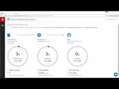

# SQL Data Warehouse data integration partners
To create your data warehouse solution, choose from a wide variety of industry-leading tools. This article highlights Microsoft partner companies with data integration solutions supporting Azure SQL Data Warehouse.

## Data integration partners
| Partner | Description | Links | Videos |
| --- | --- | --- | --- |
| ![Alteryx][1] |**Alteryx**  Alteryx Designer provides a repeatable workflow for self-service data analytics that leads to deeper insights in hours, not the weeks typical of traditional approaches! Alteryx Designer helps data analysts by combining data preparation, data blending, and analytics – predictive, statistical, and spatial – using the same intuitive user interface. |[Marketplace][alteryx_marketplace] [Website][alteryx_designer_website] [White paper][alteryx_whitepaper] [Datasheet][alteryx_designer_datasheet] [Twitter][alteryx_designer_twitter] [YouTube][alteryx_designer_youtube] | |
| ![Attunity][2] |**Attunity** Attunity CloudBeam provides an automated and optimized solution for loading data to SQL Data Warehouse. With a “click-to-load” design, it simplifies and accelerates both batch loading as well as incremental replication from many heterogeneous databases including SQL Server, Oracle, DB2, Sybase and mySQL. |[Marketplace][attunity_marketplace] [Quick start][attunity_quickstart] [Website][attunity_cloudbeam_website] [Datasheet][attunity_cloudbeam_datasheet] [Twitter][attunity_cloudbeam_twitter] [YouTube][attunity_cloudbeam_youtube] | |
| ![Bryte Systems][3] |**Bryte Systems** Bryte Systems automates data transfer to SQL Data Warehouse from various databases and sources. Bryte Systems specializes in data movement and integration technologies. They build cloud-based data warehouses and data lakes to uncover insights. |[Website][bryte_systems_azure_website] | |
| ![Informatica][4] |**Informatica Cloud Services for Azure – Pay-As-You-Go**  Optimize the value of your Azure Services and derive actionable insights out of all your hybrid data sets with Informatica Cloud Services for Azure – Pay-As-You-Go. Informatica Cloud offers a best-in-class solution for Data integration, Cloud Analytics, Application Integration, and Data Management. With self-service data migration, integration and management capabilities customers can quickly and reliably import, export, synchronize, and schedule petabytes of data to Azure from a variety of sources such as SaaS applications, Hadoop-based data lakes, and other on-prem data sources (Oracle, SAP). Informatica Cloud Services for Azure provides native, high volume, high-performance connectivity to Azure SQL Data Warehouse, SQL Database, Blob Storage, Data Lake Store, and Azure Cosmos DB. |[Marketplace][informatica_Cloud_Services_marketplace] [Free trial][informatica_cloud_free_trial] [Config guide][informatica_cloud_services_config] [Website][informatica_Cloud_Services_website] [Twitter][informatica_cloud_twitter] [YouTube][informatica_cloud_youtube] | |
| ![Informatica][4] |**Informatica PowerCenter** Informatica is one of the world’s most recognizable independent providers of data integration software. PowerCenter forms the foundation for all your data integration initiatives. Use PowerCenter for analytics, data warehousing, application migration, consolidation, or data governance. |[Marketplace][informatica_PowerCenter_byol] [Website][informatica_PowerCenter_website] [Datasheet][informatica_powercenter_datasheet] [Twitter][informatica_powercenter_twitter] [YouTube][informatica_powercenter_youtube] | |
| ![Redgate][5] |**Redgate Data Platform Studio (Preview)** Redgate’s Data Platform Studio provides a simple and reliable way to migrate on-premises SQL databases to Azure SQL Data Warehouse. It’s engineered to make smart decisions for a fully automated migration, and is free to use for one-off migrations. |[Website][redgate_website] [Twitter][redgate_twitter] [YouTube][redgate_youtube] | |
| ![SnapLogic][6] |**SnapLogic** The SnapLogic integration platform as a service (iPaaS) enables customers to quickly transfer data into and out of Microsoft Azure SQL Data Warehouse. SnapLogic offers the ability to integrate hundreds of applications, services, and IoT scenarios in one solution. Deliver fast, effective insights in the cloud, on-premises or in hybrid mode with SnapLogic! |[Marketplace][snaplogic_marketplace] [Website][snaplogic_website] [Datasheet][snaplogic_datasheet] [Twitter][snaplogic_twitter] [YouTube][snaplogic_youtube] | |

## Next steps
To learn more about other partners, see [Business Intelligence partners][bi_partners] and [Data Management partners][dm_partners].

<!--Image references-->
[1]: ./media/sql-data-warehouse-partner-data-integration/alteryx_logo.png
[2]: ./media/sql-data-warehouse-partner-data-integration/attunity_logo.png
[3]: ./media/sql-data-warehouse-partner-data-integration/bryte_systems_logo.png
[4]: ./media/sql-data-warehouse-partner-data-integration/informatica_logo.png
[5]: ./media/sql-data-warehouse-partner-data-integration/redgate_logo.png
[6]: ./media/sql-data-warehouse-partner-data-integration/snaplogic_logo.png

<!--Article links-->
[bi_partners]: ./sql-data-warehouse-partner-business-intelligence.md
[dm_partners]: ./sql-data-warehouse-partner-data-management.md
[di_partners]: ./sql-data-warehouse-partner-data-integration.md

<!--ebook Links-->

<!--Configuration Guides-->
[informatica_cloud_services_config]:https://kb.informatica.com/proddocs/Product%20Documentation/6/IC_Spring2017_MicrosoftAzure[SQL]DataWarehouseConnectorGuide_en.pdf

<!--Datasheet Links-->
[alteryx_designer_datasheet]:http://www.alteryx.com/sites/default/files/resources/files/alt-designer-ds.pdf
[attunity_cloudbeam_datasheet]:http://www.attunity.com/sites/default/files/content/attunity-azure-solution-sheet.pdf

<!--[bryte_systems_azure_datasheet]:-->

<!--[informatica_cloud_datasheet]:https://www.informatica.com/content/dam/informatica-com/global/amer/us/collateral/data-sheet/cloud-integration-platform_data-sheet_2711.pdf-->

[informatica_powercenter_datasheet]:https://www.informatica.com/content/dam/informatica-com/global/amer/us/collateral/brochure/powercenter_brochure_6659.pdf
[snaplogic_datasheet]:http://campaigns.snaplogic.com/rs/055-FYJ-916/images/SnapLogic-for-Microsoft-Cortana.pdf

<!--Free Trial-->
[informatica_cloud_free_trial]:https://www.informatica.com/products/cloud-integration/connectivity/microsoft-azure-connector.html

<!--Website Links -->
[alteryx_designer_website]:http://www.alteryx.com/partners/microsoft/
[attunity_cloudbeam_website]:http://www.attunity.com/attunity-cloudbeam-for-azure/
[bryte_systems_azure_website]:http://www.bryte.com.au/azure-integration/
[informatica_Cloud_Services_website]:https://www.informatica.com/products/cloud-integration.html
[informatica_PowerCenter_website]:https://www.informatica.com/products/data-integration/powercenter.html
[redgate_website]:http://dataplatformstudio.com/
[snaplogic_website]:https://www.snaplogic.com/solutions/microsoft-cortana-analytics-integration/

<!--Marketplace Links -->
[alteryx_marketplace]:https://azure.microsoft.com/marketplace/partners/alteryx/alteryx-designer/
[attunity_marketplace]:https://azure.microsoft.com/en-gb/marketplace/partners/attunity-cloudbeam/cloudbeam-dw-byol/ 

<!--[bryte_systems_marketplace]:https://azure.microsoft.com/en-gb/marketplace/partners/bryte/bryteflow-cdc-free-trial/--> 

[informatica_Cloud_Services_marketplace]:https://azuremarketplace.microsoft.com/marketplace/partners/informatica/informatica-cloud-services/

<!--[informatica_PowerCenter_std_marketplace]:https://azure.microsoft.com/marketplace/partners/informatica/informatica-powercenter-standard-10-0pc-std-10-0-windows/
[informatica_PowerCenter_adv_marketplace]:https://azure.microsoft.com/marketplace/partners/informatica/informatica-powercenter-advanced-10-0pc-adv-10-0-ubuntu/-->

[informatica_PowerCenter_byol]:https://azuremarketplace.microsoft.com/en-us/marketplace/apps/informatica.powercenter/

<!--[redgate_marketplace]:-->

[snaplogic_marketplace]:https://azure.microsoft.com/marketplace/partners/snaplogic/snaplogic-elastic-integration-windows/ 

<!--Quickstart_links-->

[attunity_quickstart]:https://www.attunity.com/products/cloudbeam/solutions-attunity-cloudbeam-azure-data-analytic-services/

<!--PressRelease_links-->

[alteryx_designer_press]:https://www.alteryx.com/press-releases/alteryx-now-enables-data-analysts-to-perform-in-database-blending-in-microsoft-azure 
[attunity_cloudbeam_press]:http://www.attunity.com/news/attunity-launches-cloud-data-warehouse-solutions-microsoft-azure
[bryte_systems_azure_press]:http://medianet.com.au/releases/release-details?id=837667

<!--[informatica_Cloud_Services_press]:-->
<!--[informatica_PowerCenter_press]:-->

<!--[redgate_press]:-->

[snaplogic_press]:https://www.snaplogic.com/press-releases/snaplogic-introduces-support-for-microsoft-azure-sql-data-warehouse

<!--YouTube-->

[alteryx_designer_youtube]:https://www.youtube.com/user/alteryx
[attunity_cloudbeam_youtube]:https://www.youtube.com/user/Attunity

<!--[bryte_systems_azure_youtube]:-->

[informatica_Cloud_youtube]:https://www.youtube.com/user/InformaticaOnDemand
[informatica_PowerCenter_youtube]:https://www.youtube.com/user/InformaticaCorp
[redgate_youtube]:https://www.youtube.com/user/RedGateVideos
[snaplogic_youtube]:https://www.youtube.com/user/snapLogicInc

<!--Twitter-->

[alteryx_designer_twitter]:https://twitter.com/alteryx
[attunity_cloudbeam_twitter]:https://twitter.com/attunity

<!--[bryte_systems_azure_twitter]:-->

[informatica_cloud_twitter]:https://twitter.com/infacloud
[informatica_powercenter_twitter]:https://twitter.com/Informatica
[redgate_twitter]:https://twitter.com/RedgateDPS
[snaplogic_twitter]:https://twitter.com/snaplogic

<!--WhitePaper-->

[alteryx_whitepaper]:http://pages.alteryx.com/Microsoft-Azure-InDB-WP?lsm=microsoft
