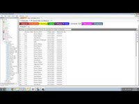
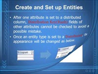
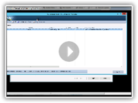
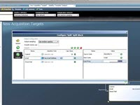
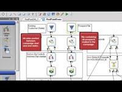

---
title: SQL Data Warehouse data management partners | Microsoft Docs
description: Lists of third-party data management partners with solutions that support SQL Data Warehouse.
services: sql-data-warehouse
author: jrowlandjones
manager: craigg
ms.service: sql-data-warehouse
ms.topic: conceptual
ms.component: consume
ms.date: 04/17/2018
ms.author: jrj
ms.reviewer: igorstan
---

# SQL Data Warehouse data management partners
To create your data warehouse solution, choose from a wide variety of industry-leading tools. This article highlights Microsoft partner companies with data management tools and solutions supporting Azure SQL Data Warehouse.

## Data management partners
| Partner | Description | Links | Videos |
| --- | --- | --- | --- |
| ![Coffing Data Warehousing][1] |**Coffing Data Warehousing** Coffing Data Warehousing provides Nexus Chameleon, a tool with 10 years of design dedicated to querying systems. Nexus is available as a query tool for SQL Data Warehouse. Use Nexus to query in-house and cloud computers and join data across different platforms. Point-Click-Report! |[Website][coffing_website] [Press Release][coffing_press] [Twitter][coffing_twitter] [YouTube][coffing_youtube] | |
| ![Inbrein][2] |**MicroERD** Inbrein MicroERD provides the tools that you need to create a precise data model, reduce data redundancy, improve productivity, and observe standards. By using its UI, which was developed based on extensive user experiences, a modeler can work on DB models easily and conveniently. You can continuously enjoy new and improved functions of MicroERD through prompt functional improvements and updates. |[Website][inbrein_website] [Datasheet][inbrein_datasheet] [Twitter][inbrein_twitter] [YouTube][inbrein_youtube] | |
| ![Infolibrarian][3] |**Infolibrarian** InfoLibrarian catalogs, stores, and manages metadata to help you solve key pain points of data management. In addition, Infolibrarian provides metadata management, data governance, and asset management software solutions for managing and publishing metadata from a diverse set of tools and technologies. |[Marketplace][infolibrarian_marketplace] [Website][infolibrarian_website] [Twitter][infolibrarian_twitter] | |
| ![Redpoint Global][4] |**RedPoint Interaction** RedPoint Interaction enables you to engage with customers in a continuous dialog across every communication channel and touch point. Easily manage the complete lifecycle of omnichannel marketing from a single point of operational control |[Marketplace][redpoint_it_marketplace] [Website][redpoint_it_website] [Press Release][redpoint_press] [Datasheet][redpoint_it_datasheet] [Twitter][redpoint_twitter] [YouTube][redpoint_youtube] | |
| ![Redpoint Global][4] |**RedPoint Data Management** RedPoint Data Management enable s marketers to apply all their data to drive cross-channel customer engagement while performing structured and unstructured data management. By taking advantage of Azure SQL Data Warehouse and RedPoint you can maximize the value of your structured and unstructured data to deliver the hyper-personalized, contextual interactions needed to engage today’s omni-channel customer. Drag-and-drop interface makes designing and executing data management processes easy. |[Marketplace][redpoint_dm_marketplace] [Website][redpoint_dm_website] [Press Release][redpoint_press] [Datasheet][redpoint_dm_datasheet] [Twitter][redpoint_twitter] [YouTube][redpoint_youtube] | |
| ![Sentry One][5] |**DW Sentry** With the intelligent data movement dashboard and event calendar, you always know exactly what is impacting your workload. Designed to give you visibility into your queries and jobs running to load, backup, or restore your data, you never worry about making the most of your Azure resources. |[Marketplace][sql_sentry_marketplace] [Website][sql_sentry_website] [Press Release][sql_sentry_press] [Twitter][sql_sentry_twitter] [YouTube][sql_sentry_youtube] | |

## Next Steps
To learn more about other partners, see [Business Intelligence partners][bi_partners] and [Data Integration partners][di_partners].

<!--Image references-->

[1]: ./media/sql-data-warehouse-partner-data-management/coffing_data_warehousing_logo.png
[2]: ./media/sql-data-warehouse-partner-data-management/inbrein_logo.png
[3]: ./media/sql-data-warehouse-partner-data-management/infolibrarian_logo.png
[4]: ./media/sql-data-warehouse-partner-data-management/redpoint_global_logo.png
[5]: ./media/sql-data-warehouse-partner-data-management/sql_sentry_logo.png

<!--Article links-->

[bi_partners]: ./sql-data-warehouse-partner-business-intelligence.md
[dm_partners]: ./sql-data-warehouse-partner-data-management.md
[di_partners]: ./sql-data-warehouse-partner-data-integration.md

<!--Website links -->

[coffing_website]:http://www.coffingdw.com/software/nexus/
[inbrein_website]:http://microerd.com/
[infolibrarian_website]:http://www.infolibcorp.com/metadata-management/software-tools
[redpoint_it_website]:http://www.redpoint.net/products/customer-interaction-management/
[redpoint_dm_website]:http://www.redpoint.net/products/data-management-solutions/
[sql_sentry_website]:https://sentryone.com/platform/azure-sql-dw-performance-monitoring/

<!--ebook Links-->

<!--Datasheet Links-->

<!--[coffing_datasheet]:-->

[inbrein_datasheet]:http://microerd.com/images/MicroERD_Manual/MicroERD_Manual.pdf

<!--[infolibrarian_datasheet]:-->

[redpoint_it_datasheet]:http://www.redpoint.net/wp-content/uploads/2016/06/RedPoint-Interaction-FS-wordle-8.5x11-RPIUS0815-07-PRINT.pdf
[redpoint_dm_datasheet]:http://www.redpoint.net/wp-content/uploads/2014/09/RedPoint-Data-Management-FS-V2-wordle-8.5x11-0216-WEB.pdf

<!--[sql_sentry_datasheet]:-->

<!--Marketplace Links -->

<!--[coffing_marketplace]:https://azure.microsoft.com/marketplace/partners/nexus/nexus-chameleon-9/ -->

<!--[inbrein_marketplace]:-->

[infolibrarian_marketplace]:https://azure.microsoft.com/marketplace/partners/infolibrarian/infolibrarian-metadata-management-server/
[redpoint_it_marketplace]:https://azure.microsoft.com/marketplace/partners/redpoint-global/redpoint-interaction/
[redpoint_dm_marketplace]:https://azure.microsoft.com/marketplace/partners/redpoint-global/redpoint-rpdm/ 
[sql_sentry_marketplace]:https://www.sentryone.com/products/sentryone-platform/dw-sentry/azure-sql-data-warehouse-monitoring

<!--Press links-->

[coffing_press]:http://www.coffingdw.com/press-release-nexus-tuned-for-azure-sql-data-warehouse/

<!--[inbrein_press]:-->

<!--[infolibrarian_press]:-->

[redpoint_press]:http://www.redpoint.net/press/redpoint-global-announces-support-for-microsoft-azure-sql-data-warehouse-microsoft-azure-data-lake-service/
[sql_sentry_press]:https://www.sentryone.com/sentryone-v-11.2-offers-new-insights-and-powerful-automation

<!--YouTube links-->

[coffing_youtube]:https://www.youtube.com/channel/UC8o1zhc9tNp9ve6vDn34tkw
[inbrein_youtube]:https://www.youtube.com/channel/UCHTYjFFaTpo6bPAtuxgdZig

<!--[infolibrarian_youtube]:-->

[redpoint_youtube]:https://www.youtube.com/user/RedPointGlobal
[sql_sentry_youtube]:https://www.youtube.com/user/SQLSentry

<!--Twitter links-->

[coffing_twitter]:https://twitter.com/CoffingDW
[inbrein_twitter]:https://twitter.com/microerd
[infolibrarian_twitter]:https://twitter.com/InfoLibCorp
[redpoint_twitter]:https://twitter.com/RedPointGlobal
[sql_sentry_twitter]:https://twitter.com/SQLSentry

<!--Video links-->
