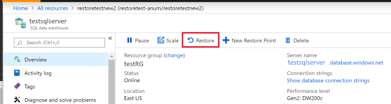
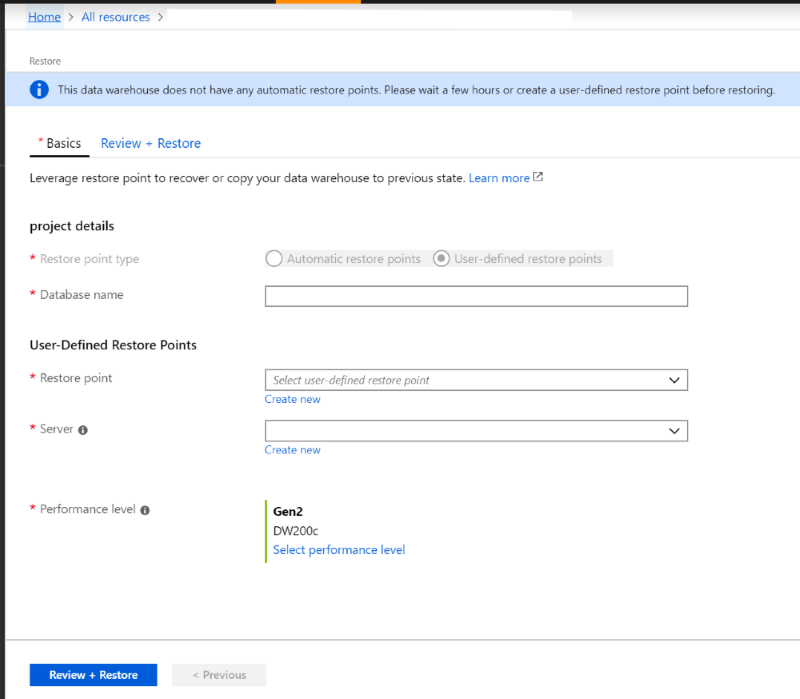

# Restore an existing Azure SQL Data Warehouse

In this article, you learn to restore an existing SQL Data Warehouse through Azure portal and PowerShell:

[!INCLUDE [updated-for-az](../../includes/updated-for-az.md)]

**Verify your DTU capacity.** Each SQL Data Warehouse is hosted by a SQL server (for example, myserver.database.windows.net) which has a default DTU quota. Verify the SQL server has enough remaining DTU quota for the database being restored. To learn how to calculate DTU needed or to request more DTU, see [Request a DTU quota change][Request a DTU quota change].

## Before you begin

1. Make sure to [install Azure PowerShell][Install Azure PowerShell].
2. Have an existing restore point that you want to restore from. If you want to create a new restore, see [the tutorial to create a new user-defined restore point][the tutorial to create a new user-defined restore point].

## Restore an existing data warehouse through PowerShell

To restore an existing data warehouse from a restore point use the [Restore-AzSqlDatabase][Restore-AzSqlDatabase] PowerShell cmdlet.

1. Open PowerShell.

2. Connect to your Azure account and list all the subscriptions associated with your account.

3. Select the subscription that contains the database to be restored.

4. List the restore points for the data warehouse.

5. Pick the desired restore point using the RestorePointCreationDate.

6. Restore the data warehouse to the desired restore point using [Restore-AzSqlDatabase][Restore-AzSqlDatabase] PowerShell cmdlet.
        1. To restore the SQL Data Warehouse to a different logical server, make sure to specify the other logical server name.  This logical server can also be in a different resource group and region.
        2. To restore to a different subscription, use the  'Move' button to move the logical server to another subscription.

7. Verify that the restored data warehouse is online.

8. After the restore has completed, you can configure your recovered data warehouse by following [configure your database after recovery][Configure your database after recovery].

```Powershell

$SubscriptionName="<YourSubscriptionName>"
$ResourceGroupName="<YourResourceGroupName>"
$ServerName="<YourServerNameWithoutURLSuffixSeeNote>"  # Without database.windows.net
#$TargetResourceGroupName="<YourTargetResourceGroupName>" # uncomment to restore to a different logical server.
#$TargetServerName="<YourtargetServerNameWithoutURLSuffixSeeNote>"  
$DatabaseName="<YourDatabaseName>"
$NewDatabaseName="<YourDatabaseName>"

Connect-AzAccount
Get-AzSubscription
Select-AzSubscription -SubscriptionName $SubscriptionName

# Or list all restore points
Get-AzSqlDatabaseRestorePoints -ResourceGroupName $ResourceGroupName -ServerName $ServerName -DatabaseName $DatabaseName

# Get the specific database to restore
$Database = Get-AzSqlDatabase -ResourceGroupName $ResourceGroupName -ServerName $ServerName -DatabaseName $DatabaseName

# Pick desired restore point using RestorePointCreationDate "xx/xx/xxxx xx:xx:xx xx"
$PointInTime="<RestorePointCreationDate>"  

# Restore database from a restore point
$RestoredDatabase = Restore-AzSqlDatabase –FromPointInTimeBackup –PointInTime $PointInTime -ResourceGroupName $Database.ResourceGroupName -ServerName $Database.ServerName -TargetDatabaseName $NewDatabaseName –ResourceId $Database.ResourceID

# Use the following command to restore to a different logical server
#$RestoredDatabase = Restore-AzSqlDatabase –FromPointInTimeBackup –PointInTime $PointInTime -ResourceGroupName $Database.ResourceTargetGroupName -ServerName $TargetServerName -TargetDatabaseName $NewDatabaseName –ResourceId $Database.ResourceID

# Verify the status of restored database
$RestoredDatabase.status

```

## Restore an existing data warehouse through the Azure portal

1. Sign in to the [Azure portal][Azure portal].
2. Navigate to the SQL Data Warehouse that you want to restore from.
3. At the top of the Overview blade, select **Restore**.

    

4. Select either **Automatic Restore Points** or **User-Defined Restore Points**. If the data warehouse doesn't have any automatic restore points, wait a few hours or create a user defined restore point before restoring. For User-Defined Restore Points, select an existing one or create a new one. For **Server**, you can pick a logical server in a different resource group and region or create a new one. After providing all the parameters, click **Review + Restore**.

    

## Next Steps
- [Restore a deleted data warehouse][Restore a deleted data warehouse]
- [Restore from a geo-backup data warehouse][Restore from a geo-backup data warehouse]
 
<!--Image references-->

<!--Article references-->
[Azure SQL Database business continuity overview]: ../sql-database/sql-database-business-continuity.md
[Request a DTU quota change]: ./sql-data-warehouse-get-started-create-support-ticket.md
[Configure your database after recovery]: ../sql-database/sql-database-disaster-recovery.md#configure-your-database-after-recovery
[How to install and configure Azure PowerShell]: /powershell/azureps-cmdlets-docs
[Overview]: ./sql-data-warehouse-restore-database-overview.md
[Portal]: ./sql-data-warehouse-restore-database-portal.md
[PowerShell]: ./sql-data-warehouse-restore-database-powershell.md
[REST]: ./sql-data-warehouse-restore-database-rest-api.md
[Configure your database after recovery]: ../sql-database/sql-database-disaster-recovery.md#configure-your-database-after-recovery
[the tutorial to create a new user-defined restore point]:../sql-data-warehouse/sql-data-warehouse-restore-points.md
[Install Azure PowerShell]: https://docs.microsoft.com/powershell/azure/overview
[Restore an existing data warehouse]:./sql-data-warehouse-restore-active-paused-dw.md
[Restore a deleted data warehouse]:./sql-data-warehouse-restore-deleted-dw.md
[Restore from a geo-backup data warehouse]:./sql-data-warehouse-restore-from-geo-backup.md

<!--MSDN references-->
[Restore-AzSqlDatabase]: https://docs.microsoft.com/powershell/module/az.sql/restore-azsqldatabase

<!--Other Web references-->
[Azure Portal]: https://portal.azure.com/
