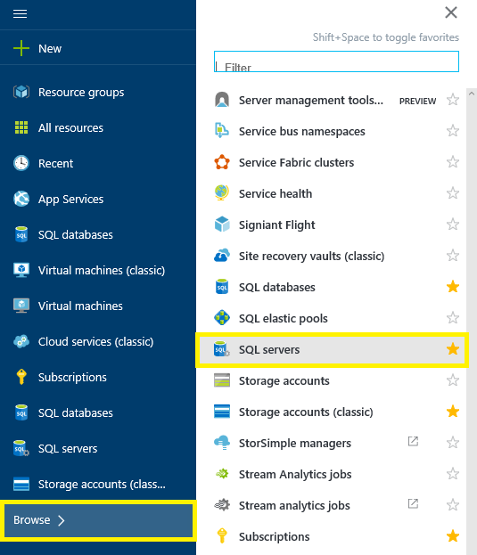
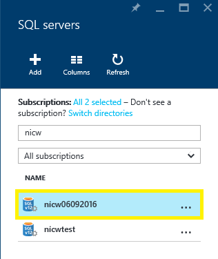
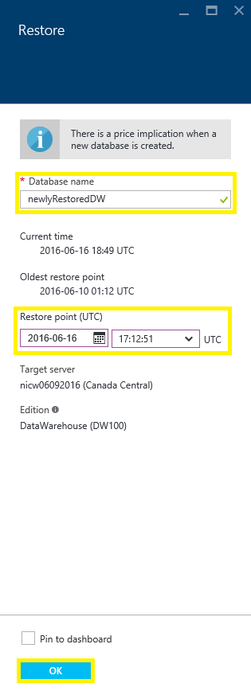
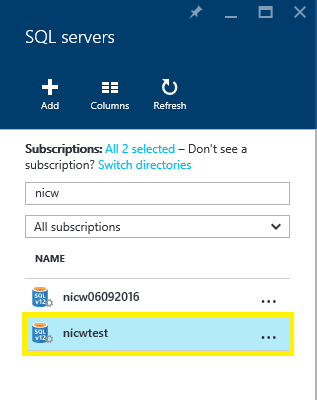
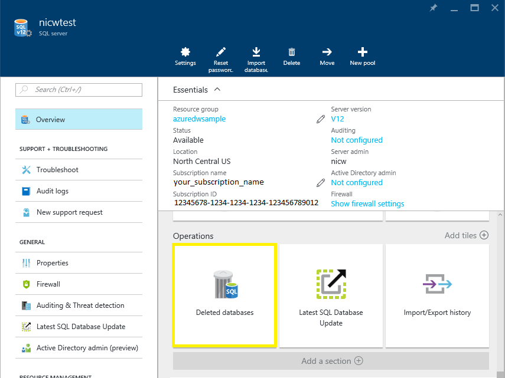
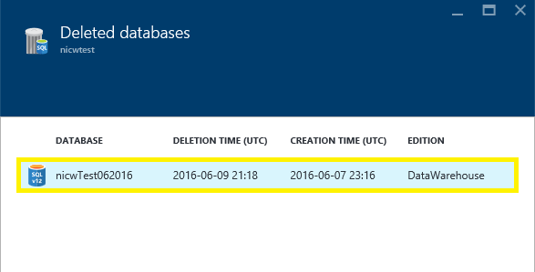
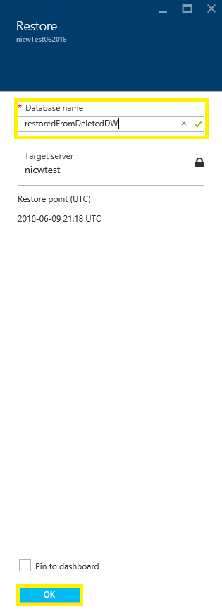

<properties
   pageTitle="Restore an Azure SQL Data Warehouse (Portal) | Microsoft Azure"
   description="Azure portal tasks for restoring an Azure SQL Data Warehouse."
   services="sql-data-warehouse"
   documentationCenter="NA"
   authors="sonyam"
   manager="barbkess"
   editor=""/>

<tags
   ms.service="sql-data-warehouse"
   ms.devlang="NA"
   ms.topic="article"
   ms.tgt_pltfrm="NA"
   ms.workload="data-services"
   ms.date="07/18/2016"
   ms.author="sonyama;barbkess;nicw"/>

# Restore an Azure SQL Data Warehouse (Portal)

> [AZURE.SELECTOR]
- [Overview][]
- [Portal][]
- [PowerShell][]
- [REST][]

In this article you will learn how to restore an Azure SQL Data Warehouse using the Azure Portal.

## Before you begin

**Verify your DTU capacity.** Each SQL Data Warehouse is hosted by a SQL server (e.g. myserver.database.windows.net) which has a default DTU quota.  Before you can restore a SQL Data Warehouse, verify that the your SQL server has enough remaining DTU quota for the database being restored. To learn how to calculate DTU needed or to request more DTU, see [Request a DTU quota change][].

## Restore an active or paused database

To restore a database:

1. Log in to the [Azure portal][]
2. On the left side of the screen select **Browse** and then select **SQL servers**
    
    
    
3. Navigate to your server and select it
    
    

4. Find the SQL Data Warehouse that you want to restore from and select it
    
    
5. At the top of the Data Warehouse blade, click **Restore**
    
    

6. Specify a new **Database name**
7. Select the latest **Restore Point**
    1. Make sure you choose the latest restore point.  Since restore points are shown in UTC, sometimes the default option shown is not the latest restore point.
    
    

8. Click **OK**
9. The database restore process will begin and can be monitored using **NOTIFICATIONS**

>[AZURE.NOTE] After the restore has completed, you can configure your recovered database by following the [Finalize a recovered database][] guide.

## Restore a deleted database

To restore a deleted database:

1. Log in to the [Azure portal][]
2. On the left side of the screen select **Browse** and then select **SQL servers**
    
    

3. Navigate to your server and select it
    
    

4. Scroll down to the Operations section on your server's blade
5. Click the **Deleted Databases** tile
    
    

6. Select the deleted database you want to restore
    
    

7. Specify a new **Database name**
    
    
    
8. Click **OK**
9. The database restore process will begin and can be monitored using **NOTIFICATIONS**

>[AZURE.NOTE] After the restore has completed, you can configure your recovered database by following the [Finalize a recovered database][] guide.

## Next steps
To learn about the business continuity features of Azure SQL Database editions, please read the [Azure SQL Database business continuity overview][].

<!--Image references-->

<!--Article references-->
[Azure SQL Database business continuity overview]: ./sql-database-business-continuity.md
[Overview]: ./sql-data-warehouse-restore-database-overview.md
[Portal]: ./sql-data-warehouse-restore-database-portal.md
[PowerShell]: ./sql-data-warehouse-restore-database-powershell.md
[REST]: ./sql-data-warehouse-restore-database-rest-api.md
[Finalize a recovered database]: ./sql-database-recovered-finalize.md
[Request a DTU quota change]: ./sql-data-warehouse-get-started-create-support-ticket.md#request-quota-change

<!--MSDN references-->

<!--Blog references-->

<!--Other Web references-->
[Azure portal]: https://portal.azure.com/
