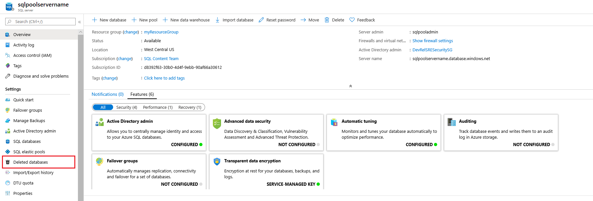
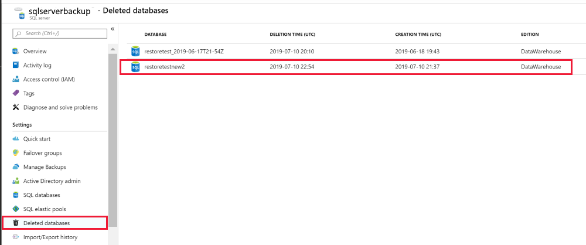
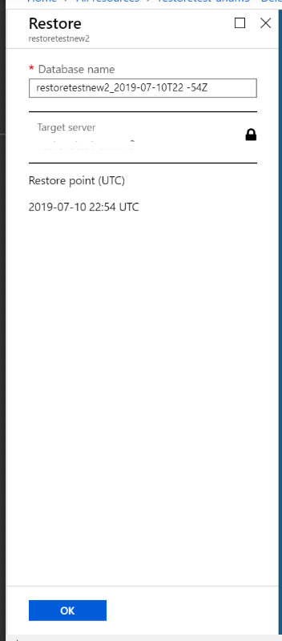

# Restore a deleted Azure SQL Data Warehouse

In this article, you learn to restore a deleted SQL Data Warehouse using Azure portal and PowerShell:

## Before you begin

[!INCLUDE [updated-for-az](../../includes/updated-for-az.md)]

**Verify your DTU capacity.** Each SQL Data Warehouse is hosted by a SQL server (for example, myserver.database.windows.net) which has a default DTU quota.  Verify that the SQL server has enough remaining DTU quota for the database being restored. To learn how to calculate DTU needed or to request more DTU, see [Request a DTU quota change][Request a DTU quota change].

## Restore a deleted data warehouse through PowerShell

To restore a deleted SQL Data Warehouse, use the [Restore-AzSqlDatabase][Restore-AzSqlDatabase] cmdlet. If the corresponding logical server has been deleted as well, you can't restore that data warehouse.

1. Before you begin, make sure to [install Azure PowerShell][Install Azure PowerShell].
2. Open PowerShell.
3. Connect to your Azure account and list all the subscriptions associated with your account.
4. Select the subscription that contains the deleted data warehouse to be restored.
5. Get the specific deleted data warehouse.
6. Restore the deleted data warehouse
    1. To restore the deleted SQL Data Warehouse to a different logical server, make sure to specify the other logical server name.  This logical server can also be in a different resource group and region.
    1. To restore to a different subscription, use the [Move][Move] button to move the logical server to another subscription.
1. Verify that the restored data warehouse is online.
1. After the restore has completed, you can configure your recovered data warehouse by following [configure your database after recovery][Configure your database after recovery].

```Powershell
$SubscriptionName="<YourSubscriptionName>"
$ResourceGroupName="<YourResourceGroupName>"
$ServerName="<YourServerNameWithoutURLSuffixSeeNote>"  # Without database.windows.net
#$TargetResourceGroupName="<YourTargetResourceGroupName>" # uncomment to restore to a different logical server.
#$TargetServerName="<YourtargetServerNameWithoutURLSuffixSeeNote>" 
$DatabaseName="<YourDatabaseName>"
$NewDatabaseName="<YourDatabaseName>"

Connect-AzAccount
Get-AzSubscription
Select-AzSubscription -SubscriptionName $SubscriptionName

# Get the deleted database to restore
$DeletedDatabase = Get-AzSqlDeletedDatabaseBackup -ResourceGroupName $ResourceGroupName -ServerName $ServerName -DatabaseName $DatabaseName

# Restore deleted database
$RestoredDatabase = Restore-AzSqlDatabase –FromDeletedDatabaseBackup –DeletionDate $DeletedDatabase.DeletionDate -ResourceGroupName $DeletedDatabase.ResourceGroupName -ServerName $DeletedDatabase.ServerName -TargetDatabaseName $NewDatabaseName –ResourceId $DeletedDatabase.ResourceID

# Use the following command to restore deleted data warehouse to a different logical server
#$RestoredDatabase = Restore-AzSqlDatabase –FromDeletedDatabaseBackup –DeletionDate $DeletedDatabase.DeletionDate -ResourceGroupName $TargetResourceGroupName -ServerName $TargetServerName -TargetDatabaseName $NewDatabaseName –ResourceId $DeletedDatabase.ResourceID

# Verify the status of restored database
$RestoredDatabase.status
```

## Restore a deleted database using the Azure portal

1. Sign in to the [Azure portal][Azure portal].
2. Navigate to the SQL server your deleted data warehouse was hosted on.
3. Select the **Deleted databases** icon in the table of contents.

    

4. Select the deleted SQL Data Warehouse that you want to restore.

    

5. Specify a new **Database name** and click **OK**

    

## Next Steps
- [Restore an existing data warehouse][Restore an existing data warehouse]
- [Restore from a geo-backup data warehouse][Restore from a geo-backup data warehouse]

<!--Image references-->

<!--Article references-->
[Azure SQL Database business continuity overview]: ../sql-database/sql-database-business-continuity.md
[Request a DTU quota change]: ./sql-data-warehouse-get-started-create-support-ticket.md
[Configure your database after recovery]: ../sql-database/sql-database-disaster-recovery.md#configure-your-database-after-recovery
[Install Azure PowerShell]: https://docs.microsoft.com/powershell/azure/overview
[Overview]: ./sql-data-warehouse-restore-database-overview.md
[Portal]: ./sql-data-warehouse-restore-database-portal.md
[PowerShell]: ./sql-data-warehouse-restore-database-powershell.md
[REST]: ./sql-data-warehouse-restore-database-rest-api.md
[Configure your database after recovery]: ../sql-database/sql-database-disaster-recovery.md#configure-your-database-after-recovery
[support ticket]: https://docs.microsoft.com/azure/sql-data-warehouse/sql-data-warehouse-get-started-create-support-ticket
[Move]:https://docs.microsoft.com/azure/azure-resource-manager/resource-group-move-resources#use-the-portal
[Restore an existing data warehouse]:./sql-data-warehouse-restore-active-paused-dw.md
[Restore a deleted data warehouse]:./sql-data-warehouse-restore-deleted-dw.md
[Restore from a geo-backup data warehouse]:./sql-data-warehouse-restore-from-geo-backup.md

<!--MSDN references-->
[Restore-AzSqlDatabase]: https://docs.microsoft.com/powershell/module/az.sql/restore-azsqldatabase

<!--Other Web references-->
[Azure Portal]: https://portal.azure.com/
