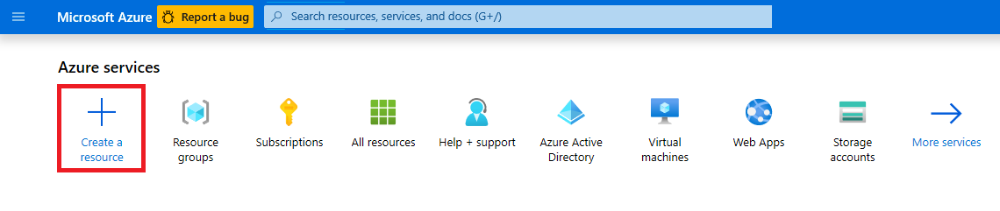
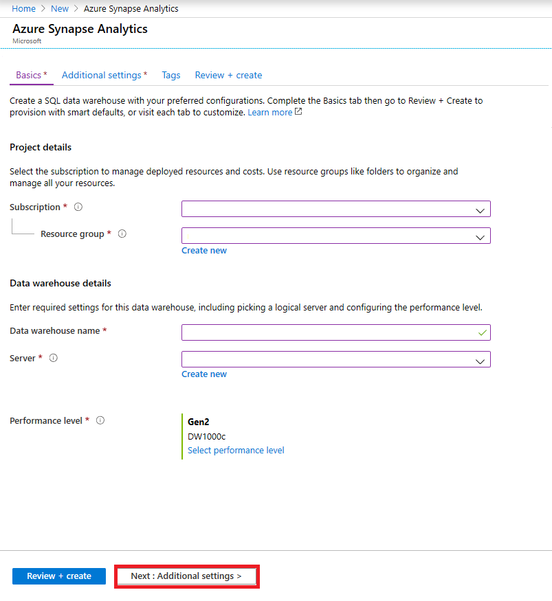
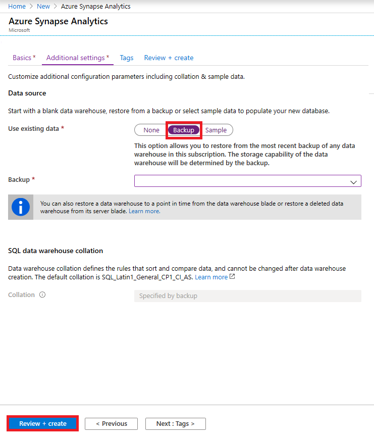

# Geo-restore Azure SQL Data Warehouse

In this article, you learn to restore your data warehouse from a geo-backup through Azure portal and PowerShell.

## Before you begin

[!INCLUDE [updated-for-az](../../includes/updated-for-az.md)]

**Verify your DTU capacity.** Each SQL Data Warehouse is hosted by a SQL server (for example, myserver.database.windows.net) which has a default DTU quota. Verify that the SQL server has enough remaining DTU quota for the database being restored. To learn how to calculate DTU needed or to request more DTU, see [Request a DTU quota change][Request a DTU quota change].

## Restore from an Azure geographical region through PowerShell

To restore from a geo-backup, use the [Get-AzSqlDatabaseGeoBackup][Get-AzSqlDatabaseGeoBackup] and [Restore-AzSqlDatabase][Restore-AzSqlDatabase] cmdlet.

> [!NOTE]
> You can perform a geo-restore to Gen2! To do so, specify an Gen2 ServiceObjectiveName (e.g. DW1000**c**) as an optional parameter.
>

1. Before you begin, make sure to [install Azure PowerShell][Install Azure PowerShell].
2. Open PowerShell.
2. Connect to your Azure account and list all the subscriptions associated with your account.
3. Select the subscription that contains the data warehouse to be restored.
4. Get the data warehouse you want to recover.
5. Create the recovery request for the data warehouse.
6. Verify the status of the geo-restored data warehouse.
7. To configure your data warehouse after the restore has completed, see [Configure your database after recovery][Configure your database after recovery].

```Powershell
$SubscriptionName="<YourSubscriptionName>"
$ResourceGroupName="<YourResourceGroupName>"
$ServerName="<YourServerNameWithoutURLSuffixSeeNote>"  # Without database.windows.net
$TargetResourceGroupName="<YourTargetResourceGroupName>" # Restore to a different logical server.
$TargetServerName="<YourtargetServerNameWithoutURLSuffixSeeNote>"  
$DatabaseName="<YourDatabaseName>"
$NewDatabaseName="<YourDatabaseName>"
$TargetServiceObjective="<YourTargetServiceObjective-DWXXXc>"

Connect-AzAccount
Get-AzSubscription
Select-AzSubscription -SubscriptionName $SubscriptionName
Get-AzureSqlDatabase -ServerName $ServerName

# Get the data warehouse you want to recover
$GeoBackup = Get-AzSqlDatabaseGeoBackup -ResourceGroupName $ResourceGroupName -ServerName $ServerName -DatabaseName $DatabaseName

# Recover data warehouse
$GeoRestoredDatabase = Restore-AzSqlDatabase –FromGeoBackup -ResourceGroupName $TargetResourceGroupName -ServerName $TargetServerName -TargetDatabaseName $NewDatabaseName –ResourceId $GeoBackup.ResourceID -ServiceObjectiveName $TargetServiceObjective

# Verify that the geo-restored data warehouse is online
$GeoRestoredDatabase.status
```

The recovered database will be TDE-enabled if the source database is TDE-enabled.

## Restore from an Azure geographical region through Azure portal

Follow the steps outlined below to restore an Azure SQL Data Warehouse from a geo-backup:

1. Sign in to your [Azure portal][Azure portal] account.
1. Click **+ Create a resource** and search for SQL Data Warehouse and click **Create**.

    
1. Fill out the information requested in the **Basics** tab and click **Next: Additional settings**.

    
1. For **Use existing data** parameter, select **Backup** and select the appropriate backup from the scroll down options. Click **Review + Create**.
 
   
2. Once the data warehouse has been restored, check that the **Status** is Online.

## Next Steps
- [Restore an existing data warehouse][Restore an existing data warehouse]
- [Restore a deleted data warehouse][Restore a deleted data warehouse]

<!--Image references-->

<!--Article references-->
[Install Azure PowerShell]: https://docs.microsoft.com/powershell/azure/overview
[Azure SQL Database business continuity overview]: ../sql-database/sql-database-business-continuity.md
[Request a DTU quota change]: ./sql-data-warehouse-get-started-create-support-ticket.md
[Configure your database after recovery]: ../sql-database/sql-database-disaster-recovery.md#configure-your-database-after-recovery
[How to install and configure Azure PowerShell]: /powershell/azureps-cmdlets-docs
[Overview]: ./sql-data-warehouse-restore-database-overview.md
[Portal]: ./sql-data-warehouse-restore-database-portal.md
[PowerShell]: ./sql-data-warehouse-restore-database-powershell.md
[REST]: ./sql-data-warehouse-restore-database-rest-api.md
[Configure your database after recovery]: ../sql-database/sql-database-disaster-recovery.md#configure-your-database-after-recovery
[Restore an existing data warehouse]:./sql-data-warehouse-restore-active-paused-dw.md
[Restore a deleted data warehouse]:./sql-data-warehouse-restore-deleted-dw.md
[Restore from a geo-backup data warehouse]:./sql-data-warehouse-restore-from-geo-backup.md


<!--MSDN references-->
[Restore-AzSqlDatabase]: https://docs.microsoft.com/powershell/module/az.sql/restore-azsqldatabase
[Get-AzSqlDatabaseGeoBackup]: https://docs.microsoft.com/powershell/module/az.sql/get-azsqldatabasegeobackup

<!--Other Web references-->
[Azure Portal]: https://portal.azure.com/
