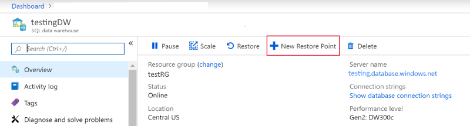
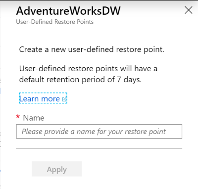

# User-defined restore points

In this article, you learn to create a new user-defined restore point for Azure SQL Data Warehouse using PowerShell and Azure portal.

## Create user-defined restore points through PowerShell

To create a user-defined restore point, use the [New-AzSqlDatabaseRestorePoint][New-AzSqlDatabaseRestorePoint] PowerShell cmdlet.

1. Before you begin, make sure to [install Azure PowerShell][Install Azure PowerShell].
2. Open PowerShell.
3. Connect to your Azure account and list all the subscriptions associated with your account.
4. Select the subscription that contains the database to be restored.
5. Create a restore point for an immediate copy of your data warehouse.

```Powershell

$SubscriptionName="<YourSubscriptionName>"
$ResourceGroupName="<YourResourceGroupName>"
$ServerName="<YourServerNameWithoutURLSuffixSeeNote>"  # Without database.windows.net
$DatabaseName="<YourDatabaseName>"
$Label = "<YourRestorePointLabel>"

Connect-AzAccount
Get-AzSubscription
Select-AzSubscription -SubscriptionName $SubscriptionName

# Create a restore point of the original database
New-AzSqlDatabaseRestorePoint -ResourceGroupName $ResourceGroupName -ServerName $ServerName -DatabaseName $DatabaseName -RestorePointLabel $Label

```

6. See the list of all the existing restore points.

```Powershell
# List all restore points
Get-AzSqlDatabaseRestorePoints -ResourceGroupName $ResourceGroupName -ServerName $ServerName -DatabaseName $DatabaseName
```

## Create user-defined restore points through the Azure portal

User-defined restore points can also be created through Azure portal.

1. Sign in to your [Azure portal][Azure portal] account.

2. Navigate to the SQL Data Warehouse that you want to create a restore point for.

3. Select **Overview** from the left pane, select **+ New Restore Point**. If the New Restore Point button isn't enabled, make sure that the data warehouse isn't paused.

    

4. Specify a name for your user-defined restore point and click **Apply**. User-defined restore points have a default retention period of seven days.

    

## Next steps

- [Restore an existing data warehouse][Restore an existing data warehouse]
- [Restore a deleted data warehouse][Restore a deleted data warehouse]
- [Restore from a geo-backup data warehouse][Restore from a geo-backup data warehouse]

<!--Image references-->

<!--Article references-->
[Azure SQL Database business continuity overview]: ../sql-database/sql-database-business-continuity.md
[Request a DTU quota change]: ./sql-data-warehouse-get-started-create-support-ticket.md
[Configure your database after recovery]: ../sql-database/sql-database-disaster-recovery.md#configure-your-database-after-recovery
[Install Azure PowerShell]: https://docs.microsoft.com/powershell/azure/overview
[Overview]: ./sql-data-warehouse-restore-database-overview.md
[Portal]: ./sql-data-warehouse-restore-database-portal.md
[PowerShell]: ./sql-data-warehouse-restore-database-powershell.md
[REST]: ./sql-data-warehouse-restore-database-rest-api.md
[Configure your database after recovery]: ../sql-database/sql-database-disaster-recovery.md#configure-your-database-after-recovery
[PowerShelldoc]:./sql-data-warehouse-restore-points.md#create-user-defined-restore-points-through-powershell
[Restore an existing data warehouse]:./sql-data-warehouse-restore-active-paused-dw.md
[Restore a deleted data warehouse]:./sql-data-warehouse-restore-deleted-dw.md
[Restore from a geo-backup data warehouse]:./sql-data-warehouse-restore-from-geo-backup.md
<!--MSDN references-->
[New-AzSqlDatabaseRestorePoint]: https://docs.microsoft.com/powershell/module/az.sql/new-azsqldatabaserestorepoint?view=azps-2.4.0

<!--Other Web references-->
[Azure Portal]: https://portal.azure.com/
