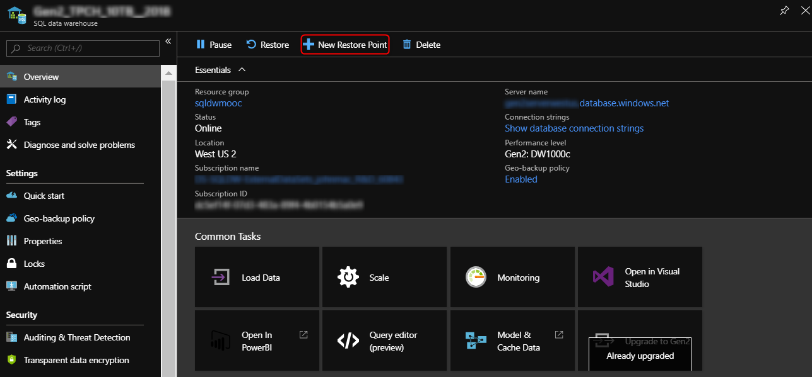
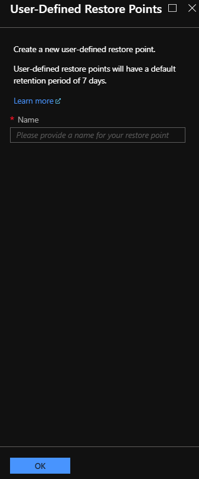
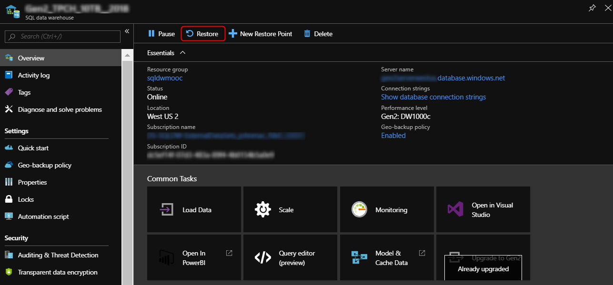
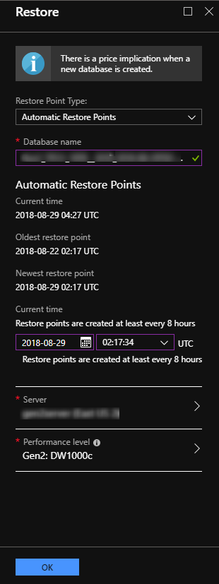
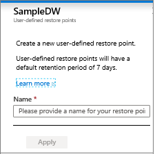
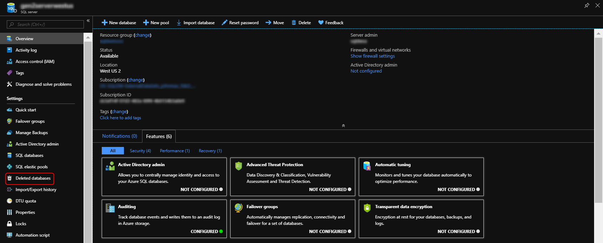
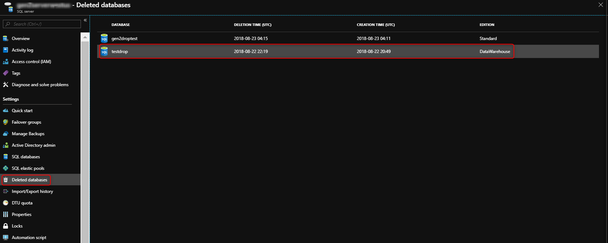
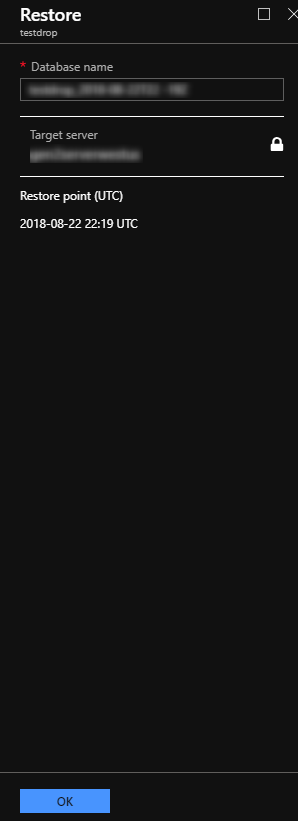

# Restoring Azure SQL Data Warehouse 
In this article you will learn how to do the following in the Azure portal and PowerShell:

- Create a restore point
- Restore from an automatic restore point or user-defined restore point
- Restore from a deleted database
- Restore from a geo-backup
- Create a copy of your data warehouse from a user-defined restore point

## Before you begin

[!INCLUDE [updated-for-az](../../includes/updated-for-az.md)]

**Verify your DTU capacity.** Each SQL Data Warehouse is hosted by a SQL server (e.g. myserver.database.windows.net) which has a default DTU quota.  Before you can restore a SQL data warehouse, verify that the your SQL server has enough remaining DTU quota for the database being restored. To learn how to calculate DTU needed or to request more DTU, see [Request a DTU quota change][Request a DTU quota change].

## Restore through PowerShell

## Install PowerShell
In order to use Azure PowerShell with SQL Data Warehouse, you will need to install Azure PowerShell.  You can check your version by running **Get-Module -ListAvailable -Name Az**. For more information on installing the latest version, see [How to install and configure Azure PowerShell][How to install and configure Azure PowerShell].

## Restore an active or paused database using PowerShell
To restore a database from a restore point use the [Restore-AzSqlDatabase][Restore-AzSqlDatabase] PowerShell cmdlet.

1. Open Windows PowerShell.

2. Connect to your Azure account and list all the subscriptions associated with your account.

3. Select the subscription that contains the database to be restored.

4. List the restore points for the database.

5. Pick the desired restore point using the RestorePointCreationDate.

   > [!NOTE]
   > When restoring, you can specify a different ServiceObjectiveName (DWU) or a different server residing in a different region.

6. Restore the database to the desired restore point.

7. Verify that the restored database is online.

```Powershell

$SubscriptionName="<YourSubscriptionName>"
$ResourceGroupName="<YourResourceGroupName>"
$ServerName="<YourServerNameWithoutURLSuffixSeeNote>"  # Without database.windows.net
$DatabaseName="<YourDatabaseName>"
$NewDatabaseName="<YourDatabaseName>"

Connect-AzAccount
Get-AzSubscription
Select-AzSubscription -SubscriptionName $SubscriptionName

# List the last 10 database restore points
((Get-AzSqlDatabaseRestorePoints -ResourceGroupName $ResourceGroupName -ServerName $ServerName -DatabaseName ($DatabaseName)).RestorePointCreationDate)[-10 .. -1]

# Or list all restore points
Get-AzSqlDatabaseRestorePoints -ResourceGroupName $ResourceGroupName -ServerName $ServerName -DatabaseName $DatabaseName

# Get the specific database to restore
$Database = Get-AzSqlDatabase -ResourceGroupName $ResourceGroupName -ServerName $ServerName -DatabaseName $DatabaseName

# Pick desired restore point using RestorePointCreationDate
$PointInTime="<RestorePointCreationDate>"  

# Restore database from a restore point
$RestoredDatabase = Restore-AzSqlDatabase –FromPointInTimeBackup –PointInTime $PointInTime -ResourceGroupName $Database.ResourceGroupName -ServerName $Database.ServerName -TargetDatabaseName $NewDatabaseName –ResourceId $Database.ResourceID

# Verify the status of restored database
$RestoredDatabase.status

```

> [!NOTE]
> After the restore has completed, you can configure your recovered database by following [Configure your database after recovery][Configure your database after recovery].
>

## Copy your data warehouse with user-defined restore points using PowerShell
To restore a database from a user-defined restore point use the [Restore-AzSqlDatabase][Restore-AzSqlDatabase] PowerShell cmdlet.

1. Open Windows PowerShell.
2. Connect to your Azure account and list all the subscriptions associated with your account.
3. Select the subscription that contains the database to be restored.
4. Create a restore point for an immediate copy of your database
5. Rename your database to a temporary name.
6. Retrieve the most recent restore point by the specified RestorePointLabel.
7. Get the resource id of the database to initiate the restore
8. Restore the database to the desired restore point.
9. Verify that the restored database is online.

```Powershell

$SubscriptionName="<YourSubscriptionName>"
$ResourceGroupName="<YourResourceGroupName>"
$ServerName="<YourServerNameWithoutURLSuffixSeeNote>"  # Without database.windows.net
$DatabaseName="<YourDatabaseName>"
$TempDatabaseName = "<YourTemporaryDatabaseName>"
$Label = "<YourRestorePointLabel"

Connect-AzAccount
Get-AzSubscription
Select-AzSubscription -SubscriptionName $SubscriptionName

# Create a restore point of the original database
New-AzSqlDatabaseRestorePoint -ResourceGroupName $ResourceGroupName -ServerName $ServerName -DatabaseName $DatabaseName -RestorePointLabel $Label

# Rename the database to a temporary name
Set-AzSqlDatabase -ResourceGroupName $ResourceGroupName -ServerName $ServerName -DatabaseName $DatabaseName -NewName $TempDatabaseName

# Get the most recent restore point with the specified label
$LabelledRestorePoint = Get-AzSqlDatabaseRestorePoints -ResourceGroupName $ResourceGroupName -ServerName $ServerName -DatabaseName $TempDatabaseName | where {$_.RestorePointLabel -eq $Label} | sort {$_.RestorePointCreationDate} | select -Last 1

# Get the resource id of the database
$ResourceId = (Get-AzSqlDatabase -ResourceGroupName $ResourceGroupName -ServerName $ServerName -DatabaseName $TempDatabaseName).ResourceId

# Restore the database to its original name from the labelled restore point from the temporary database
$RestoredDatabase = Restore-AzSqlDatabase -FromPointInTimeBackup -ResourceGroupName $ResourceGroupName -ServerName $ServerName -ResourceId $ResourceId -PointInTime $LabelledRestorePoint.RestorePointCreationDate -TargetDatabaseName $DatabaseName

# Verify the status of restored database
$RestoredDatabase.status

# The original temporary database can be deleted at this point

```

## Restore a deleted database using PowerShell
To restore a deleted database, use the [Restore-AzSqlDatabase][Restore-AzSqlDatabase] cmdlet.

1. Open Windows PowerShell.
2. Connect to your Azure account and list all the subscriptions associated with your account.
3. Select the subscription that contains the deleted database to be restored.
4. Get the specific deleted database.
5. Restore the deleted database.
6. Verify that the restored database is online.

```Powershell
$SubscriptionName="<YourSubscriptionName>"
$ResourceGroupName="<YourResourceGroupName>"
$ServerName="<YourServerNameWithoutURLSuffixSeeNote>"  # Without database.windows.net
$DatabaseName="<YourDatabaseName>"
$NewDatabaseName="<YourDatabaseName>"

Connect-AzAccount
Get-AzSubscription
Select-AzSubscription -SubscriptionName $SubscriptionName

# Get the deleted database to restore
$DeletedDatabase = Get-AzSqlDeletedDatabaseBackup -ResourceGroupName $ResourceGroupName -ServerName $ServerName -DatabaseName $DatabaseName

# Restore deleted database
$RestoredDatabase = Restore-AzSqlDatabase –FromDeletedDatabaseBackup –DeletionDate $DeletedDatabase.DeletionDate -ResourceGroupName $DeletedDatabase.ResourceGroupName -ServerName $DeletedDatabase.ServerName -TargetDatabaseName $NewDatabaseName –ResourceId $DeletedDatabase.ResourceID

# Verify the status of restored database
$RestoredDatabase.status
```

> [!NOTE]
> After the restore has completed, you can configure your recovered database by following [Configure your database after recovery][Configure your database after recovery].
>

## Restore from an Azure geographical region using PowerShell
To recover a database, use the [Restore-AzSqlDatabase][Restore-AzSqlDatabase] cmdlet.

> [!NOTE]
> You can perform a geo-restore to Gen2! To do so, specify an Gen2 ServiceObjectiveName (e.g. DW1000**c**) as an optional parameter.
>

1. Open Windows PowerShell.
2. Connect to your Azure account and list all the subscriptions associated with your account.
3. Select the subscription that contains the database to be restored.
4. Get the database you want to recover.
5. Create the recovery request for the database.
6. Verify the status of the geo-restored database.

```Powershell
Connect-AzAccount
Get-AzSubscription
Select-AzSubscription -SubscriptionName "<Subscription_name>"

# Get the database you want to recover
$GeoBackup = Get-AzSqlDatabaseGeoBackup -ResourceGroupName "<YourResourceGroupName>" -ServerName "<YourServerName>" -DatabaseName "<YourDatabaseName>"

# Recover database
$GeoRestoredDatabase = Restore-AzSqlDatabase –FromGeoBackup -ResourceGroupName "<YourResourceGroupName>" -ServerName "<YourTargetServer>" -TargetDatabaseName "<NewDatabaseName>" –ResourceId $GeoBackup.ResourceID -ServiceObjectiveName "<YourTargetServiceLevel>"

# Verify that the geo-restored database is online
$GeoRestoredDatabase.status
```

> [!NOTE]
> To configure your database after the restore has completed, see [Configure your database after recovery][Configure your database after recovery].
>

The recovered database will be TDE-enabled if the source database is TDE-enabled.

## Restore through the Azure portal

## Create a user-defined restore point using the Azure portal
1. Sign in to the [Azure portal][Azure portal].

2. Navigate to the SQL data warehouse that you want to create a restore point for.

3. At the top of the Overview blade, select **+New Restore Point**.

    

4. Specify a name for your restore point.

    

## Restore an active or paused database using the Azure portal
1. Sign in to the [Azure portal][Azure portal].
2. Navigate to the SQL data warehouse that you want to restore from.
3. At the top of the Overview blade, select **Restore**.

    

4. Select either **Automatic Restore Points** or **User-Defined Restore Points**.

    

5. For User-Defined Restore Points, **select a Restore point** or **Create a new user-defined restore point**.

    

## Restore a deleted database using the Azure portal
1. Sign in to the [Azure portal][Azure portal].
2. Navigate to the SQL server your deleted database was hosted on.
3. Select the Deleted databases icon in the table of contents.

    

4. Select the deleted database that you want to restore.

    

5. Specify a new database name.

    

<!--Image references-->

<!--Article references-->
[Azure SQL Database business continuity overview]: ../sql-database/sql-database-business-continuity.md
[Request a DTU quota change]: ./sql-data-warehouse-get-started-create-support-ticket.md
[Configure your database after recovery]: ../sql-database/sql-database-disaster-recovery.md#configure-your-database-after-recovery
[How to install and configure Azure PowerShell]: /powershell/azureps-cmdlets-docs
[Overview]: ./sql-data-warehouse-restore-database-overview.md
[Portal]: ./sql-data-warehouse-restore-database-portal.md
[PowerShell]: ./sql-data-warehouse-restore-database-powershell.md
[REST]: ./sql-data-warehouse-restore-database-rest-api.md
[Configure your database after recovery]: ../sql-database/sql-database-disaster-recovery.md#configure-your-database-after-recovery

<!--MSDN references-->
[Restore-AzSqlDatabase]: https://docs.microsoft.com/powershell/module/az.sql/restore-azsqldatabase

<!--Other Web references-->
[Azure Portal]: https://portal.azure.com/
