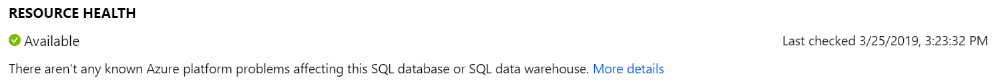
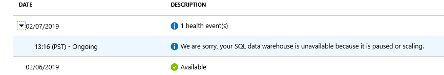
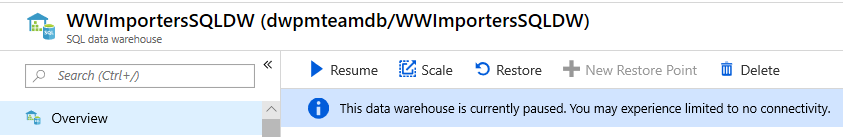

# Troubleshooting connectivity issues

This article lists common troubleshooting techniques around connecting to your SQL Data Warehouse.
- [Check service availability](./sql-data-warehouse-troubleshoot-connectivity.md#check-service-availability)
- [Check for paused or scaling operation](./sql-data-warehouse-troubleshoot-connectivity.md#check-for-paused-or-scaling-operation)
- [Check your firewall settings](./sql-data-warehouse-troubleshoot-connectivity.md#check-your-firewall-settings)
- [Check your VNet/Service Endpoint settings](./sql-data-warehouse-troubleshoot-connectivity.md#check-your-vnetservice-endpoint-settings)
- [Check for the latest drivers](./sql-data-warehouse-troubleshoot-connectivity.md#check-for-the-latest-drivers)
- [Check your connection string](./sql-data-warehouse-troubleshoot-connectivity.md#check-your-connection-string)
- [Intermittent connection issues](./sql-data-warehouse-troubleshoot-connectivity.md#intermittent-connection-issues)
- [Common error messages](./sql-data-warehouse-troubleshoot-connectivity.md#common-error-messages)

## Check service availability

Check to see if the service is available. In the Azure portal, go to the SQL data warehouse you're trying to connect. In the left TOC panel, click on **Diagnose and solve problems**.


The status of your SQL data warehouse will be shown here. If the service isn't showing as **Available**, check further steps.



If your Resource health shows that your data warehouse is paused or scaling, follow the guidance to resume your data warehouse.


Additional information about Resource Health can be found here.

## Check for paused or scaling operation

Check the portal to see if your SQL data warehouse is paused or scaling.



If you see that your service is paused or scaling, check to see it isn't during your maintenance schedule. On the portal for your SQL data warehouse *Overview*, you'll see the elected maintenance schedule.


Otherwise, check with your IT administrator to verify that this maintenance isn't a scheduled event. To resume the SQL data warehouse, follow the steps outlined [here](https://docs.microsoft.com/azure/sql-data-warehouse/pause-and-resume-compute-portal#resume-compute).

## Check your firewall settings

SQL Data Warehouse communicates over port 1433.   If you're trying to connect from within a corporate network, outbound traffic over port 1433 might not be allowed by your network's firewall. In that case, you can't connect to your Azure SQL Database server unless your IT department opens port 1433. Additional information on firewall configurations can be found [here](https://docs.microsoft.com/azure/sql-database/sql-database-firewall-configure#manage-server-level-ip-firewall-rules-using-the-azure-portal).

## Check your VNet/Service Endpoint settings

If you're receiving Errors 40914 and 40615, see [error description and resolution here](https://docs.microsoft.com/azure/sql-database/sql-database-vnet-service-endpoint-rule-overview?toc=/azure/sql-data-warehouse/toc.json#errors-40914-and-40615).

## Check for the latest drivers

### Software

Check to make sure you're using the latest tools to connect to your SQL data warehouse:

* SSMS
* Azure Data Studio
* SQL Server Data Tools (Visual Studio)

### Drivers

Check to make sure you're using the latest driver versions.  Using an older version of the drivers could result in unexpected behaviors as the older drivers may not support new features.

* [ODBC](https://docs.microsoft.com/sql/connect/odbc/download-odbc-driver-for-sql-server)
* [JDBC](https://docs.microsoft.com/sql/connect/jdbc/download-microsoft-jdbc-driver-for-sql-server)
* [OLE DB](https://docs.microsoft.com/sql/connect/oledb/download-oledb-driver-for-sql-server)
* [PHP](https://docs.microsoft.com/sql/connect/php/download-drivers-php-sql-server)

## Check your connection string

Check to make sure your connection strings are set properly.  Below are some samples.  You can find additional information around [connection strings here](https://docs.microsoft.com/azure/sql-data-warehouse/sql-data-warehouse-connection-strings).

ADO.NET connection string

```csharp
Server=tcp:{your_server}.database.windows.net,1433;Database={your_database};User ID={your_user_name};Password={your_password_here};Encrypt=True;TrustServerCertificate=False;Connection Timeout=30;
```

ODBC Connection string

```csharp
Driver={SQL Server Native Client 11.0};Server=tcp:{your_server}.database.windows.net,1433;Database={your_database};Uid={your_user_name};Pwd={your_password_here};Encrypt=yes;TrustServerCertificate=no;Connection Timeout=30;
```

PHP Connection string

```PHP
Server: {your_server}.database.windows.net,1433 \r\nSQL Database: {your_database}\r\nUser Name: {your_user_name}\r\n\r\nPHP Data Objects(PDO) Sample Code:\r\n\r\ntry {\r\n   $conn = new PDO ( \"sqlsrv:server = tcp:{your_server}.database.windows.net,1433; Database = {your_database}\", \"{your_user_name}\", \"{your_password_here}\");\r\n    $conn->setAttribute( PDO::ATTR_ERRMODE, PDO::ERRMODE_EXCEPTION );\r\n}\r\ncatch ( PDOException $e ) {\r\n   print( \"Error connecting to SQL Server.\" );\r\n   die(print_r($e));\r\n}\r\n\rSQL Server Extension Sample Code:\r\n\r\n$connectionInfo = array(\"UID\" => \"{your_user_name}\", \"pwd\" => \"{your_password_here}\", \"Database\" => \"{your_database}\", \"LoginTimeout\" => 30, \"Encrypt\" => 1, \"TrustServerCertificate\" => 0);\r\n$serverName = \"tcp:{your_server}.database.windows.net,1433\";\r\n$conn = sqlsrv_connect($serverName, $connectionInfo);
```

JDBC connection string

```Java
jdbc:sqlserver://yourserver.database.windows.net:1433;database=yourdatabase;user={your_user_name};password={your_password_here};encrypt=true;trustServerCertificate=false;hostNameInCertificate=*.database.windows.net;loginTimeout=30;
```

## Intermittent connection issues

Check to see if you're experiencing heavy load on the server with a high number of queued requests. You may need to scale up your data warehouse for additional resources.

## Common error messages

Errors 40914 and 40615, see the [error description and resolution here](https://docs.microsoft.com/azure/sql-database/sql-database-vnet-service-endpoint-rule-overview?toc=/azure/sql-data-warehouse/toc.json#errors-40914-and-40615).

## Still having connectivity issues?
Create a [support ticket](https://docs.microsoft.com/azure/sql-data-warehouse/sql-data-warehouse-get-started-create-support-ticket) so the engineering team can support you.
