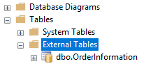

# Tutorial: Use Elastic Query to access data in Azure SQL Data Warehouse from Azure SQL Database

This tutorial uses the Elastic Query feature to query Azure SQL Data Warehouse from Azure SQL Database. 

## Prerequisites for the tutorial

Before you begin the tutorial, you must have the following prerequisites:

1. Installed SQL Server Management Studio (SSMS).
2. Created an Azure SQL server with a  database and data warehouse within this server.
3. Setup firewall rules for accessing the Azure SQL Server.

## Set up connection between SQL Data Warehouse and SQL Database instances 

1. Using SSMS or another query client, open a new query for database **master** on your logical server.

2. Create a login and user that represents the SQL database to data warehouse connection.

   ```sql
   CREATE LOGIN SalesDBLogin WITH PASSWORD = 'aReallyStrongPassword!@#';
   ```

3. Using SSMS or another query client, open a new query for the **SQL data warehouse instance** on your logical server.

4. Create a user on the data warehouse instance with the login you created in Step 2

   ```sql
   CREATE USER SalesDBUser FOR LOGIN SalesDBLogin;
   ```

5. Grant permissions to the user from Step 4 that you would like the SQL Database would like to execute. In this example, permission is only being granted for SELECT on a specific schema, illustrating how we may restrict queries from the SQL database to a specific domain. 

   ```sql
   GRANT SELECT ON SCHEMA :: [dbo] TO SalesDBUser;
   ```

6. Using SSMS or another query client, open a new query for the **SQL database instance** on your logical server.

7. Create a master key if you do not already have one. 

   ```sql
   CREATE MASTER KEY; 
   ```

8. Create a database scoped credential using the credentials you created in Step 2.

   ```sql
   CREATE DATABASE SCOPED CREDENTIAL SalesDBElasticCredential
   WITH IDENTITY = 'SalesDBLogin',
   SECRET = 'aReallyStrongPassword@#!';
   ```

9. Create an external data source that points to the data warehouse instance.

   ```sql
   CREATE EXTERNAL DATA SOURCE EnterpriseDwSrc WITH 
       (TYPE = RDBMS, 
       LOCATION = '<SERVER NAME>.database.windows.net', 
       DATABASE_NAME = '<SQL DATA WAREHOUSE NAME>', 
       CREDENTIAL = SalesDBElasticCredential, 
   ) ;
   ```

10. Now you can create external tables that reference this external data source. Queries using those tables are sent to the data warehouse instance to be processed and sent back to the database instance.


## Elastic Query from SQL database to SQL data warehouse

In the next few steps we will create a table in our data warehouse instance with several values. We will then demonstrate how to set up an external table to query the data warehouse instance from the database instance.

1. Using SSMS or another query client, open a new query for the **SQL Data Warehouse** on your logical server.

2. Submit the following query to create an **OrdersInformation** table in your data warehouse instance.

   ```sql
   CREATE TABLE [dbo].[OrderInformation]
   ( 
       [OrderID] [int] NOT NULL 
   ,   [CustomerID] [int] NOT NULL 
   ) 
   INSERT INTO [dbo].[OrderInformation] ([OrderID], [CustomerID]) VALUES (123, 1) 
   INSERT INTO [dbo].[OrderInformation] ([OrderID], [CustomerID]) VALUES (149, 2) 
   INSERT INTO [dbo].[OrderInformation] ([OrderID], [CustomerID]) VALUES (857, 2) 
   INSERT INTO [dbo].[OrderInformation] ([OrderID], [CustomerID]) VALUES (321, 1) 
   INSERT INTO [dbo].[OrderInformation] ([OrderID], [CustomerID]) VALUES (564, 8)
   ```

3. Using SSMS or another query client, open a new query for the **SQL database** on your logical server.

4. Submit the following query to create an external table definition that points to the **OrdersInformation** table in the data warehouse instance.

   ```sql
   CREATE EXTERNAL TABLE [dbo].[OrderInformation]
   ( 
       [OrderID] [int] NOT NULL
   ,   [CustomerID] [int] NOT NULL 
   ) 
   WITH 
   (
     	DATA_SOURCE = EnterpriseDwSrc
   ,	SCHEMA_NAME = N'dbo'
   ,	OBJECT_NAME = N'OrderInformation'
   )
   ```

5. Observe that you now have an external table definition in your **SQL database instance**.

   


6. Submit the following query, which queries the data warehouse instance. You should receive the five values that you inserted in Step 2. 

```sql
SELECT * FROM [dbo].[OrderInformation];
```

> [!NOTE]
>
> Notice that despite few values, this query takes considerable time to return. When using elastic query with data warehouse, one should consider the overhead costs of query processing and movement over the wire. Utilize elastic query remote execution when the compute power, not latency, is the priority.

Congratulations, you have set up the very basics of Elastic Query. 

## Next steps
For recommendations, see [Best practices for using Elastic Query with Azure SQL Data Warehouse](how-to-use-elastic-query-with-sql-data-warehouse.md).