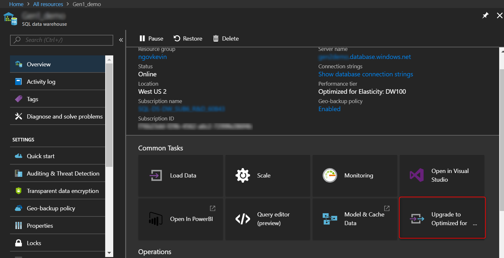
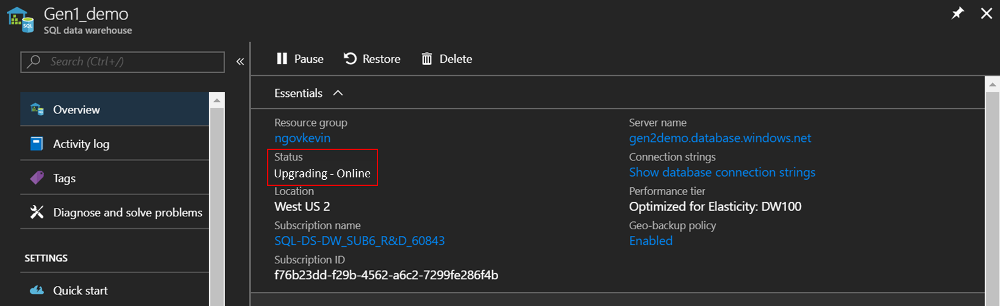

# Optimize performance by upgrading SQL Data Warehouse
Upgrade Azure SQL Data Warehouse to latest generation of Azure hardware and storage architecture.

## Why upgrade?
You can now seamlessly upgrade to the SQL Data Warehouse Compute Optimized Gen2 tier in the Azure portal. If you have a Compute Optimized Gen1 tier data warehouse, upgrading is recommended. By upgrading, you can use the latest generation of Azure hardware and enhanced storage architecture. You can take advantage of faster performance, higher scalability, and unlimited columnar storage. 

> [!VIDEO https://www.youtube.com/embed/9B2F0gLoyss]

## Applies to
This upgrade applies to Compute Optimized Gen1 tier data warehouses.

## Sign in to the Azure portal

Sign in to the [Azure portal](https://portal.azure.com/).

## Before you begin
> [!NOTE]
> If your existing Compute Optimized Gen1 tier data warehouse is not in a region where the Compute Optimized Gen2 tier is available, you can [geo-restore](https://docs.microsoft.com/azure/sql-data-warehouse/sql-data-warehouse-restore-database-powershell#restore-from-an-azure-geographical-region) through PowerShell to a supported region.
> 
>

1. If the Compute Optimized Gen1 tier data warehouse to be upgraded is paused, [resume the data warehouse](pause-and-resume-compute-portal.md).
2. Be prepared for a few minutes of downtime. 


## Start the upgrade

1. Go to your Compute Optimized Gen1 tier data warehouse in the Azure portal and click on **Upgrade to Gen2**:
    

2. By default, **select the suggested performance level** for the data warehouse based on your current performance level on Compute Optimized Gen1 tier by using the mapping below:
    
   | Compute Optimized Gen1 tier | Compute Optimized Gen2 tier |
   | :----------------------: | :-------------------: |
   |      DW100 – DW1000      |        DW1000c        |
   |          DW1200          |        DW1500c        |
   |          DW1500          |        DW1500c        |
   |          DW2000          |        DW2000c        |
   |          DW3000          |        DW3000c        |
   |          DW6000          |        DW6000c        |

3. Ensure your workload has completed running and quiesced before upgrading. You will experience downtime for a few minutes before your data warehouse is back online as a Compute Optimized Gen2 tier data warehouse. **Click Upgrade**. The price of the Compute Optimized Gen2 tier performance tier is currently half-off during the preview period:
    
   

4. **Monitor your upgrade** by checking the status in the Azure portal:

   
   
   The first step of the upgrade process goes through the scale operation ("Upgrading - Offline") where all sessions will be killed, and connections will be dropped. 
   
   The second step of the upgrade process is data migration ("Upgrading - Online"). Data migration is an online trickle background process, which slowly moves columnar data from the old storage architecture to the new storage architecture leveraging a local SSD cache. During this time, your data warehouse will be online for querying and loading. All your data will be available to query regardless of whether it has been migrated or not. The data migration happens at a varying rate depending on your data size, your performance level, and the number of your columnstore segments. 

5. **Optional Recommendation:** 
To expedite the data migration background process, you can immediately force data movement by running [Alter Index rebuild](https://docs.microsoft.com/azure/sql-data-warehouse/sql-data-warehouse-tables-index) on all primary columnstore tables you'd be querying at a larger SLO and resource class. This operation is **offline** compared to the trickle background process which can take hours to complete depending on the number and sizes of your tables; however, data migration will be much quicker where you can then take full advantage of the new enhanced storage architecture once complete with high-quality rowgroups. 

The following query generates the required Alter Index Rebuild commands to expedite the data migration process:

```sql
SELECT 'ALTER INDEX [' + idx.NAME + '] ON [' 
       + Schema_name(tbl.schema_id) + '].[' 
       + Object_name(idx.object_id) + '] REBUILD ' + ( CASE 
                                                         WHEN ( 
                                                     (SELECT Count(*) 
                                                      FROM   sys.partitions 
                                                             part2 
                                                      WHERE  part2.index_id 
                                                             = idx.index_id 
                                                             AND 
                                                     idx.object_id = 
                                                     part2.object_id) 
                                                     > 1 ) THEN 
              ' PARTITION = ' 
              + Cast(part.partition_number AS NVARCHAR(256)) 
              ELSE '' 
                                                       END ) + '; SELECT ''[' + 
              idx.NAME + '] ON [' + Schema_name(tbl.schema_id) + '].[' + 
              Object_name(idx.object_id) + '] ' + ( 
              CASE 
                WHEN ( (SELECT Count(*) 
                        FROM   sys.partitions 
                               part2 
                        WHERE 
                     part2.index_id = 
                     idx.index_id 
                     AND idx.object_id 
                         = part2.object_id) > 1 ) THEN 
              ' PARTITION = ' 
              + Cast(part.partition_number AS NVARCHAR(256)) 
              + ' completed'';' 
              ELSE ' completed'';' 
                                                    END ) 
FROM   sys.indexes idx 
       INNER JOIN sys.tables tbl 
               ON idx.object_id = tbl.object_id 
       LEFT OUTER JOIN sys.partitions part 
                    ON idx.index_id = part.index_id 
                       AND idx.object_id = part.object_id 
WHERE  idx.type_desc = 'CLUSTERED COLUMNSTORE'; 
```


## Next steps
Your upgraded data warehouse is online. To take advantage of the enhanced architecture, see [Resource classes for Workload Management](resource-classes-for-workload-management.md).
 
