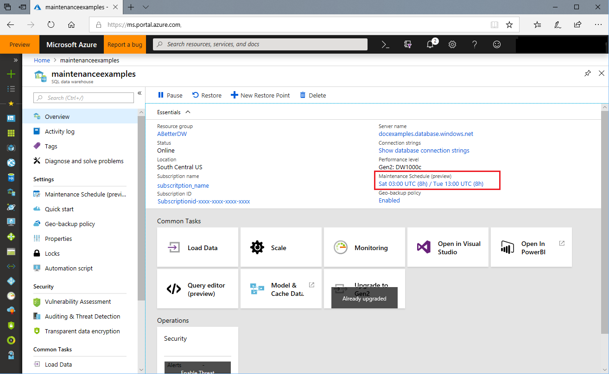

# View a maintenance schedule 

## Portal

By default, all newly created Azure SQL Data Warehouse instances have an eight-hour primary and secondary maintenance window applied during deployment. You can change the windows as soon deployment is complete. No maintenance will take place outside the specified maintenance windows without prior notification.

To view the maintenance schedule that has been applied to your data warehouse, complete the following steps:

1.	Sign in to the [Azure portal](https://portal.azure.com/).
2.	Select the data warehouse that you want to view. 
3.	The selected data warehouse opens on the overview blade. The maintenance schedule that's applied to the data warehouse appears below **Maintenance schedule**.

## Next steps
- [Learn more](https://docs.microsoft.com/azure/monitoring-and-diagnostics/monitor-alerts-unified-usage) about creating, viewing, and managing alerts by using Azure Monitor.
- [Learn more](https://docs.microsoft.com/azure/monitoring-and-diagnostics/monitor-alerts-unified-log-webhook) about webhook actions for log alert rules.
- [Learn more](https://docs.microsoft.com/azure/monitoring-and-diagnostics/monitoring-action-groups) Creating and managing Action Groups.
- [Learn more](https://docs.microsoft.com/azure/service-health/service-health-overview) about Azure Service Health.

