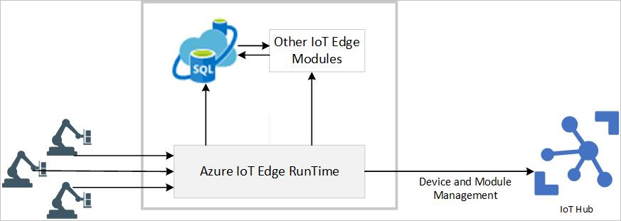

# What is Azure SQL Database Edge Preview?

Azure SQL Database Edge Preview is an optimized relational database engine geared for IoT and IoT Edge deployments. It provides capabilities to create a high-performance data storage and processing layer for IoT applications and solutions. Azure SQL Database Edge provides capabilities to stream, process, and analyze relational and non-relational such as JSON, graph and time-series data, which makes it the right choice for a variety of modern IoT applications.

Azure SQL Database Edge is built on the latest versions of the [Microsoft SQL Server Database Engine](/sql/sql-server/sql-server-technical-documentation?toc=/azure/sql-database-edge/toc.json), which provides industry-leading performance, security and query processing capabilities. Since, Azure SQL Database Edge is built on the same engine as SQL Server and Azure SQL Database, it provides the same T-SQL programming surface area that makes development of applications or solutions easier and faster, and at the same time makes application portability between IoT Edge devices, data centers and the cloud straight forward.

## Deployment Models

Azure SQL Database Edge is available on the Azure Marketplace and can be deployed as a module for [Azure IoT Edge](../iot-edge/about-iot-edge.md). For more information, see [Deploy Azure SQL Database Edge](deploy-portal.md). 

## Editions of SQL Database Edge

SQL Database Edge is available with three different editions or software plans. These editions have identical feature sets and only differ in terms of their usage rights and the amount of cpu/memory they support.

   |**Plan**  |**Description**  |
   |---------|---------|
   |Developer  |  Development only sku, with the same throttling limits as imposed by Standard sku mentioned below |
   |Standard   |  Standard plan supports up to 4 CPU's and up to 32 GB of memory for the SQL Database Edge Container. |
   |Premium    |  Premium sku supports up to 8 cores and up to 64 GB of memory for the SQL Database Edge Container. |

## Pricing and Availability

Azure SQL Database is currently in preview. For more information on the pricing and availability, see [Azure SQL Database Edge](https://azure.microsoft.com/services/sql-database-edge/).

> [!IMPORTANT]
> To understand the feature differences between Azure SQL Database Edge and SQL Server, as well as the differences among different Azure SQL Database Edge options, see [SQL Database Edge Database features](https://azure.microsoft.com/services/sql-database-edge/).

## Streaming Capabilities  

Azure SQL Database Edge provides built in streaming capabilities for real-time analytics and complex event-processing. The streaming capability is built using the same constructs as [Azure Stream Analytics](../stream-analytics/stream-analytics-introduction.md) and provides similar capabilities as [Azure Stream Analytics on IoT Edge](../stream-analytics/stream-analytics-edge.md).

The streaming engine for Azure SQL Database Edge is designed for low-latency, resiliency, efficient use of bandwidth and compliance.

## Machine Learning and Artificial Intelligence Capabilities

Azure SQL Database Edge provides built-in machine learning and analytics capabilities by integrating the open format ONNX (Open Neural Network Exchange) runtime, which allows exchange of deep learning and neural network models between different frameworks. For more information on ONNX, see [here](https://onnx.ai/). ONNX runtime provides the flexibility to develop models in a language or tools of your choice, which can then be converted to the ONNX format for execution within SQL Database Edge. For more information, see [Machine Learning and Artificial Intelligence with ONNX in SQL Database Edge](onnx-overview.md).

## Working with Azure SQL Database Edge

Azure SQL Database Edge makes developing and maintaining applications easier and more productive. Users can use all the familiar tools and skills to build great apps and solutions for their IoT Edge needs. User can develop in SQL Database Edge using tools like the following:

- [The Azure portal](https://portal.azure.com/) - A web-based application for managing all Azure services.
- [SQL Server Management Studio](/sql/ssms/download-sql-server-management-studio-ssms/) - A free, downloadable client application for managing any SQL infrastructure, from SQL Server to SQL Database.
- [SQL Server Data Tools in Visual Studio](/sql/ssdt/download-sql-server-data-tools-ssdt/) - A free, downloadable client application for developing SQL Server relational databases, SQL databases, Integration Services packages, Analysis Services data models, and Reporting Services reports.
- [Azure Data Studio](/sql/azure-data-studio/what-is/) - A free, downloadable, cross platform database tool for data professional using the Microsoft family of on-premises and cloud data platforms on Windows, MacOS, and Linux.
- [Visual Studio Code](https://code.visualstudio.com/docs) - A free, downloadable, open-source code editor for Windows, macOS, and Linux. It supports extensions, including the [mssql extension](https://aka.ms/mssql-marketplace) for querying Microsoft SQL Server, Azure SQL Database, and Azure SQL Data Warehouse.

## Next steps

- For pricing and availability-related details, see [Azure SQL Database Edge](https://azure.microsoft.com/services/sql-database-edge/).
- Request to enable Azure SQL Database Edge for your subscription.
- To get started, see the following:
  - [Deploy SQL Database Edge through Azure portal](deploy-portal.md)
  - [Machine Learning and Artificial Intelligence with SQL Database Edge](onnx-overview.md)
