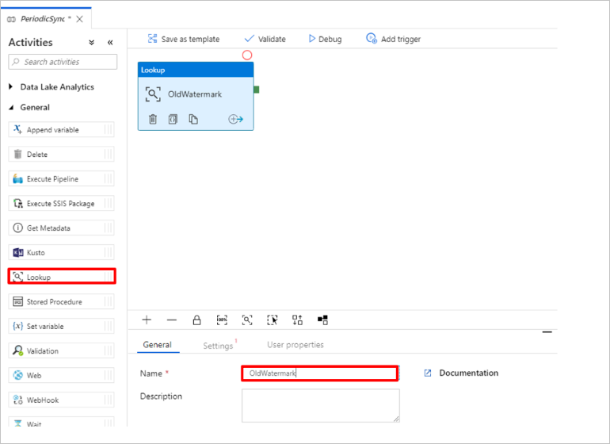
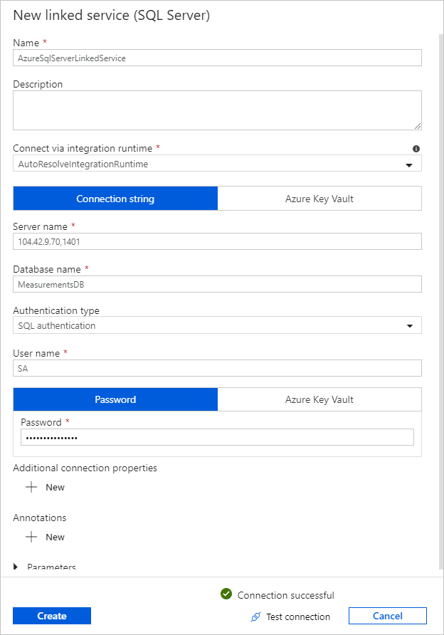

# Tutorial: Sync data from SQL Database Edge to Azure Blob storage using Azure Data Factory

In this tutorial, you use Azure Data Factory to incrementally sync data from a table in an instance of Azure SQL Database Edge to Azure Blob storage.

## Before you begin

If you haven't already created a database or table in your Azure SQL Database Edge deployment, use one of the following methods to create one:

* Use [SQL Server Management Studio](/sql/ssms/download-sql-server-management-studio-ssms/) or [Azure Data Studio](/sql/azure-data-studio/download/) to connect to SQL Database Edge and execute a SQL script to create the database and table.
* Create a SQL database and table using [SQLCMD](/sql/tools/sqlcmd-utility/) by directly connecting to the SQL Database Edge module. For more information, see [Connect to the Database Engine using sqlcmd](/sql/ssms/scripting/sqlcmd-connect-to-the-database-engine/).
* Use SQLPackage.exe to deploy a dacpac file to the SQL Database Edge container. This can be automated by specifying the SQLPackage file URI as part of the modules desired properties configuration, or by directly using the SqlPackage.exe client tool to deploy a dacpac to SQL Database Edge.

    To download sqlpackage, see [Download and install sqlpackage](/sql/tools/sqlpackage-download/). The following sample commands for SqlPackage.exe are provided, but check the sqlpackage documentation for more information.

    **Create dacpac**:

    ```cmd
    sqlpackage /Action:Extract /SourceConnectionString:"Data Source=<Server_Name>,<port>;Initial Catalog=<DB_name>;User ID=<user>;Password=<password>" /TargetFile:<dacpac_file_name> 
    ```

    **Apply dacpac**:

    ```cmd
    sqlpackage /Action:Publish /Sourcefile:<dacpac_file_name> /TargetServerName:<Server_Name>,<port> /TargetDatabaseName:<DB_Name> /TargetUser:<user> /TargetPassword:<password>
    ```

## Create a SQL table and procedure to store and update the Watermark levels

The Watermark table is used to store the last timestamp up to which the data has already been synchronized with the Azure storage. The Transact-SQL (T-SQL) stored procedure is used to update the watermark table after every sync. 

Execute the following commands on the SQL Database Edge instance:

```sql
    Create table [dbo].[watermarktable]
    (
    TableName varchar(255),
    WatermarkValue datetime,
    )
    GO

    CREATE PROCEDURE usp_write_watermark @timestamp datetime, @TableName varchar(50)  
    AS  
    BEGIN
    UPDATE [dbo].[watermarktable]
    SET [WatermarkValue] = @timestamp WHERE [TableName] = @TableName
    END
    Go
```

## Create a Data Factory Workflow

In this section, you create an Azure Data Factory pipeline to sync data from a table within Azure SQL Database Edge to Azure Blob storage.

### Create Data Factory using the Data Factory UI

Create a Data Factory using the instructions in this [tutorial](../data-factory/quickstart-create-data-factory-portal.md#create-a-data-factory).

### Create a Data Factory pipeline

1. On the **Get Started** page of the Data Factory UI, select the **Create Pipeline** tile.

    

2. On the **General** page of the **Properties** window for the pipeline, enter **PeriodicSync** name.

3. Add the **Lookup** activity to get the old watermark value. In the **Activities toolbox**, expand **General**, drag & drop the **Lookup** activity to the pipeline designer surface. Change the name of the activity to *OldWatermark*.

    

4. Switch to the **Settings** tab, and select **+ New** for **Source Dataset**. In this step, you create a dataset to represent data in the watermarktable. This table contains the old watermark that was used in the previous copy operation.

5. In the **New Dataset** window, select **Azure SQL Server**, and select **Continue**.  

6. In the **Set properties** window for the dataset, enter *WatermarkDataset* for Name.

7. For **Linked Service**, select **New**, and then perform the following steps:

    1. Enter *SQLDBEdgeLinkedService* for **Name**.

    2. Input your SQL Database Edge server details for **Server name**.

    3. Input your **Database name** from the dropdown list.

    4. Enter your **User name** and **Password**.

    5. To test connection to the SQL Database Edge instance, select **Test connection**.

    6. Select **Create**.

    

    7. Select **Ok**

8. In the **Settings** tab, select **Edit**.

9. In the **Connection** tab, select *[dbo].[watermarktable]* for **Table**. If you want to preview data in the table, select **Preview data**.

10. Switch to the pipeline editor by selecting the pipeline tab at the top or by selecting the name of the pipeline in the tree view on the left. In the properties window for the **Lookup activity**, confirm that **WatermarkDataset** is selected for the **Source Dataset** field.

11. In the **Activities** toolbox, expand **General**, drag and drop another **Lookup** activity to the pipeline designer surface, and set the name to **NewWatermark** in the **General** tab of the properties window. This Lookup activity gets the new watermark value from the table with the source data to be copied to the destination.

12. In the properties window for the second **Lookup** activity, switch to the **Settings** tab, and select **New** to create a dataset to point to the source table that contains the new watermark value.

13. In the **New Dataset** window, select SQL Database Edge instance, and select **Continue**.

    1. In the **Set properties** window, enter **SourceDataset** for **Name**. Select *SQLDBEdgeLinkedService* for Linked service.

    2. Select ***the table you want to synchronize*** for Table. You can also specify a query for this dataset, as mentioned later in the tutorial. The query takes the precedence over the table you specify in this step.

    3. Select **OK**.

14. Switch to the pipeline editor by selecting the pipeline tab at the top or by selecting the name of the pipeline in the tree view on the left. In the properties window for the **Lookup** activity, confirm that **SourceDataset** is selected for the **Source Dataset** field.

15. Select **Query** for the **Use Query** field, and enter the following query after updating table name in the query: you are only selecting the maximum value of timestamp from the table. Please make sure you have also checked **First row only**.

    ```sql
    select MAX(timestamp) as NewWatermarkvalue from [TableName]
    ```

    

16. In the **Activities** toolbox, expand **Move & Transform**, drag and drop the **Copy** activity from the Activities toolbox, and set the name to **IncrementalCopy**.

17. Connect both **Lookup** activities to the **Copy** activity by dragging the **green button** attached to the **Lookup** activities to the **Copy** activity. Release the mouse button when you see the border color of the Copy activity change to blue.

18. Select the **Copy** activity and confirm that you see the properties for the activity in the **Properties** window.

19. Switch to the **Source** tab in the **Properties** window, and do the following steps:

    1. Select **SourceDataset** for the **Source Dataset** field.

    2. Select **Query** for the **Use Query** field.

    3. Enter the SQL query for the **Query** field. Sample Query below

    4. SQL Query:

    ```sql
    select * from TemperatureSensor where timestamp > '@{activity('OldWaterMark').output.firstRow.WatermarkValue}' and timestamp <= '@{activity('NewWaterMark').output.firstRow.NewWatermarkvalue}'
    ```

20. Switch to the **Sink** tab, and select **+ New** for the **Sink Dataset** field.

21. In this tutorial, sink data store is of type **Azure Blob storage**. Select **Azure Blob storage**, and select **Continue** in the **New Dataset** window.

22. In the **Select Format** window, select the format type of your data, and select **Continue**.

23. In the **Set Properties** window, enter **SinkDataset** for Name. For Linked Service, select **+ New**. In this step, you create a connection (linked service) to your **Azure Blob storage**.

24. In the **New Linked Service (Azure Blob storage)** window, do the following steps:

    1. Enter *AzureStorageLinkedService* for Name.

    2. Select your Azure Storage account for **Storage account name** with your Azure subscription.

    3. Test **Connection** and then select **Finish**.

25. In the **Set Properties** window, confirm that *AzureStorageLinkedService* is selected for **Linked service**. Then select **Create** and **OK**.

26. In **Sink** tab, select **Edit**.

27. Go to the **Connection** tab of *SinkDataset* and do the following steps:

    1. For the **File path** field, enter *asdedatasync/incrementalcopy*, where **adftutorial** is the blob container name and **incrementalcopy** is the folder name. Create the container if it doesn't exist, or set it to the name of an existing one. Azure Data Factory automatically creates the output folder *incrementalcopy* if it does not exist. You can also use the **Browse** button for the **File path** to navigate to a folder in a blob container.

    2. For the **File** part of the **File path** field, select **Add dynamic content [Alt+P]**, and then *enter @CONCAT('Incremental-', pipeline().RunId, '.txt')* in the opened window. Then select **Finish**. The file name is dynamically generated by using the expression. Each pipeline run has a unique ID. The Copy activity uses the run ID to generate the file name.

28. Switch to the **pipeline** editor by selecting the pipeline tab at the top or by selecting the name of the pipeline in the tree view on the left.

29. In the **Activities** toolbox, expand **General**, and drag-drop the **Stored Procedure** activity from the **Activities** toolbox to the pipeline designer surface. **Connect** the green (Success) output of the **Copy** activity to the **Stored Procedure** activity.

30. Select **Stored Procedure Activity** in the pipeline designer, change its name to *SPtoUpdateWatermarkActivity*.

31. Switch to the **SQL Account** tab, and select *SQLDBEdgeLinkedService* for **Linked service**.

32. Switch to the **Stored Procedure** tab, and do the following steps:

    1. For **Stored procedure name**, select *[dbo].[usp_write_watermark]*.

    2. To specify values for the stored procedure parameters, select Import parameter, and enter following values for the parameters:

    |Name|Type|Value|
    |-----|----|-----|
    |LastModifiedtime|DateTime|@{activity('NewWaterMark').output.firstRow.NewWatermarkvalue}|
    |TableName|String|@{activity('OldWaterMark').output.firstRow.TableName}|

33. To validate the pipeline settings, select **Validate** on the toolbar. Confirm that there are no validation errors. To close **the Pipeline Validation Report** window, select **>>**.

34. Publish entities (linked services, datasets, and pipelines) to the Azure Data Factory service by selecting the **Publish All** button. Wait until you see a message that the publishing succeeded.

## Trigger a Pipeline on schedule

1. On the pipeline toolbar select **Add Trigger**, then select **New/Edit**, select **+ New**.

2. Name your trigger with *HourlySync*, choose **Type** as Schedule, and set **Recurrence** to every 1 hour.

3. Select **OK**.

4. Select **Publish All**.

5. Select **Trigger Now**.

6. Switch to the **Monitor** tab on the left. You can see the status of the pipeline run triggered by the manual trigger. Select **Refresh** button to refresh the list.

## Next steps

The Azure Data Factory pipeline in this tutorial copies data from a table on the SQL Database Edge instance to a location in Azure Blob storage at an hourly frequency. To learn about using Data Factory in more scenarios, go through these [tutorials](../data-factory/tutorial-copy-data-portal.md).
