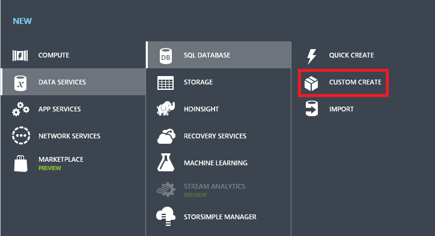
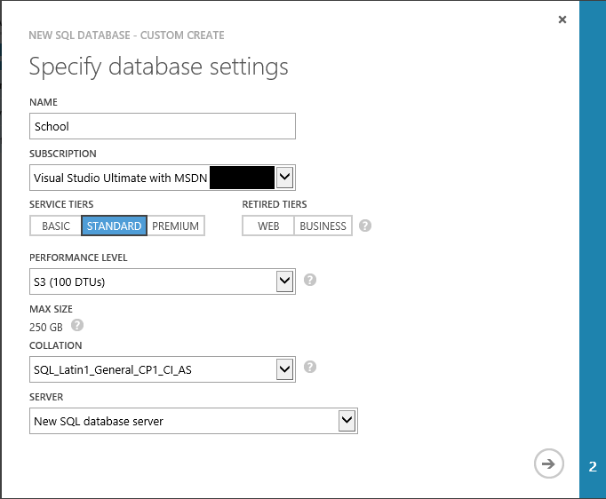
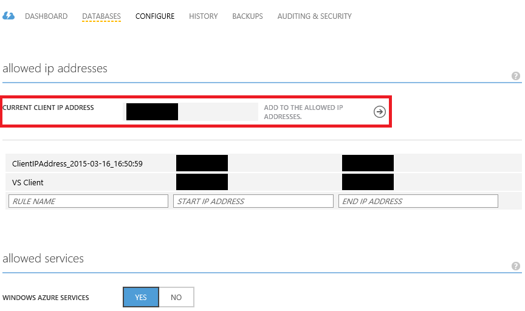
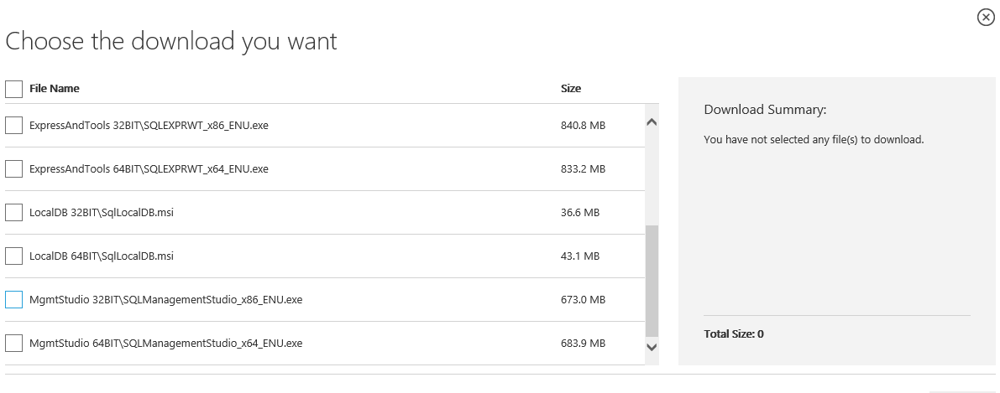
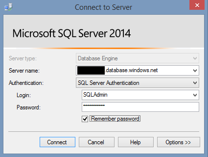
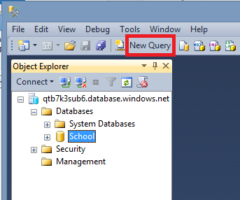
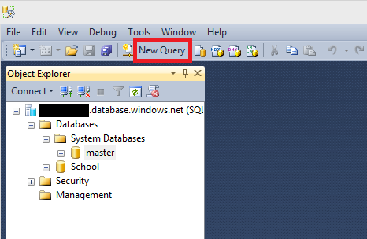

<properties 
	pageTitle="Get started with SQL Database" 
	description="Get started creating and managing SQL Databases in Azure." 
	services="sql-database" 
	documentationCenter="" 
	authors="jeffgoll" 
	manager="jeffreyg" 
	editor="monicar"/>

<tags 
	ms.service="sql-database" 
	ms.workload="data-management" 
	ms.tgt_pltfrm="na" 
	ms.devlang="na" 
	ms.topic="article" 
	ms.date="03/24/2015" 
	ms.author="jeffreyg"/>

# Get started with SQL Database

Use this article to learn how to create and administer a relational database service in the cloud with Azure. If you're new to SQL Server and database administration, you can finish this topic in about 30 minutes. You'll create and provision a new sample database using SQL Database, and then you'll query system and user data using SQL Server Management Studio (SSMS). When you finish, you'll have a new sample database and an understanding of how to perform basic administration tasks.

Another option for running SQL in the cloud is to host SQL Server on a virtual machine. See [Provisioning a SQL Server Virtual Machine on Azure](virtual-machines-provision-sql-server.md) if you want to get started on that route, and see [Understanding Azure SQL Database and SQL Server in Azure VMs](data-management-azure-sql-database-and-sql-server-iaas.md) for a quick comparison of the options.

## Step 1: Create a Microsoft Azure account
Skip this step if you already have an Azure account. If you don't, click **Free Trial** in the upper right of this page and then come back after you've signed up.

## Step 2: Use the Azure Management Portal to create a database and a logical server

 
1. Sign in to the [Azure Management portal](http://manage.windowsazure.com) and then click **New** at the bottom of the page. From the list of stuff you can create, click **Data Services**, and then click **SQL Database**.

 
2. In this article, you'll create a database using **Custom Create** because it's the best way to show you all the options. Click that.
 
   

 
3. Clicking **Custom Create** opens the **Specify database settings** screen.

   

   Use this guidance for settings on this screen:

* Use "School" for the **Name** of the database. The name needs to be unique in the subscription you're using.
 
* If your account has access to multiple subscriptions, you can choose a different one from the **Subscription** list.

* Under **Service Tiers**, **Standard** is automatically selected, which is the go-to option. If you want to change it, you can click a different service tier. Your service tier selection determines what **Performance Level** is available for you to choose. See [Azure SQL Database Service Tiers and Performance Levels](https://msdn.microsoft.com/library/azure/dn741336.aspx) for details.

* Choose a **Collation**. For this exercise, you can leave this alone. If you want to be adventurous and learn more about collation, see [Collation and Unicode Support](https://msdn.microsoft.com/library/ms143726.aspx).

* Choose a logical **Server** to host the database you create. In this exercise, you'll create a new one, so choose **New SQL database server**. When you do that, a second page appears for you to create Server settings. A single logical server can host multiple databases, so you can add another database to this server later.

  
4. Clicking the arrow on the bottom of the screen moves you on to the **Server Settings** page.

   

Use this guidance for settings on that page:

* For **Login name** type "SQLAdmin", which will be the name of the server-level principal of your SQL Database server. Then create and confirm a strong password for that login. The administrator name can't be a Windows user, nor should it be a Live ID user name. Windows authentication is not supported on SQL Database. See [Managing Databases and Logins in Azure SQL Database](https://msdn.microsoft.com/library/azure/ee336235.aspx) for more information.

* Pick a **Region** that is closest to you, your users, or that makes sense for your application. Keep your application and database in the same region to save bandwidth cost and reduce data latency.

* Check **Allow Azure services to access this server** so that you other Azure services can connect to this database for reporting and integration.

 
5. Click the check mark at the bottom of the screen, which takes you to the **SQL databases** listing. When Azure is done creating your database and the server, its status shows as **Online**, and the name of the server appears in the **Server** column.

   

 
6. Make a note of the **Server** name. You'll need it later.

> [AZURE.NOTE] You didn't have to choose a server name because SQL Database sets up the appropriate DNS entries when it creates the server. This helps avoid pesky name collisions with other DNS entries, which can be hard to isolate and troubleshoot.

In the next step, you'll configure the firewall on the server so that connections from applications running on your computer can access the databases on your SQL Database server.

## Step 3: Configure the firewall

When you create a server, the SQL Database firewall prevents access until you give it the IP addresses of the client computers that you want to authorize. The firewall grants access based on the originating IP address of each request, so you'll need to add IP addresses or address ranges to the server as you add clients.

When you add an IP address, a new firewall rule on the server is created to allow traffic from that IP address, which is often the router or proxy server your device is listening on.

> [AZURE.IMPORTANT] The SQL Database service is only available with TCP port 1433 used by the TDS protocol, so make sure that the firewall on your network and local computer allows outgoing TCP communication on port 1433. For more information, see [Azure SQL Database Firewall](https://msdn.microsoft.com/library/azure/ee621782.aspx).

 
1. If you're not already there from the previous step, in the Management Portal, click **SQL Databases** on the left nav, find your database in the list, and then click the link under **Server**.

   

 
2. Click **Configure**, and you'll see a list of **allowed IP addresses** along with the **Current client IP address** that the SQL Database server recognizes from your connection.

   

 
3. Click **Add to the allowed IP addresses**, which creates a firewall rule to allow your current client IP address. You can create additional firewall rules by providing a **Rule name** and the **Start IP Address** and **End IP address** in a range.
 
 
4. Click **SAVE** at the bottom of the page.

> [AZURE.IMPORTANT] Depending on your network configuration, your originating IP address may change frequently, which can result in a "Client with IP Address xxx.xxx.xxx.xxx is not allowed to access the server" error. Check back here to find your client IP address and then add it, or choose a range of inclusive IP addresses.

Congratulations! You now have a database running in Azure on a SQL Database server, with a server-level SQL administrator, and a firewall rule that enables client access! But you still don't have a working database you can play with. To do that, your database needs a schema and some data. We'll do that next.

## Step 4: Install SSMS and connect to your SQL Database logical server

In this step, you'll download and run SQL Server Management Studio Express and connect to your server. Then you'll copy two Transact-SQL (T-SQL) scripts from this article and run them. The first script creates a schema that defines tables, columns, and relationships. The second script adds the data. If you've built databases in SQL Server before, one of the differences you'll notice is that CREATE and INSERT commands must run in separate batches. SQL Database imposes this requirement to minimize the threat of attacks against the data in transit. 

 
1. Get the **Server** name you took note of earlier. We'll call this <*servername*> later when you connect to your logical server. Also have your Login name and password handy.
 
 
2. Go to the download page for [SQL Server 2014 Express](http://www.microsoft.com/download/details.aspx?id=42299) and read that page to be sure your computer meets the requirements. Click **Download**, and choose either the 32-bit version (x86) or the 64-bit version (x64) of the **MgmtStudio** download.

   

 
3. Follow the prompts as you install SSMS. The default selections work for this exercise.

  
4. After you install SSMS, search for **SQL Server 2014 Management Studio** on your PC and start SSMS.

 
5. SSMS prompts you for server information.

   
   
Use this guidance for settings:

* Choose **Database Engine** from the **Server type** list.

* In **Server name** type <*servername*>**.database.windows.net**, where <*servername*> is the name that SQL Database assigned to your server, which you recorded earlier.

* For **Authentication**, type the Login name you chose when you set up the server. We used **SQLAdmin**. Then type the **Password** you set up for it.

6. Click **Connect**. SSMS tries to connect to your server. Occasionally a different IP address will be assigned to the SSMS client and the connection fails with an error. If that happens, record the IP address from the error message and add it to the firewall using the portal, which you learned how to do earlier in this article.

Now you have SSMS connected to your SQL Database server, and you're ready to create a database schema and load it up with data.

## Step 5: Create the schema

In this step, you create the schema with a [Transact-SQL](https://msdn.microsoft.com/library/bb510741.aspx) script. The script first checks for an existing table of the same name to ensure there won't be a name collision, and creates the table using the [CREATE TABLE](https://msdn.microsoft.com/library/dn305849.aspx) statement. Further on, the script uses the [ALTER TABLE](https://msdn.microsoft.com/library/ms190273.aspx) statement to specify the primary key and table relationships.

 
1. In **Object Explorer**, expand **Databases**, click **School** and then click **New Query**.

   

 
2. Copy this script, paste it into the query window that opens, and then click **Execute**.
 

	-- Create the Department table.
	IF NOT EXISTS (SELECT * FROM sys.objects 
		WHERE object_id = OBJECT_ID(N'[dbo].[Department]') 
		AND type in (N'U'))
   	BEGIN
  	CREATE TABLE [dbo].[Department](
		[DepartmentID] [int] NOT NULL,
		[Name] [nvarchar](50) NOT NULL,
		[Budget] [money] NOT NULL,
		[StartDate] [datetime] NOT NULL,
		[Administrator] [int] NULL,
     CONSTRAINT [PK_Department] PRIMARY KEY CLUSTERED 
    (
	[DepartmentID] ASC
    )WITH (IGNORE_DUP_KEY = OFF)
    )
    END;
	GO

	-- Create the Person table.
	IF NOT EXISTS (SELECT * FROM sys.objects 
		WHERE object_id = OBJECT_ID(N'[dbo].[Person]') 
		AND type in (N'U'))
	BEGIN
	CREATE TABLE [dbo].[Person](
		[PersonID] [int] IDENTITY(1,1) NOT NULL,
		[LastName] [nvarchar](50) NOT NULL,
		[FirstName] [nvarchar](50) NOT NULL,
		[HireDate] [datetime] NULL,
		[EnrollmentDate] [datetime] NULL,
 	 CONSTRAINT [PK_School.Student] PRIMARY KEY CLUSTERED 	
	(
	[PersonID] ASC
	)WITH (IGNORE_DUP_KEY = OFF)
	) 
	END;
	GO

	-- Create the OnsiteCourse table.
	IF NOT EXISTS (SELECT * FROM sys.objects 
		WHERE object_id = OBJECT_ID(N'[dbo].[OnsiteCourse]') 
		AND type in (N'U'))
	BEGIN
	CREATE TABLE [dbo].[OnsiteCourse](
		[CourseID] [int] NOT NULL,
		[Location] [nvarchar](50) NOT NULL,
		[Days] [nvarchar](50) NOT NULL,
		[Time] [smalldatetime] NOT NULL,
 	 CONSTRAINT [PK_OnsiteCourse] PRIMARY KEY CLUSTERED 
	(
		[CourseID] ASC
	)WITH (IGNORE_DUP_KEY = OFF)
	) 
	END;
	GO

	-- Create the OnlineCourse table.
	IF NOT EXISTS (SELECT * FROM sys.objects 
		WHERE object_id = OBJECT_ID(N'[dbo].[OnlineCourse]') 
		AND type in (N'U'))
	BEGIN
	CREATE TABLE [dbo].[OnlineCourse](
		[CourseID] [int] NOT NULL,
		[URL] [nvarchar](100) NOT NULL,
 	 CONSTRAINT [PK_OnlineCourse] PRIMARY KEY CLUSTERED 
	(
		[CourseID] ASC
	)WITH (IGNORE_DUP_KEY = OFF)
	) 
	END;
	GO

	--Create the StudentGrade table.
	IF NOT EXISTS (SELECT * FROM sys.objects 
		WHERE object_id = OBJECT_ID(N'[dbo].[StudentGrade]') 
		AND type in (N'U'))
	BEGIN
	CREATE TABLE [dbo].[StudentGrade](
		[EnrollmentID] [int] IDENTITY(1,1) NOT NULL,
		[CourseID] [int] NOT NULL,
		[StudentID] [int] NOT NULL,
		[Grade] [decimal](3, 2) NULL,
	 CONSTRAINT [PK_StudentGrade] PRIMARY KEY CLUSTERED 
	(
		[EnrollmentID] ASC
	)WITH (IGNORE_DUP_KEY = OFF)
	) 
	END;
	GO

	-- Create the CourseInstructor table.
	IF NOT EXISTS (SELECT * FROM sys.objects 
		WHERE object_id = OBJECT_ID(N'[dbo].[CourseInstructor]') 
		AND type in (N'U'))
	BEGIN
	CREATE TABLE [dbo].[CourseInstructor](
		[CourseID] [int] NOT NULL,
		[PersonID] [int] NOT NULL,
	 CONSTRAINT [PK_CourseInstructor] PRIMARY KEY CLUSTERED 
	(
		[CourseID] ASC,
		[PersonID] ASC
	)WITH (IGNORE_DUP_KEY = OFF)
	) 
	END;
	GO

	-- Create the Course table.
	IF NOT EXISTS (SELECT * FROM sys.objects 
		WHERE object_id = OBJECT_ID(N'[dbo].[Course]') 
		AND type in (N'U'))
	BEGIN
	CREATE TABLE [dbo].[Course](
		[CourseID] [int] NOT NULL,
		[Title] [nvarchar](100) NOT NULL,
		[Credits] [int] NOT NULL,
		[DepartmentID] [int] NOT NULL,
 	 CONSTRAINT [PK_School.Course] PRIMARY KEY CLUSTERED 
	(
		[CourseID] ASC
	)WITH (IGNORE_DUP_KEY = OFF)
	)
	END;
	GO

	-- Create the OfficeAssignment table.
	IF NOT EXISTS (SELECT * FROM sys.objects 
		WHERE object_id = OBJECT_ID(N'[dbo].[OfficeAssignment]')
		AND type in (N'U'))
	BEGIN
	CREATE TABLE [dbo].[OfficeAssignment](
		[InstructorID] [int] NOT NULL,
		[Location] [nvarchar](50) NOT NULL,
		[Timestamp] [timestamp] NOT NULL,
 	 CONSTRAINT [PK_OfficeAssignment] PRIMARY KEY CLUSTERED 
	(
		[InstructorID] ASC
	)WITH (IGNORE_DUP_KEY = OFF)
	)
	END;
	GO

	-- Define the relationship between OnsiteCourse and Course.
	IF NOT EXISTS (SELECT * FROM sys.foreign_keys 
       WHERE object_id = OBJECT_ID(N'[dbo].[FK_OnsiteCourse_Course]')
       AND parent_object_id = OBJECT_ID(N'[dbo].[OnsiteCourse]'))
	ALTER TABLE [dbo].[OnsiteCourse]  WITH CHECK ADD  
       CONSTRAINT [FK_OnsiteCourse_Course] FOREIGN KEY([CourseID])
	REFERENCES [dbo].[Course] ([CourseID]);
	GO
	ALTER TABLE [dbo].[OnsiteCourse] CHECK 
       CONSTRAINT [FK_OnsiteCourse_Course];
	GO

	-- Define the relationship between OnlineCourse and Course.
	IF NOT EXISTS (SELECT * FROM sys.foreign_keys 
       WHERE object_id = OBJECT_ID(N'[dbo].[FK_OnlineCourse_Course]')
       AND parent_object_id = OBJECT_ID(N'[dbo].[OnlineCourse]'))
	ALTER TABLE [dbo].[OnlineCourse]  WITH CHECK ADD  
       CONSTRAINT [FK_OnlineCourse_Course] FOREIGN KEY([CourseID])
	REFERENCES [dbo].[Course] ([CourseID]);
	GO
	ALTER TABLE [dbo].[OnlineCourse] CHECK 
       CONSTRAINT [FK_OnlineCourse_Course];
	GO
	-- Define the relationship between StudentGrade and Course.
	IF NOT EXISTS (SELECT * FROM sys.foreign_keys 
       WHERE object_id = OBJECT_ID(N'[dbo].[FK_StudentGrade_Course]')
       AND parent_object_id = OBJECT_ID(N'[dbo].[StudentGrade]'))
	ALTER TABLE [dbo].[StudentGrade]  WITH CHECK ADD  
       CONSTRAINT [FK_StudentGrade_Course] FOREIGN KEY([CourseID])
	REFERENCES [dbo].[Course] ([CourseID]);
	GO
	ALTER TABLE [dbo].[StudentGrade] CHECK 
       CONSTRAINT [FK_StudentGrade_Course];
	GO

	--Define the relationship between StudentGrade and Student.
	IF NOT EXISTS (SELECT * FROM sys.foreign_keys 
       WHERE object_id = OBJECT_ID(N'[dbo].[FK_StudentGrade_Student]')
       AND parent_object_id = OBJECT_ID(N'[dbo].[StudentGrade]'))	
	ALTER TABLE [dbo].[StudentGrade]  WITH CHECK ADD  
       CONSTRAINT [FK_StudentGrade_Student] FOREIGN KEY([StudentID])
	REFERENCES [dbo].[Person] ([PersonID]);
	GO
	ALTER TABLE [dbo].[StudentGrade] CHECK 
       CONSTRAINT [FK_StudentGrade_Student];
	GO

	-- Define the relationship between CourseInstructor and Course.
	IF NOT EXISTS (SELECT * FROM sys.foreign_keys 
  	 WHERE object_id = OBJECT_ID(N'[dbo].[FK_CourseInstructor_Course]')
  	 AND parent_object_id = OBJECT_ID(N'[dbo].[CourseInstructor]'))
	ALTER TABLE [dbo].[CourseInstructor]  WITH CHECK ADD  
  	 CONSTRAINT [FK_CourseInstructor_Course] FOREIGN KEY([CourseID])
	REFERENCES [dbo].[Course] ([CourseID]);
	GO
	ALTER TABLE [dbo].[CourseInstructor] CHECK 
 	  CONSTRAINT [FK_CourseInstructor_Course];
	GO

	-- Define the relationship between CourseInstructor and Person.
	IF NOT EXISTS (SELECT * FROM sys.foreign_keys 
 	  WHERE object_id = OBJECT_ID(N'[dbo].[FK_CourseInstructor_Person]')
	   AND parent_object_id = OBJECT_ID(N'[dbo].[CourseInstructor]'))
	ALTER TABLE [dbo].[CourseInstructor]  WITH CHECK ADD  
 	  CONSTRAINT [FK_CourseInstructor_Person] FOREIGN KEY([PersonID])
	REFERENCES [dbo].[Person] ([PersonID]);
	GO
	ALTER TABLE [dbo].[CourseInstructor] CHECK 
  	 CONSTRAINT [FK_CourseInstructor_Person];
	GO

	-- Define the relationship between Course and Department.
	IF NOT EXISTS (SELECT * FROM sys.foreign_keys 
       WHERE object_id = OBJECT_ID(N'[dbo].[FK_Course_Department]')
       AND parent_object_id = OBJECT_ID(N'[dbo].[Course]'))
	ALTER TABLE [dbo].[Course]  WITH CHECK ADD  
       CONSTRAINT [FK_Course_Department] FOREIGN KEY([DepartmentID])
	REFERENCES [dbo].[Department] ([DepartmentID]);
	GO
	ALTER TABLE [dbo].[Course] CHECK CONSTRAINT [FK_Course_Department];
	GO

	--Define the relationship between OfficeAssignment and Person.
	IF NOT EXISTS (SELECT * FROM sys.foreign_keys 
	  WHERE object_id = OBJECT_ID(N'[dbo].[FK_OfficeAssignment_Person]')
 	  AND parent_object_id = OBJECT_ID(N'[dbo].[OfficeAssignment]'))
	ALTER TABLE [dbo].[OfficeAssignment]  WITH CHECK ADD  
 	  CONSTRAINT [FK_OfficeAssignment_Person] FOREIGN KEY([InstructorID])
	REFERENCES [dbo].[Person] ([PersonID]);
	GO
	ALTER TABLE [dbo].[OfficeAssignment] CHECK 
   	 CONSTRAINT [FK_OfficeAssignment_Person];
	GO

## Step 6: Insert data
This script uses the [INSERT](https://msdn.microsoft.com/library/ms174335.aspx) statement to add values to each column.

Click **New Query** again, copy this script, paste it into the new query window, and then click **Execute**.
 
	-- Insert data into the Person table.
    SET IDENTITY_INSERT dbo.Person ON;
	GO
	INSERT INTO dbo.Person (PersonID, LastName, FirstName, HireDate, EnrollmentDate)
	VALUES (1, 'Abercrombie', 'Kim', '1995-03-11', null);
	INSERT INTO dbo.Person (PersonID, LastName, FirstName, HireDate, EnrollmentDate)
	VALUES (2, 'Barzdukas', 'Gytis', null, '2005-09-01');
	INSERT INTO dbo.Person (PersonID, LastName, FirstName, HireDate, EnrollmentDate)
	VALUES (3, 'Justice', 'Peggy', null, '2001-09-01');
	INSERT INTO dbo.Person (PersonID, LastName, FirstName, HireDate, EnrollmentDate)
	VALUES (4, 'Fakhouri', 'Fadi', '2002-08-06', null);
	INSERT INTO dbo.Person (PersonID, LastName, FirstName, HireDate, EnrollmentDate)
	VALUES (5, 'Harui', 'Roger', '1998-07-01', null);
	INSERT INTO dbo.Person (PersonID, LastName, FirstName, HireDate, EnrollmentDate)
	VALUES (6, 'Li', 'Yan', null, '2002-09-01');
	INSERT INTO dbo.Person (PersonID, LastName, FirstName, HireDate, EnrollmentDate)
	VALUES (7, 'Norman', 'Laura', null, '2003-09-01');
	INSERT INTO dbo.Person (PersonID, LastName, FirstName, HireDate, EnrollmentDate)
	VALUES (8, 'Olivotto', 'Nino', null, '2005-09-01');
	INSERT INTO dbo.Person (PersonID, LastName, FirstName, HireDate, EnrollmentDate)
	VALUES (9, 'Tang', 'Wayne', null, '2005-09-01');
	INSERT INTO dbo.Person (PersonID, LastName, FirstName, HireDate, EnrollmentDate)
	VALUES (10, 'Alonso', 'Meredith', null, '2002-09-01');
	INSERT INTO dbo.Person (PersonID, LastName, FirstName, HireDate, EnrollmentDate)
	VALUES (11, 'Lopez', 'Sophia', null, '2004-09-01');
	INSERT INTO dbo.Person (PersonID, LastName, FirstName, HireDate, EnrollmentDate)
	VALUES (12, 'Browning', 'Meredith', null, '2000-09-01');
	INSERT INTO dbo.Person (PersonID, LastName, FirstName, HireDate, EnrollmentDate)
	VALUES (13, 'Anand', 'Arturo', null, '2003-09-01');
	INSERT INTO dbo.Person (PersonID, LastName, FirstName, HireDate, EnrollmentDate)
	VALUES (14, 'Walker', 'Alexandra', null, '2000-09-01');
	INSERT INTO dbo.Person (PersonID, LastName, FirstName, HireDate, EnrollmentDate)
	VALUES (15, 'Powell', 'Carson', null, '2004-09-01');
	INSERT INTO dbo.Person (PersonID, LastName, FirstName, HireDate, EnrollmentDate)
	VALUES (16, 'Jai', 'Damien', null, '2001-09-01');
	INSERT INTO dbo.Person (PersonID, LastName, FirstName, HireDate, EnrollmentDate)
	VALUES (17, 'Carlson', 'Robyn', null, '2005-09-01');
	INSERT INTO dbo.Person (PersonID, LastName, FirstName, HireDate, EnrollmentDate)
	VALUES (18, 'Zheng', 'Roger', '2004-02-12', null);
	INSERT INTO dbo.Person (PersonID, LastName, FirstName, HireDate, EnrollmentDate)
	VALUES (19, 'Bryant', 'Carson', null, '2001-09-01');
	INSERT INTO dbo.Person (PersonID, LastName, FirstName, HireDate, EnrollmentDate)
	VALUES (20, 'Suarez', 'Robyn', null, '2004-09-01');
	INSERT INTO dbo.Person (PersonID, LastName, FirstName, HireDate, EnrollmentDate)
	VALUES (21, 'Holt', 'Roger', null, '2004-09-01');
	INSERT INTO dbo.Person (PersonID, LastName, FirstName, HireDate, EnrollmentDate)
	VALUES (22, 'Alexander', 'Carson', null, '2005-09-01');
	INSERT INTO dbo.Person (PersonID, LastName, FirstName, HireDate, EnrollmentDate)
	VALUES (23, 'Morgan', 'Isaiah', null, '2001-09-01');
	INSERT INTO dbo.Person (PersonID, LastName, FirstName, HireDate, EnrollmentDate)
	VALUES (24, 'Martin', 'Randall', null, '2005-09-01');
	INSERT INTO dbo.Person (PersonID, LastName, FirstName, HireDate, EnrollmentDate)
	VALUES (25, 'Kapoor', 'Candace', '2001-01-15', null);
	INSERT INTO dbo.Person (PersonID, LastName, FirstName, HireDate, EnrollmentDate)
	VALUES (26, 'Rogers', 'Cody', null, '2002-09-01');
	INSERT INTO dbo.Person (PersonID, LastName, FirstName, HireDate, EnrollmentDate)
	VALUES (27, 'Serrano', 'Stacy', '1999-06-01', null);
	INSERT INTO dbo.Person (PersonID, LastName, FirstName, HireDate, EnrollmentDate)
	VALUES (28, 'White', 'Anthony', null, '2001-09-01');
	INSERT INTO dbo.Person (PersonID, LastName, FirstName, HireDate, EnrollmentDate)
	VALUES (29, 'Griffin', 'Rachel', null, '2004-09-01');
	INSERT INTO dbo.Person (PersonID, LastName, FirstName, HireDate, EnrollmentDate)
	VALUES (30, 'Shan', 'Alicia', null, '2003-09-01');
	INSERT INTO dbo.Person (PersonID, LastName, FirstName, HireDate, EnrollmentDate)
	VALUES (31, 'Stewart', 'Jasmine', '1997-10-12', null);
	INSERT INTO dbo.Person (PersonID, LastName, FirstName, HireDate, EnrollmentDate)
	VALUES (32, 'Xu', 'Kristen', '2001-7-23', null);
	INSERT INTO dbo.Person (PersonID, LastName, FirstName, HireDate, EnrollmentDate)
	VALUES (33, 'Gao', 'Erica', null, '2003-01-30');
	INSERT INTO dbo.Person (PersonID, LastName, FirstName, HireDate, EnrollmentDate)
	VALUES (34, 'Van Houten', 'Roger', '2000-12-07', null);
	GO
	SET IDENTITY_INSERT dbo.Person OFF;
	GO

## Step 7: Query sample and system data

To check your work, run simple queries that return the data you just entered. You can also run built-in stored procedures and data management views that provide information about the databases running on your SQL Database server.

### Query sample data

In a new query window, copy and run the following Transact-SQL script to retrieve some of the data you just added.

	SELECT * From Person

You should see a result set with 34 rows from the person table, including PersonID, LastName, FirstName, HireDate, and EnrollmentDate.

### Query system data

You can also use system views and built-in stored procedures to get information from the server. For the purposes of this tutorial, you will try out just a few commands.

Run the following command to find out which databases are available on the server. 

	SELECT * FROM sys.databases  

Run this command to return a list of users currently connected to the server.

	SELECT user_name(),suser_sname()

Run this stored procedure to return a list of all of the objects in the **School** database.

	EXEC SP_help

## Step 8: Create a database login and assign permissions

With SQL Database, you can create logins and grant permissions using Transact-SQL similar to the one you created when you set up the server. In this lesson, using SSMS and T-SQL, you'll do three things:

* Create a new SQL Server authentication login

* Create  a database user

* Grant permissions via role membership

 
1. In **Object Explorer**, expand **System Databases**, right-click **Master** and then click **New Query**.

   

 
2. Copy and paste the following command into the query window, and then click **Execute**, which creates a new SQL Server login named 'SQLDBLogin'.

    CREATE LOGIN SQLDBLogin WITH password='Password1';

### Create a database user and assign permissions

Now that you've created the SQL Server authentication login, the next step is to create a user for the School database and assign the database and permission levels associated with the user. You do this by creating a **database user** on each database you want the user to access.

 
1. In **Object Explorer** click the **School** database and open a new query window again.

 
2. Copy and paste the following statement into the query window, and then click **Execute**, which creates a new user for the School database.

    CREATE USER SQLDBUser FROM LOGIN SQLDBLogin;
 
 
3. Open a new query window for the School database, copy and paste the following statement into the query window, and then click **Execute**, which runs a [system stored procedure](https://msdn.microsoft.com/library/ms187961.aspx), called [sp_addrolemember](https://msdn.microsoft.com/library/ms187750.aspx), which assigns the db_datareader [role](https://msdn.microsoft.com/library/ms189121.aspx) to the new database user you created earlier.

    EXEC sp_addrolemember 'db_datareader', 'SQLDBUser';
   
You now have a new SQL Server authentication login that has read-only permission to the **School** database. Using these steps, you can create other SQL Server authentication logins, and assign those logins to different roles for different databases.

## Step 9: Connect from an application

You can use ADO.NET to connect to Microsoft Azure SQL Database. Unlike an on-premises connection, you need to account for throttling or other service faults that could terminate a connection or temporarily block new connections. This condition is called a transient fault. To manage transient faults, you implement a retry strategy. When connecting to Azure SQL Database, the [Transient Fault Handling Application Block](http://go.microsoft.com/fwlink/?LinkId=519356), part of Enterprise Library 6 – April 2013, has detection strategies that identify a transient fault condition.

### Sample C# Console Application

	static void Main(string[] args)
    {
        //NOTE: Use appropriate exception handling in a production application.

        //Replace
        //  builder["Server"]: {servername} = Your Azure SQL Database server name
        //  builder["User ID"]: {username}@{servername} = Your Azure SQL Database user name and server name
        //  builder["Password"]: {password} = Your Azure SQL Database password

        System.Data.SqlClient.SqlConnectionStringBuilder builder = new System.Data.SqlClient.SqlConnectionStringBuilder();
        builder["Server"] = "{servername}";
        builder["User ID"] = "{username}@{servername}";
        builder["Password"] = "{password}";

        builder["Database"] = "AdventureWorks2012";
        builder["Trusted_Connection"] = false;
        builder["Integrated Security"] = false;
        builder["Encrypt"] = true;

        //1. Define an Exponential Backoff retry strategy for Azure SQL Database throttling (ExponentialBackoff Class). An exponential back-off strategy will gracefully back off the load on the service.
        int retryCount = 4;
        int minBackoffDelayMilliseconds = 2000;
        int maxBackoffDelayMilliseconds = 8000;
        int deltaBackoffMilliseconds = 2000;

        ExponentialBackoff exponentialBackoffStrategy = 
          new ExponentialBackoff("exponentialBackoffStrategy",
              retryCount,
              TimeSpan.FromMilliseconds(minBackoffDelayMilliseconds), 
              TimeSpan.FromMilliseconds(maxBackoffDelayMilliseconds),
              TimeSpan.FromMilliseconds(deltaBackoffMilliseconds));

        //2. Set a default strategy to Exponential Backoff.
        RetryManager manager = new RetryManager(new List<RetryStrategy>
        {  
            exponentialBackoffStrategy 
        }, "exponentialBackoffStrategy");

        //3. Set a default Retry Manager. A RetryManager provides retry functionality, or if you are using declarative configuration, you can invoke the RetryPolicyFactory.CreateDefault
            RetryManager.SetDefault(manager);

        //4. Define a default SQL Connection retry policy and SQL Command retry policy. A policy provides a retry mechanism for unreliable actions and transient conditions.
        RetryPolicy retryConnectionPolicy = manager.GetDefaultSqlConnectionRetryPolicy();
        RetryPolicy retryCommandPolicy = manager.GetDefaultSqlCommandRetryPolicy();

        //5. Create a function that will retry the connection using a ReliableSqlConnection.
        retryConnectionPolicy.ExecuteAction(() =>
        {
            using (ReliableSqlConnection connection = new ReliableSqlConnection(builder.ConnectionString))
            {
                connection.Open();

                IDbCommand command = connection.CreateCommand();
                command.CommandText = "SELECT Name FROM Production.Product";

                //6. Create a function that will retry the command calling ExecuteCommand() from the ReliableSqlConnection
                retryCommandPolicy.ExecuteAction(() =>
                {
                    using (IDataReader reader = connection.ExecuteCommand<IDataReader>(command))
                    {
                        while (reader.Read())
                        {
                            string name = reader.GetString(0);

                            Console.WriteLine(name);
                        }
                    }
                });                  
            }
        });

        Console.ReadLine();
    }

## Next steps

Now that you are familiar with SQL Database and how to connect to databases and run queries to perform basic tasks, you can try out other tools and techniques used by SQL Server database administrators. If you're new to Transact-SQL, go deeper with [Tutorial: Writing Transact-SQL Statements](http://msdn.microsoft.com/library/ms365303.aspx) to learn some basic skills.

There are other methods for moving an on-premises database to SQL Database. If you have existing databases, or if you downloaded sample databases to practice with, try the following alternative approaches:

* [Migrating Databases to SQL Database](http://msdn.microsoft.com/library/windowsazure/ee730904.aspx)
* [Copying Databases in SQL Database](http://msdn.microsoft.com/library/windowsazure/ff951624.aspx)
* [Deploy a SQL Server Database to an Azure Virtual Machine](http://msdn.microsoft.com/library/dn195938)

