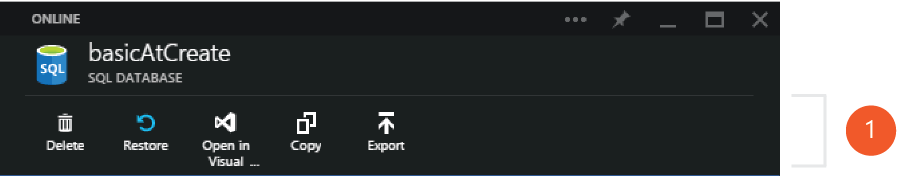

<properties 
	pageTitle="Manage Azure SQL Databases using the Azure Management Portal" 
	description="Learn how to use the Azure Management Portal to manage a relational database in the cloud using the Azure Management Portal." 
	services="sql-database" 
	documentationCenter="" 
	authors="stevestein" 
	manager="jeffreyg" 
	editor=""/>

<tags 
	ms.service="sql-database" 
	ms.devlang="NA" 
	ms.workload="data-management" 
	ms.topic="article" 
	ms.tgt_pltfrm="NA" 
	ms.date="04/14/2015" 
	ms.author="sstein"/>

# Managing Azure SQL Databases using the Azure Management Portal

The [Azure management portal][Management Portal] allows you to create, monitor and manage Azure SQL databases and servers. This article will highlight the database operations that can be accomplished using the management portal. You can learn more about the other Azure SQL database management tools [here][AzureDb management overview].

>[AZURE.NOTE] If you are unfamiliar with the Azure management portal, this [video tour provides a quick overview][Azure Portal Tour] of its general features and concepts.

## 1. Database management actions

The Azure management portal provides a set of common database actions accessible at the top of a database blade. You can restore a database to a previous point in time, open a database in Visual Studio, copy a database to a new server, and export the database to an Azure storage account. 

## 2. Database monitoring

Azure SQL databases by default feature monitoring charts for Database Throughput Unit (DTU), database size, and connection health. These monitoring charts can be customized and extended to additionally chart CPU percentage, Data IO percentage, Deadlocks, Log IO percentage or even the percentage of requests blocked by firewall. More information on how to customize monitoring charts can be found [here][Azure part monitoring].

Additionally, alert rules can be setup to monitor a specified metric and alert a designated administrator and co-administrator when pre-set thresholds are reached. More information on how to setup alert rules in the Azure management portal can be found [here][Azure part monitoring].

## 3. Database security & auditing

Azure SQL databases can be configured to track all database events and write them to an audit log in your Azure storage account. This feature can help you maintain regulatory compliance, understand database activity, and gain insight into discrepancies that could indicate business concerns or suspected security violations. More information on Azure SQL database auditing can be found [here][AzureDb Auditing]

Azure SQL databases can also be configured to mask sensitive data to non-priviledged users. More information on the Dynamic data masking feature of Azure SQL databases can be found [here][AzureDb datamasking]

## 4. Geo-replication

Azure SQL databases can be configured to asynchronously replicate committed transactions to a secondary database. The geo-replication part on the management portal allows you to select the Azure region you would like the secondary database to reside in. More information on database geo-replication in Azure can be found [here][Database geo-replication]

##Additional resources
* [Introducing SQL Database][]   
* [Managing Azure SQL Database using SQL Server Management Studio][]   
* [Monitoring SQL Database using Dynamic Management Views][]   
* [Transact-SQL Reference (SQL Database)][]
  
  [Azure Portal Tour]: https://go.microsoft.com/fwlink/?LinkID=522341
  [Management Portal]: https://portal.azure.com
  [Azure part monitoring]: documentdb-monitor-accounts.md
  [AzureDb management overview]: http://azure.microsoft.com/blog/2014/12/22/client-tooling-updates-for-azure-sql-database/
  [Introducing SQL Database]: http://azure.microsoft.com/services/sql-database
  [Database geo-replication]: http://azure.microsoft.com/blog/2014/07/12/spotlight-on-sql-database-active-geo-replication/
  [Managing Azure SQL Database using SQL Server Management Studio]: sql-database-manage-azure-ssms.md
  [Monitoring SQL Database using Dynamic Management Views]: http://msdn.microsoft.com/library/windowsazure/ff394114.aspx
  [Transact-SQL Reference (SQL Database)]: http://msdn.microsoft.com/library/bb510741(v=sql.120).aspx
  [AzureDb Auditing]: http://azure.microsoft.com/documentation/articles/sql-database-auditing-get-started/
  [AzureDb datamasking]: http://azure.microsoft.com/documentation/articles/sql-database-dynamic-data-masking-get-started/

 
