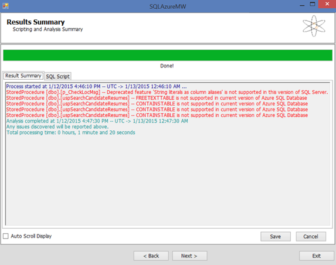

<properties 
   pageTitle="Migration using SQL Migration Wizard" 
   description="Microsoft Azure SQL Database, database migration, import database, export database, migration wizard" 
   services="sql-database" 
   documentationCenter="" 
   authors="pehteh" 
   manager="jeffreyg" 
   editor="monicar"/>

<tags
   ms.service="sql-database"
   ms.devlang="NA"
   ms.topic="article"
   ms.tgt_pltfrm="NA"
   ms.workload="data-management" 
   ms.date="04/14/2015"
   ms.author="pehteh"/>

# Migrating using SQL Azure Migration Wizard

This Option uses the SQL Azure Migration Wizard to generate a T-SQL script from a source database which is then transformed by the wizard to make it compatible with the SQL Database and then connect to Azure SQL Database to execute the script against an empty Azure SQL database. The script can be generated with schema only or can include data in BCP format. The wizard also allows you to include or exclude specific objects from the database in the script. 

Note that not all incompatible schema that can be detected by the wizard can be processed by its built-in transformations. Incompatible script that cannot be addressed will be reported as errors, with comments injected into the generated script. If this occurs the script must be saved and edited manually before it can be submitted to Azure SQL Database. If changes are needed the script can be saved and then edited with SSMS or the SQL Server tooling in VS, and once compatible, executed out-of-band against Azure SQL Database. 

> Note: As an extension to this Option, if many errors are detected and correcting them is not straightforward you can import the generated script file into a database project in Visual Studio. If you set the target of the project to the  SQL Database V12 you can then build the project and progressively correct the errors using the SQL Server tooling in VS. Once the schema has no errors you can publish the schema to a copy of the source database and then use SSMS to deploy or export/import the database to Azure SQL database as described in Option #1.

## Migration steps
1.	Provision a new database either on a new server in the SQL Database  or on an existing server upgraded as described earlier. You will execute the migration script created in this Option against this database as the final step. 

2.	Open the migration wizard and select the option to **Analyze/Migrate a Database** and set the **Target Server** to Azure SQL Database V12 and then click **Next**.

3.	On the next page click **Connect to Server** and provide the connection information for your source server. Either specify the source database in the connection dialog or connect to the server and then select the source database from the list of databases. 

4.	On the next page, Choose Objects, you can select whether to Script all database objects (the default) or Select specific database objects to be scripted. You may find it best to start by scripting all objects in a first pass and then potentially come back to this step and exclude objects if the wizard reports scripting or transformation errors. The wizard works by first scripting the objects in the database (using SMO) and then post-processes the generated script to apply a series of regex-based validation and transformation rules.

 

4.	Select Advanced and review the configuration options used by the wizard. For a first pass, particularly for a large database you should set **Script Table/Data** to Table Schema Only, ensure **Target Server** is set to Microsoft Azure SQL Database   V12, and **Compatibility Checks** is set to Override: Perform All Compatibility Checks.

5.	Click **Next** to review the options and then **Next** again to generate and transform the script. You can review the script on the SQL Script tab.

6.	Script generation will report errors if the schema is incompatible with the SQL Database and cannot be transformed by the wizard. In the screen shot below the transformation process has found problems with one stored procedure. In this case, a procedure has been written to use full text search which is not yet supported in the V12 (but will be supported in a later release). 

- Depending on your assessment of the errors you may choose to go back in the wizard and exclude objects that are causing problems and regenerate the script. As you consider how you plan to address the errors consider the impact on other objects in the database as well as the applications that use the database.
- If the script has errors that need to be corrected you can save a schema-only script file from the SQL Script tab and open and edit the script in your favorite editor to correct the errors before executing it outside of SAMW against the new database you created in step 1. If the script is large or there are a large number of errors you should use Option 3. Note that while you can import the generated script file into Visual Studio importing from a SQL file can take considerable longer than importing from a database as described in Option 3. 

7.	If there are no errors or you have eliminated the source of errors resulting from the generation you can click **Next** and then on the following page click **Connect to Server** to connect to the Azure SQL Database server you created in step 1.

8.	The next step is to select the database against which the script will be executed. All existing databases on the server will be listed. Select the database you created in step 1. The database should be empty and have an appropriate pricing tier for this operation. 
- If you prefer, you can create a database at this point using the wizard. To do so click Create Database to configure and create it. See the Getting Started section for guidance on choosing the performance level to use during the migration process.
- Once you have created the database select and continue. 

9.	With an empty database selected click **Next** and confirm that you want to execute the script to complete the migration.

