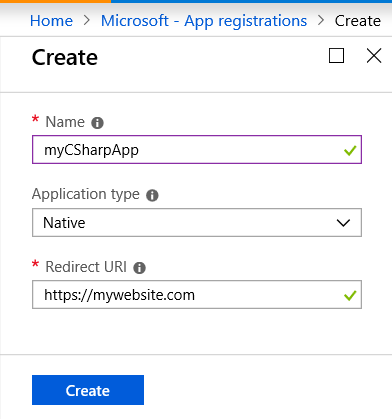
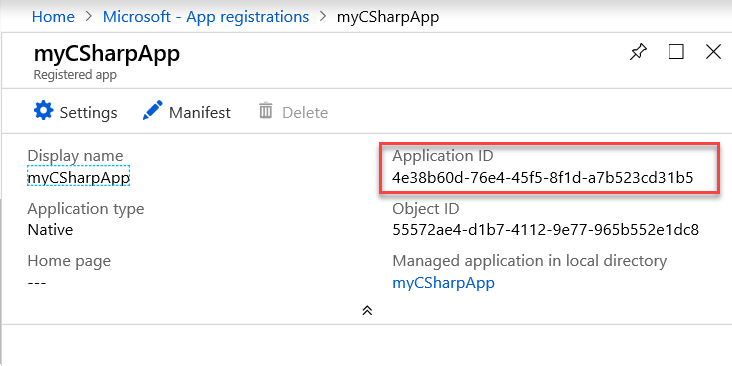
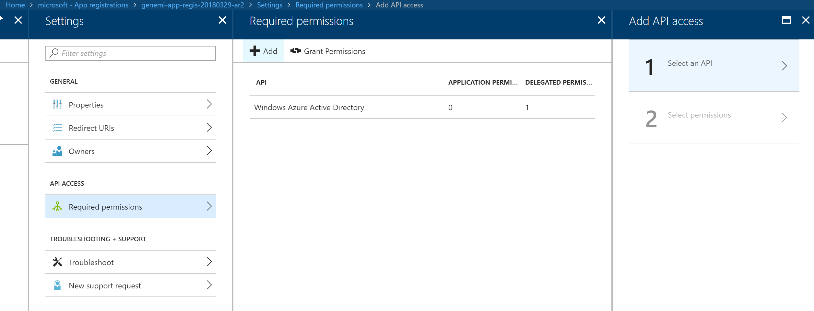
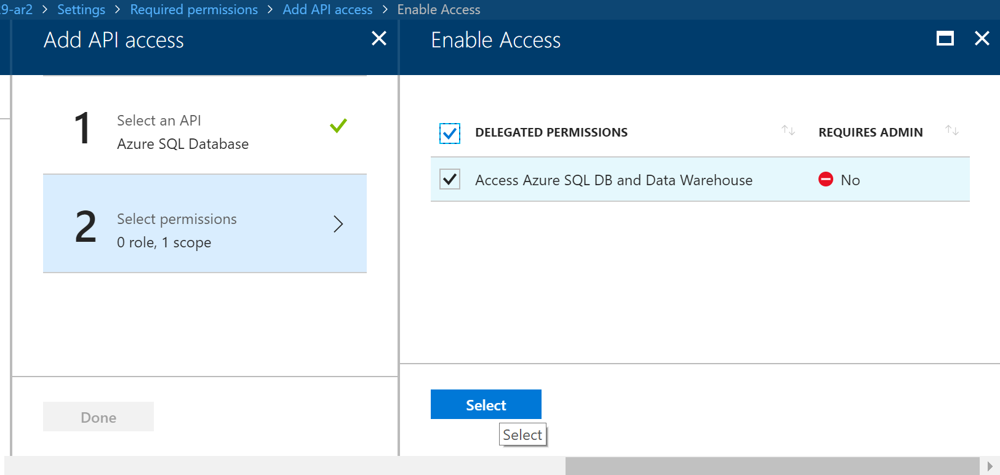

# Connect to Azure SQL Database with Azure Multi-Factor Authentication

This article provides a C# program that connects to Azure SQL Database. The program uses interactive mode authentication, which supports [Azure Multi-Factor Authentication](https://docs.microsoft.com/azure/active-directory/authentication/concept-mfa-howitworks).

For more information about Multi-Factor Authentication support for SQL tools, see [Azure Active Directory support in SQL Server Data Tools (SSDT)](https://docs.microsoft.com/sql/ssdt/azure-active-directory).

## Multi-Factor Authentication for Azure SQL Database

Starting in .NET Framework version 4.7.2, the enum [`SqlAuthenticationMethod`](https://docs.microsoft.com/dotnet/api/system.data.sqlclient.sqlauthenticationmethod) has a new value: `ActiveDirectoryInteractive`. In a client C# program, the enum value directs the system to use the Azure Active Directory (Azure AD) interactive mode that supports Multi-Factor Authentication to connect to an Azure SQL database. The user who runs the program sees the following dialog boxes:

* A dialog box that displays an Azure AD user name and asks for the user's password.

   If the user's domain is federated with Azure AD, this dialog box doesn't appear, because no password is needed.

   If the Azure AD policy imposes Multi-Factor Authentication on the user, the next two dialog boxes are displayed.

* The first time a user goes through Multi-Factor Authentication, the system displays a dialog box that asks for a mobile phone number to send text messages to. Each message provides the *verification code* that the user must enter in the next dialog box.

* A dialog box that asks for a Multi-Factor Authentication verification code, which the system has sent to a mobile phone.

For information about how to configure Azure AD to require Multi-Factor Authentication, see [Getting started with Azure Multi-Factor Authentication in the cloud](https://docs.microsoft.com/azure/multi-factor-authentication/multi-factor-authentication-get-started-cloud).

For screenshots of these dialog boxes, see [Configure multi-factor authentication for SQL Server Management Studio and Azure AD](sql-database-ssms-mfa-authentication-configure.md).

> [!TIP]
> You can search .NET Framework APIs with the [.NET API Browser tool page](https://docs.microsoft.com/dotnet/api/).
>
> You can also search directly with the [optional ?term=&lt;search value&gt; parameter](https://docs.microsoft.com/dotnet/api/?term=SqlAuthenticationMethod).

## Configure your C# application in the Azure portal

Before you begin, you should have an [Azure SQL Database server](sql-database-get-started-portal.md) created and available.

### Register your app and set permissions

To use Azure AD authentication, your C# program has to register as an Azure AD application. To register an app, you need to be either an Azure AD admin or a user assigned the Azure AD *Application Developer* role. For more information about assigning roles, see [Assign administrator and non-administrator roles to users with Azure Active Directory](https://docs.microsoft.com/azure/active-directory/fundamentals/active-directory-users-assign-role-azure-portal).

Completing an app registration generates and displays an **application ID**. Your program has to include this ID to connect.

To register and set necessary permissions for your application:

1. In the Azure portal, select **Azure Active Directory** > **App registrations** > **New application registration**.

    

    After the app registration is created, the **application ID** value is generated and displayed.

    

2. Select **Registered app** > **Settings** > **Required permissions** > **Add**.

    

3. Select **Required permissions** > **Add** > **Select an API** > **Azure SQL Database**.

    

4. Select **API access** > **Select permissions** > **Delegated permissions**.

    

### Set an Azure AD admin for your SQL Database server

For your C# program to run, an Azure SQL server admin needs to assign an Azure AD admin for your SQL Database server. 

On the **SQL Server** page, select **Active Directory admin** > **Set admin**.

For more information about Azure AD admins and users for Azure SQL Database, see the screenshots in [Configure and manage Azure Active Directory authentication with SQL Database](sql-database-aad-authentication-configure.md#provision-an-azure-active-directory-administrator-for-your-azure-sql-database-server).

### Add a non-admin user to a specific database (optional)

An Azure AD admin for a SQL Database server can run the C# example program. An Azure AD user can run the program if they are in the database. An Azure AD SQL admin or an Azure AD user who exists already in the database and has the `ALTER ANY USER` permission on the database can add a user.

You can add a user to the database with the SQL [`Create User`](https://docs.microsoft.com/sql/t-sql/statements/create-user-transact-sql) command. An example is `CREATE USER [<username>] FROM EXTERNAL PROVIDER`.

For more information, see [Use Azure Active Directory Authentication for authentication with SQL Database, Managed Instance, or SQL Data Warehouse](sql-database-aad-authentication.md).

## New authentication enum value

The C# example relies on the [`System.Data.SqlClient`](https://docs.microsoft.com/dotnet/api/system.data.sqlclient) namespace. Of special interest for Multi-Factor Authentication is the enum `SqlAuthenticationMethod`, which has the following values:

- `SqlAuthenticationMethod.ActiveDirectoryInteractive`

   Use this value with an Azure AD user name to implement Multi-Factor Authentication. This value is the focus of the present article. It produces an interactive experience by displaying dialog boxes for the user password, and then for Multi-Factor Authentication validation if Multi-Factor Authentication is imposed on this user. This value is available starting with .NET Framework version 4.7.2.

- `SqlAuthenticationMethod.ActiveDirectoryIntegrated`

  Use this value for a *federated* account. For a federated account, the user name is known to the Windows domain. This authentication method doesn't support Multi-Factor Authentication.

- `SqlAuthenticationMethod.ActiveDirectoryPassword`

  Use this value for authentication that requires an Azure AD user name and password. Azure SQL Database does the authentication. This method doesn't support Multi-Factor Authentication.

## Set C# parameter values from the Azure portal

For the C# program to successfully run, you need to assign proper values to static fields. Shown here are fields with example values. Also shown are the Azure portal locations where you can obtain the needed values.

| Static field name | Example value | Where in Azure portal |
| :---------------- | :------------ | :-------------------- |
| Az_SQLDB_svrName | "my-sqldb-svr.database.windows.net" | **SQL servers** > **Filter by name** |
| AzureAD_UserID | "auser\@abc.onmicrosoft.com" | **Azure Active Directory** > **User** > **New guest user** |
| Initial_DatabaseName | "myDatabase" | **SQL servers** > **SQL databases** |
| ClientApplicationID | "a94f9c62-97fe-4d19-b06d-111111111111" | **Azure Active Directory** > **App registrations** > **Search by name** > **Application ID** |
| RedirectUri | new Uri("https://mywebserver.com/") | **Azure Active Directory** > **App registrations** > **Search by name** > *[Your-App-registration]* > **Settings** > **RedirectURIs**<br /><br />For this article, any valid value is fine for RedirectUri, because it isn't used here. |
| &nbsp; | &nbsp; | &nbsp; |

## Verify with SQL Server Management Studio

Before you run the C# program, it's a good idea to check that your setup and configurations are correct in SQL Server Management Studio (SSMS). Any C# program failure can then be narrowed to source code.

### Verify SQL Database firewall IP addresses

Run SSMS from the same computer, in the same building, where you plan to run the C# program. For this test, any **Authentication** mode is OK. If there's any indication that the database server firewall isn't accepting your IP address, see [Azure SQL Database server-level and database-level firewall rules](sql-database-firewall-configure.md) for help.

### Verify Azure Active Directory Multi-Factor Authentication

Run SSMS again, this time with **Authentication** set to **Active Directory - Universal with MFA support**. This option requires SSMS version 17.5 or later.

For more information, see [Configure Multi-Factor Authentication for SSMS and Azure AD](sql-database-ssms-mfa-authentication-configure.md).

> [!NOTE]
> If you are a guest user in the database, you also need to provide the Azure AD domain name for the database: Select **Options** > **AD domain name or tenant ID**. To find the domain name in the Azure portal, select **Azure Active Directory** > **Custom domain names**. In the C# example program, providing a domain name is not necessary.

## C# code example

The example C# program relies on the [*Microsoft.IdentityModel.Clients.ActiveDirectory*](https://docs.microsoft.com/dotnet/api/microsoft.identitymodel.clients.activedirectory) DLL assembly.

To install this package, in Visual Studio, select **Project** > **Manage NuGet Packages**. Search for and install **Microsoft.IdentityModel.Clients.ActiveDirectory**.

This is an example of C# source code.

```csharp

using System;

// Reference to Azure AD authentication assembly
using Microsoft.IdentityModel.Clients.ActiveDirectory;

using DA = System.Data;
using SC = System.Data.SqlClient;
using AD = Microsoft.IdentityModel.Clients.ActiveDirectory;
using TX = System.Text;
using TT = System.Threading.Tasks;

namespace ADInteractive5
{
    class Program
    {
        // ASSIGN YOUR VALUES TO THESE STATIC FIELDS !!
        static public string Az_SQLDB_svrName = "<Your SQL DB server>";
        static public string AzureAD_UserID = "<Your User ID>";
        static public string Initial_DatabaseName = "<Your Database>";
        // Some scenarios do not need values for the following two fields:
        static public readonly string ClientApplicationID = "<Your App ID>";
        static public readonly Uri RedirectUri = new Uri("<Your URI>");

        public static void Main(string[] args)
        {
            var provider = new ActiveDirectoryAuthProvider();

            SC.SqlAuthenticationProvider.SetProvider(
                SC.SqlAuthenticationMethod.ActiveDirectoryInteractive,
                //SC.SqlAuthenticationMethod.ActiveDirectoryIntegrated,  // Alternatives.
                //SC.SqlAuthenticationMethod.ActiveDirectoryPassword,
                provider);

            Program.Connection();
        }

        public static void Connection()
        {
            SC.SqlConnectionStringBuilder builder = new SC.SqlConnectionStringBuilder();

            // Program._  static values that you set earlier.
            builder["Data Source"] = Program.Az_SQLDB_svrName;
            builder.UserID = Program.AzureAD_UserID;
            builder["Initial Catalog"] = Program.Initial_DatabaseName;

            // This "Password" is not used with .ActiveDirectoryInteractive.
            //builder["Password"] = "<YOUR PASSWORD HERE>";

            builder["Connect Timeout"] = 15;
            builder["TrustServerCertificate"] = true;
            builder.Pooling = false;

            // Assigned enum value must match the enum given to .SetProvider().
            builder.Authentication = SC.SqlAuthenticationMethod.ActiveDirectoryInteractive;
            SC.SqlConnection sqlConnection = new SC.SqlConnection(builder.ConnectionString);

            SC.SqlCommand cmd = new SC.SqlCommand(
                "SELECT '******** MY QUERY RAN SUCCESSFULLY!! ********';",
                sqlConnection);

            try
            {
                sqlConnection.Open();
                if (sqlConnection.State == DA.ConnectionState.Open)
                {
                    var rdr = cmd.ExecuteReader();
                    var msg = new TX.StringBuilder();
                    while (rdr.Read())
                    {
                        msg.AppendLine(rdr.GetString(0));
                    }
                    Console.WriteLine(msg.ToString());
                    Console.WriteLine(":Success");
                }
                else
                {
                    Console.WriteLine(":Failed");
                }
                sqlConnection.Close();
            }
            catch (Exception ex)
            {
                Console.ForegroundColor = ConsoleColor.Red;
                Console.WriteLine("Connection failed with the following exception...");
                Console.WriteLine(ex.ToString());
                Console.ResetColor();
            }
        }
    } // EOClass Program.

    /// <summary>
    /// SqlAuthenticationProvider - Is a public class that defines 3 different Azure AD
    /// authentication methods.  The methods are supported in the new .NET 4.7.2.
    ///  . 
    /// 1. Interactive,  2. Integrated,  3. Password
    ///  . 
    /// All 3 authentication methods are based on the Azure
    /// Active Directory Authentication Library (ADAL) managed library.
    /// </summary>
    public class ActiveDirectoryAuthProvider : SC.SqlAuthenticationProvider
    {
        // Program._ more static values that you set!
        private readonly string _clientId = Program.ClientApplicationID;
        private readonly Uri _redirectUri = Program.RedirectUri;

        public override async TT.Task<SC.SqlAuthenticationToken>
            AcquireTokenAsync(SC.SqlAuthenticationParameters parameters)
        {
            AD.AuthenticationContext authContext =
                new AD.AuthenticationContext(parameters.Authority);
            authContext.CorrelationId = parameters.ConnectionId;
            AD.AuthenticationResult result;

            switch (parameters.AuthenticationMethod)
            {
                case SC.SqlAuthenticationMethod.ActiveDirectoryInteractive:
                    Console.WriteLine("In method 'AcquireTokenAsync', case_0 == '.ActiveDirectoryInteractive'.");

                    result = await authContext.AcquireTokenAsync(
                        parameters.Resource,  // "https://database.windows.net/"
                        _clientId,
                        _redirectUri,
                        new AD.PlatformParameters(AD.PromptBehavior.Auto),
                        new AD.UserIdentifier(
                            parameters.UserId,
                            AD.UserIdentifierType.RequiredDisplayableId));
                    break;

                case SC.SqlAuthenticationMethod.ActiveDirectoryIntegrated:
                    Console.WriteLine("In method 'AcquireTokenAsync', case_1 == '.ActiveDirectoryIntegrated'.");

                    result = await authContext.AcquireTokenAsync(
                        parameters.Resource,
                        _clientId,
                        new AD.UserCredential());
                    break;

                case SC.SqlAuthenticationMethod.ActiveDirectoryPassword:
                    Console.WriteLine("In method 'AcquireTokenAsync', case_2 == '.ActiveDirectoryPassword'.");

                    result = await authContext.AcquireTokenAsync(
                        parameters.Resource,
                        _clientId,
                        new AD.UserPasswordCredential(
                            parameters.UserId,
                            parameters.Password));
                    break;

                default: throw new InvalidOperationException();
            }
            return new SC.SqlAuthenticationToken(result.AccessToken, result.ExpiresOn);
        }

        public override bool IsSupported(SC.SqlAuthenticationMethod authenticationMethod)
        {
            return authenticationMethod == SC.SqlAuthenticationMethod.ActiveDirectoryIntegrated
                || authenticationMethod == SC.SqlAuthenticationMethod.ActiveDirectoryInteractive
                || authenticationMethod == SC.SqlAuthenticationMethod.ActiveDirectoryPassword;
        }
    } // EOClass ActiveDirectoryAuthProvider.
} // EONamespace.  End of entire program source code.

```

&nbsp;

This is an example of the C# test output.

```
[C:\Test\VSProj\ADInteractive5\ADInteractive5\bin\Debug\]
>> ADInteractive5.exe
In method 'AcquireTokenAsync', case_0 == '.ActiveDirectoryInteractive'.
******** MY QUERY RAN SUCCESSFULLY!! ********

:Success

[C:\Test\VSProj\ADInteractive5\ADInteractive5\bin\Debug\]
>>
```

## Next steps

[!INCLUDE [updated-for-az](../../includes/updated-for-az.md)]
> [!IMPORTANT]
> The PowerShell Azure Resource Manager module is still supported by Azure SQL Database, but all future development is for the Az.Sql module. For these cmdlets, see [AzureRM.Sql](https://docs.microsoft.com/powershell/module/AzureRM.Sql/). The arguments for the commands in the Az module and in the AzureRm modules are substantially identical.

- [Get-AzSqlServerActiveDirectoryAdministrator](https://docs.microsoft.com/powershell/module/az.sql/get-azsqlserveractivedirectoryadministrator)
