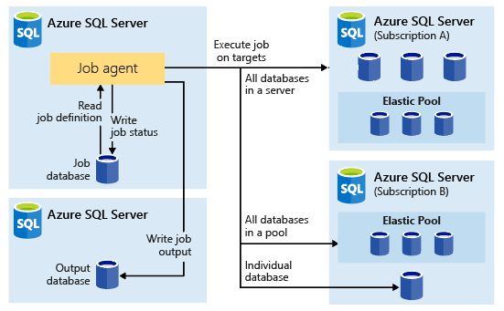
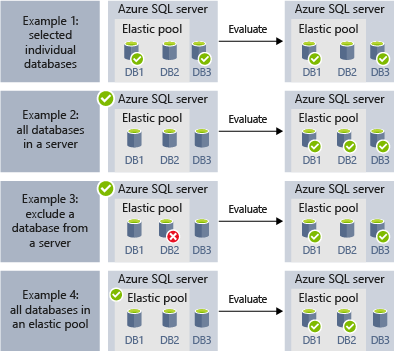
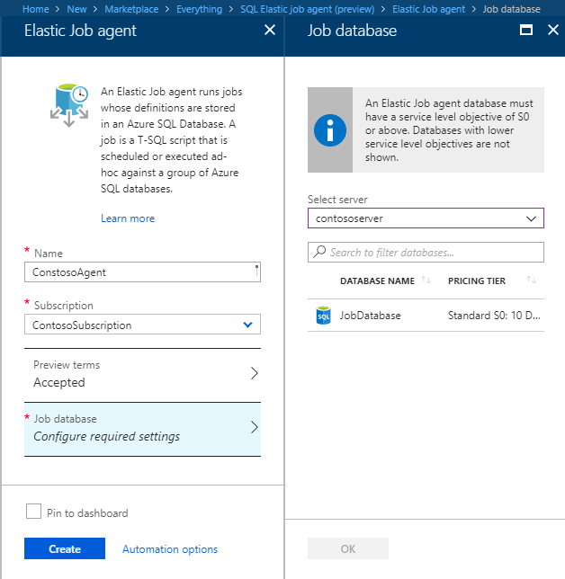
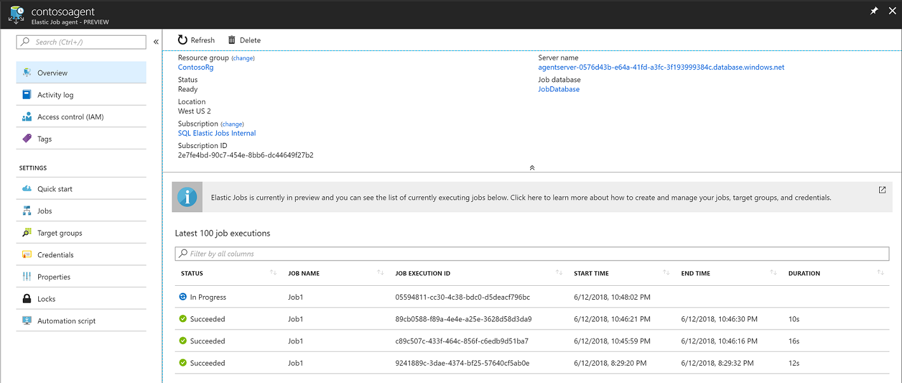
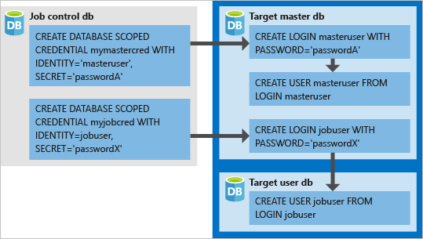

# Manage groups of databases with Elastic Database Jobs

**Elastic Database Jobs** provide the ability to run one or more T-SQL scripts in parallel, across a large number of databases, on a schedule or on-demand.

**Run jobs against any combination of databases**: one or more individual databases, all databases on a server, all databases in an elastic pool, or shardmap, with the added flexibility to include or exclude any specific database. **Jobs can run across multiple servers, multiple pools, and can even run against databases in different subscriptions.** Servers and pools are dynamically enumerated at runtime, so jobs run against all databases that exist in the target group at the time of execution.

The following image shows a job agent executing jobs across the different types of target groups:




## Why use elastic jobs?

### Manage many databases

- Schedule administrative tasks to run every weekday, after hours, etc.
- Deploy schema changes, credentials management, performance data collection or tenant (customer) telemetry collection. Update reference data (information common across all databases).
- Rebuild indexes to improve query performance. Configure jobs to execute across a collection of databases on a recurring basis, such as during off-peak hours.
- Collect query results from a set of databases into a central table on an on-going basis. Performance queries can be continually executed and configured to trigger additional tasks to be executed.

### Collect data for reporting

- Aggregate data from a collection of Azure SQL databases into a single destination table.
- Execute longer running data processing queries across a large set of databases, for example the collection of customer telemetry. Results are collected into a single destination table for further analysis.

### Reduce overhead

- Normally, you must connect to each database independently in order to run Transact-SQL statements or perform other administrative tasks. A job handles the task of logging in to each database in the target group. You also define, maintain and persist Transact-SQL scripts to be executed across a group of Azure SQL databases.

### Accounting

- Jobs log the status of execution for each database. You also get automatic retry when failures occur.

### Flexibility

- Define custom groups of Azure SQL databases, and define schedules for running a job.


## Elastic Job components

|Component  | Description (additional details are below the table) |
|---------|---------|
|[**Elastic Job agent**](#elastic-job-agent) |  The Azure resource you create to run and manage Jobs.   |
|[**Job database**](#job-database)    |    An Azure SQL database the job agent uses to store job related data, job definitions, etc.      |
|[**Target group**](#target-group)      |  The set of servers, pools, databases, and shard maps to run a job against.       |
|[**Job**](#job)  |  A job is a unit of work that is comprised of one or more [job steps](#job-step). Job steps specify the T-SQL script to run, as well as other details required to execute the script.  |


### Elastic Job agent

An Elastic Job agent is the Azure resource for creating, running, and managing jobs. The Elastic Job agent is an Azure resource you create in the portal ([PowerShell](elastic-jobs-powershell.md) and REST are also supported). 

Creating an **Elastic Job agent** requires an existing SQL database. The agent configures this existing database as the [*Job database*](#job-database).

The Elastic Job agent is free. The job database is billed the same rate as any SQL database.

### Job database

The *Job database* is used for defining jobs and tracking the status and history of job executions. The *Job database* is also used to store agent metadata, logs, results, job definitions, and also contains many useful stored procedures, and other database objects, for creating, running, and managing jobs using T-SQL.

For the current preview, an existing Azure SQL database (S0 or higher) is required to create an Elastic Job agent.

The *Job database* doesn't literally need to be new, but should be a clean, empty, S0 or higher service tier. The recommended service tier of the *Job database* is S1 or higher, but really depends on the performance needs of your job(s): number of job steps, how many times, and how frequently jobs are run. For example, an S0 database might be sufficient for a job agent that runs few jobs an hour, but running a job every minute might not be performant enough, and a higher service tier might be better.


#### Job database permissions

During job agent creation, a schema, tables, and a role called *jobs_reader* are created in the *Job database*. The role is created with the following permission and is designed to give administrators finer access control for job monitoring:


|Role name  |'jobs' schema permissions  |'jobs_internal' schema permissions  |
|---------|---------|---------|
|**jobs_reader**     |    SELECT     |    None     |

> [!IMPORTANT]
> Consider the security implications before granting access to the *Job database* as a database administrator. A malicious user with permissions to create or edit jobs could create or edit a job that uses a stored credential to connect to a database under the malicious user's control, which could allow the malicious user to determine the credential’s password.


### Target group

A *target group* defines the set of databases a job step will execute on. A target group can contain any number and combination of the following:

- **Azure SQL server** - if a server is specified, all databases that exist in the server at the time of the job execution are part of the group. The master database credential must be provided so that the group can be enumerated and updated prior to job execution.
- **Elastic pool** - if an elastic pool is specified, all databases that are in the elastic pool at the time of the job execution are part of the group. As for a server, the master database credential must be provided so that the group can be updated prior to the job execution.
- **Single database** - specify one or more individual databases to be part of the group.
- **Shardmap** - databases of a shardmap.

> [!TIP]
> At the moment of job execution, *dynamic enumeration* re-evaluates the set of databases in target groups that include servers or pools. Dynamic enumeration ensures that **jobs run across all databases that exist in the server or pool at the time of job execution**. Re-evaluating the list of databases at runtime is specifically useful for scenarios where pool or server membership changes frequently.

Pools and single databases can be specified as included or excluded from the group. This enables creating a target group with any combination of databases. For example, you can add a server to a target group, but exclude specific databases in an elastic pool (or exclude an entire pool).

A target group can include databases in multiple subscriptions, and across multiple regions. Note that cross-region executions have higher latency than executions within the same region.

The following examples show how different target group definitions are dynamically enumerated at the moment of job execution to determine which databases the job will run:



**Example 1** shows a target group that consists of a list of individual databases. When a job step is executed using this target group, the job step's action will be executed in each of those databases.<br>
**Example 2** shows a target group that contains an Azure SQL Server as a target. When a job step is executed using this target group, the server is dynamically enumerated to determine the list of databases that are currently in the server. The job step's action will be executed in each of those databases.<br>
**Example 3** shows a similar target group as *Example 2*, but an individual database is specifically excluded. The job step's action will *not* be executed in the excluded database.<br>
**Example 4** shows a target group that contains an elastic pool as a target. Similar to *Example 2*, the pool will be dynamically enumerated at job run time to determine the list of databases in the pool.
<br><br>


**Example 5** and *Example 6* show advanced scenarios where Azure SQL Servers, elastic pools, and databases, can be combined using include and exclude rules.<br>
**Example 7** shows that the shards in a shard map can also be evaluated at job run time.

### Job

A *job* is a unit of work that is executed on a schedule or as a one-time job. A job consists of one or more *job steps*.

#### Job step

Each job step specifies a T-SQL script to execute, one or more target groups to run the T-SQL script against, and the credentials the job agent needs to connect to the target database. Each job step has customizable timeout and retry policies, and can optionally specify output parameters.

#### Job output

The outcome of a job's steps on each target database are recorded in detail, and script output can be captured to a specified table. You can specify a database to save any data returned from a job.

#### Job history

Job execution history is stored in the *Job database*. A system cleanup job purges execution history that is older than 45 days. To remove history less than 45 days old, call the **sp_purge_history** stored procedure in the *Job database*.

## Workflow to create, configure, and manage jobs

### Create and configure the agent

1. Create or identify an empty S0 or higher SQL database. This will be used as the *Job database* during Elastic Job agent creation.
2. Create an Elastic Job agent in the [portal](https://portal.azure.com/#create/Microsoft.SQLElasticJobAgent), or with [PowerShell](elastic-jobs-powershell.md#create-the-elastic-job-agent).

   

### Create, run, and manage jobs

1. Create a credential for job execution in the *Job database* using [PowerShell](elastic-jobs-powershell.md#create-job-credentials-so-that-jobs-can-execute-scripts-on-its-targets), or [T-SQL](elastic-jobs-tsql.md#create-a-credential-for-job-execution).
2. Define the target group (the databases you want to run the job against) using [PowerShell](elastic-jobs-powershell.md#define-the-target-databases-you-want-to-run-the-job-against), or [T-SQL](elastic-jobs-tsql.md#create-a-target-group-servers).
3. Create a job agent credential in each database the job will run [(add the user (or role) to each database in the group)](https://docs.microsoft.com/azure/sql-database/sql-database-control-access). For an example, see the [PowerShell tutorial](elastic-jobs-powershell.md#create-job-credentials-so-that-jobs-can-execute-scripts-on-its-targets).
4. Create a job using [PowerShell](elastic-jobs-powershell.md#create-a-job), or [T-SQL](elastic-jobs-tsql.md#deploy-new-schema-to-many-databases).
5. Add job steps using [PowerShell](elastic-jobs-powershell.md#create-a-job-step) or [T-SQL](elastic-jobs-tsql.md#deploy-new-schema-to-many-databases).
6. Run a job using [PowerShell](elastic-jobs-powershell.md#run-the-job), or [T-SQL](elastic-jobs-tsql.md#begin-ad-hoc-execution-of-a-job).
7. Monitor job execution status using the portal, [PowerShell](elastic-jobs-powershell.md#monitor-status-of-job-executions), or [T-SQL](elastic-jobs-tsql.md#monitor-job-execution-status).

   

## Credentials for running jobs

Jobs use [database scoped credentials](/sql/t-sql/statements/create-database-scoped-credential-transact-sql) to connect to the databases specified by the target group upon execution. If a target group contains servers or pools, these database scoped credentials are used to connect to the master database to enumerate the available databases.

Setting up the proper credentials to run a job can be a little confusing, so keep the following points in mind:

- The database scoped credentials must be created in the *Job database*.
- **All target databases must have a login with [sufficient permissions](https://docs.microsoft.com/sql/relational-databases/security/permissions-database-engine) for the job to complete successfully** (jobuser in the diagram below).
- Credentials are expected to be reused across jobs, and the credential passwords are encrypted and secured from users who have read-only access to job objects.

The following image is designed to assist in understanding and setting up the proper job credentials. **Remember to create the user in every database (all *target user dbs*) the job needs to run**.



## Security best practices

A few best practice considerations for working with Elastic Jobs:

- Limit usage of the APIs to trusted individuals.
- Credentials should have the least privileges necessary to perform the job step. For additional information, see [Authorization and Permissions SQL Server](https://docs.microsoft.com/dotnet/framework/data/adonet/sql/authorization-and-permissions-in-sql-server).
- When using a server and/or pool target group member, it is highly suggested to create a separate credential with rights on the master database to view/list databases which is used to expand the database lists of the server(s) and/or pool(s) prior to the job execution.


## Agent performance, capacity, and limitations

Elastic Jobs use minimal compute resources while waiting for long-running jobs to complete.

Depending on the size of the target group of databases and the desired execution time for a job (number of concurrent workers), the agent requires different amounts of compute and performance of the *Job database* (the more targets and the higher number of jobs, the higher the amount of compute required).

Currently, the preview is limited to 100 concurrent jobs.

### Prevent jobs from reducing target database performance

To ensure resources aren't overburdened when running jobs against databases in a SQL elastic pool, jobs can be configured to limit the number of databases a job can run against at the same time.

##	Differences between Elastic Jobs and SQL Server Agent

It is worth noting a couple of differences between SQL Server Agent (available on-premises and as part of SQL Database Managed Instance), and the Azure SQL Database Elastic Job agent (now available for SQL Database and SQL Data Warehouse).


|  |Elastic Jobs  |SQL Server Agent |
|---------|---------|---------|
|Scope     |  Any number of Azure SQL databases and/or data warehouses in the same Azure cloud as the job agent. Targets can be in different logical servers, subscriptions, and/or regions. <br><br>Target groups can be composed of individual databases or data warehouses, or all databases in a server, pool, or shardmap (dynamically enumerated at job runtime). | Any single database in the same SQL Server instance as the SQL agent. |
|Supported APIs and Tools     |  Portal, PowerShell, T-SQL, Azure Resource Manager      |   T-SQL, SQL Server Management Studio (SSMS)     |


## Best practices for creating jobs

### Idempotent scripts
A job's T-SQL scripts must be [idempotent](https://en.wikipedia.org/wiki/Idempotence). **Idempotent** means that if the script succeeds, and it is run again, the same result occurs. A script may fail due to transient network issues. In that case, the job will automatically retry running the script a preset number of times before desisting. An idempotent script has the same result even if its been successfully run twice (or more).

A simple tactic is to test for the existence of an object before creating it.


```sql
IF NOT EXIST (some_object)
    -- Create the object
    -- If it exists, drop the object before recreating it.
```

Similarly, a script must be able to execute successfully by logically testing for and countering any conditions it finds.


## Next steps

- [Create and manage Elastic Jobs using PowerShell](elastic-jobs-powershell.md)
- [Create and manage Elastic Jobs using Transact-SQL (T-SQL)](elastic-jobs-tsql.md)