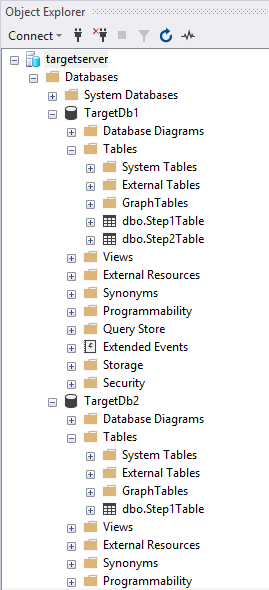

# Create an Elastic Job agent using PowerShell

[Elastic jobs](elastic-jobs-overview.md) enable the running of one or more Transact-SQL (T-SQL) scripts in parallel across many databases.

In this tutorial you learn the steps required to run a query across multiple databases:

> [!div class="checklist"]
> * Create an Elastic Job agent
> * Create job credentials so that jobs can execute scripts on its targets
> * Define the targets (servers, elastic pools, databases, shard maps) you want to run the job against
> * Create database scoped credentials in the target databases so the agent connect and execute jobs
> * Create a job
> * Add job steps to a job
> * Start execution of a job
> * Monitor a job

## Prerequisites

If you don't have already have an Azure subscription, [create a free account](https://azure.microsoft.com/free/) before you begin.

Install the **AzureRM.Sql** 4.8.1-preview module to get the latest Elastic Job cmdlets. Run the following commands in PowerShell with  administrative access.

```powershell
# Installs the latest PackageManagement powershell package which PowershellGet v1.6.5 is dependent on
Find-Package PackageManagement -RequiredVersion 1.1.7.2 | Install-Package -Force

# Installs the latest PowershellGet module which adds the -AllowPrerelease flag to Install-Module
Find-Package PowerShellGet -RequiredVersion 1.6.5 | Install-Package -Force

# Restart your powershell session with administrative access

# Places AzureRM.Sql preview cmdlets side by side with existing AzureRM.Sql version
Install-Module -Name AzureRM.Sql -AllowPrerelease -RequiredVersion 4.8.1-preview -Force

# Import the AzureRM.Sql 4.8.1 module
Import-Module AzureRM.Sql -RequiredVersion 4.8.1

# Confirm if module successfully imported - if the imported version is 4.8.1, then continue
Get-Module AzureRM.Sql
```

## Create required resources

Creating an Elastic Job agent requires a database (S0 or higher) for use as the [Job database](elastic-jobs-overview.md#job-database). 

*The script below creates a new resource group, server, and database for use as the Job database. The script below also creates a second server with 2 blank databases to execute jobs against.*

Elastic Jobs has no specific naming requirements so you can use whatever naming conventions you want, as long as they conform to any [Azure requirements](https://docs.microsoft.com/azure/architecture/best-practices/naming-conventions).

```powershell
# Sign in to your Azure account
Connect-AzureRmAccount

# Create a resource group
Write-Output "Creating a resource group..."
$ResourceGroupName = Read-Host "Please enter a resource group name"
$Location = Read-Host "Please enter an Azure Region"
$Rg = New-AzureRmResourceGroup -Name $ResourceGroupName -Location $Location
$Rg

# Create a server
Write-Output "Creating a server..."
$AgentServerName = Read-Host "Please enter an agent server name"
$AgentServerName = $AgentServerName + "-" + [guid]::NewGuid()
$AdminLogin = Read-Host "Please enter the server admin name"
$AdminPassword = Read-Host "Please enter the server admin password"
$AdminPasswordSecure = ConvertTo-SecureString -String $AdminPassword -AsPlainText -Force
$AdminCred = New-Object -TypeName "System.Management.Automation.PSCredential" -ArgumentList $AdminLogin, $AdminPasswordSecure
$AgentServer = New-AzureRmSqlServer -ResourceGroupName $ResourceGroupName -Location $Location -ServerName $AgentServerName -ServerVersion "12.0" -SqlAdministratorCredentials ($AdminCred)

# Set server firewall rules to allow all Azure IPs
Write-Output "Creating a server firewall rule..."
$AgentServer | New-AzureRmSqlServerFirewallRule -AllowAllAzureIPs
$AgentServer

# Create the job database
Write-Output "Creating a blank SQL database to be used as the Job Database..."
$JobDatabaseName = "JobDatabase"
$JobDatabase = New-AzureRmSqlDatabase -ResourceGroupName $ResourceGroupName -ServerName $AgentServerName -DatabaseName $JobDatabaseName -RequestedServiceObjectiveName "S0"
$JobDatabase
```

```powershell
# Create a target server and some sample databases - uses the same admin credential as the agent server just for simplicity
Write-Output "Creating target server..."
$TargetServerName = Read-Host "Please enter a target server name"
$TargetServerName = $TargetServerName + "-" + [guid]::NewGuid()
$TargetServer = New-AzureRmSqlServer -ResourceGroupName $ResourceGroupName -Location $Location -ServerName $TargetServerName -ServerVersion "12.0" -SqlAdministratorCredentials ($AdminCred)

# Set target server firewall rules to allow all Azure IPs
$TargetServer | New-AzureRmSqlServerFirewallRule -AllowAllAzureIPs
$TargetServer | New-AzureRmSqlServerFirewallRule -StartIpAddress 0.0.0.0 -EndIpAddress 255.255.255.255 -FirewallRuleName AllowAll
$TargetServer

# Create some sample databases to execute jobs against...
$Db1 = New-AzureRmSqlDatabase -ResourceGroupName $ResourceGroupName -ServerName $TargetServerName -DatabaseName "TargetDb1"
$Db1
$Db2 = New-AzureRmSqlDatabase -ResourceGroupName $ResourceGroupName -ServerName $TargetServerName -DatabaseName "TargetDb2"
$Db2
```

## Enable the Elastic Jobs preview for your subscription

To use Elastic Jobs, register the feature in your Azure subscription by running the following command (this only needs to be run once in each subscription where you want to use Elastic Jobs):

```powershell
Register-AzureRmProviderFeature -FeatureName sqldb-JobAccounts -ProviderNamespace Microsoft.Sql
```

## Create the Elastic Job agent

An Elastic Job agent is an Azure resource for creating, running, and managing jobs. The agent executes jobs based on a schedule or as a one-time job.

The **New-AzureRmSqlElasticJobAgent** cmdlet requires an Azure SQL database to already exist, so the *ResourceGroupName*, *ServerName*, and *DatabaseName* parameters must all point to existing resources.

```powershell
Write-Output "Creating job agent..."
$AgentName = Read-Host "Please enter a name for your new Elastic Job agent"
$JobAgent = $JobDatabase | New-AzureRmSqlElasticJobAgent -Name $AgentName
$JobAgent
```

## Create job credentials so that jobs can execute scripts on its targets

Jobs use database scoped credentials to connect to the target databases specified by the target group upon execution. These database scoped credentials are also used to connect to the master database to enumerate all the databases in a server or an elastic pool, when either of these are used as the target group member type.

The database scoped credentials must be created in the job database.  
All target databases must have a login with sufficient permissions for the job to complete successfully.


In addition to the credentials in the image, note the addition of the *GRANT* commands in the following script. These permissions are required for the script we chose for this example job. Because the example creates a new table in the targeted databases,  each target db needs the proper permissions to successfully run.

To create the required job credentials (in the job database), run the following script:

```powershell
# In the master database (target server)
# - Create the master user login
# - Create the master user from master user login
# - Create the job user login
$Params = @{
  'Database' = 'master'
  'ServerInstance' =  $TargetServer.ServerName + '.database.windows.net'
  'Username' = $AdminLogin
  'Password' = $AdminPassword
  'OutputSqlErrors' = $true
  'Query' = "CREATE LOGIN masteruser WITH PASSWORD='password!123'"
}
Invoke-SqlCmd @Params
$Params.Query = "CREATE USER masteruser FROM LOGIN masteruser"
Invoke-SqlCmd @Params
$Params.Query = "CREATE LOGIN jobuser WITH PASSWORD='password!123'"
Invoke-SqlCmd @Params

# For each of the target databases
# - Create the jobuser from jobuser login
# - Make sure they have the right permissions for successful script execution
$TargetDatabases = @( $Db1.DatabaseName, $Db2.DatabaseName )
$CreateJobUserScript =  "CREATE USER jobuser FROM LOGIN jobuser"
$GrantAlterSchemaScript = "GRANT ALTER ON SCHEMA::dbo TO jobuser"
$GrantCreateScript = "GRANT CREATE TABLE TO jobuser"

$TargetDatabases | % {
  $Params.Database = $_

  $Params.Query = $CreateJobUserScript
  Invoke-SqlCmd @Params

  $Params.Query = $GrantAlterSchemaScript
  Invoke-SqlCmd @Params

  $Params.Query = $GrantCreateScript
  Invoke-SqlCmd @Params
}

# Create job credential in Job database for master user
Write-Output "Creating job credentials..."
$LoginPasswordSecure = (ConvertTo-SecureString -String "password!123" -AsPlainText -Force)

$MasterCred = New-Object -TypeName "System.Management.Automation.PSCredential" -ArgumentList "masteruser", $LoginPasswordSecure
$MasterCred = $JobAgent | New-AzureRmSqlElasticJobCredential -Name "masteruser" -Credential $MasterCred

$JobCred = New-Object -TypeName "System.Management.Automation.PSCredential" -ArgumentList "jobuser", $LoginPasswordSecure
$JobCred = $JobAgent | New-AzureRmSqlElasticJobCredential -Name "jobuser" -Credential $JobCred
```

## Define the target databases you want to run the job against

A [target group](elastic-jobs-overview.md#target-group) defines the set of one or more databases a job step will execute on. 

The following snippet creates two target groups: *ServerGroup*, and *ServerGroupExcludingDb2*. *ServerGroup* targets all databases that exist on the server at the time of execution, and *ServerGroupExcludingDb2* targets all databases on the server, except *TargetDb2*:

```powershell
Write-Output "Creating test target groups..."
# Create ServerGroup target group
$ServerGroup = $JobAgent | New-AzureRmSqlElasticJobTargetGroup -Name 'ServerGroup'
$ServerGroup | Add-AzureRmSqlElasticJobTarget -ServerName $TargetServerName -RefreshCredentialName $MasterCred.CredentialName

# Create ServerGroup with an exclusion of Db2
$ServerGroupExcludingDb2 = $JobAgent | New-AzureRmSqlElasticJobTargetGroup -Name 'ServerGroupExcludingDb2'
$ServerGroupExcludingDb2 | Add-AzureRmSqlElasticJobTarget -ServerName $TargetServerName -RefreshCredentialName $MasterCred.CredentialName
$ServerGroupExcludingDb2 | Add-AzureRmSqlElasticJobTarget -ServerName $TargetServerName -Database $Db2.DatabaseName -Exclude
```

## Create a job

```powershell
Write-Output "Creating a new job"
$JobName = "Job1"
$Job = $JobAgent | New-AzureRmSqlElasticJob -Name $JobName -RunOnce
$Job
```

## Create a job step

This example defines two job steps for the job to run. The first job step (*step1*) creates a new table (*Step1Table*) in every database in target group *ServerGroup*. The second job step (*step2*) creates a new table (*Step2Table*) in every database except for *TargetDb2*, because the target group [defined previously](#define-the-target-databases-you-want-to-run-the-job-against) specified to exclude it.

```powershell
Write-Output "Creating job steps"
$SqlText1 = "IF NOT EXISTS (SELECT * FROM sys.tables WHERE object_id = object_id('Step1Table')) CREATE TABLE [dbo].[Step1Table]([TestId] [int] NOT NULL);"
$SqlText2 = "IF NOT EXISTS (SELECT * FROM sys.tables WHERE object_id = object_id('Step2Table')) CREATE TABLE [dbo].[Step2Table]([TestId] [int] NOT NULL);"

$Job | Add-AzureRmSqlElasticJobStep -Name "step1" -TargetGroupName $ServerGroup.TargetGroupName -CredentialName $JobCred.CredentialName -CommandText $SqlText1
$Job | Add-AzureRmSqlElasticJobStep -Name "step2" -TargetGroupName $ServerGroupExcludingDb2.TargetGroupName -CredentialName $JobCred.CredentialName -CommandText $SqlText2
```


## Run the job

To start the job immediately, run the following command:

```powershell
Write-Output "Start a new execution of the job..."
$JobExecution = $Job | Start-AzureRmSqlElasticJob
$JobExecution
```

After successful completion you should see two new tables in TargetDb1, and only one new table in TargetDb2:


   


## Monitor status of job executions

The following snippets get job execution details:

```powershell
# Get the latest 10 executions run
$JobAgent | Get-AzureRmSqlElasticJobExecution -Count 10

# Get the job step execution details
$JobExecution | Get-AzureRmSqlElasticJobStepExecution

# Get the job target execution details
$JobExecution | Get-AzureRmSqlElasticJobTargetExecution -Count 2
```

## Schedule the job to run later

To schedule a job to run at a specific time, run the following command:

```powershell
# Run every hour starting from now
$Job | Set-AzureRmSqlElasticJob -IntervalType Hour -IntervalCount 1 -StartTime (Get-Date) -Enable
```

## Clean up resources

Delete the Azure resources created in this tutorial by deleting the resource group.

> [!TIP]
> If you plan to continue to work with these jobs, do not clean up the resources created in this article. If you do not plan to continue, use the following steps to delete all resources created in this article.
>

```powershell
Remove-AzureRmResourceGroup -ResourceGroupName $ResourceGroupName
```


## Next steps

In this tutorial, you ran a Transact-SQL script against a set of databases.  You learned how to do the following tasks:

> [!div class="checklist"]
> * Create an Elastic Job agent
> * Create job credentials so that jobs can execute scripts on its targets
> * Define the targets (servers, elastic pools, databases, shard maps) you want to run the job against
> * Create database scoped credentials in the target databases so the agent connect and execute jobs
> * Create a job
> * Add a job step to the job
> * Start an execution of the job
> * Monitor the job

> [!div class="nextstepaction"]
>[Manage Elastic Jobs using Transact-SQL](elastic-jobs-tsql.md)