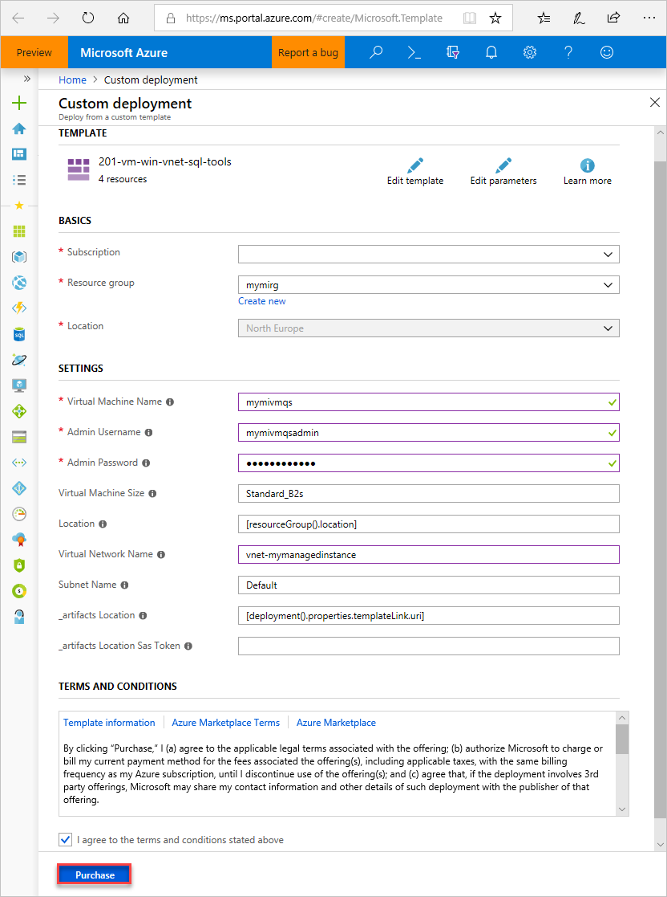

# Export from an Azure virtual machine to SQL Database

This article shows you how to import and export a database from an Azure virtual machine to an Azure SQL database when *Allow Azure Services* is set to *OFF* on the Azure SQL server.

## Sign in to the Azure portal

Sign in to the [Azure portal](https://portal.azure.com/).

## Prepare the Azure virtual machine

Since SQL Managed Instance is placed in your private Virtual Network, you need to create an Azure VM with an installed SQL client tool, like SQL Server Management Studio or Azure Data Studio. This tool lets you connect to the Managed Instance and execute queries. This quickstart uses SQL Server Management Studio.

The easiest way to create a client virtual machine with all necessary tools is to use the Azure Resource Manager templates.

1. Make sure that you're signed in to the Azure portal in another browser tab. Then, select the following button to create a client virtual machine and install SQL Server Management Studio:

    <a href="https://portal.azure.com/#create/Microsoft.Template/uri/https%3A%2F%2Fraw.githubusercontent.com%2Fjovanpop-msft%2Fazure-quickstart-templates%2Fsql-win-vm-w-tools%2F201-vm-win-vnet-sql-tools%2Fazuredeploy.json" target="_blank"></a>

2. Fill out the form using the information in the following table:

   | Setting| Suggested value | Description |
   | ---------------- | ----------------- | ----------- |
   | **Subscription** | A valid subscription | Must be a subscription in which you have permission to create new resources. |
   | **Resource Group** |The resource group that you specified in the [Create Managed Instance](sql-database-managed-instance-get-started.md) quickstart.|This resource group must be the one in which the VNet exists.|
   | **Location** | The location for the resource group | This value is populated based on the resource group selected. |
   | **Virtual machine name**  | Any valid name | For valid names, see [Naming rules and restrictions](/azure/architecture/best-practices/resource-naming).|
   |**Admin Username**|Any valid username|For valid names, see [Naming rules and restrictions](/azure/architecture/best-practices/resource-naming). Don't use "serveradmin" as that is a reserved server-level role.<br>You use this username any time you [connect to the VM](#connect-to-virtual-machine).|
   |**Password**|Any valid password|The password must be at least 12 characters long and meet the [defined complexity requirements](../virtual-machines/windows/faq.md#what-are-the-password-requirements-when-creating-a-vm).<br>You use this password any time you [connect to the VM](#connect-to-virtual-machine).|
   | **Virtual Machine Size** | Any valid size | The default in this template of **Standard_B2s** is sufficient for this quickstart. |
   | **Location**|[resourceGroup().location].| Don't change this value. |
   | **Virtual Network Name**|The virtual network in which you created the Managed Instance.|
   | **Subnet name**|The name of the subnet that you created in the previous procedure| Don't choose the subnet in which you created the Managed Instance.|
   | **artifacts Location** | [deployment().properties.templateLink.uri] | Don't change this value. |
   | **artifacts Location Sas token** | leave blank | Don't change this value. |

   

   If you used the suggested VNet name and the default subnet in [creating your Managed Instance](sql-database-managed-instance-get-started.md), you don't need to change last two parameters. Otherwise you should change these values to the values that you entered when you set up the network environment.

3. Select the **I agree to the terms and conditions stated above** checkbox.
4. Select **Purchase** to deploy the Azure VM in your network.
5. Select the **Notifications** icon to view the status of deployment.

> [!IMPORTANT]
> Do not continue until approximately 15 minutes after the virtual machine is created to give time for the post-creation scripts to install SQL Server Management Studio.

## Connect to virtual machine

The following steps show you how to connect to your newly created virtual machine using a remote desktop connection.

1. After deployment completes, go to the virtual machine resource.

      

2. Select **Connect**.

   A Remote Desktop Protocol file (.rdp file) form appears with the public IP address and port number for the virtual machine.

     

3. Select **Download RDP File**.

   > [!NOTE]
   > You can also use SSH to connect to your VM.

4. Close the **Connect to virtual machine** form.
5. To connect to your VM, open the downloaded RDP file.
6. When prompted, select **Connect**. On a Mac, you need an RDP client such as this [Remote Desktop Client](https://itunes.apple.com/us/app/microsoft-remote-desktop/id715768417?mt=12) from the Mac App Store.

7. Enter the username and password you specified when creating the virtual machine, then choose **OK**.

8. You might receive a certificate warning during the sign-in process. Choose **Yes** or **Continue** to proceed with the connection.

You're connected to your virtual machine in the Server Manager dashboard.


## Export a database using SQLPackage

To export a SQL database using the [SqlPackage](https://docs.microsoft.com/sql/tools/sqlpackage) command-line utility, see [Export parameters and properties](https://docs.microsoft.com/sql/tools/sqlpackage#export-parameters-and-properties). The SQLPackage utility ships with the latest versions of [SQL Server Management Studio](https://msdn.microsoft.com/library/mt238290.aspx) and [SQL Server Data Tools for Visual Studio](https://msdn.microsoft.com/library/mt204009.aspx), or you can download the latest version of [SqlPackage](https://www.microsoft.com/download/details.aspx?id=53876) directly from the Microsoft download center.

We recommend the use of the SQLPackage utility for scale and performance in most production environments. For a SQL Server Customer Advisory Team blog about migrating using BACPAC files, see [Migrating from SQL Server to Azure SQL Database using BACPAC Files](https://blogs.msdn.microsoft.com/sqlcat/20../../migrating-from-sql-server-to-azure-sql-database-using-bacpac-files/).

This example shows how to export a database using SqlPackage.exe with Active Directory Universal Authentication:

```cmd
SqlPackage.exe /a:Export /tf:testExport.bacpac /scs:"Data Source=apptestserver.database.windows.net;Initial Catalog=MyDB;" /ua:True /tid:"apptest.onmicrosoft.com"
```


## Import a database using SqlPackage

To import a SQL Server database using the [SqlPackage](https://docs.microsoft.com/sql/tools/sqlpackage) command-line utility, see [import parameters and properties](https://docs.microsoft.com/sql/tools/sqlpackage#import-parameters-and-properties). SqlPackage has the latest [SQL Server Management Studio](https://docs.microsoft.com/sql/ssms/download-sql-server-management-studio-ssms) and [SQL Server Data Tools for Visual Studio](https://msdn.microsoft.com/library/mt204009.aspx). You can also download the latest [SqlPackage](https://www.microsoft.com/download/details.aspx?id=53876) from the Microsoft download center.

For scale and performance, we recommend using SqlPackage in most production environments rather than using the Azure portal. For a SQL Server Customer Advisory Team blog about migrating using `BACPAC` files, see [migrating from SQL Server to Azure SQL Database using BACPAC Files](https://blogs.msdn.microsoft.com/sqlcat/2016/10/20/migrating-from-sql-server-to-azure-sql-database-using-bacpac-files/).

The following SqlPackage command imports the **AdventureWorks2008R2** database from local storage to an Azure SQL Database server called **mynewserver20170403**. It creates a new database called **myMigratedDatabase** with a **Premium** service tier and a **P6** Service Objective. Change these values as appropriate for your environment.

```cmd
sqlpackage.exe /a:import /tcs:"Data Source=<serverName>.database.windows.net;Initial Catalog=<migratedDatabase>;User Id=<userId>;Password=<password>" /sf:AdventureWorks2008R2.bacpac /p:DatabaseEdition=Premium /p:DatabaseServiceObjective=P6
```

> [!IMPORTANT]
> To connect to a SQL Database server managing a single database from behind a corporate firewall, the firewall must have port 1433 open. To connect to a managed instance, you must have a [point-to-site connection](sql-database-managed-instance-configure-p2s.md) or an express route connection.

This example shows how to import a database using SqlPackage with Active Directory Universal Authentication.

```cmd
sqlpackage.exe /a:Import /sf:testExport.bacpac /tdn:NewDacFX /tsn:apptestserver.database.windows.net /ua:True /tid:"apptest.onmicrosoft.com"
```


## Next steps

- To learn how to connect to and query an imported SQL Database, see [Quickstart: Azure SQL Database: Use SQL Server Management Studio to connect and query data](sql-database-connect-query-ssms.md).
- For a SQL Server Customer Advisory Team blog about migrating using BACPAC files, see [Migrating from SQL Server to Azure SQL Database using BACPAC Files](https://techcommunity.microsoft.com/t5/DataCAT/Migrating-from-SQL-Server-to-Azure-SQL-Database-using-Bacpac/ba-p/305407).
- For a discussion of the entire SQL Server database migration process, including performance recommendations, see [SQL Server database migration to Azure SQL Database](sql-database-single-database-migrate.md).
- To learn how to manage and share storage keys and shared access signatures securely, see [Azure Storage Security Guide](https://docs.microsoft.com/azure/storage/common/storage-security-guide).
