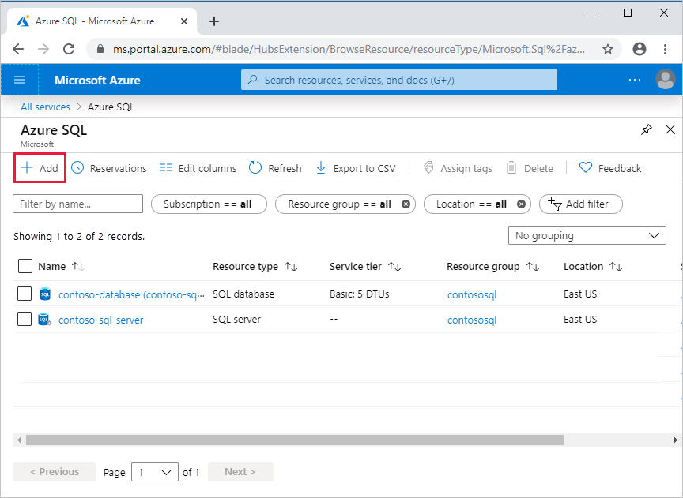

## Create and manage Azure SQL resources with the Azure portal

The Azure portal provides a single page where you can manage [all of your Azure SQL resources](https://go.microsoft.com/fwlink/?linkid=2100641) including your SQL virtual machines.

To access the **Azure SQL resources** page, from the Azure portal menu, select **Azure SQL** or search for and select **Azure SQL** in any page.

> [!NOTE]
> **Azure SQL** provides a quick and easy way to access all of your SQL databases, elastic pools, database servers, SQL managed instances, and SQL virtual machines. Azure SQL is not a service or resource. 

To manage existing resources, select the desired item in the list. To create new Azure SQL resources, select **+ Add**. 

After selecting **+ Add**, view additional information about the different options by selecting **Show details** on any tile.

For details, see:

- [Create a single database](../sql-database-single-database-get-started.md)
- [Create an elastic pool](../sql-database-elastic-pool.md#creating-a-new-sql-database-elastic-pool-using-the-azure-portal)
- [Create a managed instance](../sql-database-managed-instance-get-started.md)
- [Create a SQL virtual machine](../virtual-machines/windows/quickstart-sql-vm-create-portal.md)