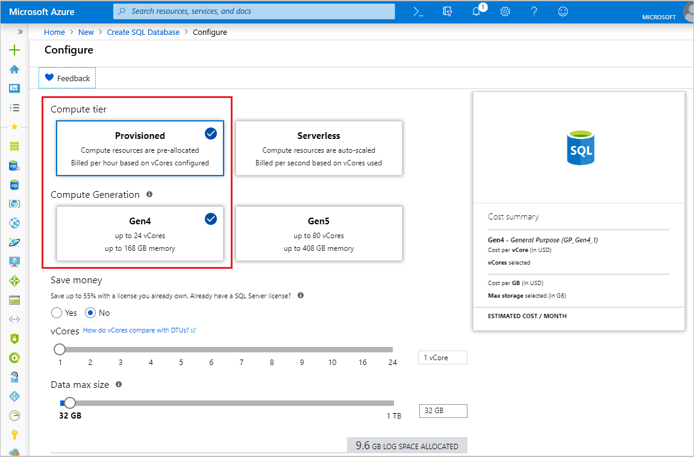

In this step, you will create your resource group and an Azure SQL Database single database.

> [!IMPORTANT]
> Be sure to set up firewall rules to use the public IP address of the computer on which you're performing the steps in this article. 
>
> For information see [Create a database-level firewall rule](/sql/relational-databases/system-stored-procedures/sp-set-database-firewall-rule-azure-sql-database) or to determine the IP address used for the server-level firewall rule for your computer see [Create a server-level firewall](../sql-database-server-level-firewall-rule.md).  

# [Portal](#tab/azure-portal)

Create your resource group and single database using the Azure portal.

1. Select **Create a resource** in the upper left-hand corner of the Azure portal.
2. Select **Databases** and then select **SQL Database** to open the **Create SQL Database** page.

   

3. On the **Basics** tab, in the **Project Details** section, type or select the following values:

   - **Subscription**: Drop down and select the correct subscription, if it doesn't appear.
   - **Resource group**: Select **Create new**, type `myResourceGroup`, and select **OK**.

     

4. In the **Database Details** section, type or select the following values:

   - **Database name**: Enter `mySampleDatabase`.
   - **Server**: Select **Create new**, enter the following values and then select **Select**.
       - **Server name**: Type `mysqlserver`; along with some numbers for uniqueness.
       - **Server admin login**: Type `azureuser`.
       - **Password**: Type a complex password that meets password requirements.
       - **Location**: Choose a location from the drop-down, such as `West US 2`.

         

      > [!IMPORTANT]
      > Remember to record the server admin login and password so you can log in to the server and databases for this and other quickstarts. If you forget your login or password, you can get the login name or reset the password on the **SQL server** page. To open the **SQL server** page, select the server name on the database **Overview** page after database creation.

   - **Want to use SQL elastic pool**: Select the **No** option.
   - **Compute + storage**: Select **Configure database**. 

     

   - Select **Provisioned** and **Gen5**.

     

   - Review the settings for **Max vCores**, **Min vCores**, **Autopause delay**, and **Data max size**. Change these as desired.
   - Accept the preview terms and click **OK**.
   - Select **Apply**.

5. Select the **Additional settings** tab. 
6. In the **Data source** section, under **Use existing data**, select `Sample`.

   

   > [!IMPORTANT]
   > Make sure to select the **Sample (AdventureWorksLT)** data so you can follow easily this and other Azure SQL Database quickstarts that use this data.

7. Leave the rest of the values as default and select **Review + Create** at the bottom of the form.
8. Review the final settings and select **Create**.

9. On the **SQL Database** form, select **Create** to deploy and provision the resource group, server, and database.

# [PowerShell](#tab/azure-powershell)

[!INCLUDE [updated-for-az](../../../includes/updated-for-az.md)]

Create your resource group and single database using PowerShell.

   ```powershell-interactive
   # Set variables for your server and database
   $subscriptionId = '<SubscriptionID>'
   $resourceGroupName = "myResourceGroup-$(Get-Random)"
   $location = "West US 2"
   $adminLogin = "azureuser"
   $password = "PWD27!"+(New-Guid).Guid
   $serverName = "mysqlserver-$(Get-Random)"
   $databaseName = "mySampleDatabase"

   # The ip address range that you want to allow to access your server 
   # (leaving at 0.0.0.0 will prevent outside-of-azure connections to your DB)
   $startIp = "0.0.0.0"
   $endIp = "0.0.0.0"

   # Show randomized variables
   Write-host "Resource group name is" $resourceGroupName 
   Write-host "Password is" $password  
   Write-host "Server name is" $serverName 

   # Connect to Azure
   Connect-AzAccount

   # Set subscription ID
   Set-AzContext -SubscriptionId $subscriptionId 

   # Create a resource group
   Write-host "Creating resource group..."
   $resourceGroup = New-AzResourceGroup -Name $resourceGroupName -Location $location -Tag @{Owner="SQLDB-Samples"}
   $resourceGroup

   # Create a server with a system wide unique server name
   Write-host "Creating primary logical server..."
   $server = New-AzSqlServer -ResourceGroupName $resourceGroupName `
      -ServerName $serverName `
      -Location $location `
      -SqlAdministratorCredentials $(New-Object -TypeName System.Management.Automation.PSCredential `
      -ArgumentList $adminLogin, $(ConvertTo-SecureString -String $password -AsPlainText -Force))
   $server

   # Create a server firewall rule that allows access from the specified IP range
   Write-host "Configuring firewall for primary logical server..."
   $serverFirewallRule = New-AzSqlServerFirewallRule -ResourceGroupName $resourceGroupName `
      -ServerName $serverName `
      -FirewallRuleName "AllowedIPs" -StartIpAddress $startIp -EndIpAddress $endIp
   $serverFirewallRule

   # Create General Purpose Gen4 database with 1 vCore
   Write-host "Creating a gen5 2 vCore database..."
   $database = New-AzSqlDatabase  -ResourceGroupName $resourceGroupName `
      -ServerName $serverName `
      -DatabaseName $databaseName `
      -Edition GeneralPurpose `
      -VCore 2 `
      -ComputeGeneration Gen5 `
      -MinimumCapacity 2 `
      -SampleName "AdventureWorksLT"
   $database
   ```

# [Azure CLI](#tab/azure-cli)

Create your resource group and single database using AZ CLI.

   ```azurecli-interactive
   #!/bin/bash
   # Set variables
   subscriptionID=<SubscriptionID>
   resourceGroupName=myResourceGroup-$RANDOM
   location=SouthCentralUS
   adminLogin=azureuser
   password="PWD27!"+`openssl rand -base64 18`
   serverName=mysqlserver-$RANDOM
   databaseName=mySampleDatabase
   drLocation=NorthEurope
   drServerName=mysqlsecondary-$RANDOM
   failoverGroupName=failovergrouptutorial-$RANDOM

   # The ip address range that you want to allow to access your DB. 
   # Leaving at 0.0.0.0 will prevent outside-of-azure connections to your DB
   startip=0.0.0.0
   endip=0.0.0.0
  
   # Connect to Azure
   az login

   # Set the subscription context for the Azure account
   az account set -s $subscriptionID

   # Create a resource group
   echo "Creating resource group..."
   az group create \
      --name $resourceGroupName \
      --location $location \
      --tags Owner[=SQLDB-Samples]

   # Create a logical server in the resource group
   echo "Creating primary logical server..."
   az sql server create \
      --name $serverName \
      --resource-group $resourceGroupName \
      --location $location  \
      --admin-user $adminLogin \
      --admin-password $password

   # Configure a firewall rule for the server
   echo "Configuring firewall..."
   az sql server firewall-rule create \
      --resource-group $resourceGroupName \
      --server $serverName \
      -n AllowYourIp \
      --start-ip-address $startip \
      --end-ip-address $endip

   # Create a gen5 1vCore database in the server 
   echo "Creating a gen5 2 vCore database..."
   az sql db create \
      --resource-group $resourceGroupName \
      --server $serverName \
      --name $databaseName \
      --sample-name AdventureWorksLT \
      --edition GeneralPurpose \
      --family Gen5 \
      --capacity 2
   ```

---
