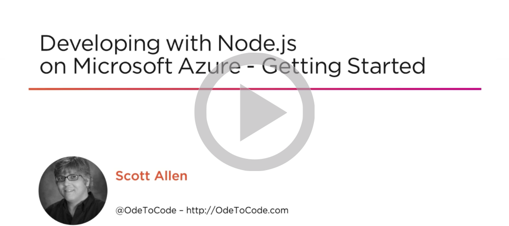

# SQL Database Documentation

Learn how to use SQL Database, a relational database-as-a-service in the cloud built on the Microsoft SQL Server engine.

<h2 style="margin-top: 6px;">Quickstarts</h2>

    

        <a href="/azure/sql-database/sql-database-get-started-portal">
            
            Create a SQL DB - Portal
        </a>
    

    

        <a href="/azure/sql-database/sql-database-get-started-cli">
            
            Create a SQL DB - Azure CLI
        </a>
    

    

        <a href="/azure/sql-database/sql-database-get-started-powershell">
            
            Create a SQL DB - PowerShell
        </a>
    

    

        <h2 style="margin-top: 18px;">Tutorials</h2>
        
Follow these step-by-step tutorials to build and deploy SQL Database applications.

        <ul class="spaced">
            <li><a href="/azure/sql-database/sql-database-design-first-database">Design a database</a></li>
            
        </ul>
        <h2>Samples</h2>
        
Find scripts and code sample to simplify common management tasks.

        <ul class="spaced">
            <li><a href="/azure/sql-database/sql-database-cli-samples.md">Azure CLI</a></li>
            <li><a href="/azure/sql-database/sql-database-powershell-samples.md">PowerShell</a></li>
        </ul>
    

    

        <h2 style="margin-top: 18px;">Free Video Training</h2>
        <a href="https://app.pluralsight.com/player?author=scott-allen&name=f24a629c-37b7-47f1-bc43-4b122da61cbb&mode=live&clip=0&course=developing-dotnet-microsoft-azure-getting-started">
        
        
Free Pluralsight video training – Developing with .NET</a>

        

        <a href="https://app.pluralsight.com/player?author=scott-allen&name=developing-nodejs-microsoft-azure-getting-started-m0&mode=live&clip=0&course=developing-nodejs-microsoft-azure-getting-started">
        
        
Free Pluralsight video training – Developing with Node.js</a>

    

---
<h2>Reference</h2>
<ul class="panelContent cardsW">
    <li>
        

            

                

                    

                        <h3>Command-Line</h3>
                        
<a href="/powershell/resourcemanager/azurerm.sql/v2.3.0/azurerm.sql">PowerShell</a>

                        
<a href="/powershell/elasticdatabasejobs/v0.8.33/elasticdatabasejobs">PowerShell (Elastic DB)</a>

                        
<a href="/cli/azure/sql">Azure CLI 2.0</a>

                    

                

            

        

    </li>
    <li>
        

            

                

                    

                        <h3>Languages</h3>
                        
<a href="/dotnet/api/microsoft.azure.management.sql.models">.NET</a>

                        
<a href="/java/api/com.microsoft.azure.management.sql">Java</a>

                        
<a href="https://msdn.microsoft.com/library/mt652093.aspx">Node.js</a>

                        
<a href="https://msdn.microsoft.com/library/mt652092.aspx">Python</a>

                        
<a href="https://msdn.microsoft.com/library/mt691981.aspx">Ruby</a>

                        
<a href="https://msdn.microsoft.com/library/dn865013.aspx">PHP</a>

                        
<a href="https://msdn.microsoft.com/library/azure/bb510741.aspx">T-SQL</a>

                    

                

            

        

    </li>
    <li>
        

            

                

                    

                        <h3>REST</h3>
                        
<a href="/rest/api/sql/">REST API Reference</a>

                    

                

            

        

    </li>
    <li>
        

            

                

                    

                        <h3><a href="https://msdn.microsoft.com/library/mt238365.aspx">SQL Server Tools</a></h3>
                        
<a href="https://msdn.microsoft.com/library/mt238290.aspx">SQL Server Management Studio (SSMS)</a>

                        
<a href="https://msdn.microsoft.com/library/mt204009.aspx">SQL Server Data Tools (SSDT)</a>

                        
<a href="https://msdn.microsoft.com/library/ms162802.aspx">BCP</a>

                        
<a href="https://msdn.microsoft.com/library/ms162773.aspx">SQLCMD</a>

                        
<a href="https://msdn.microsoft.com/hh550080.aspx">SqlPackage</a>

                        
<a href="https://www.nuget.org/packages/Microsoft.Azure.Management.Sql">SQL Database Management Library package</a>

                    

                

            

        

    </li>
    <li>
        

            

                

                    

                        <h3><a href="https://msdn.microsoft.com/library/mt654049.aspx">SQL Server Drivers</a></h3>
                        
<a href="https://msdn.microsoft.com/library/mt657768.aspx">ADO.NET</a>

                        
<a href="https://msdn.microsoft.com/library/mt484311.aspx">JDBC</a>

                        
<a href="https://msdn.microsoft.com/library/mt654048.aspx">ODBC</a>

                    

                

            

        

    </li>
</ul>