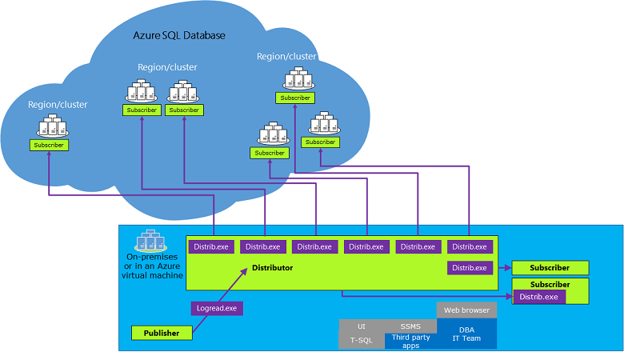

# Replication to SQL Database single and pooled databases

SQL Server replication can be configured to single and pooled databases on a [SQL Database server](sql-database-servers.md) in Azure SQL Database.  

## **Supported Configurations:**
  
- The SQL Server can be an instance of SQL Server running on-premises or an instance of SQL Server running in an Azure virtual machine in the cloud. For more information, see [SQL Server on Azure Virtual Machines overview](https://azure.microsoft.com/documentation/articles/virtual-machines-sql-server-infrastructure-services/).  
- The Azure SQL database must be a push subscriber of a SQL Server publisher.  
- The distribution database and the replication agents cannot be placed on an Azure SQL database.  
- Snapshot and one-way transactional replication are supported. Peer-to-peer transactional replication and merge replication are not supported.
- Replication is available for public preview on Azure SQL Database Managed Instance. Managed Instance can host publisher, distributor, and subscriber databases. For more information, see [Replication with SQL Database Managed Instance](replication-with-sql-database-managed-instance.md).

## Versions  

- The publisher and distributor must be at least at one of the following versions:  
- SQL Server 2017 (14.x)
- SQL Server 2016 (13.x)
- SQL Server 2014 (12.x) SP1 CU3
- SQL Server 2014 (12.x) RTM CU10
- SQL Server 2012 (11.x) SP2 CU8 or SP3
- Attempting to configure replication using an older version can result in error number MSSQL_REPL20084 (The process could not connect to Subscriber.) and MSSQL_REPL40532 (Cannot open server \<name> requested by the login. The login failed.).  
- To use all the features of Azure SQL Database, you must be using the latest versions of [SQL Server Management Studio](https://docs.microsoft.com/sql/ssms/download-sql-server-management-studio-ssms) and [SQL Server Data Tools](https://docs.microsoft.com/sql/ssdt/download-sql-server-data-tools-ssdt).  
  
## Remarks

- Replication can be configured by using [SQL Server Management Studio](https://docs.microsoft.com/sql/ssms/download-sql-server-management-studio-ssms) or by executing Transact-SQL statements on the publisher. You cannot configure replication by using the Azure portal.  
- Replication can only use SQL Server authentication logins to connect to an Azure SQL database.
- Replicated tables must have a primary key.  
- You must have an existing Azure subscription.  
- The Azure SQL database subscriber can be in any region.  
- A single publication on SQL Server can support both Azure SQL Database and SQL Server (on-premises and SQL Server in an Azure virtual machine) subscribers.  
- Replication management, monitoring, and troubleshooting must be performed from the on-premises SQL Server.  
- Only push subscriptions to Azure SQL Database are supported.  
- Only `@subscriber_type = 0` is supported in **sp_addsubscription** for SQL Database.  
- Azure SQL Database does not support bi-directional, immediate, updatable, or peer to peer replication.

## Replication Architecture  

  

## Scenarios  

### Typical Replication Scenario  

1. Create a transactional replication publication on an on-premises SQL Server database.  
2. On the on-premises SQL Server use the **New Subscription Wizard** or Transact-SQL statements to create a push to subscription to Azure SQL Database.  
3. With single and pooled databases in Azure SQL Database, the initial data set is a snapshot that is created by the Snapshot Agent and distributed and applied by the Distribution Agent. With a managed instance database, you can also use a database backup to seed the subscriber database.

### Data Migration Scenario  

1. Use transactional replication to replicate data from an on-premises SQL Server database to Azure SQL Database.  
2. Redirect the client or middle-tier applications to update the Azure SQL database copy.  
3. Stop updating the SQL Server version of the table and remove the publication.  

## Limitations

The following options are not supported for Azure SQL Database subscriptions:

- Copy file groups association  
- Copy table partitioning schemes  
- Copy index partitioning schemes  
- Copy user defined statistics  
- Copy default bindings  
- Copy rule bindings  
- Copy fulltext indexes  
- Copy XML XSD  
- Copy XML indexes  
- Copy permissions  
- Copy spatial indexes  
- Copy filtered indexes  
- Copy data compression attribute  
- Copy sparse column attribute  
- Convert filestream to MAX data types  
- Convert hierarchyid to MAX data types  
- Convert spatial to MAX data types  
- Copy extended properties  
- Copy permissions  

### Limitations to be determined

- Copy collation  
- Execution in a serialized transaction of the SP  

## Examples

Create a publication and a push subscription. For more information, see:
  
- [Create a Publication](https://docs.microsoft.com/sql/relational-databases/replication/publish/create-a-publication)
- [Create a Push Subscription](https://docs.microsoft.com/sql/relational-databases/replication/create-a-push-subscription/) by using the Azure SQL Database server name as the subscriber (for example **N'azuresqldbdns.database.windows.net'**) and the Azure SQL database name as the destination database (for example **AdventureWorks**).  

## See Also  

- [Transactional replication](sql-database-managed-instance-transactional-replication.md)
- [Create a Publication](https://docs.microsoft.com/sql/relational-databases/replication/publish/create-a-publication)
- [Create a Push Subscription](https://docs.microsoft.com/sql/relational-databases/replication/create-a-push-subscription/)
- [Types of Replication](https://docs.microsoft.com/sql/relational-databases/replication/types-of-replication)
- [Monitoring (Replication)](https://docs.microsoft.com/sql/relational-databases/replication/monitor/monitoring-replication)
- [Initialize a Subscription](https://docs.microsoft.com/sql/relational-databases/replication/initialize-a-subscription)  
