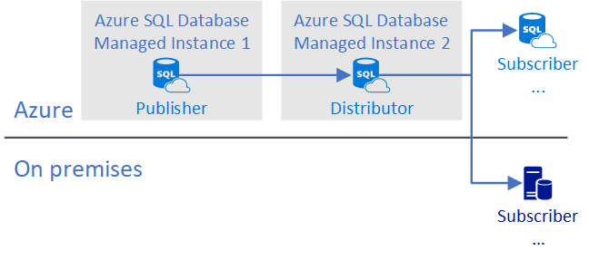

# Replication with SQL Database Managed Instance

Replication is available for public preview on [Azure SQL Database Managed Instance](sql-database-managed-instance.md). A Managed Instance can host publisher, distributor, and subscriber databases.

## Common configurations

In general, the publisher and the distributor must both be either in the cloud or on-premises. The following configurations are supported:

- **Publisher with local distributor on managed instance**

   

   Publisher and distributor databases are configured on a single managed instance.

- **Publisher with remote distributor on managed instance**

   

   Publisher and distributor are configured on two managed instances. In this configuration:

  - Both managed instances are in the same vNet.

  - Both managed instances are in the same location.

- **Publisher and distributor on-premises with subscriber on managed instance**

   

   In this configuration, an Azure SQL database is a subscriber. This configuration supports migration from on-premises to Azure. In the subscriber role, SQL database does not require Managed Instance, however you can use a SQL Database Managed Instance as a step in migration from on-premises to the Azure. For more information about Azure SQL Database subscribers, see [Replication to SQL Database](replication-to-sql-database.md).

## Requirements

Publisher and distributor on Azure SQL Database requires:

- Azure SQL Database Managed Instance.

   >[!NOTE]
   >Azure SQL Databases that are not configured with Managed Instance can only be subscribers.

- All instances of SQL Server need to be on the same vNet.

- Connectivity uses SQL Authentication between replication participants.

- An Azure Storage Account share for the replication working directory.

## Features

Supports:

- Transactional and snapshot replication mix of on-premises and Azure SQL Database Managed Instance instances.

- Subscribers can be on-premises, single databases in Azure SQL Database, or pooled databases in Azure SQL Database elastic pools.

- One-way or bidirectional replication

## Configure publishing and distribution example

1. [Create an Azure SQL Database Managed Instance](sql-database-managed-instance-create-tutorial-portal.md) in the portal.
2. [Create an Azure Storage Account](http://docs.microsoft.com/azure/storage/common/storage-create-storage-account#create-a-storage-account) for the working directory.

   Be sure to copy the storage keys. See [View and copy storage access keys](../storage/common/storage-account-manage.md#access-keys
).
3. Create a database for the publisher.

   In the example scripts below, replace `<Publishing_DB>` with the name of this database.

4. Create a database user with SQL Authentication for the distributor. See, [Creating database users](http://docs.microsoft.com/azure/sql-database/sql-database-security-tutorial#creating-database-users). Use a secure password.

   In the example scripts below, use `<SQL_USER>` and `<PASSWORD>` with this SQL Server Account database user and password.

5. [Connect to the SQL Database Managed Instance](http://docs.microsoft.com/azure/sql-database/sql-database-connect-query-ssms).

6. Run the following query to add the distributor and the distribution database.

   ```sql
   USE [master]​
   GO
   EXEC sp_adddistributor @distributor = @@ServerName​;
   EXEC sp_adddistributiondb @database = N'distribution'​;
   ```

7. To configure a publisher to use a specified distribution database, update and run the following query.

   Replace `<SQL_USER>` and `<PASSWORD>` with the SQL Server Account and password.

   Replace `\\<STORAGE_ACCOUNT>.file.core.windows.net\<SHARE>` with the value of your storage account.  

   Replace `<STORAGE_CONNECTION_STRING>` with the connection string from the **Access keys** tab of your Microsoft Azure storage account.

   After you update the following query, run it.

   ```sql
   USE [master]​
   EXEC sp_adddistpublisher @publisher = @@ServerName,
                @distribution_db = N'distribution',​
                @security_mode = 0,
                @login = N'<SQL_USER>',
                @password = N'<PASSWORD>',
                @working_directory = N'\\<STORAGE_ACCOUNT>.file.core.windows.net\<SHARE>',
                @storage_connection_string = N'<STORAGE_CONNECTION_STRING>';
   GO​
   ```

8. Configure the publisher for replication.

    In the following query, replace `<Publishing_DB>` with the name of your publisher database.

    Replace `<Publication_Name>` with the name for your publication.

    Replace `<SQL_USER>` and `<PASSWORD>` with the SQL Server Account and password.

    After you update the query, run it to create the publication.

   ```sql
   USE [<Publishing_DB>]​
   EXEC sp_replicationdboption @dbname = N'<Publishing_DB>',
                @optname = N'publish',
                @value = N'true'​;

   EXEC sp_addpublication @publication = N'<Publication_Name>',
                @status = N'active';​

   EXEC sp_changelogreader_agent @publisher_security_mode = 0,
                @publisher_login = N'<SQL_USER>',
                @publisher_password = N'<PASSWORD>',
                @job_login = N'<SQL_USER>',
                @job_password = N'<PASSWORD>';

   EXEC sp_addpublication_snapshot @publication = N'<Publication_Name>',
                @frequency_type = 1,​
                @publisher_security_mode = 0,​
                @publisher_login = N'<SQL_USER>',
                @publisher_password = N'<PASSWORD>',
                @job_login = N'<SQL_USER>',
                @job_password = N'<PASSWORD>'
   ```

9. Add the article, subscription, and push subscription agent.

   To add these objects, update the following script.

   - Replace `<Object_Name>` with the name of the publication object.
   - Replace `<Object_Schema>` with the name of the source schema.
   - Replace the other parameters in angle brackets `<>` to match the values in the previous scripts.

   ```sql
   EXEC sp_addarticle @publication = N'<Publication_Name>',
                @type = N'logbased',
                @article = N'<Object_Name>',
                @source_object = N'<Object_Name>',
                @source_owner = N'<Object_Schema>'​

   EXEC sp_addsubscription @publication = N'<Publication_Name>',​
                @subscriber = @@ServerName,
                @destination_db = N'<Subscribing_DB>',
                @subscription_type = N'Push'​

   EXEC sp_addpushsubscription_agent @publication = N'<Publication_Name>',
                @subscriber = @@ServerName,​
                @subscriber_db = N'<Subscribing_DB>',
                @subscriber_security_mode = 0,
                @subscriber_login = N'<SQL_USER>',
                @subscriber_password = N'<PASSWORD>',
                @job_login = N'<SQL_USER>',
                @job_password = N'<PASSWORD>'
   GO​
   ```

## Limitations

The following features are not supported:

- Updateable subscriptions

- Active geo replication

## See Also

- [What is a Managed Instance?](http://docs.microsoft.com/azure/sql-database/sql-database-managed-instance)
