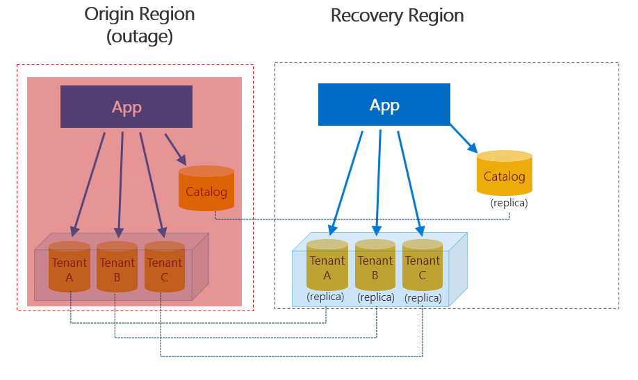
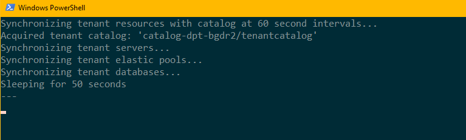
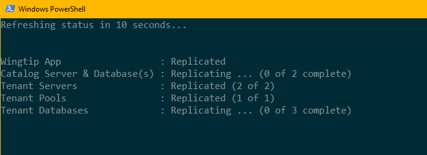
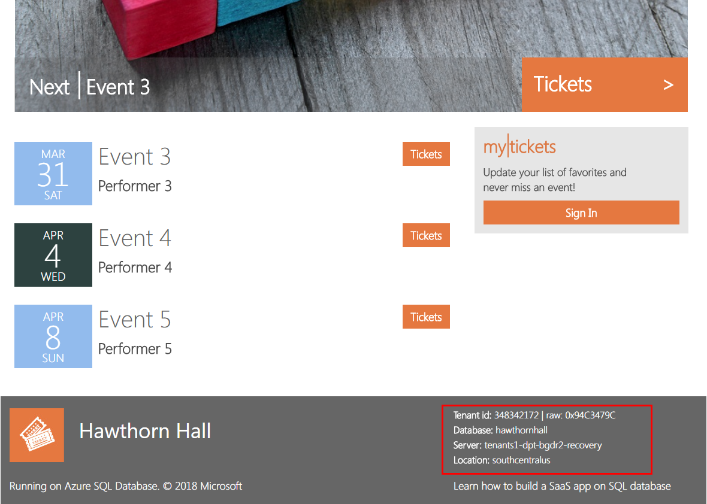
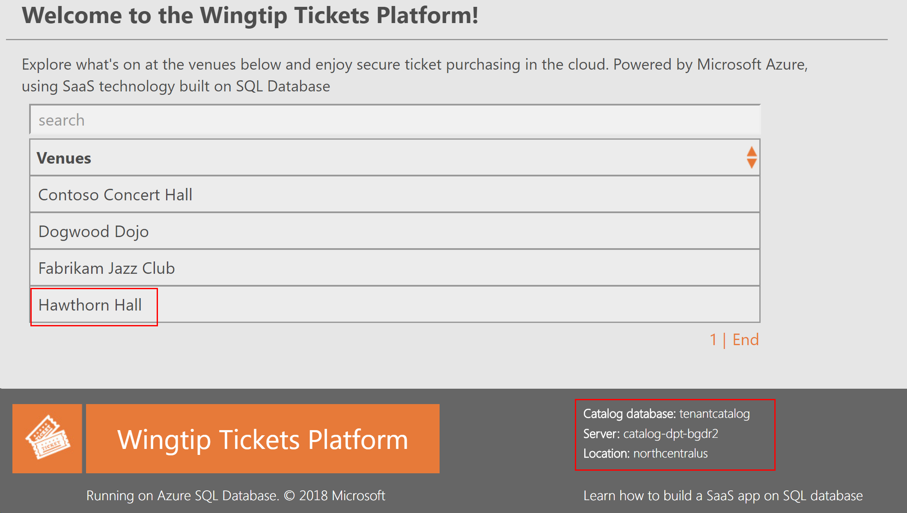

# Recover a multi-tenant SaaS application using database geo-replicas

In this tutorial, you explore a full disaster recovery scenario for a multi-tenant SaaS application implemented using the database-per-tenant model. You use [geo-replication](https://docs.microsoft.com/en-us/azure/sql-database/sql-database-geo-replication-overview) to create replicas for the catalog and tenant databases in an alternate recovery region prior to an outage. During an outage, you failover to these replicas to resume normal business operations. After the outage is resolved, you failback to the original production region after any data modified in the recovery region is seeded back to the original region.

This tutorial explores both restore and repatriation workflows. You'll learn how to:

* Sync database and elastic pool configuration info into the tenant catalog
* Set up replicas in a 'recovery' region, comprising application, servers, and pools    
* Recover catalog and tenant databases using _geo-replication_
* Repatriate the tenant catalog and changed tenant databases using _geo-replication_ after the outage is resolved
* Update the catalog as each database is repatriated to track the current location of the active copy of each tenant's database
* Ensure the application and tenant database are always colocated in the same Azure region to reduce latency  
 

Before starting this tutorial, make sure the following prerequisites are completed:
* The Wingtip Tickets SaaS database per tenant app is deployed. To deploy in less than five minutes, see [Deploy and explore the Wingtip Tickets SaaS database per tenant application](saas-dbpertenant-get-started-deploy.md)  
* Azure PowerShell is installed. For details, see [Getting started with Azure PowerShell](https://docs.microsoft.com/powershell/azure/get-started-azureps)

## Introduction to the geo-replication recovery pattern

 
Disaster recovery (DR) is an important consideration for many applications, whether for compliance reasons or business continuity. Should there be a prolonged service outage, a well-prepared DR plan can minimize business disruption. A DR plan based on geo-replication must accomplish several goals:
 * Replicate catalog and tenant databases in order to reserve all needed capacity in the recovery region.
 * It must be possible to cancel the restore process in mid-flight if the original region comes back on-line.
 * Enable tenant provisioning quickly so new tenant onboarding can restart as soon as possible  
 * Be optimized for restoring tenants in priority order
 * Be optimized for getting tenants online as soon as possible by doing steps in parallel where practical
 * Be resilient to failure, restartable, and idempotent
 * Repatriate databases to their original region with minimal impact to tenants when the outage is resolved.  

> Note: the application is recovered into the _paired region_ of the region in which the application is deployed. For more information, see [Azure paired regions](https://docs.microsoft.com/en-us/azure/best-practices-availability-paired-regions). 

In this tutorial, these challenges are addressed using features of Azure SQL Database and the Azure platform:

* [Azure Resource Management (ARM) templates](https://docs.microsoft.com/azure/azure-resource-manager/resource-manager-create-first-template), to reserve all needed capacity as quickly as possible. ARM templates are used to provision a mirror image of the production servers and elastic pools in the recovery region.
* [Asynchronous restore operations](https://docs.microsoft.com/azure/azure-resource-manager/resource-manager-async-operations) sent in tenant-priority order, which are queued for each pool by the system and processed in batches so the pool is not overloaded. These operations can be canceled before or during execution if necessary.
* [Shard management recovery features](https://docs.microsoft.com/azure/sql-database/sql-database-elastic-database-recovery-manager), to change database entries in the catalog during recovery and repatriation. These features allow the app to connect to tenant databases regardless of location without reconfiguring the app.
* [Azure SQL Server DNS alias](https://docs.microsoft.com/azure/sql-database/dns-alias-overview), to enable seamless provisioning of new tenants regardless of which region the app is operating in. DNS aliases are also used to allow the catalog sync process to connect to the active catalog regardless of its location.
* [Geo-replication](https://docs.microsoft.com/azure/sql-database/sql-database-geo-replication-overview), to create replicas that will be activated during an outage. The replicas also seed changed data back to the original region to ensure that there is no data loss and minimal impact during repatriation. 

## Get the disaster recovery management scripts 

> IMPORTANT.  Like all the Wingtip Tickets management scripts, the DR scripts are sample quality and are not to be used in production. 

The recovery scripts used in this tutorial and Wingtip application source code are available in the [Wingtip Tickets SaaS database per tenant GitHub repository](https://github.com/Microsoft/WingtipTicketsSaaS-DbPerTenant/). Check out the [general guidance](saas-tenancy-wingtip-app-guidance-tips.md) for steps to download and unblock the Wingtip Tickets management scripts.

In this tutorial, you first use geo-replication to create replicas of the Wingtip Tickets application and its databases in a different region. Then, you failover to this region to simulate recovering from an outage. When complete, the application is fully functional in the recovery region.

Later, in a separate repatriation step, you failover the catalog and tenant databases in the recovery region to the original region. The application and databases stay online and available throughout. When complete, the application is fully functional in the original region.

## Review the healthy state of the application

Before you start the recovery process, review the normal healthy state of the application.
1. In your web browser, open the Wingtip Tickets Events Hub (http://events.wingtip-dpt.&lt;user&gt;.trafficmanager.net - substitute &lt;user&gt; with your deployment's user value).
	* Scroll to the bottom of the page and notice the catalog server name and location in the footer. The location is the region in which you deployed the app.
	*TIP: Hover the mouse over the location to enlarge the display.*
	

2. Click on the Contoso Concert Hall tenant and open its event page.
	* In the footer, notice the tenant server name. The location will be the same as the catalog server's location.

3. In the [Azure portal](https://portal.azure.com), open the resource group in which the app is deployed
	* Notice the region in which the servers are deployed. 

## Sync tenant configuration into catalog

In this task, you start a process to sync the configuration of the servers, elastic pools, and databases into the tenant catalog.  The process keeps this information up-to-date in the catalog so it can be used later to create replicas in the recovery region. This information is also used to keep track of the recovery state of tenant resources

> IMPORTANT.  For simplicity, the sync process and other long running recovery and repatriation processes are implemented in these samples as local Powershell jobs or sessions that run under your client user login. The authentication tokens issued when you login will expire after several hours and the jobs will then fail. In a production scenario, long-running processes should be implemented as reliable Azure services of some kind, running under a service principal. See [Use Azure PowerShell to create a service principal with a certificate](https://docs.microsoft.com/en-us/azure/azure-resource-manager/resource-group-authenticate-service-principal).

1. In the _PowerShell ISE_, open the ...\Learning Modules\UserConfig.psm1 file. Replace `<resourcegroup>` and `<user>` on lines 10 and 11  with the value used when you deployed the app.  Save the file!

2. In the *PowerShell ISE*, open the ...\Learning Modules\Business Continuity and Disaster Recovery\DR-FailoverToReplica\Demo-FailoverToReplica.ps1 script and set the following values:
	* **$DemoScenario = 1, Start a background job that syncs tenant server, and pool configuration info into the catalog**

3. Press **F5** to run the sync script. A new PowerShell session is opened to sync the configuration of tenant resources.

Leave the PowerShell window running in the background and continue with the rest of the tutorial. 

> Note: The sync process connects to the catalog via a DNS alias. This alias is modified during restore and repatriation to point to the active catalog. The sync process keeps the catalog up-to-date with any database or pool configuration changes made in the recovery region.  During repatriation, these changes are applied to the equivalent resources in the original region.

## Create replicas in the recovery region

In this task, you start a process to create a duplicate app instance and database replicas in a recovery region.

> Note: This task is included as part of the tutorial because the initial Wingtip deployment is created in a single region for simplicity. In a production scenario, you would use a multi-region deployment that deploys app and databases along with their replicas. See [Designing highly available services using Azure SQL Database](https://docs.microsoft.com/azure/sql-database/sql-database-designing-cloud-solutions-for-disaster-recovery#scenario-1-using-two-azure-regions-for-business-continuity-with-minimal-downtime)

1. In the *PowerShell ISE*, open the ...\Learning Modules\Business Continuity and Disaster Recovery\DR-FailoverToReplica\Demo-FailoverToReplica.ps1 script and set the following values:
	* **$DemoScenario = 2, Start a background job to create replicas for an existing Wingtip deployment**

2. Press **F5** to run the script. A new PowerShell session is opened to create the replicas.
  

## Failover the application into the recovery region

### Geo-replication disaster recovery process overview
The failover DR script performs the following tasks:

1. Disables the Traffic Manager endpoint for the web app in the original region. Disabling the endpoint prevents users from connecting to the app in an invalid state should the original region come online during recovery.

2. Force-failover the catalog database to the recovery region, and update the _activecatalog_ alias to point to the restored catalog server. Changing the catalog alias ensures the catalog sync process always syncs to the active catalog.

3. Updates the _newtenant_ alias to point to the tenants' server in the recovery region. Changing this alias ensures that the databases for any new tenants will be provisioned in the recovery region. 

4. Marks all existing tenants in the recovery catalog as offline to prevent access to tenant databases before they are failed over.

5. Enables the Traffic Manager endpoint for the web app in the recovery region. This allows the application to provision new tenants. At this stage, existing tenants are still offline.

6. Submits batches of requests to failover databases in priority order.
	* Batches are organized so that databases are failed over in parallel across all pools.
	* Failover requests are submitted asynchronously so they are submitted quickly and queued for execution in each pool.

7. Monitors the SQL database service to determine when databases have been failed over. Once a tenant database is failed over, it updates the catalog to record the recovery state of the tenant database and mark the tenant as online.
	* Tenant databases can be accessed by the application as soon as they're marked online in the catalog.
	* A sum of rowversion values in the tenant database is stored in the catalog. This generates a fingerprint that allows the repatriation process to determine if the database has been updated in the recovery region.

### Run the script to failover to the recovery region

>To explore the code for the recovery jobs, review the PowerShell scripts in the ...\Learning Modules\Business Continuity and Disaster Recovery\DR-FailoverToReplica\RecoveryJobs folder.

Now imagine there is an outage in the region in which the application is deployed and run the recovery script:

1. In the *PowerShell ISE*, open the ...\Learning Modules\Business Continuity and Disaster Recovery\DR-FailoverToReplica\Demo-FailoverToReplica.ps1 script and set the following values:
	* **$DemoScenario = 3, Recover the app into a recovery region by failing over to replicas**

2. Press **F5** to run the script.  
	* The script opens in a new PowerShell window and then starts a series of PowerShell jobs that run in parallel. These jobs failover tenant databases to the recovery region.
	* The recovery region is the _paired region_ associated with the Azure region in which you deployed the application. For more information, see [Azure paired regions](https://docs.microsoft.com/en-us/azure/best-practices-availability-paired-regions). 

3. Monitor the status of the recovery process in the PowerShell window.

### Review the application state during recovery
While the application endpoint is disabled in Traffic Manager, the application is unavailable. After the catalog is restored and all the tenants marked offline, the application is brought back online. Although the application is available, tenants appear offline in the events hub until their databases are failed over. It's important to design your application to handle offline tenant databases.

1. After the catalog database has been recovered but before the tenants are back online, refresh the Wingtip Tickets Events Hub in your web browser.
	* In the footer, notice that the catalog server name now has a _-recovery_ suffix and is located in the recovery region.
	* Notice that tenants that are not yet restored are marked as offline and are not selectable.   
 
		

	* If you open an offline tenant's Events page directly it displays a 'tenant offline' notification. For example, if Contoso Concert Hall is offline, try to open http://events.wingtip-dpt.&lt;user&gt;.trafficmanager.net/contosoconcerthall 
	 

## Provision a new tenant in the recovery region
Even before the existing tenant databases are restored, you can provision new tenants in the recovery region. 

1. In the *PowerShell ISE*, open the ...\Learning Modules\Business Continuity and Disaster Recovery\DR-FailoverToReplica\Demo-FailoverToReplica.ps1 script and set the following property:
	* **$DemoScenario = 4, Provision a new tenant in the recovery region**

2. Press **F5** to run the script and provision the new tenant. 

3. The Hawthorn Hall events page opens in the browser when it completes. Note from the footer that the Hawthorn Hall database is provisioned in the recovery region.
	 

4. In the browser, refresh the Wingtip Tickets Events Hub page to see Hawthorn Hall included. 
	* If you provisioned Hawthorn Hall without waiting for the other tenants to restore, other tenants may still be offline.

## Review the recovered state of the application

When the recovery process completes, the application and all tenants are fully functional in the recovery region. 

1. Once the display in the PowerShell console window indicates all the tenants are recovered, refresh the Events Hub.  The tenants will all appear online, including the new tenant, Hawthorn Hall.

	

2. Click on Contoso Concert Hall and open its Events page.
	* In the footer, notice the database is located on the recovery server located in the recovery region.

3. In the [Azure portal](https://portal.azure.com), open the list of resource groups.  
	* Notice the resource group that you deployed, plus the recovery resource group, with the _-recovery_ suffix.  The recovery resource group contains all the resources created during the recovery process, plus new resources created during the outage.  

4. Open the recovery resource group and notice the following items:
	* The recovery versions of the catalog and tenants1 servers, with _-recovery_ suffix.  The restored catalog and tenant databases on these servers all have the names used in the original region.

	* The _tenants2-dpt-&lt;user&gt;-recovery_ SQL server.  This server is used for provisioning new tenants during the outage.
	* 	The App Service named, _events-wingtip-dpt-&lt;recoveryregion&gt;-&lt;user&gt_;, which is the recovery instance of the Events app. 

		
	
5. Open the _tenants2-dpt-&lt;user&gt;-recovery_ SQL server.  Notice it contains the database _hawthornhall_ and the elastic pool, _Pool1_.  The _hawthornhall_ database is configured as an elastic database in _Pool1_ elastic pool.

## Change tenant data 
In this task, you update one of the tenant databases. 

1. In your browser, find the events list for the Contoso Concert Hall and note the last event name.
2. In the *PowerShell ISE*, in the ...\Learning Modules\Business Continuity and Disaster Recovery\DR-FailoverToReplica\Demo-FailoverToReplica.ps1 script, set the following value:
	* **$DemoScenario = 5** Delete an event from a tenant in the recovery region
3. Press **F5** to execute the script
4. Refresh the Contoso Concert Hall events page (http://events.wingtip-dpt.&lt;user&gt;.trafficmanager.net/contosoconcerthall - substitute &lt;user&gt; with your deployment's user value) and notice that the last event has been deleted.

## Repatriate the application to its original production region

This task repatriates the application to its original region. In a real scenario, you would initiate repatriation when the outage is resolved.

### Repatriation process overview

The repatriation process:
1. Reactivates tenant databases in the original region that have not been restored to the recovery region and restored databases that have not been changed. These databases will be exactly as last accessed by their tenants and are immediately available to the application.
1. Causes new tenant onboarding to occur in the original region so no further tenant databases are created in the recovery region.
1. Cancels any outstanding or in-flight database restore requests.
1. Copies all restored databases _that have been changed post-restore_ to the original region.
1. Cleans up resources created in the recovery region during the restore process.

To limit the number of tenant databases that need to be repatriated, steps 1-3 are done promptly.  

It's important that step 4 causes no further disruption to tenants and no data loss. To achieve this goal, the process uses _geo-replication_ to 'move' changed databases to the original region.

Once each database being repatriated has been replicated to the original region, it is failed over.  Failover effectively moves the database to the original region. When the database fails over, any open connections are dropped and the database is unavailable for a few seconds. Applications should be written with retry logic to ensure they connect again.  Although this brief disconnect is often not noticed, you may choose to repatriate databases out of business hours. 

Once a database is failed over to its replica in the production region, the restored database in the recovery region can be deleted. The database in the production region then relies on geo-restore for DR protection again. 

In step 5, resources in the recovery region, including the recovery servers and pools, are deleted.      

### Run the repatriation script
Now let's imagine the outage is resolved and run the repatriation script.

1. In the *PowerShell ISE*, in the ...\Learning Modules\Business Continuity and Disaster Recovery\DR-FailoverToReplica\Demo-FailoverToReplica.ps1 script.

2. Verify that the Catalog Sync process is still running in its PowerShell instance.  If necessary, restart it by setting:
	* **$DemoScenario = 1**, Start synchronizing tenant server, pool, and database configuration info into the catalog
	* Press **F5** to run the script.

3.  Then to start the repatriation process, set:
	* **$DemoScenario = 6**, Repatriate the app into its original region
	* Press **F5** to run the recovery script in a new PowerShell window.  Repatriation will take several minutes and can be monitored in the PowerShell window.
	

4. While the script is running, refresh the Events Hub page (http://events.wingtip-dpt.&lt;user&gt;.trafficmanager.net)
	* Notice that all the tenants are online and accessible throughout this process.

5. After the repatriation is complete, refresh the Events hub and open the events page for Hawthorn Hall. Notice that this database has been repatriated to the original region.
	

## Designing the application to ensure app and database are colocated 
The application is designed so that it always connects from an instance in the same region as the tenant database. This design reduces latency between the application and the database. This optimization assumes the app-to-database interaction is chattier than the user-to-app interaction.  

Tenant databases may be spread across recovery and original regions for some time during repatriation.  For each database, the app looks up the region in which the database is located by doing a DNS lookup on the tenant server name. In SQL Database, the server name is an alias. The aliased server name contains the region name. If the application instance isn't in the same region as the database, it redirects to the application instance in the same region as the database server.  Redirecting to instance in the same region as the database minimizes latency between app and database. 

## Next steps

In this tutorial you learned how to:

* Sync tenant configuration data into the tenant catalog database
* Use tenant aliases to ensure no application changes are required during the recovery process 
* Failover Azure SQL servers, elastic pools, and Azure SQL databases into a recovery region
* Repatriate tenant databases to the original production region

## Additional resources

* [Additional tutorials that build upon the Wingtip SaaS application](https://docs.microsoft.com/en-us/azure/sql-database/sql-database-wtp-overview#sql-database-wingtip-saas-tutorials)