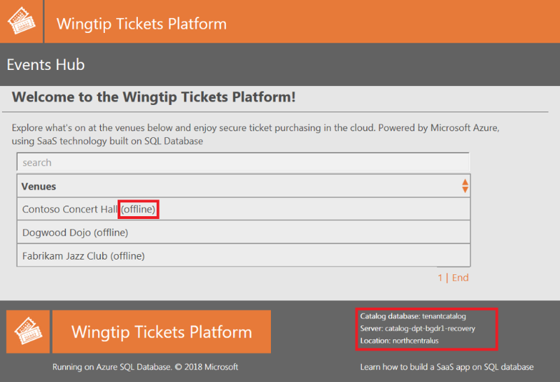
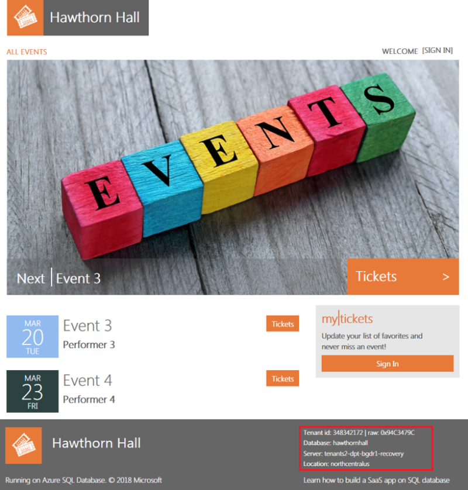
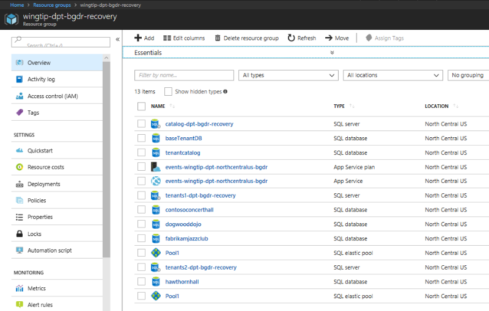
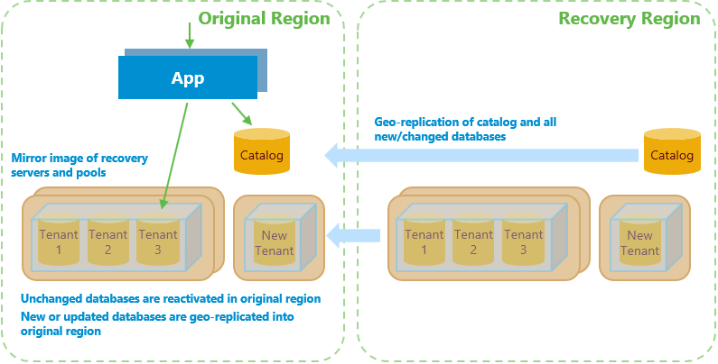

# Use geo-restore to recover a multitenant SaaS application from database backups

This tutorial explores a full disaster recovery scenario for a multitenant SaaS application implemented with the database per tenant model. You use [geo-restore](sql-database-recovery-using-backups.md) to recover the catalog and tenant databases from automatically maintained geo-redundant backups into an alternate recovery region. After the outage is resolved, you use [geo-replication](sql-database-geo-replication-overview.md) to repatriate changed databases to their original region.

Geo-restore is the lowest-cost disaster recovery solution for Azure SQL Database. However, restoring from geo-redundant backups can result in data loss of up to one hour. It can take considerable time, depending on the size of each database. 

> [!NOTE]
> Recover applications with the lowest possible RPO and RTO by using geo-replication instead of geo-restore.

This tutorial explores both restore and repatriation workflows. You learn how to:
> [!div class="checklist"]
> 
> * Sync database and elastic pool configuration info into the tenant catalog.
> * Set up a mirror image environment in a recovery region that includes application, servers, and pools.   
> * Recover catalog and tenant databases by using geo-restore.
> * Use geo-replication to repatriate the tenant catalog and changed tenant databases after the outage is resolved.
> * Update the catalog as each database is restored (or repatriated) to track the current location of the active copy of each tenant's database.
> * Ensure that the application and tenant database are always co-located in the same Azure region to reduce latency. 
 

Before you start this tutorial, complete the following prerequisites:
* Deploy the Wingtip Tickets SaaS database per tenant app. To deploy in less than five minutes, see [Deploy and explore the Wingtip Tickets SaaS database per tenant application](saas-dbpertenant-get-started-deploy.md). 
* Install Azure PowerShell. For details, see [Getting started with Azure PowerShell](https://docs.microsoft.com/powershell/azure/get-started-azureps).

## Introduction to the geo-restore recovery pattern

Disaster recovery (DR) is an important consideration for many applications, whether for compliance reasons or business continuity. If there's a prolonged service outage, a well-prepared DR plan can minimize business disruption. A DR plan based on geo-restore must accomplish several goals:
 * Reserve all needed capacity in the chosen recovery region as quickly as possible to ensure that it's available to restore tenant databases.
 * Establish a mirror image recovery environment that reflects the original pool and database configuration. 
 * Allow cancellation of the restore process in mid-flight if the original region comes back online.
 * Enable tenant provisioning quickly so new tenant onboarding can restart as soon as possible.
 * Be optimized to restore tenants in priority order.
 * Be optimized to get tenants online as soon as possible by doing steps in parallel where practical.
 * Be resilient to failure, restartable, and idempotent.
 * Repatriate databases to their original region with minimal impact to tenants when the outage is resolved.  

> [!NOTE]
> The application is recovered into the paired region of the region in which the application is deployed. For more information, see [Azure paired regions](https://docs.microsoft.com/azure/best-practices-availability-paired-regions).   

This tutorial uses features of Azure SQL Database and the Azure platform to address these challenges:

* [Azure Resource Manager templates](https://docs.microsoft.com/azure/azure-resource-manager/resource-manager-create-first-template), to reserve all needed capacity as quickly as possible. Azure Resource Manager templates are used to provision a mirror image of the original servers and elastic pools in the recovery region. A separate server and pool are also created for provisioning new tenants.
* [Elastic Database Client Library](sql-database-elastic-database-client-library.md) (EDCL), to create and maintain a tenant database catalog. The extended catalog includes periodically refreshed pool and database configuration information.
* [Shard management recovery features](sql-database-elastic-database-recovery-manager.md) of the EDCL, to maintain database location entries in the catalog during recovery and repatriation.  
* [Geo-restore](sql-database-disaster-recovery.md), to recover the catalog and tenant databases from automatically maintained geo-redundant backups. 
* [Asynchronous restore operations](https://docs.microsoft.com/azure/azure-resource-manager/resource-manager-async-operations), sent in tenant-priority order, are queued for each pool by the system and processed in batches so the pool isn't overloaded. These operations can be canceled before or during execution if necessary.   
* [Geo-replication](sql-database-geo-replication-overview.md), to repatriate databases to the original region after the outage. There is no data loss and minimal impact on the tenant when you use geo-replication.
* [SQL server DNS aliases](dns-alias-overview.md), to allow the catalog sync process to connect to the active catalog regardless of its location.  

## Get the disaster recovery scripts

The DR scripts used in this tutorial are available in the [Wingtip Tickets SaaS database per tenant GitHub repository](https://github.com/Microsoft/WingtipTicketsSaaS-DbPerTenant). Check out the [general guidance](saas-tenancy-wingtip-app-guidance-tips.md) for steps to download and unblock the Wingtip Tickets management scripts.

> [!IMPORTANT]
> Like all the Wingtip Tickets management scripts, the DR scripts are sample quality and are not to be used in production.

## Review the healthy state of the application
Before you start the recovery process, review the normal healthy state of the application.

1. In your web browser, open the Wingtip Tickets events hub (http://events.wingtip-dpt.&lt;user&gt;.trafficmanager.net, replace &lt;user&gt; with your deployment's user value).
	
   Scroll to the bottom of the page and notice the catalog server name and location in the footer. The location is the region in which you deployed the app.	

   > [!TIP]
   > Hover the mouse over the location to enlarge the display.

   

2. Select the Contoso Concert Hall tenant and open its event page.

   In the footer, notice the tenant's server name. The location is the same as the catalog server's location.

   	

3. In the [Azure portal](https://portal.azure.com), review and open the resource group in which you deployed the app.

   Notice the resources and the region in which the app service components and SQL Database servers are deployed.

## Sync the tenant configuration into the catalog

In this task, you start a process to sync the configuration of the servers, elastic pools, and databases into the tenant catalog. This information is used later to configure a mirror image environment in the recovery region.

> [!IMPORTANT]
> For simplicity, the sync process and other long-running recovery and repatriation processes are implemented in these samples as local PowerShell jobs or sessions that run under your client user login. The authentication tokens issued when you log in expire after several hours, and the jobs will then fail. 
> In a production scenario, long-running processes should be implemented as reliable Azure services of some kind, running under a service principal. See [Use Azure PowerShell to create a service principal with a certificate](https://docs.microsoft.com/azure/azure-resource-manager/resource-group-authenticate-service-principal). 

1. In the PowerShell ISE, open the ...\Learning Modules\UserConfig.psm1 file. Replace `<resourcegroup>` and `<user>` on lines 10 and 11 with the value used when you deployed the app. Save the file.

2. In the PowerShell ISE, open the ...\Learning Modules\Business Continuity and Disaster Recovery\DR-RestoreFromBackup\Demo-RestoreFromBackup.ps1 script.

	In this tutorial, you run each of the scenarios in this PowerShell script, so keep this file open.

3. Set the following:

	$DemoScenario = 1: Start a background job that syncs tenant server and pool configuration info into the catalog.

4. To run the sync script, select F5. 

	This information is used later to ensure that recovery creates a mirror image of the servers, pools, and databases in the recovery region.  

	

Leave the PowerShell window running in the background and continue with the rest of this tutorial.

> [!NOTE]
> The sync process connects to the catalog via a DNS alias. The alias is modified during restore and repatriation to point to the active catalog. The sync process keeps the catalog up to date with any database or pool configuration changes made in the recovery region. During repatriation, these changes are applied to the equivalent resources in the original region.

## Geo-restore recovery process overview

The geo-restore recovery process deploys the application and restores databases from backups into the recovery region.

The recovery process does the following:

1. Disables the Azure Traffic Manager endpoint for the web app in the original region. Disabling the endpoint prevents users from connecting to the app in an invalid state should the original region come online during recovery.

2. Provisions a recovery catalog server in the recovery region, geo-restores the catalog database, and updates the activecatalog alias to point to the restored catalog server. Changing the catalog alias ensures that the catalog sync process always syncs to the active catalog.

3. Marks all existing tenants in the recovery catalog as offline to prevent access to tenant databases before they are restored.

4. Provisions an instance of the app in the recovery region and configures it to use the restored catalog in that region. To keep latency to a minimum, the sample app is designed to always connect to a tenant database in the same region.

5. Provisions a server and elastic pool in which new tenants are provisioned. Creating these resources ensures that provisioning new tenants doesn't interfere with the recovery of existing tenants.

6. Updates the new tenant alias to point to the server for new tenant databases in the recovery region. Changing this alias ensures that databases for any new tenants are provisioned in the recovery region.
		
7. Provisions servers and elastic pools in the recovery region for restoring tenant databases. These servers and pools are a mirror image of the configuration in the original region. Provisioning pools up front reserves the capacity needed to restore all the databases.

	An outage in a region might place significant pressure on the resources available in the paired region. If you rely on geo-restore for DR, then reserving resources quickly is recommended. Consider geo-replication if it's critical that an application is recovered in a specific region. 

8. Enables the Traffic Manager endpoint for the web app in the recovery region. Enabling this endpoint allows the application to provision new tenants. At this stage, existing tenants are still offline.

9. Submits batches of requests to restore databases in priority order. 

	* Batches are organized so that databases are restored in parallel across all pools.  

	* Restore requests are submitted asynchronously so they are submitted quickly and queued for execution in each pool.

	* Because restore requests are processed in parallel across all pools, it's better to distribute important tenants across many pools. 

10. Monitors the SQL Database service to determine when databases are restored. After a tenant database is restored, it's marked online in the catalog, and a rowversion sum for the tenant database is recorded. 

	* Tenant databases can be accessed by the application as soon as they're marked online in the catalog.

	* A sum of rowversion values in the tenant database is stored in the catalog. This sum acts as a fingerprint that allows the repatriation process to determine if the database was updated in the recovery region.   	 

## Run the recovery script

> [!IMPORTANT]
> This tutorial restores databases from geo-redundant backups. Although these backups are typically available within 10 minutes, it can take up to an hour. The script pauses until they're available.

Imagine there's an outage in the region in which the application is deployed, and run the recovery script:

1. In the PowerShell ISE, in the ...\Learning Modules\Business Continuity and Disaster Recovery\DR-RestoreFromBackup\Demo-RestoreFromBackup.ps1 script, set the following value:

	$DemoScenario = 2: Recover the app into a recovery region by restoring from geo-redundant backups.

2. To run the script, select F5.  

	* The script opens in a new PowerShell window and then starts a set of PowerShell jobs that run in parallel. These jobs restore servers, pools, and databases to the recovery region.

	* The recovery region is the paired region associated with the Azure region in which you deployed the application. For more information, see [Azure paired regions](https://docs.microsoft.com/azure/best-practices-availability-paired-regions). 

3. Monitor the status of the recovery process in the PowerShell window.

	

> [!NOTE]
> To explore the code for the recovery jobs, review the PowerShell scripts in the ...\Learning Modules\Business Continuity and Disaster Recovery\DR-RestoreFromBackup\RecoveryJobs folder.

## Review the application state during recovery
While the application endpoint is disabled in Traffic Manager, the application is unavailable. The catalog is restored, and all the tenants are marked offline. The application endpoint in the recovery region is then enabled, and the application is back online. Although the application is available, tenants appear offline in the events hub until their databases are restored. It's important to design your application to handle offline tenant databases.

* After the catalog database has been recovered but before the tenants are back online, refresh the Wingtip Tickets events hub in your web browser.

  * In the footer, notice that the catalog server name now has a -recovery suffix and is located in the recovery region.

  * Notice that tenants that are not yet restored are marked as offline and are not selectable.   
 
		

  * If you open a tenant's events page directly while the tenant is offline, the page displays a tenant offline notification. For example, if Contoso Concert Hall is offline, try to open http://events.wingtip-dpt.&lt;user&gt;.trafficmanager.net/contosoconcerthall.

	

## Provision a new tenant in the recovery region
Even before tenant databases are restored, you can provision new tenants in the recovery region. New tenant databases provisioned in the recovery region are repatriated with the recovered databases later.   

1. In the PowerShell ISE, in the ...\Learning Modules\Business Continuity and Disaster Recovery\DR-RestoreFromBackup\Demo-RestoreFromBackup.ps1 script, set the following property:

	$DemoScenario = 3: Provision a new tenant in the recovery region.

2. To run the script, select F5.

3. The Hawthorn Hall events page opens in the browser when provisioning finishes. 

	Notice that the Hawthorn Hall database is located in the recovery region.

	

4. In the browser, refresh the Wingtip Tickets events hub page to see Hawthorn Hall included. 

	If you provisioned Hawthorn Hall without waiting for the other tenants to restore, other tenants might still be offline.

## Review the recovered state of the application

When the recovery process finishes, the application and all tenants are fully functional in the recovery region. 

1. After the display in the PowerShell console window indicates all the tenants are recovered, refresh the events hub. 

	The tenants all appear online, including the new tenant, Hawthorn Hall.

	

2. Click on Contoso Concert Hall and open its events page. 

	In the footer, notice that the database is located on the recovery server located in the recovery region.

	

3. In the [Azure portal](https://portal.azure.com), open the list of resource groups.  

	Notice the resource group that you deployed, plus the recovery resource group, with the -recovery suffix. The recovery resource group contains all the resources created during the recovery process, plus new resources created during the outage. 

4. Open the recovery resource group and notice the following items:

   * The recovery versions of the catalog and tenants1 servers, with the -recovery suffix. The restored catalog and tenant databases on these servers all have the names used in the original region.

   * The tenants2-dpt-&lt;user&gt;-recovery SQL server. This server is used for provisioning new tenants during the outage.

   * The app service named events-wingtip-dpt-&lt;recoveryregion&gt;-&lt;user&gt;, which is the recovery instance of the events app.

      
	
5. Open the tenants2-dpt-&lt;user&gt;-recovery SQL server. Notice that it contains the database hawthornhall and the elastic pool Pool1. The hawthornhall database is configured as an elastic database in the Pool1 elastic pool.

## Change the tenant data 
In this task, you update one of the restored tenant databases. The repatriation process copies restored databases that have been changed to the original region. 

1. In your browser, find the events list for the Contoso Concert Hall, scroll through the events, and notice the last event, Seriously Strauss.

2. In the PowerShell ISE, in the ...\Learning Modules\Business Continuity and Disaster Recovery\DR-RestoreFromBackup\Demo-RestoreFromBackup.ps1 script, set the following value:

	$DemoScenario = 4: Delete an event from a tenant in the recovery region.

3. To execute the script, select F5.

4. Refresh the Contoso Concert Hall events page (http://events.wingtip-dpt.&lt;user&gt;.trafficmanager.net/contosoconcerthall), and notice that the event Seriously Strauss is missing.

At this point in the tutorial, you have recovered the application, which is now running in the recovery region. You have provisioned a new tenant in the recovery region and modified data of one of the restored tenants.  

> [!NOTE]
> Other tutorials in the sample are not designed to run with the app in the recovery state. If you want to explore other tutorials, be sure to repatriate the application first.

## Repatriation process overview

The repatriation process reverts the application and its databases to its original region after an outage is resolved.

	

The process:

1. Stops any ongoing restore activity and cancels any outstanding or in-flight database restore requests.

2. Reactivates in the original region tenant databases that have not been changed since the outage. These databases include those not recovered yet and those recovered but not changed afterward. The reactivated databases are exactly as last accessed by their tenants.

3. Provisions a mirror image of the new tenant's server and elastic pool in the original region. After this action is complete, the new tenant alias is updated to point to this server. Updating the alias causes new tenant onboarding to occur in the original region instead of the recovery region.

3. Uses geo-replication to move the catalog to the original region from the recovery region.

4. Updates pool configuration in the original region so it's consistent with changes that were made in the recovery region during the outage.

5. Creates the required servers and pools to host any new databases created during the outage.

6. Uses geo-replication to repatriate restored tenant databases that have been updated post-restore and all new tenant databases provisioned during the outage. 

7. Cleans up resources created in the recovery region during the restore process.

To limit the number of tenant databases that need to be repatriated, steps 1 to 3 are done promptly.  

Step 4 is only done if the catalog in the recovery region has been modified during the outage. The catalog is updated if new tenants are created or if any database or pool configuration is changed in the recovery region.

It's important that step 7 causes minimal disruption to tenants and no data is lost. To achieve this goal, the process uses geo-replication.

Before each database is geo-replicated, the corresponding database in the original region is deleted. The database in the recovery region is then geo-replicated, creating a secondary replica in the original region. After replication is complete, the tenant is marked offline in the catalog, which breaks any connections to the database in the recovery region. The database is then failed over, causing any pending transactions to process on the secondary so no data is lost. 

On failover, the database roles are reversed. The secondary in the original region becomes the primary read-write database, and the database in the recovery region becomes a read-only secondary. The tenant entry in the catalog is updated to reference the database in the original region, and the tenant is marked online. At this point, repatriation of the database is complete. 

Applications should be written with retry logic to ensure that they reconnect automatically when connections are broken. When they use the catalog to broker the reconnection, they connect to the repatriated database in the original region. Although the brief disconnect is often not noticed, you might choose to repatriate databases out of business hours.

After a database is repatriated, the secondary database in the recovery region can be deleted. The database in the original region then relies again on geo-restore for DR protection.

In step 8, resources in the recovery region, including the recovery servers and pools, are deleted.

## Run the repatriation script
Let's imagine the outage is resolved and run the repatriation script.

If you've followed the tutorial, the script immediately reactivates Fabrikam Jazz Club and Dogwood Dojo in the original region because they're unchanged. It then repatriates the new tenant, Hawthorn Hall, and Contoso Concert Hall because it has been modified. The script also repatriates the catalog, which was updated when Hawthorn Hall was provisioned.
  
1. In the PowerShell ISE, in the ...\Learning Modules\Business Continuity and Disaster Recovery\DR-RestoreFromBackup\Demo-RestoreFromBackup.ps1 script, verify that the Catalog Sync process is still running in its PowerShell instance. If necessary, restart it by setting:

	$DemoScenario = 1: Start synchronizing tenant server, pool, and database configuration info into the catalog.

	To run the script, select F5.

2.  Then to start the repatriation process, set:

	$DemoScenario = 5: Repatriate the app into its original region.

	To run the recovery script in a new PowerShell window, select F5. Repatriation takes several minutes and can be monitored in the PowerShell window.

3. While the script is running, refresh the events hub page (http://events.wingtip-dpt.&lt;user&gt;.trafficmanager.net).

	Notice that all the tenants are online and accessible throughout this process.

4. Select the Fabrikam Jazz Club to open it. If you didn't modify this tenant, notice from the footer that the server is already reverted to the original server.

5. Open or refresh the Contoso Concert Hall events page. Notice from the footer that, initially, the database is still on the -recovery server. 

6. Refresh the Contoso Concert Hall events page when the repatriation process finishes, and notice that the database is now in your original region.

7. Refresh the events hub again and open Hawthorn Hall. Notice that its database is also located in the original region. 

## Clean up recovery region resources after repatriation
After repatriation is complete, it's safe to delete the resources in the recovery region. 

> [!IMPORTANT]
> Delete these resources promptly to stop all billing for them.

The restore process creates all the recovery resources in a recovery resource group. The cleanup process deletes this resource group and removes all references to the resources from the catalog. 

1. In the PowerShell ISE, in the ...\Learning Modules\Business Continuity and Disaster Recovery\DR-RestoreFromBackup\Demo-RestoreFromBackup.ps1 script, set:
	
	$DemoScenario = 6: Delete obsolete resources from the recovery region.

2. To run the script, select F5.

After cleaning up the scripts, the application is back where it started. At this point, you can run the script again or try out other tutorials.

## Designing the application to ensure that the app and the database are co-located 
The application is designed to always connect from an instance in the same region as the tenant's database. This design reduces latency between the application and the database. This optimization assumes the app-to-database interaction is chattier than the user-to-app interaction.  

Tenant databases might be spread across recovery and original regions for some time during repatriation. For each database, the app looks up the region in which the database is located by doing a DNS lookup on the tenant server name. In SQL Database, the server name is an alias. The aliased server name contains the region name. If the application isn't in the same region as the database, it redirects to the instance in the same region as the database server. Redirecting to the instance in the same region as the database minimizes latency between the app and the database.  

## Next steps

In this tutorial, you learned how to:
> [!div class="checklist"]
> 
> * Use the tenant catalog to hold periodically refreshed configuration information, which allows a mirror image recovery environment to be created in another region.
> * Recover Azure SQL databases into the recovery region by using geo-restore.
> * Update the tenant catalog to reflect restored tenant database locations. 
> * Use a DNS alias to enable an application to connect to the tenant catalog throughout without reconfiguration.
> * Use geo-replication to repatriate recovered databases to their original region after an outage is resolved.

Try the [Disaster recovery for a multitenant SaaS application using database geo-replication](saas-dbpertenant-dr-geo-replication.md) tutorial to learn how to use geo-replication to dramatically reduce the time needed to recover a large-scale multitenant application.

## Additional resources

[Additional tutorials that build upon the Wingtip SaaS application](saas-dbpertenant-wingtip-app-overview.md#sql-database-wingtip-saas-tutorials)
