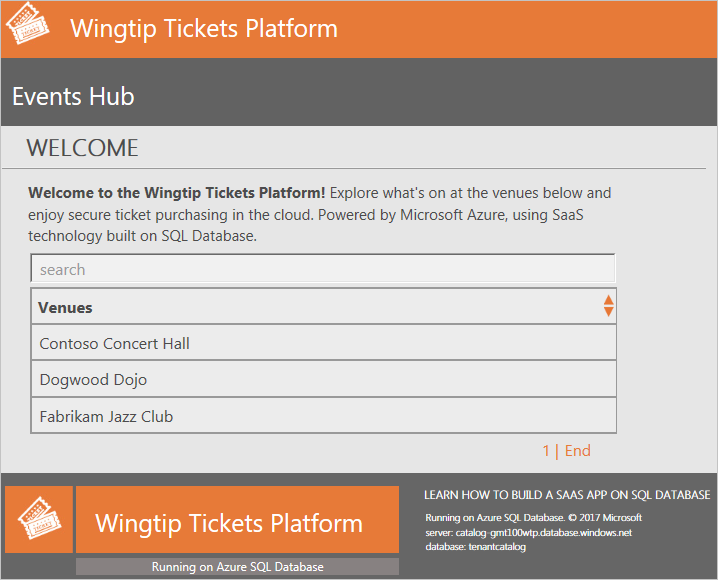
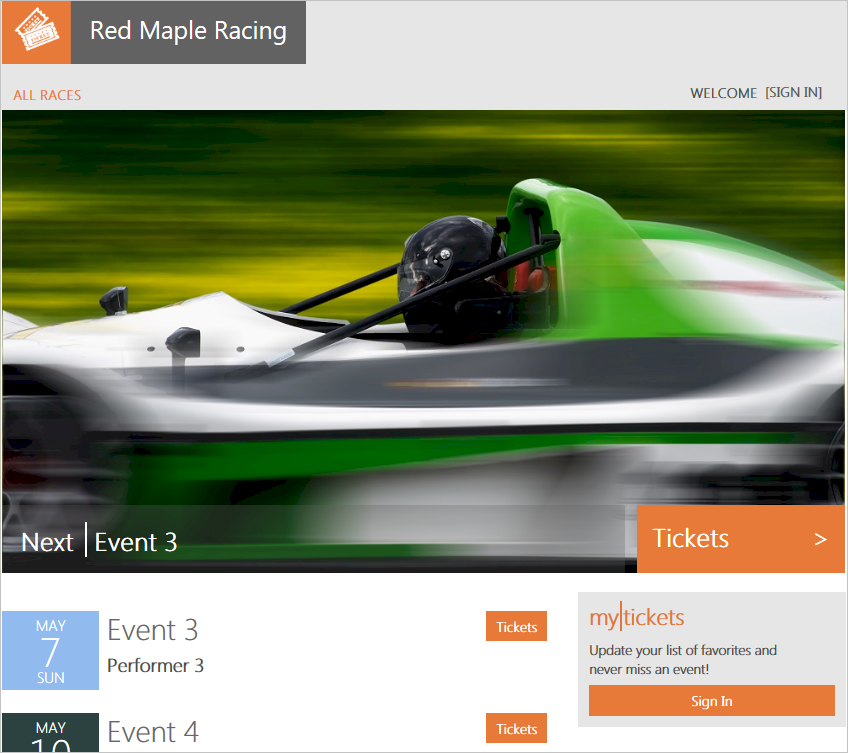

---
title: Database-per-tenant SaaS tutorial - Azure SQL Database | Microsoft Docs 
description: Deploy and explore the Wingtip Tickets SaaS multitenant application that demonstrates the database-per-tenant pattern and other SaaS patterns by using Azure SQL Database.
services: sql-database
ms.service: sql-database
ms.subservice: scenario
ms.custom: 
ms.devlang: 
ms.topic: conceptual
author: MightyPen
ms.author: genemi
ms.reviewer: sstein
manager: craigg
ms.date: 04/01/2018
---
# Deploy and explore a multitenant SaaS app that uses the database-per-tenant pattern with SQL Database

In this tutorial, you deploy and explore the Wingtip Tickets SaaS database-per-tenant application (Wingtip). The app uses a database-per-tenant pattern to store the data of multiple tenants. The app is designed to showcase features of Azure SQL Database that simplify how to enable SaaS scenarios.

Five minutes after you select **Deploy to Azure**, you have a multitenant SaaS application. The app includes a SQL database that runs in the cloud. The app is deployed with three sample tenants, each with its own database. All the databases are deployed into a SQL elastic pool. The app is deployed to your Azure subscription. You have full access to explore and work with the individual components of the app. The application C# source code and the management scripts are available in the [WingtipTicketsSaaS-DbPerTenant GitHub repo][github-wingtip-dpt].

In this tutorial you learn:

> [!div class="checklist"]
> - How to deploy the Wingtip SaaS application.
> - Where to get the application source code and management scripts.
> - About the servers, pools, and databases that make up the app.
> - How tenants are mapped to their data with the *catalog*.
> - How to provision a new tenant.
> - How to monitor tenant activity in the app.

A [series of related tutorials](saas-dbpertenant-wingtip-app-overview.md#sql-database-wingtip-saas-tutorials) offers to explore various SaaS design and management patterns. The tutorials build beyond this initial deployment. When you use the tutorials, you can examine the provided scripts to see how the different SaaS patterns are implemented. The scripts demonstrate how features of SQL Database simplify the development of SaaS applications.

## Prerequisites

To complete this tutorial, make sure Azure PowerShell is installed. For more information, see [Get started with Azure PowerShell](https://docs.microsoft.com/powershell/azure/get-started-azureps).

## Deploy the Wingtip Tickets SaaS application

#### Plan the names

In the steps of this section, you provide a user value that is used to make sure resource names are globally unique. You also provide a name for the resource group that contains all the resources created by a deployment of the app. For a fictitious person named Ann Finley, we suggest:

- **User**: *af1* is made up of Ann Finley's initials plus a digit. If you deploy the app a second time, use a different value. An example is af2.
- **Resource group**: *wingtip-dpt-af1* indicates this is the database-per-tenant app. Append the user name af1 to correlate the resource group name with the names of the resources it contains.

Choose your names now, and write them down. 

#### Steps

1. To open the Wingtip Tickets SaaS database-per-tenant deployment template in the Azure portal, select **Deploy to Azure**.

   

1. Enter values in the template for the required parameters.

    > [!IMPORTANT]
    > Some authentication and server firewalls are intentionally unsecured for demonstration purposes. We recommend that you create a new resource group. Don't use existing resource groups, servers, or pools. Don't use this application, scripts, or any deployed resources for production. Delete this resource group when you're finished with the application to stop related billing.

    - **Resource group**: Select **Create new**, and provide the unique name you chose earlier for the resource group. 
    - **Location**: Select a location from the drop-down list.
    - **User**: Use the user name value you chose earlier.

1. Deploy the application.

    a. Select to agree to the terms and conditions.

    b. Select **Purchase**.

1. To monitor deployment status, select **Notifications** (the bell icon to the right of the search box). Deploying the Wingtip Tickets SaaS app takes approximately five minutes.

   

## Download and unblock the Wingtip Tickets management scripts

While the application deploys, download the source code and management scripts.

> [!IMPORTANT]
> Executable contents (scripts and DLLs) might be blocked by Windows when .zip files are downloaded from an external source and extracted. Follow the steps to unblock the .zip file before you extract the scripts. Unblocking makes sure the scripts are allowed to run.

1. Browse to the [WingtipTicketsSaaS-DbPerTenant GitHub repo][github-wingtip-dpt].
1. Select **Clone or download**.
1. Select **Download ZIP**, and then save the file.
1. Right-click the **WingtipTicketsSaaS-DbPerTenant-master.zip** file, and then select **Properties**.
1. On the **General** tab, select **Unblock** > **Apply**.
1. Select **OK**, and extract the files

Scripts are located in the ...\\WingtipTicketsSaaS-DbPerTenant-master\\Learning Modules folder.

## Update the user configuration file for this deployment

Before you run any scripts, update the resource group and user values in the User Config file. Set these variables to the values you used during deployment.

1. In the PowerShell ISE, open ...\\Learning Modules\\**UserConfig.psm1** 
1. Update **ResourceGroupName** and **Name** with the specific values for your deployment (on lines 10 and 11 only).
1. Save the changes.

These values are referenced in nearly every script.

## Run the application

The app showcases venues that host events. Venue types include concert halls, jazz clubs, and sports clubs. In Wingtip Tickets, venues are registered as tenants. Being a tenant gives a venue an easy way to list events and to sell tickets to their customers. Each venue gets a personalized website to list their events and to sell tickets.

Internally in the app, each tenant gets a SQL database deployed into a SQL elastic pool.

A central **Events Hub** page provides a list of links to the tenants in your deployment.

1. Use the URL to open the Events Hub in your web browser: http://events.wingtip-dpt.&lt;user&gt;.trafficmanager.net. Substitute &lt;user&gt; with your deployment's user value.

    

1. Select **Fabrikam Jazz Club** in the Events Hub.

    

#### Azure Traffic Manager

The Wingtip application uses [*Azure Traffic Manager*](../traffic-manager/traffic-manager-overview.md) to control the distribution of incoming requests. The URL to access the events page for a specific tenant uses the following format:

- http://events.wingtip-dpt.&lt;user&gt;.trafficmanager.net/fabrikamjazzclub

    The parts of the preceding format are explained in the following table.

    | URL part        | Description       |
    | :-------------- | :---------------- |
    | http://events.wingtip-dpt | The events parts of the Wingtip app.   *-dpt* distinguishes the *database-per-tenant* implementation of Wingtip Tickets from other implementations. Examples are the *standalone* app-per-tenant (*-sa*) or *multitenant database* (*-mt*) implementations. |
    | .*&lt;user&gt;* | *af1* in the example. |
    | .trafficmanager.net/ | Traffic Manager, base URL. |
    | fabrikamjazzclub | Identifies the tenant named Fabrikam Jazz Club. |
    | &nbsp; | &nbsp; |

* The tenant name is parsed from the URL by the events app.
* The tenant name is used to create a key.
* The key is used to access the catalog to obtain the location of the tenant's database.
    - The catalog is implemented by using *shard map management*.
* The Events Hub uses extended metadata in the catalog to construct the list-of-events page URLs for each tenant.

In a production environment, typically you create a CNAME DNS record to [*point a company internet domain*](../traffic-manager/traffic-manager-point-internet-domain.md) to the Traffic Manager DNS name.

## Start generating load on the tenant databases

Now that the app is deployed, let's put it to work.

The *Demo-LoadGenerator* PowerShell script starts a workload that runs against all tenant databases. The real-world load on many SaaS apps is sporadic and unpredictable. To simulate this type of load, the generator produces a load with randomized spikes or bursts of activity on each tenant. The bursts occur at randomized intervals. It takes several minutes for the load pattern to emerge. Let the generator run for at least three or four minutes before you monitor the load.

1. In the PowerShell ISE, open the ...\\Learning Modules\\Utilities\\*Demo-LoadGenerator.ps1* script.
1. Press F5 to run the script and start the load generator. Leave the default parameter values for now.
1. Sign in to your Azure account, and select the subscription you want to use, if necessary.

The load generator script starts a background job for each database in the catalog and then stops. If you rerun the load generator script, it stops any background jobs that are running before it starts new ones.

#### Monitor the background jobs

If you want to control and monitor the background jobs, use the following cmdlets:

- `Get-Job`
- `Receive-Job`
- `Stop-Job`

#### Demo-LoadGenerator.ps1 actions

*Demo-LoadGenerator.ps1* mimics an active workload of customer transactions. The following steps describe the sequence of actions that *Demo-LoadGenerator.ps1* initiates:

1. *Demo-LoadGenerator.ps1* starts *LoadGenerator.ps1* in the foreground.

    - Both .ps1 files are stored under the folders Learning Modules\\Utilities\\.

1. *LoadGenerator.ps1* loops through all tenant databases in the catalog.

1. *LoadGenerator.ps1* starts a background PowerShell job for each tenant database:

    - By default, the background jobs run for 120 minutes.
    - Each job causes a CPU-based load on one tenant database by executing *sp_CpuLoadGenerator*. The intensity and duration of the load varies depending on `$DemoScenario`. 
    - *sp_CpuLoadGenerator* loops around a SQL SELECT statement that causes a high CPU load. The time interval between issues of the SELECT varies according to parameter values to create a controllable CPU load. Load levels and intervals are randomized to simulate more realistic loads.
    - This .sql file is stored under *WingtipTenantDB\\dbo\\StoredProcedures\\*.

1. If `$OneTime = $false`, the load generator starts the background jobs and then continues to run. Every 10 seconds, it monitors for any new tenants that are provisioned. If you set `$OneTime = $true`, the LoadGenerator starts the background jobs and then stops running in the foreground. For this tutorial, leave `$OneTime = $false`.

  Use Ctrl-C or Stop Operation Ctrl-Break if you want to stop or restart the load generator. 

  If you leave the load generator running in the foreground, use another PowerShell ISE instance to run other PowerShell scripts.

&nbsp;

Before you continue with the next section, leave the load generator running in the job-invoking state.

## Provision a new tenant

The initial deployment creates three sample tenants. Now you create another tenant to see the impact on the deployed application. In the Wingtip app, the workflow to provision new tenants is explained in the [Provision and catalog tutorial](saas-dbpertenant-provision-and-catalog.md). In this phase, you create a new tenant, which takes less than one minute.

1. Open a new PowerShell ISE.
1. Open ...\\Learning Modules\Provision and Catalog\\*Demo-ProvisionAndCatalog.ps1*.
1. To run the script, press F5. Leave the default values for now.

   > [!NOTE]
   > Many Wingtip SaaS scripts use *$PSScriptRoot* to browse folders to call functions in other scripts. This variable is evaluated only when the full script is executed by pressing F5. Highlighting and running a selection with F8 can result in errors. To run the scripts, press F5.

The new tenant database is:

- Created in an SQL elastic pool.
- Initialized.
- Registered in the catalog.

After successful provisioning, the *Events* site of the new tenant appears in your browser.

Refresh the Events Hub to make the new tenant appear in the list.

## Explore the servers, pools, and tenant databases

Now that you've started running a load against the collection of tenants, let's look at some of the resources that were deployed.

1. In the [Azure portal](http://portal.azure.com), browse to your list of SQL servers. Then open the **catalog-dpt-&lt;USER&gt;** server.
    - The catalog server contains two databases, **tenantcatalog** and **basetenantdb** (a template database that's copied to create new tenants).

   

1. Go back to your list of SQL servers.

1. Open the **tenants1-dpt-&lt;USER&gt;** server that holds the tenant databases.

1. See the following items:

    - Each tenant database is an **Elastic Standard** database in a 50-eDTU standard pool.
    - The Red Maple Racing database is the tenant database you provisioned previously.

   

## Monitor the pool

After *LoadGenerator.ps1* runs for several minutes, enough data should be available to start looking at some monitoring capabilities. These capabilities are built into pools and databases.

Browse to the server **tenants1-dpt-&lt;user&gt;**, and select **Pool1** to view resource utilization for the pool. In the following charts, the load generator ran for one hour.

   

- The first chart, labeled **Resource utilization**, shows pool eDTU utilization.
- The second chart shows eDTU utilization of the five most active databases in the pool.

The two charts illustrate that elastic pools and SQL Database are well suited to unpredictable SaaS application workloads. The charts show that four databases are each bursting to as much as 40 eDTUs, and yet all the databases are comfortably supported by a 50-eDTU pool. The 50-eDTU pool can support even heavier workloads. If the databases are provisioned as single databases, each one needs to be an S2 (50 DTU) to support the bursts. The cost of four standalone S2 databases is nearly three times the price of the pool. In real-world situations, SQL Database customers run up to 500 databases in 200 eDTU pools. For more information, see the [Performance monitoring tutorial](saas-dbpertenant-performance-monitoring.md).

## Additional resources

- For more information, see additional [tutorials that build on the Wingtip Tickets SaaS database-per-tenant application](saas-dbpertenant-wingtip-app-overview.md#sql-database-wingtip-saas-tutorials).
- To learn about elastic pools, see [What is an Azure SQL elastic pool?](sql-database-elastic-pool.md).
- To learn about elastic jobs, see [Manage scaled-out cloud databases](sql-database-elastic-jobs-overview.md).
- To learn about multitenant SaaS applications, see [Design patterns for multitenant SaaS applications](saas-tenancy-app-design-patterns.md).

## Next steps

In this tutorial you learned:

> [!div class="checklist"]
> - How to deploy the Wingtip Tickets SaaS application.
> - About the servers, pools, and databases that make up the app.
> - How tenants are mapped to their data with the *catalog*.
> - How to provision new tenants.
> - How to view pool utilization to monitor tenant activity.
> - How to delete sample resources to stop related billing.

Next, try the [Provision and catalog tutorial](saas-dbpertenant-provision-and-catalog.md).

<!-- Link references. -->

[github-wingtip-dpt]: https://github.com/Microsoft/WingtipTicketsSaaS-DbPerTenant 

