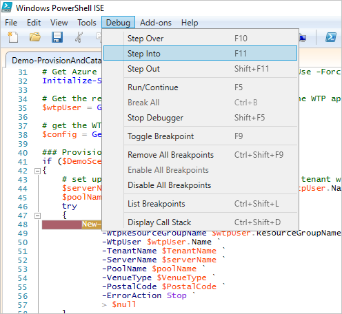
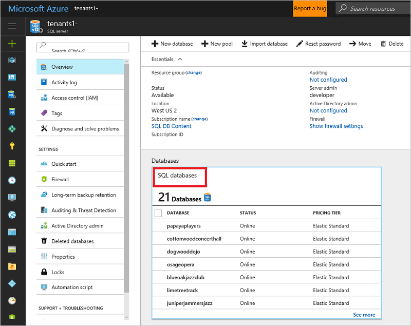

# Learn how to provision new tenants and register them in the catalog

In this tutorial, you learn how to provision and catalog SaaS patterns. You also learn how they're implemented in the Wingtip Tickets SaaS database-per-tenant application. You create and initialize new tenant databases and register them in the application's tenant catalog. The catalog is a database that maintains the mapping between the SaaS application's many tenants and their data. The catalog plays an important role in directing application and management requests to the correct database.

In this tutorial, you learn how to:

> [!div class="checklist"]
> 
> * Provision a single new tenant.
> * Provision a batch of additional tenants.

To complete this tutorial, make sure the following prerequisites are completed:

* The Wingtip Tickets SaaS database-per-tenant app is deployed. To deploy it in less than five minutes, see [Deploy and explore the Wingtip Tickets SaaS database-per-tenant application](saas-dbpertenant-get-started-deploy.md).
* Azure PowerShell is installed. For more information, see [Get started with Azure PowerShell](https://docs.microsoft.com/powershell/azure/get-started-azureps).

## Introduction to the SaaS catalog pattern

In a database-backed multitenant SaaS application, it's important to know where information for each tenant is stored. In the SaaS catalog pattern, a catalog database is used to hold the mapping between each tenant and the database in which their data is stored. This pattern applies whenever tenant data is distributed across multiple databases.

Each tenant is identified by a key in the catalog, which is mapped to the location of their database. In the Wingtip Tickets app, the key is formed from a hash of the tenant's name. This scheme allows the app to construct the key from the tenant name included in the application URL. Other tenant key schemes can be used.  

The catalog allows the name or location of the database to be changed with minimal impact on the application. In a multitenant database model, this capability also accommodates moving a tenant between databases. The catalog also can be used to indicate whether a tenant or database is offline for maintenance or other actions. This capability is explored in the [Restore single tenant tutorial](saas-dbpertenant-restore-single-tenant.md).

The catalog also can store additional tenant or database metadata, such as the schema version, service plan, or SLAs offered to tenants. The catalog can store other information that enables application management, customer support, or DevOps. 

Beyond the SaaS application, the catalog can enable database tools. In the Wingtip Tickets SaaS database-per-tenant sample, the catalog is used to enable cross-tenant query, which is explored in the [Ad hoc reporting tutorial](saas-tenancy-cross-tenant-reporting.md). Cross-database job management is explored in the [Schema management](saas-tenancy-schema-management.md) and [Tenant analytics](saas-tenancy-tenant-analytics.md) tutorials. 

In the Wingtip Tickets SaaS samples, the catalog is implemented by using the Shard Management features of the [Elastic Database client library (EDCL)](sql-database-elastic-database-client-library.md). The EDCL is available in Java and the .NET Framework. The EDCL enables an application to create, manage, and use a database-backed shard map. 

A shard map contains a list of shards (databases) and the mapping between keys (tenants) and shards. EDCL functions are used during tenant provisioning to create the entries in the shard map. They're used at run time by applications to connect to the correct database. EDCL caches connection information to minimize traffic to the catalog database and speed up the application. 

> [!IMPORTANT]
> The mapping data is accessible in the catalog database, but *don't edit it*. Edit mapping data by using Elastic Database Client Library APIs only. Directly manipulating the mapping data risks corrupting the catalog and isn't supported.

## Introduction to the SaaS provisioning pattern

When you add a new tenant in a SaaS application that uses a single-tenant database model, you must provision a new tenant database. The database must be created in the appropriate location and service tier. It also must be initialized with the appropriate schema and reference data. And it must be registered in the catalog under the appropriate tenant key. 

Different approaches to database provisioning can be used. You can execute SQL scripts, deploy a bacpac, or copy a template database. 

Database provisioning needs to be part of your schema management strategy. You must make sure that new databases are provisioned with the latest schema. This requirement is explored in the [Schema management tutorial](saas-tenancy-schema-management.md). 

The Wingtip Tickets database-per-tenant app provisions new tenants by copying a template database named _basetenantdb_, which is deployed on the catalog server. Provisioning can be integrated into the application as part of a sign-up experience. It also can be supported offline by using scripts. This tutorial explores provisioning by using PowerShell. 

Provisioning scripts copy the _basetenantdb_ database to create a new tenant database in an elastic pool. The tenant database is created in the tenant server mapped to the _newtenant_ DNS alias. This alias maintains a reference to the server used to provision new tenants and is updated to point to a recovery tenant server in the disaster recovery tutorials ([DR using georestore](saas-dbpertenant-dr-geo-restore.md), [DR using georeplication](saas-dbpertenant-dr-geo-replication.md)). The scripts then initialize the database with tenant-specific information and register it in the catalog shard map. Tenant databases are given names based on the tenant name. This naming scheme isn't a critical part of the pattern. The catalog maps the tenant key to the database name, so any naming convention can be used. 

## Get the Wingtip Tickets SaaS database-per-tenant application scripts

The Wingtip Tickets SaaS scripts and application source code are available in the [WingtipTicketsSaaS-DbPerTenant](https://github.com/Microsoft/WingtipTicketsSaaS-DbPerTenant) GitHub repo. Check out the [general guidance](saas-tenancy-wingtip-app-guidance-tips.md) for steps to download and unblock the Wingtip Tickets SaaS scripts.

## Provision and catalog detailed walkthrough

To understand how the Wingtip Tickets application implements new tenant provisioning, add a breakpoint and follow the workflow while you provision a tenant.

1. In the PowerShell ISE, open ...\\Learning Modules\\ProvisionAndCatalog\\_Demo-ProvisionAndCatalog.ps1_ and set the following parameters:

   * **$TenantName** = the name of the new venue (for example, *Bushwillow Blues*).
   * **$VenueType** = one of the predefined venue types: _blues, classicalmusic, dance, jazz, judo, motor racing, multipurpose, opera, rockmusic, soccer_.
   * **$DemoScenario** = **1**, *Provision a single tenant*.

2. To add a breakpoint, put your cursor anywhere on the line that says *New-Tenant `*. Then press F9.

   

3. To run the script, press F5.

4. After the script execution stops at the breakpoint, press F11 to step into the code.

   

Trace the script's execution by using the **Debug** menu options. Press F10 and F11 to step over or into the called functions. For more information about debugging PowerShell scripts, see [Tips on working with and debugging PowerShell scripts](https://msdn.microsoft.com/powershell/scripting/core-powershell/ise/how-to-debug-scripts-in-windows-powershell-ise).

You don't need to explicitly follow this workflow. It explains how to debug the script.

* **Import the CatalogAndDatabaseManagement.psm1 module.** It provides a catalog and tenant-level abstraction over the [Shard Management](sql-database-elastic-scale-shard-map-management.md) functions. This module encapsulates much of the catalog pattern and is worth exploring.
* **Import the SubscriptionManagement.psm1 module.** It contains functions for signing in to Azure and selecting the Azure subscription you want to work with.
* **Get configuration details.** Step into Get-Configuration by using F11, and see how the app config is specified. Resource names and other app-specific values are defined here. Don't change these values until you are familiar with the scripts.
* **Get the catalog object.** Step into Get-Catalog, which composes and returns a catalog object that's used in the higher-level script. This function uses Shard Management functions that are imported from **AzureShardManagement.psm1**. The catalog object is composed of the following elements:

   * $catalogServerFullyQualifiedName is constructed by using the standard stem plus your user name: _catalog-\<user\>.database.windows .net_.
   * $catalogDatabaseName is retrieved from the config: *tenantcatalog*.
   * $shardMapManager object is initialized from the catalog database.
   * $shardMap object is initialized from the _tenantcatalog_ shard map in the catalog database. A catalog object is composed and returned. It's used in the higher-level script.
* **Calculate the new tenant key.** A hash function is used to create the tenant key from the tenant name.
* **Check if the tenant key already exists.** The catalog is checked to make sure the key is available.
* **The tenant database is provisioned with New-TenantDatabase.** Use F11 to step into how the database is provisioned by using an [Azure Resource Manager template](../azure-resource-manager/resource-manager-template-walkthrough.md).

    The database name is constructed from the tenant name to make it clear which shard belongs to which tenant. You also can use other database naming conventions. A Resource Manager template creates a tenant database by copying a template database (_baseTenantDB_) on the catalog server. As an alternative, you can create a database and initialize it by importing a bacpac. Or you can execute an initialization script from a well-known location.

    The Resource Manager template is in the …\Learning Modules\Common\ folder: *tenantdatabasecopytemplate.json*

* **The tenant database is further initialized.** The venue (tenant) name and the venue type are added. You also can do other initialization here.

* **The tenant database is registered in the catalog.** It's registered with *Add-TenantDatabaseToCatalog* by using the tenant key. Use F11 to step into the details:

    * The catalog database is added to the shard map (the list of known databases).
    * The mapping that links the key value to the shard is created.
    * Additional metadata about the tenant (the venue's name) is added to the Tenants table in the catalog. The Tenants table isn't part of the Shard Management schema, and it isn't installed by the EDCL. This table illustrates how the catalog database can be extended to support additional application-specific data.

After provisioning completes, execution returns to the original *Demo-ProvisionAndCatalog* script. The **Events** page opens for the new tenant in the browser.

   

## Provision a batch of tenants

This exercise provisions a batch of 17 tenants. We recommend that you provision this batch of tenants before starting other Wingtip Tickets SaaS database-per-tenant tutorials. There are more than just a few databases to work with.

1. In the PowerShell ISE, open ...\\Learning Modules\\ProvisionAndCatalog\\*Demo-ProvisionAndCatalog.ps1*. Change the *$DemoScenario* parameter to 3:

   * **$DemoScenario** = **3**, *Provision a batch of tenants*.
2. To run the script, press F5.

The script deploys a batch of additional tenants. It uses an [Azure Resource Manager template](../azure-resource-manager/resource-manager-template-walkthrough.md) that controls the batch and delegates provisioning of each database to a linked template. Using templates in this way allows Azure Resource Manager to broker the provisioning process for your script. The templates provision databases in parallel and handle retries, if needed. The script is idempotent, so if it fails or stops for any reason, run it again.

### Verify the batch of tenants that successfully deployed

* In the [Azure portal](https://portal.azure.com), browse to your list of servers and open the *tenants1* server. Select **SQL databases**, and verify that the batch of 17 additional databases is now in the list.

   

## Other provisioning patterns

Other provisioning patterns not included in this tutorial:

**Pre-provisioning databases**: The pre-provisioning pattern exploits the fact that databases in an elastic pool don't add extra cost. Billing is for the elastic pool, not the databases. Idle databases consume no resources. By pre-provisioning databases in a pool and allocating them when needed, you can reduce the time to add tenants. The number of databases pre-provisioned can be adjusted as needed to keep a buffer suitable for the anticipated provisioning rate.

**Auto-provisioning**: In the auto-provisioning pattern, a provisioning service provisions servers, pools, and databases automatically, as needed. If you want, you can include pre-provisioning databases in elastic pools. If databases are decommissioned and deleted, gaps in elastic pools can be filled by the provisioning service. Such a service can be simple or complex, such as handling provisioning across multiple geographies and setting up geo-replication for disaster recovery. 

With the auto-provisioning pattern, a client application or script submits a provisioning request to a queue to be processed by the provisioning service. It then polls the service to determine completion. If pre-provisioning is used, requests are handled quickly. The service provisions a replacement database in the background.

## Next steps

In this tutorial you learned how to:

> [!div class="checklist"]
> 
> * Provision a single new tenant.
> * Provision a batch of additional tenants.
> * Step into the details of provisioning tenants and registering them into the catalog.

Try the [Performance monitoring tutorial](saas-dbpertenant-performance-monitoring.md).

## Additional resources

* Additional [tutorials that build on the Wingtip Tickets SaaS database-per-tenant application](saas-dbpertenant-wingtip-app-overview.md#sql-database-wingtip-saas-tutorials)
* [Elastic database client library](sql-database-elastic-database-client-library.md)
* [Debug scripts in the Windows PowerShell ISE](https://msdn.microsoft.com/powershell/scripting/core-powershell/ise/how-to-debug-scripts-in-windows-powershell-ise)
