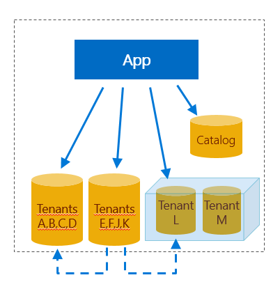
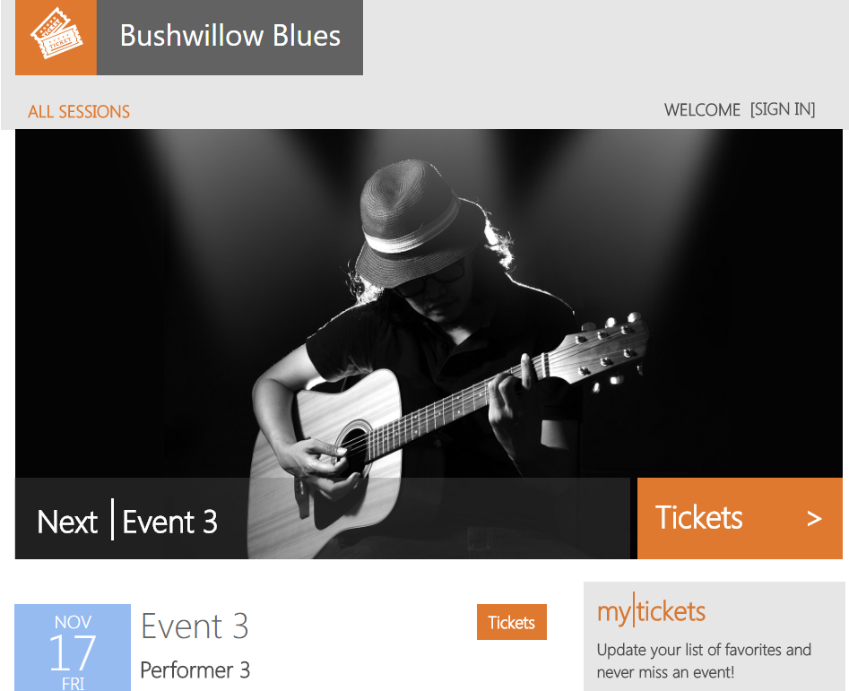
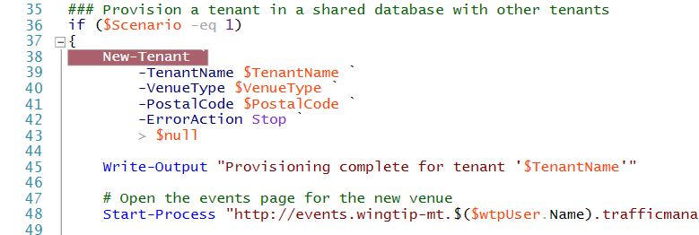

# Provision and catalog new tenants in a SaaS application using a sharded multi-tenant Azure SQL database

This article covers the provisioning and cataloging of new tenants, in a *multi-tenant sharded database* model or pattern.

This article has two major parts:

- [Conceptual discussion](#goto_2_conceptual) of the provisioning and cataloging of new tenants.

- [Tutorial](#goto_1_tutorial) that highlights the PowerShell script code that accomplishes the provisioning and cataloging.
    - The tutorial uses the Wingtip Tickets SaaS application, adapted to the multi-tenant sharded database pattern.

<a name="goto_2_conceptual"/>

## Database pattern

This section, plus a few more that follow, discuss the concepts of the multi-tenant sharded database pattern.

In this multi-tenant sharded model, the table schemas inside each database include a tenant key in the primary key of tables that store tenant data. The tenant key enables each individual database to store 0, 1, or many tenants. The use of sharded databases makes it easy for the application system to support a very large number of tenants. All the data for any one tenant is stored in one database. The large number of tenants are distributed across the many sharded databases. A catalog database stores the mapping of each tenant to its database.

#### Isolation versus lower cost

A tenant that has a database all to itself enjoys the benefits of isolation. The tenant can have the database restored to an earlier date without being restricted by the impact on other tenants. Database performance can be tuned to optimize for the one tenant, again without having to compromise with other tenants. The problem is that isolation costs more than it costs to share a database with other tenants.

When a new tenant is provisioned, it can share a database with other tenants, or it can be placed into its own new database. Later you can change your mind and move the database to the other situation.

Databases with multiple tenants and single tenants are mixed in the same SaaS application, to optimize cost or isolation for each tenant.

   

## Tenant catalog pattern

When you have two or more databases that each contain at least one tenant, the application must have a way to discover which database stores the tenant of current interest. A catalog database stores this mapping.

#### Tenant key

For each tenant, the Wingtip application can derive a unique key, which is the tenant key. The app extracts the tenant name from the webpage URL. The app hashes the name to obtain the key. The app uses the key to access the catalog. The catalog cross-references information about the database in which the tenant is stored. The app uses the database info to connect. Other tenant key schemes can also be used.

Using a catalog allows the name or location of a tenant database to be changed after provisioning without disrupting the application. In a multi-tenant database model, the catalog accommodates moving a tenant between databases.

#### Tenant metadata beyond location

The catalog can also indicate whether a tenant is offline for maintenance or other actions. And the catalog can be extended to store additional tenant or database metadata, such as the following items:
- The service tier or edition of a database.
- The version of the database schema.
- The tenant name and its SLA (service level agreement).
- Information to enable application management, customer support, or devops processes.  

The catalog can also be used to enable cross-tenant reporting, schema management, and data extract for analytics purposes. 

### Elastic Database Client Library 

In Wingtip, the catalog is implemented in the *tenantcatalog* database. The *tenantcatalog* is created using the Shard Management features of the [Elastic Database Client Library (EDCL)](sql-database-elastic-database-client-library.md). The library enables an application to create, manage, and use a *shard map* that is stored in a database. A shard map cross-references the tenant key with its shard, meaning its sharded database.

During tenant provisioning, EDCL functions can be used from applications or PowerShell scripts to create the entries in the shard map. Later the EDCL functions can be used to connect to the correct database. The EDCL caches connection information to minimize the traffic on the catalog database and speed up the process of connecting.

> [!IMPORTANT]
> Do *not* edit the data in the catalog database through direct access! Direct updates are not supported due to the high risk of data corruption. Instead, edit the mapping data by using EDCL APIs only.

## Tenant provisioning pattern

#### Checklist

When you want to provision a new tenant into an existing shared database, of the shared database you must ask the following questions:
- Does it have enough space left for the new tenant?
- Does it have tables with the necessary reference data for the new tenant, or can the data be added?
- Does it have the appropriate variation of the base schema for the new tenant?
- Is it in the appropriate geographic location close to the new tenant?
- Is it at the right service tier for the new tenant?

When you want the new tenant to be isolated in its own database, you can create it to meet the specifications for the tenant.

After the provisioning is complete, you must register the tenant in the catalog. Finally, the tenant mapping can be added to reference the appropriate shard.

#### Template database

Provision the database by executing SQL scripts, deploying a bacpac, or copying a template database. The Wingtip apps copy a template database to create new tenant databases.

Like any application, Wingtip will evolve over time. At times, Wingtip will require changes to the database. Changes may include the following items:
- New or changed schema.
- New or changed reference data.
- Routine database maintenance tasks to ensure optimal app performance.

With a SaaS application, these changes need to be deployed in a coordinated manner across a potentially massive fleet of tenant databases. For these changes to be in future tenant databases, they need to be incorporated into the provisioning process. This challenge is explored further in the [schema management tutorial](saas-tenancy-schema-management.md).

#### Scripts

The tenant provisioning scripts in this tutorial support both of the following scenarios:
- Provisioning a tenant into an existing database shared with other tenants.
- Provisioning a tenant into its own database.

Tenant data is then initialized and registered in the catalog shard map. In the sample app, databases that contain multiple tenants are given a generic name, such as *tenants1* or *tenants2*. Databases that contain a single tenant are given the tenant's name. The specific naming conventions used in the sample are not a critical part of the pattern, as the use of a catalog allows any name to be assigned to the database.  

<a name="goto_1_tutorial"/>

## Tutorial begins

In this tutorial, you learn how to:

> [!div class="checklist"]
> * Provision a tenant into a multi-tenant database
> * Provision a tenant into a single-tenant database
> * Provision a batch of tenants into both multi-tenant and single-tenant databases
> * Register a database and tenant mapping in a catalog

#### Prerequisites

To complete this tutorial, make sure the following prerequisites are completed:

- Azure PowerShell is installed. For details, see [Getting started with Azure PowerShell](https://docs.microsoft.com/powershell/azure/get-started-azureps)

- The Wingtip Tickets SaaS Multi-tenant Database app is deployed. To deploy in less than five minutes, see [Deploy and explore the Wingtip Tickets SaaS Multi-tenant Database application](saas-multitenantdb-get-started-deploy.md)

- Get the Wingtip scripts and source code:
    - The Wingtip Tickets SaaS Multi-tenant Database scripts and application source code are available in the [WingtipTicketsSaaS-MultitenantDB](https://github.com/microsoft/WingtipTicketsSaaS-MultiTenantDB) GitHub repo.
    - See the [general guidance](saas-tenancy-wingtip-app-guidance-tips.md) for steps to download and unblock the Wingtip scripts. 

## Provision a tenant into a database *shared* with other tenants

In this section, you see a list of the major actions for provisioning that are taken by the PowerShell scripts. Then you use the PowerShell ISE debugger to step through the scripts to see the actions in code.

#### Major actions of provisioning

The following are key elements of the provisioning workflow you step through:

- **Calculate the new tenant key**: A hash function is used to create the tenant key from the tenant name.
- **Check if the tenant key already exists**: The catalog is checked to ensure the key has not already been registered.
- **Initialize tenant in the default tenant database**: The tenant database is updated to add the new tenant information.  
- **Register tenant in the catalog**: The mapping between the new tenant key and the existing tenants1 database is added to the catalog. 
- **Add the tenant's name to a catalog extension table**: The venue name is added to the Tenants table in the catalog.  This addition shows how the Catalog database can be extended to support additional application-specific data.
- **Open Events page for the new tenant**: The *Bushwillow Blues* events page is opened in the browser.

   

#### Debugger steps

To understand how the Wingtip app implements new tenant provisioning in a shared database, add a breakpoint and step through the workflow:

1. In the *PowerShell ISE*, open ...\\Learning Modules\\ProvisionTenants\\*Demo-ProvisionTenants.ps1* and set the following parameters:
   - **$TenantName** = **Bushwillow Blues**, the name of a new venue.
   - **$VenueType** = **blues**, one of the pre-defined venue types: blues, classicalmusic, dance, jazz, judo, motorracing, multipurpose, opera, rockmusic, soccer (lowercase, no spaces).
   - **$DemoScenario** = **1**, to provision a tenant in a shared database with other tenants.

2. Add a breakpoint by putting your cursor anywhere on line 38, the line that says: *New-Tenant `*, and then press **F9**.

   

3. Run the script by pressing **F5**.

4. After script execution stops at the breakpoint, press **F11** to step into the code.

   

5. Trace the script's execution using the **Debug** menu options, **F10** and **F11**, to step over or into called functions.

For more information about debugging PowerShell scripts, see [Tips on working with and debugging PowerShell scripts](https://msdn.microsoft.com/powershell/scripting/core-powershell/ise/how-to-debug-scripts-in-windows-powershell-ise).

## Provision a tenant in its *own* database

#### Major actions of provisioning

The following are key elements of the workflow you step through while tracing the script:

- **Calculate the new tenant key**: A hash function is used to create the tenant key from the tenant name.
- **Check if the tenant key already exists**: The catalog is checked to ensure the key has not already been registered.
- **Create a new tenant database**: The database is created by copying the *basetenantdb* database using a Resource Manager template.  The new database name is based on the tenant's name.
- **Add database to catalog**: The new tenant database is registered as a shard in the catalog.
- **Initialize tenant in the default tenant database**: The tenant database is updated to add the new tenant information.  
- **Register tenant in the catalog**: The mapping between the new tenant key and the *sequoiasoccer* database is added to the catalog.
- **Tenant name is added to the catalog**: The venue name is added to the Tenants extension table in the catalog.
- **Open Events page for the new tenant**: The *Sequoia Soccer* Events page is opened in the browser.

   

#### Debugger steps

Now walk through the script process when creating a tenant in its own database:

1. Still in ...\\Learning Modules\\ProvisionTenants\\*Demo-ProvisionTenants.ps1* set the following parameters:
   - **$TenantName** = **Sequoia Soccer**, the name of a new venue.
   - **$VenueType** = **soccer**, one of the pre-defined venue types: blues, classicalmusic, dance, jazz, judo, motorracing, multipurpose, opera, rockmusic, soccer (lower case, no spaces).
   - **$DemoScenario** = **2**, to provision a tenant into its own database.

2. Add a new breakpoint by putting your cursor anywhere on line 57, the line that says: *&&nbsp;$PSScriptRoot\New-TenantAndDatabase `*, and press **F9**.

   

3. Run the script by pressing **F5**.

4. After the script execution stops at the breakpoint, press **F11** to step into the code.  Use **F10** and **F11** to step over and step into functions to trace the execution.

## Provision a batch of tenants

This exercise provisions a batch of 17 tenants. It’s recommended you provision this batch of tenants before starting other Wingtip Tickets tutorials so there are more databases to work with.

1. In the *PowerShell ISE*, open ...\\Learning Modules\\ProvisionTenants\\*Demo-ProvisionTenants.ps1*  and change the *$DemoScenario* parameter to 4:
   - **$DemoScenario** = **4**, to provision a batch of tenants into a shared database.

2. Press **F5** and run the script.

### Verify the deployed set of tenants 

At this stage, you have a mix of tenants deployed into a shared database and tenants deployed into their own databases. The Azure portal can be used to inspect the databases created. In the [Azure portal](https://portal.azure.com), open the **tenants1-mt-\<USER\>** server by browsing to the list of SQL servers.  The **SQL databases** list should include the shared **tenants1** database and the databases for the tenants that are in their own database:

   

While the Azure portal shows the tenant databases, it doesn't let you see the tenants *inside* the shared database. The full list of tenants can be seen in the **Events Hub** webpage of Wingtip, and by browsing the catalog.

#### Using Wingtip Tickets events hub page

Open the Events Hub page in the browser (http:events.wingtip-mt.\<USER\>.trafficmanager.net)  

#### Using catalog database

The full list of tenants and the corresponding database for each is available in the catalog. A SQL view is provided that joins the tenant name to the database name. The view nicely demonstrates the value of extending the metadata that is stored in the catalog.
- The SQL view is available in the tenantcatalog database.
- The tenant name is stored in the Tenants table.
- The database name is stored in the Shard Management tables.

1. In SQL Server Management Studio (SSMS), connect to the tenants server at **catalog-mt.\<USER\>.database.windows.net**, with Login = **developer**, and Password = **P@ssword1**

    

2. In the SSMS Object Explorer, browse to the views in the *tenantcatalog* database.

3. Right click on the view *TenantsExtended* and choose **Select Top 1000 Rows**. Note the mapping between tenant name and database for the different tenants.

    
      
## Other provisioning patterns

This section discusses other interesting provisioning patterns.

#### Pre-provisioning databases in elastic pools

The pre-provisioning pattern exploits the fact that when using elastic pools, billing is for the pool not the databases. Thus databases can be added to an elastic pool before they are needed without incurring extra cost. This pre-visioning significantly reduces the time taken to provision a tenant into a database. The number of databases pre-provisioned can be adjusted as needed to keep a buffer suitable for the anticipated provisioning rate.

#### Auto-provisioning

In the auto-provisioning pattern, a dedicated provisioning service is used to provision servers, pools, and databases automatically as needed. This automation includes the pre-provisioning of databases in elastic pools. And if databases are decommissioned and deleted, the gaps this creates in elastic pools can be filled by the provisioning service as desired.

This type of automated service could be simple or complex. For example, the automation could handle provisioning across multiple geographies, and could set up geo-replication for disaster recovery. With the auto-provisioning pattern, a client application or script would submit a provisioning request to a queue to be processed by a provisioning service. The script would then poll to detect completion. If pre-provisioning is used, requests would be handled quickly, while a background service would manage the provisioning of a replacement database.

## Additional resources

<!-- - Additional [tutorials that build upon the Wingtip SaaS application](saas-dbpertenant-wingtip-app-overview.md#sql-database-wingtip-saas-tutorials)-->
- [Elastic database client library](sql-database-elastic-database-client-library.md)
- [How to Debug Scripts in Windows PowerShell ISE](https://msdn.microsoft.com/powershell/scripting/core-powershell/ise/how-to-debug-scripts-in-windows-powershell-ise)

## Next steps

In this tutorial you learned how to:

> [!div class="checklist"]
> * Provision a single new tenant into a shared multi-tenant database and its own database
> * Provision a batch of additional tenants
> * Step through the details of provisioning tenants, and registering them into the catalog

Try the [Performance monitoring tutorial](saas-multitenantdb-performance-monitoring.md).

