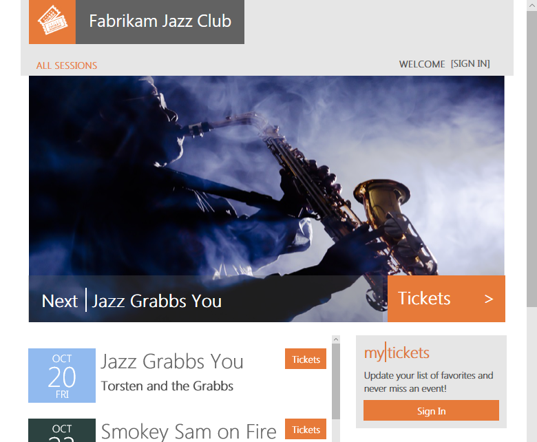

# Deploy and explore a standalone single-tenant application that uses Azure SQL Database

In this tutorial, you deploy and explore the Wingtip Tickets SaaS sample application developed using the standalone application, or app-per-tenant, pattern.  The application is designed to showcase features of Azure SQL Database that simplify enabling multi-tenant SaaS scenarios.

The standalone application or app-per-tenant pattern deploys an application instance for each tenant.  Each application is configured for a specific tenant and deployed in a separate Azure resource group. Multiple instances of the application are provisioned to provide a multi-tenant solution. This pattern is best suited to smaller numbers, of tenants where tenant isolation is a top priority. Azure has partner programs that allow resources to be deployed into a tenant’s subscription and managed by a service provider on the tenant’s behalf. 

In this tutorial, you will deploy three standalone applications for three tenants into your Azure subscription.  You have full access to explore and work with the individual application components.

The application source code and management scripts are available in the [WingtipTicketsSaaS-StandaloneApp](https://github.com/Microsoft/WingtipTicketsSaaS-StandaloneApp) GitHub repo. The application was created using Visual Studio 2015, and does not successfully open and compile in Visual Studio 2017 without updating.

In this tutorial you learn:

> [!div class="checklist"]
> * How to deploy the Wingtip Tickets SaaS Standalone Application.
> * Where to get the application source code, and management scripts.
> * About the servers and databases that make up the app.

Additional tutorials will be released. They will allow you to explore a range of management scenarios based on this application pattern.   

## Deploy the Wingtip Tickets SaaS Standalone Application

Deploy the app for the three provided tenants:

1. Click each blue **Deploy to Azure** button to open the deployment template in the [Azure portal](https://portal.azure.com). Each template requires two parameter values; a name for a new resource group, and a user name that distinguishes this deployment from other deployments of the app. The next step provides details for setting these values.  
     &nbsp; **Contoso Concert Hall**
  
     &nbsp; **Dogwood Dojo**
  
     &nbsp; **Fabrikam Jazz Club**

2. Enter required parameter values for each deployment.

    > [!IMPORTANT]
    > Some authentication and server firewalls are intentionally unsecured for demonstration purposes. **Create a new resource group** for each application deployment.  Do not use an existing resource group. Do not use this application, or any resources it creates, for production. Delete all the resource groups when you are finished with the applications to stop related billing.

    It is best to use only lowercase letters, numbers, and hyphens in your resource names.
    * For **Resource group**, select Create new, and then provide a lowercase Name for the resource group. **wingtip-sa-\<venueName\>-\<user\>** is the recommended pattern.  For \<venueName\>, substitute the venue name with no spaces. For \<user\>, substitute the user value from below.  With this pattern, resource group names might be *wingtip-sa-contosoconcerthall-af1*, *wingtip-sa-dogwooddojo-af1*, *wingtip-sa-fabrikamjazzclub-af1*.
    * Select a **Location** from the drop-down list.

    * For **User** - We recommend a short user value, such as your initials plus a digit: for example, *af1*.

3. **Deploy the application**.

    * Click to agree to the terms and conditions.
    * Click **Purchase**.

4. Monitor the status of all three deployments by clicking **Notifications** (the bell icon to the right of the search box). Deploying the apps takes around five minutes.

## Run the applications

The app showcases venues that host events.  The venues are the tenants of the application. Each venue gets a personalized web site to list their events and sell tickets. Venue types include concert halls, jazz clubs, and sports clubs. In the sample, the type of venue determines the background photograph shown on the venue's web site.   In the standalone app model, each venue has a separate application instance with its own standalone SQL database.

1. Open the events page for each of the three tenants in separate browser tabs:

    - http://events.contosoconcerthall.&lt;user&gt;.trafficmanager.net
    - http://events.dogwooddojo.&lt;user&gt;.trafficmanager.net
    - http://events.fabrikamjazzclub.&lt;user&gt;.trafficmanager.net

    (In each URL, replace &lt;user&gt; with your deployment's user value.)

   

To control the distribution of incoming requests, the app uses [*Azure Traffic Manager*](../traffic-manager/traffic-manager-overview.md). Each tenant-specific app instance includes the tenant name as part of the domain name in the URL. All the tenant URLs include your specific **User** value. The URLs follow the following format:
- http://events.&lt;venuename&gt;.&lt;user&gt;.trafficmanager.net

Each tenant's database **Location** is included in the app settings of the corresponding deployed app.

In a production environment, typically you create a CNAME DNS record to [*point a company internet domain*](../traffic-manager/traffic-manager-point-internet-domain.md) to the URL of the traffic manager profile.

## Explore the servers and tenant databases

Let’s look at some of the resources that were deployed:

1. In the [Azure portal](http://portal.azure.com), browse to the list of resource groups.
2. You should see the three tenant resource groups.
3. Open the **wingtip-sa-fabrikam-&lt;user&gt;** resource group, which contains the resources for the Fabrikam Jazz Club deployment.  The **fabrikamjazzclub-&lt;user&gt;** server contains the **fabrikamjazzclub** database.

Each tenant database is a 50 DTU *standalone* database.

## Additional resources

<!--
* Additional [tutorials that build on the Wingtip SaaS application](sql-database-wtp-overview.md#sql-database-wingtip-saas-tutorials)
* To learn about elastic pools, see [*What is an Azure SQL elastic pool*](https://docs.microsoft.com/azure/sql-database/sql-database-elastic-pool)
* To learn about elastic jobs, see [*Managing scaled-out cloud databases*](https://docs.microsoft.com/azure/sql-database/sql-database-elastic-jobs-overview)
-->

- To learn about multi-tenant SaaS applications, see [Design patterns for multi-tenant SaaS applications](saas-tenancy-app-design-patterns.md).

 
## Delete resource groups to stop billing ##

When you have finished using the sample, delete all the resource groups you created to stop the associated billing.

## Next steps

In this tutorial you learned:

> [!div class="checklist"]
> * How to deploy the Wingtip Tickets SaaS Standalone Application.
> * About the servers and databases that make up the app.
> * How to delete sample resources to stop related billing.

Next, try the [Provision and Catalog](saas-standaloneapp-provision-and-catalog.md) tutorial in which you will explore the use of a catalog of tenants that enables a range of cross-tenant scenarios such as schema management and tenant analytics.
 

