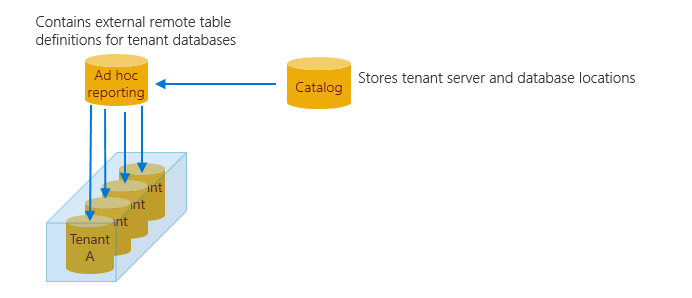

# Run ad hoc analytics queries across multiple Azure SQL databases

In this tutorial, you run distributed queries across the entire set of tenant databases to enable ad hoc interactive reporting. These queries can extract insights buried in the day-to-day operational data of the Wingtip Tickets SaaS app. To do this, you will deploy an additional analytics database to the catalog server and use Elastic Query to enable distributed queries.


In this tutorial you learn:

> [!div class="checklist"]

> * About the global views in each database, these views enable efficient querying across tenants
> * How to deploy an ad hoc reporting database
> * How to run distributed queries across all tenant databases


To complete this tutorial, make sure the following prerequisites are completed:


* The Wingtip Tickets SaaS Database Per Tenant app is deployed. To deploy in less than five minutes, see [Deploy and explore the Wingtip Tickets SaaS Database Per Tenant application](saas-dbpertenant-get-started-deploy.md)
* Azure PowerShell is installed. For details, see [Getting started with Azure PowerShell](https://docs.microsoft.com/powershell/azure/get-started-azureps)
* SQL Server Management Studio (SSMS) is installed. To download and install SSMS, see [Download SQL Server Management Studio (SSMS)](https://docs.microsoft.com/sql/ssms/download-sql-server-management-studio-ssms).


## Ad hoc reporting pattern



One of the great opportunities with SaaS applications is the ability to use the vast amount of tenant data stored centrally in the cloud to gain insights into the operation and usage of your application. These insights can guide feature development, usability improvements, and other investments in your apps and services.

Accessing this data in a single multi-tenant database is easy, but not so easy when distributed at scale across potentially thousands of databases. One approach is to use [Elastic Query](sql-database-elastic-query-overview.md), which enables querying across a distributed set of databases with common schema. These databases can be distributed across different resource groups and subscriptions, but need to share a common login. Elastic Query uses a single *head* database in which external tables are defined that mirror tables or views in the distributed (tenant) databases. Queries submitted to this head database are compiled to produce a distributed query plan, with portions of the query pushed down to the tenant databases as needed. Elastic Query uses the shard map in the catalog database to determine the location of all tenant databases. Setup and query are straightforward using standard [Transact-SQL](https://docs.microsoft.com/sql/t-sql/language-reference), and support ad hoc querying from tools like Power BI and Excel.

By distributing queries across the tenant databases, Elastic Query provides immediate insight into live production data. However, as Elastic Query pulls data from potentially many databases, query latency can sometimes be higher than for equivalent queries submitted to a single multi-tenant database. Be sure to design queries to minimize the data that is returned. Elastic Query is often best suited for querying small amounts of real-time data, as opposed to building frequently used or complex analytics queries or reports. If queries don't perform well, look at the [execution plan](https://docs.microsoft.com/sql/relational-databases/performance/display-an-actual-execution-plan) to see what part of the query has been pushed down to the remote database and how much data is being returned. Queries that require complex analytical processing may be better served in some cases by extracting tenant data into a dedicated database or data warehouse optimized for analytics queries. This pattern is explained in the [tenant analytics tutorial](saas-tenancy-tenant-analytics.md). 

## Get the Wingtip Tickets SaaS Database Per Tenant application scripts

The Wingtip Tickets SaaS Database Per Tenant scripts and application source code are available in the [WingtipTicketsSaaS-DbPerTenant github repo](https://github.com/Microsoft/WingtipTicketsSaaS-DbPerTenant/). Make sure to follow unblock steps outlined in the readme.

## Create ticket sales data

To run queries against a more interesting data set, create ticket sales data by running the ticket-generator.

1. In the *PowerShell ISE*, open the ...\\Learning Modules\\Operational Analytics\\Adhoc Reporting\\*Demo-AdhocReporting.ps1* script and set the following values:
   * **$DemoScenario** = 1, **Purchase tickets for events at all venues**.
2. Press **F5** to run the script and generate ticket sales. While the script is running, continue the steps in this tutorial. The ticket data is queried in the *Run ad-hoc distributed queries* section, so wait for the ticket generator to complete.

## Explore the global views

In the Wingtip Tickets SaaS Database Per Tenant application, each tenant is given a database. Thus, the data contained in the database tables is scoped to the perspective of a single tenant. However, when querying across all databases, it's important that Elastic Query can treat the data as if it is part of a single logical database sharded by tenant. 

To simulate this pattern, a set of 'global' views are added to the tenant database that project a tenant id into each of the tables that are queried globally. For example, the *VenueEvents* view adds a computed *VenueId* to the columns projected from the *Events* table. Similarly, the *VenueTicketPurchases* and *VenueTickets* views add a computed *VenueId* column projected from their respective tables. These views are used by Elastic Query to parallelize queries and push them down to the appropriate remote tenant database when a *VenueId* column is present. This dramatically reduces the amount of data that is returned and results in a substantial increase in performance for many queries. These global views have been pre-created in all tenant databases.

1. Open SSMS and [connect to the tenants1-&lt;USER&gt; server](saas-dbpertenant-wingtip-app-guidance-tips.md#explore-database-schema-and-execute-sql-queries-using-ssms).
2. Expand **Databases**, right-click **contosoconcerthall**, and select **New Query**.
3. Run the following queries to explore the difference between the single-tenant tables and the global views:

   ```T-SQL
   -- The base Venue table, that has no VenueId associated.
   SELECT * FROM Venue

   -- Notice the plural name 'Venues'. This view projects a VenueId column.
   SELECT * FROM Venues

   -- The base Events table, which has no VenueId column.
   SELECT * FROM Events

   -- This view projects the VenueId retrieved from the Venues table.
   SELECT * FROM VenueEvents
   ```

In these views, the *VenueId* is computed as a hash of the Venue name, but any approach could be used to introduce a unique value. This approach is similar to the way the tenant key is computed for use in the catalog.

To examine the definition of the *Venues* view:

1. In **Object Explorer**, expand **contosoconcethall** > **Views**:

   

2. Right-click **dbo.Venues**.
3. Select **Script View as** > **CREATE To** > **New Query Editor Window**

Script any of the other *Venue* views to see how they add the *VenueId*.

## Deploy the database used for ad hoc distributed queries

This exercise deploys the *adhocreporting* database. This is the head database that contains the schema used for querying across all tenant databases. The database is deployed to the existing catalog server, which is the server used for all management-related databases in the sample app.

1. Open ...\\Learning Modules\\Operational Analytics\\Adhoc Reporting\\*Demo-AdhocReporting.ps1* in the *PowerShell ISE* and set the following values:
   * **$DemoScenario** = 2, **Deploy Ad-hoc analytics database**.

2. Press **F5** to run the script and create the *adhocreporting* database.

In the next section, you add schema to the database so it can be used to run distributed queries.

## Configure the 'head' database for running distributed queries

This exercise adds schema (the external data source and external table definitions) to the ad hoc analytics database that enables querying across all tenant databases.

1. Open SQL Server Management Studio, and connect to the Adhoc Reporting database you created in the previous step. The name of the database is *adhocreporting*.
2. Open ...\Learning Modules\Operational Analytics\Adhoc Reporting\ *Initialize-AdhocReportingDB.sql* in SSMS.
3. Review the SQL script and note the following:

   Elastic Query uses a database-scoped credential to access each of the tenant databases. This credential needs to be available in all the databases and should normally be granted the minimum rights required to enable these ad hoc queries.

    

   The external data source, that is defined to use the tenant shard map in the catalog database. By using this as the external data source, queries are distributed to all databases registered in the catalog when the query is run. Because server names are different for each deployment, this initialization script gets the location of the catalog database by retrieving the current server (@@servername) where the script is executed.

    

   The external tables that reference the global views described in the previous section, and defined with **DISTRIBUTION = SHARDED(VenueId)**. Because each *VenueId* maps to a single database, this improves performance for many scenarios as shown in the next section.

    

   The local table *VenueTypes* that is created and populated. This reference data table is common in all tenant databases, so it can be represented here as a local table and populated with the common data. For some queries, this may reduce the amount of data moved between the tenant databases and the *adhocreporting* database.

    

   If you include reference tables in this manner, be sure to update the table schema and data whenever you update the tenant databases.

4. Press **F5** to run the script and initialize the *adhocreporting* database. 

Now you can run distributed queries, and gather insights across all tenants!

## Run ad hoc distributed queries

Now that the *adhocreporting* database is set up, go ahead and run some distributed queries. Include the execution plan for a better understanding of where the query processing is happening. 

When inspecting the execution plan, hover over the plan icons for details. 

Important to note, is that setting **DISTRIBUTION = SHARDED(VenueId)** when we defined the external data source, improves performance for many scenarios. Because each *VenueId* maps to a single database, filtering is easily done remotely, returning only the data we need.

1. Open ...\\Learning Modules\\Operational Analytics\\Adhoc Reporting\\*Demo-AdhocReportingQueries.sql* in SSMS.
2. Ensure you are connected to the **adhocreporting** database.
3. Select the **Query** menu and click **Include Actual Execution Plan**
4. Highlight the *Which venues are currently registered?* query, and press **F5**.

   The query returns the entire venue list, illustrating how quick and easy it is to query across all tenants and return data from each tenant.

   Inspect the plan and see that the entire cost is the remote query because we're simply going to each tenant database and selecting the venue information.

   

5. Select the next query, and press **F5**.

   This query joins data from the tenant databases and the local *VenueTypes* table (local, as it's a table in the *adhocreporting* database).

   Inspect the plan and see that the majority of cost is the remote query because we query each tenant's venue info (dbo.Venues), and then do a quick local join with the local *VenueTypes* table to display the friendly name.

   

6. Now select the *On which day were the most tickets sold?* query, and press **F5**.

   This query does a bit more complex joining and aggregation. What's important to note is that most of the processing is done remotely, and once again, we bring back only the rows we need, returning just a single row for each venue's aggregate ticket sale count per day.

   


## Next steps

In this tutorial you learned how to:

> [!div class="checklist"]

> * Run distributed queries across all tenant databases
> * Deploy an ad hoc reporting database and add schema to it to run distributed queries.


Now try the [Tenant Analytics tutorial](saas-tenancy-tenant-analytics.md) to explore extracting data to a separate analytics database for more complex analytics processing...

## Additional resources

* Additional [tutorials that build upon the Wingtip Tickets SaaS Database Per Tenant application](saas-dbpertenant-wingtip-app-overview.md#sql-database-wingtip-saas-tutorials)
* [Elastic Query](sql-database-elastic-query-overview.md)
