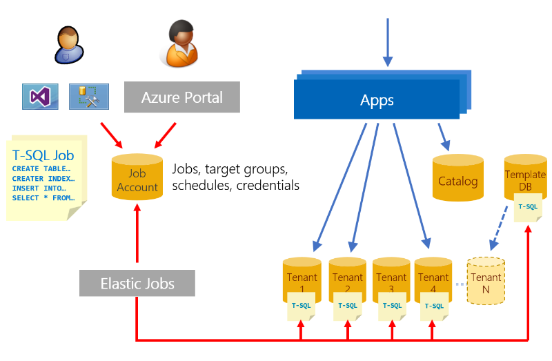

# Manage schema in a SaaS application using the database-per-tenant pattern with Azure SQL Database
 
As a database application evolves, changes inevitably need to be made to the database schema or reference data.  Database maintenance tasks are also needed periodically. Managing an application that uses the database per tenant pattern requires that you apply these changes or maintenance tasks across a fleet of tenant databases.

This tutorial explores two scenarios - deploying reference data updates for all tenants, and rebuilding an index on the table containing the reference data. The [Elastic jobs](sql-database-elastic-jobs-overview.md) feature is used to execute these actions on all tenant databases, and on the template database used to create new tenant databases.

In this tutorial you learn how to:

> [!div class="checklist"]

> * Create a job agent
> * Cause T-SQL jobs to be run on all tenant databases
> * Update reference data in all tenant databases
> * Create an index on a table in all tenant databases

To complete this tutorial, make sure the following prerequisites are met:

* The Wingtip Tickets SaaS Database Per Tenant app is deployed. To deploy in less than five minutes, see [Deploy and explore the Wingtip Tickets SaaS database per tenant application](saas-dbpertenant-get-started-deploy.md)
* Azure PowerShell is installed. For details, see [Getting started with Azure PowerShell](https://docs.microsoft.com/powershell/azure/get-started-azureps)
* The latest version of SQL Server Management Studio (SSMS) is installed. [Download and Install SSMS](https://docs.microsoft.com/sql/ssms/download-sql-server-management-studio-ssms)

> [!NOTE]
> This tutorial uses features of the SQL Database service that are in a limited preview (Elastic Database jobs). If you wish to do this tutorial, provide your subscription ID to SaaSFeedback@microsoft.com with subject=Elastic Jobs Preview. After you receive confirmation that your subscription has been enabled, [download and install the latest pre-release jobs cmdlets](https://github.com/jaredmoo/azure-powershell/releases). This preview is limited, so contact SaaSFeedback@microsoft.com for related questions or support.

## Introduction to SaaS schema management patterns

The database per tenant pattern isolates tenant data effectively, but increases the number of databases to manage and maintain. [Elastic Jobs](sql-database-elastic-jobs-overview.md) facilitates administration and management of SQL databases. Jobs enable you to securely and reliably, run tasks (T-SQL scripts) against a group of databases. Jobs can deploy schema and common reference data changes across all tenant databases in an application. Elastic Jobs can also be used to maintain a *template* database used to create new tenants, ensuring it always has the latest schema and reference data.

## Elastic Jobs limited preview

There's a new version of Elastic Jobs that is now an integrated feature of Azure SQL Database. This new version of Elastic Jobs is currently in limited preview. This limited preview currently supports using PowerShell to create a job agent, and T-SQL to create and manage jobs.

> [!NOTE]
> This tutorial uses features of the SQL Database service that are in a limited preview (Elastic Database jobs). If you wish to do this tutorial, provide your subscription ID to SaaSFeedback@microsoft.com with subject=Elastic Jobs Preview. After you receive confirmation that your subscription has been enabled, [download and install the latest pre-release jobs cmdlets](https://github.com/jaredmoo/azure-powershell/releases). This preview is limited, so contact SaaSFeedback@microsoft.com for related questions or support.

## Get the Wingtip Tickets SaaS database per tenant application scripts

The application source code and management scripts are available in the [WingtipTicketsSaaS-DbPerTenant](https://github.com/Microsoft/WingtipTicketsSaaS-DbPerTenant) GitHub repo. Check out the [general guidance](saas-tenancy-wingtip-app-guidance-tips.md) for steps to download and unblock the Wingtip Tickets SaaS scripts.

## Create a job agent database and new job agent

This tutorial requires you use PowerShell to create a job agent and its backing job agent database. The job agent database holds job definitions, job status, and history. Once the job agent and its database are created, you can create and monitor jobs immediately.

1. **In PowerShell ISE**, open …\\Learning Modules\\Schema Management\\*Demo-SchemaManagement.ps1*.
1. Press **F5** to run the script.

The *Demo-SchemaManagement.ps1* script calls the *Deploy-SchemaManagement.ps1* script to create a SQL database named *osagent* on the catalog server. It then creates the job agent, using the  database as a parameter.

## Create a job to deploy new reference data to all tenants

In the Wingtip Tickets app, each tenant database includes a set of supported venue types. Each venue is of a specific venue type, which defines the kind of events that can be hosted, and determines the background image used in the app. For the application to support new kinds of events, this reference data must be updated and new venue types added.  In this exercise, you deploy an update to all the tenant databases to add two additional venue types: *Motorcycle Racing* and *Swimming Club*.

First, review the venue types included in each tenant database. Connect to one of the tenant databases in SQL Server Management Studio (SSMS) and inspect the VenueTypes table.  You can also query this table in the Query editor in the Azure portal, accessed from the database page. 

1. Open SSMS and connect to the tenant server: *tenants1-dpt-&lt;user&gt;.database.windows.net*
1. To confirm that *Motorcycle Racing* and *Swimming Club* **are not** currently included, browse to the _contosoconcerthall_ database on the *tenants1-dpt-&lt;user&gt;* server and query the *VenueTypes* table.

Now let’s create a job to update the *VenueTypes* table in all the tenant databases to add the new venue types.

To create a new job, you use a set of jobs system stored procedures created in the _jobagent_ database when the job agent was created.

1. In SSMS, connect to the catalog server: *catalog-dpt-&lt;user&gt;.database.windows.net* server 
1. In SSMS, open the file …\\Learning Modules\\Schema Management\\DeployReferenceData.sql
1. Modify the statement: SET @wtpUser = &lt;user&gt; and substitute the User value used when you deployed the Wingtip Tickets SaaS Database Per Tenant app
1. Ensure you are connected to the _jobagent_ database and press **F5** to run the script

Observe the following elements in the *DeployReferenceData.sql* script:
* **sp\_add\_target\_group** creates the target group name DemoServerGroup.
* **sp\_add\_target\_group\_member** is used to define the set of target databases.  First the _tenants1-dpt-&lt;user&gt;_ server is added.  Adding the server as a target causes the databases in that server at the time of job execution to be included in the job. Then the _basetenantdb_ database and the *adhocreporting* database (used in a later tutorial) are added as targets.
* **sp\_add\_job** creates a job named _Reference Data Deployment_.
* **sp\_add\_jobstep** creates the job step containing T-SQL command text to update the reference table, VenueTypes.
* The remaining views in the script display the existence of the objects and monitor job execution. Use these queries to review the status value in the **lifecycle** column to determine when the job has finished on all the target databases.

Once the script has completed, you can verify the reference data has been updated.  In SSMS, browse to the *contosoconcerthall* database on the *tenants1-dpt-&lt;user&gt;* server and query the *VenueTypes* table.  Check that *Motorcycle Racing* and *Swimming Club* **are** now present.

## Create a job to manage the reference table index

This exercise uses a job to rebuild the index on the reference table primary key.  This is a typical database maintenance operation that might be done after loading large amounts of data.

Create a job using the same jobs 'system' stored procedures.

1. Open SSMS and connect to the _catalog-dpt-&lt;user&gt;.database.windows.net_ server
1. Open the file _…\\Learning Modules\\Schema Management\\OnlineReindex.sql_
1. Right click, select Connection, and connect to the _catalog-dpt-&lt;user&gt;.database.windows.net_ server, if not already connected
1. Ensure you are connected to the _jobagent_ database and press **F5** to run the script

Observe the following elements in the _OnlineReindex.sql_ script:
* **sp\_add\_job** creates a new job called “Online Reindex PK\_\_VenueTyp\_\_265E44FD7FD4C885”
* **sp\_add\_jobstep** creates the job step containing T-SQL command text to update the index
* The remaining views in the script monitor job execution. Use these queries to review the status value in the **lifecycle** column to determine when the job has successfully finished on all target group members.

## Next steps

In this tutorial you learned how to:

> [!div class="checklist"]

> * Create a job agent to run across T-SQL jobs multiple databases
> * Update reference data in all tenant databases
> * Create an index on a table in all tenant databases

Next, try the [Ad-hoc reporting tutorial](saas-tenancy-cross-tenant-reporting.md) to explore running distributed queries across tenant databases.

## Additional resources

* [Additional tutorials that build upon the Wingtip Tickets SaaS Database Per Tenant application deployment](saas-dbpertenant-wingtip-app-overview.md#sql-database-wingtip-saas-tutorials)
* [Managing scaled-out cloud databases](sql-database-elastic-jobs-overview.md)
* [Create and manage scaled-out cloud databases](sql-database-elastic-jobs-create-and-manage.md)