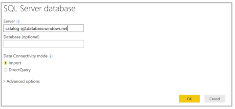
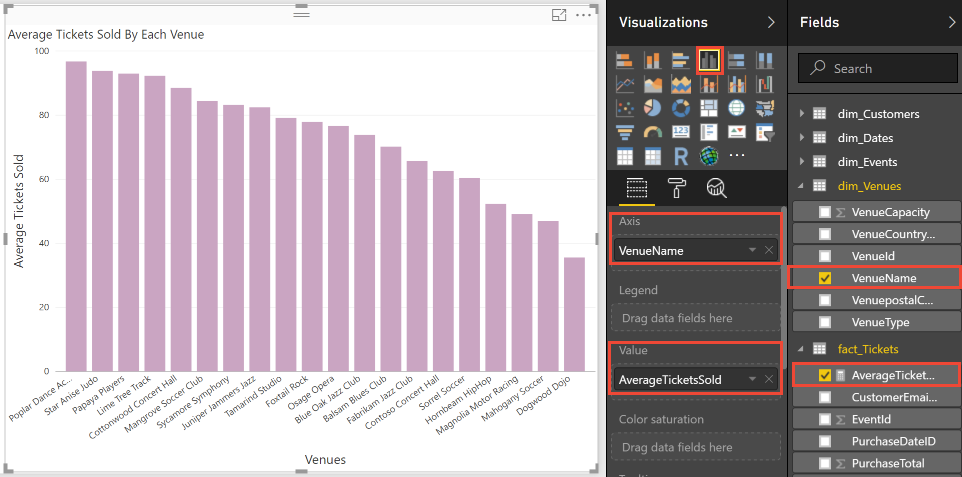

# Cross-tenant analytics using extracted data - single-tenant app
 
In this tutorial, you walk through a complete analytics scenario for a single tenant implementatoin. The scenario demonstrates how analytics can enable businesses to make smart decisions. Using data extracted from each tenant database, you use analytics to gain insights into tenant behavior, including their use of the sample Wingtip Tickets SaaS application. This scenario involves three steps: 

1.	**Extract** data from each tenant database and **Load** into an analytics store.
2.	**Transform the extracted data** for analytics processing.
3.	Use **business intelligence** tools to draw out useful insights, which can guide decision making. 

In this tutorial you learn how to:

> [!div class="checklist"]
> - Create the tenant analytics store to extract the data into.
> - Use elastic jobs to extract data from each tenant database into the analytics store.
> - Optimize the extracted data (reorganize into a star-schema).
> -	Query the analytics database.
> -	Use Power BI for data visualization to highlight trends in tenant data and make recommendation for improvements.


## Offline tenant analytics pattern

Multi-tenant SaaS applications typically have a vast amount of tenant data stored in the cloud. This data provides a rich source of insights about the operation and usage of your application, and the behavior of your tenants. These insights can guide feature development, usability improvements, and other investments in the app and platform.

Accessing data for all tenants is simple when all the data is in just one multi-tenant database. But the access is more complex when distributed at scale across potentially thousands of databases. One way to tame the complexity and to minimize the impact of analytics queries on transactional data is to extract data into a purpose designed analytics database or data warehouse.

This tutorial presents a complete analytics scenario for Wingtip Tickets SaaS application. First, *Elastic Jobs* is used to extract data from each tenant database and load it into staging tables in an analytics store. The analytics store could either be an SQL Database or a SQL Data Warehouse. For large-scale data extraction, [Azure Data Factory](../data-factory/introduction.md) is recommended.

Next, the aggregated data is transformed into a set of [star-schema](https://www.wikipedia.org/wiki/Star_schema) tables. The tables consist of a central fact table plus related dimension tables.  For Wingtip Tickets:

- The central fact table in the star-schema contains ticket data.
- The dimension tables describe venues, events, customers, and purchase dates.

Together the central fact and dimension tables enable efficient analytical processing. The star-schema used in this tutorial is shown in the following image:
 


Finally, the analytics store is queried using **PowerBI** to highlight insights into tenant behavior and their use of the Wingtip Tickets application. You run queries that:
 
- Show the relative popularity of each venue
- Highlight patterns in ticket sales for different events
- Show the relative success of different venues in selling out their event

Understanding how each tenant is using the service is used to explore options for monetizing the service and improving the service to help tenants be more successful. This tutorial provides basic examples of the kinds of insights that can be gleaned from tenant data.

## Setup

### Prerequisites

To complete this tutorial, make sure the following prerequisites are met:

- The Wingtip Tickets SaaS Database Per Tenant application is deployed. To deploy in less than five minutes, see [Deploy and explore the Wingtip SaaS application](saas-dbpertenant-get-started-deploy.md)
- The Wingtip Tickets SaaS Database Per Tenant scripts and application [source code](https://github.com/Microsoft/WingtipTicketsSaaS-DbPerTenant/) are downloaded from GitHub. See download instructions. Be sure to *unblock the zip file* before extracting its contents. Check out the [general guidance](saas-tenancy-wingtip-app-guidance-tips.md) for steps to download and unblock the Wingtip Tickets SaaS scripts.
- Power BI Desktop is installed. [Download Power BI Desktop](https://powerbi.microsoft.com/downloads/)
- The batch of additional tenants has been provisioned, see the [**Provision tenants tutorial**](saas-dbpertenant-provision-and-catalog.md).
- A job account and job account database have been created. See the appropriate steps in the [**Schema management tutorial**](saas-tenancy-schema-management.md#create-a-job-agent-database-and-new-job-agent).

### Create data for the demo

In this tutorial, analysis is performed on ticket sales data. In the current step, you generate ticket data for all the tenants.  Later this data is extracted for analysis. *Ensure you have provisioned the batch of tenants as described earlier, so that you have a meaningful amount of data*. A sufficiently large amount of data can expose a range of different ticket purchasing patterns.

1. In PowerShell ISE, open *…\Learning Modules\Operational Analytics\Tenant Analytics\Demo-TenantAnalytics.ps1*, and set the following value:
    - **$DemoScenario** = **1** Purchase tickets for events at all venues
2. Press **F5** to run the script and create ticket purchasing history for every event in each venue.  The script runs for several minutes to generate tens of thousands of tickets.

### Deploy the analytics store
Often there are numerous transactional databases that together hold all tenant data. You must aggregate the tenant data from the many transactional databases into one analytics store. The aggregation enables efficient query of the data. In this tutorial, an Azure SQL Database database is used to store the aggregated data.

In the following steps, you deploy the analytics store, which is called **tenantanalytics**. You also deploy predefined tables that are populated later in the tutorial:
1. In PowerShell ISE, open *…\Learning Modules\Operational Analytics\Tenant Analytics\Demo-TenantAnalytics.ps1* 
2. Set the $DemoScenario variable in the script to match your choice of analytics store:
    - To use SQL database without column store, set **$DemoScenario** = **2**
    - To use SQL database with column store, set **$DemoScenario** = **3**  
3. Press **F5** to run the demo script (that calls the *Deploy-TenantAnalytics<XX>.ps1* script) which creates the tenant analytics store. 

Now that you have deployed the application and filled it with interesting tenant data, use [SQL Server Management Studio (SSMS)](https://docs.microsoft.com/sql/ssms/download-sql-server-management-studio-ssms) to connect **tenants1-dpt-&lt;User&gt;** and **catalog-dpt-&lt;User&gt;** servers using Login = *developer*, Password = *P@ssword1*. See the [introductory tutorial](saas-dbpertenant-wingtip-app-overview.md) for more guidance.


In the Object Explorer, perform the following steps:

1. Expand the *tenants1-dpt-&lt;User&gt;* server.
2. Expand the Databases node, and see the list of tenant databases.
3. Expand the *catalog-dpt-&lt;User&gt;* server.
4. Verify that you see the analytics store and the jobaccount database.

See the following database items in the SSMS Object Explorer by expanding the analytics store node:

- Tables **TicketsRawData** and **EventsRawData** hold raw extracted data from the tenant databases.
- The star-schema tables are **fact_Tickets**, **dim_Customers**, **dim_Venues**, **dim_Events**, and **dim_Dates**.
- The stored procedure is used to populate the star-schema tables from the raw data tables.


## Data extraction 

### Create target groups 

Before proceeding, ensure you have deployed the job account and jobaccount database. In the next set of steps, Elastic Jobs is used to extract data from each tenant database, and to store the data in the analytics store. Then the second job shreds the data and stores it into tables in the star-schema. These two jobs run against two different target groups, namely **TenantGroup** and **AnalyticsGroup**. The extract job runs against the TenantGroup, which contains all the tenant databases. The shredding job runs against the AnalyticsGroup, which contains just the analytics store. Create the target groups by using the following steps:

1. In SSMS, connect to the **jobaccount** database in catalog-dpt-&lt;User&gt;.
2. In SSMS, open *…\Learning Modules\Operational Analytics\Tenant Analytics\ TargetGroups.sql* 
3. Modify the @User variable at the top of the script, replacing <User> with the user value used when you deployed the Wingtip SaaS app.
4. Press **F5** to run the script that creates the two target groups.

### Extract raw data from all tenants

Extensive data modifications might occur more frequently for *ticket and customer* data than for *event and venue* data. Therefore, consider extracting ticket and customer data separately and more frequently than you extract event and venue data. In this section, you define and schedule two separate jobs:

- Extract ticket and customer data.
- Extract event and venue data.

Each job extracts its data, and posts it into the analytics store. There a separate job shreds the extracted data into the analytics star-schema.

1. In SSMS, connect to the **jobaccount** database in catalog-dpt-&lt;User&gt; server.
2. In SSMS, open *...\Learning Modules\Operational Analytics\Tenant Analytics\ExtractTickets.sql*.
3. Modify @User at the top of the script, and replace <User> with the user name used when you deployed the Wingtip SaaS app 
4. Press F5 to run the script that creates and runs the job that extracts tickets and customers data from each tenant database. The job saves the data into the analytics store.
5. Query the TicketsRawData table in the tenantanalytics database, to ensure that the table is populated with tickets information from all tenants.


Repeat the preceding steps, except this time replace **\ExtractTickets.sql** with **\ExtractVenuesEvents.sql** in step 2.

Successfully running the job populates the EventsRawData table in the analytics store with new events and venues information from all tenants. 

## Data reorganization

### Shred extracted data to populate star-schema tables

The next step is to shred the extracted raw data into a set of tables that are optimized for analytics queries. A star-schema is used. A central fact table holds individual ticket sales records. Other tables are populated with related data about venues, events, and customers. And there are time dimension tables. 

In this section of the tutorial, you define and run a job that merges the extracted raw data with the data in the star-schema tables. After the merge job is finished, the raw data is deleted, leaving the tables ready to be populated by the next tenant data extract job.

1. In SSMS, connect to the **jobaccount** database in catalog-dpt-&lt;User&gt;.
2. In SSMS, open *…\Learning Modules\Operational Analytics\Tenant Analytics\ShredRawExtractedData.sql*.
3. Press **F5** to run the script to define a job that calls the sp_ShredRawExtractedData stored procedure in the analytics store.
4. Allow enough time for the job to run successfully.
    - Check the **Lifecycle** column of jobs.jobs_execution table for the status of job. Ensure that the job **Succeeded** before proceeding. A successful run displays data similar to the following chart:


## Data exploration

### Visualize tenant data

The data in the star-schema table provides all the ticket sales data needed for your analysis. To make it easier to see trends in large data sets, you need to visualize it graphically.  In this section, you learn how to use **Power BI** to manipulate and visualize the tenant data you have extracted and organized.

Use the following steps to connect to Power BI, and to import the views you created earlier:

1. Launch Power BI desktop.
2. From the Home ribbon, select **Get Data**, and select **More…** from the menu.
3. In the **Get Data** window, select Azure SQL Database.
4. In the database login window, enter your server name (catalog-dpt-&lt;User&gt;.database.windows.net). Select **Import** for **Data Connectivity Mode**, and then click OK. 

    

5. Select **Database** in the left pane, then enter user name = *developer*, and enter password = *P@ssword1*. Click **Connect**.  

    

6. In the **Navigator** pane, under the analytics database, select the star-schema tables: fact_Tickets, dim_Events, dim_Venues, dim_Customers and dim_Dates. Then select **Load**. 

Congratulations! You have successfully loaded the data into Power BI. Now you can start exploring interesting visualizations to help gain insights into your tenants. Next you walk through how analytics can enable you to provide data-driven recommendations to the Wingtip Tickets business team. The recommendations can help to optimize the business model and customer experience.

You start by analyzing ticket sales data to see the variation in usage across the venues. Select the following options in Power BI to plot a bar chart of the total number of tickets sold by each venue. Due to random variation in the ticket generator, your results may be different.
 


The preceding plot confirms that the number of tickets sold by each venue varies. Venues that sell more tickets are using your service more heavily than venues that sell fewer tickets. There may be an opportunity here to tailor resource allocation according to different tenant needs.

You can further analyze the data to see how ticket sales vary over time. Select the following options in Power BI to plot the total number of tickets sold each day for a period of 60 days.
 


The preceding chart displays that ticket sales spike for some venues. These spikes reinforce the idea that some venues might be consuming system resources disproportionately. So far there is no obvious pattern in when the spikes occur.

Next you want to further investigate the significance of these peak sale days. When do these peaks occur after tickets go on sale? To plot tickets sold per day, select the following options in Power BI.


The preceding plot shows that some venues sell a lot of tickets on the first day of sale. As soon as tickets go on sale at these venues, there seems to be a mad rush. This burst of activity by a few venues might impact the service for other tenants.

You can drill into the data again to see if this mad rush is true for all events hosted by these venues. In previous plots, you observed that Contoso Concert Hall sells a lot of tickets, and that Contoso also has a spike in ticket sales on certain days. Play around with Power BI options to plot cumulative ticket sales for Contoso Concert Hall, focusing on sale trends for each of its events. Do all events follow the same sale pattern?


The preceding plot for Contoso Concert Hall shows that the mad rush does not happen for all events. Play around with the filter options to see sale trends for other venues.

The insights into ticket selling patterns might lead Wingtip Tickets to optimize their business model. Instead of charging all tenants equally, perhaps Wingtip should introduce service tiers with different compute sizes. Larger venues that need to sell more tickets per day could be offered a higher tier with a higher service level agreement (SLA). Those venues could have their databases placed in pool with higher per-database resource limits. Each service tier could have an hourly sales allocation, with additional fees charged for exceeding the allocation. Larger venues that have periodic bursts of sales would benefit from the higher tiers, and Wingtip Tickets can monetize their service more efficiently.

Meanwhile, some Wingtip Tickets customers complain that they struggle to sell enough tickets to justify the service cost. Perhaps in these insights there is an opportunity to boost ticket sales for underperforming venues. Higher sales would increase the perceived value of the service. Right click fact_Tickets and select **New measure**. Enter the following expression for the new measure called **AverageTicketsSold**:

```
AverageTicketsSold = AVERAGEX( SUMMARIZE( TableName, TableName[Venue Name] ), CALCULATE( SUM(TableName[Tickets Sold] ) ) )
```

Select the following visualization options to plot the percentage tickets sold by each venue to determine their relative success.



The preceding plot shows that even though most venues sell more than 80% of their tickets, some are struggling to fill more than half the seats. Play around with the Values Well to select maximum or minimum percentage of tickets sold for each venue.

Earlier you deepened your analysis to discover that ticket sales tend to follow predictable patterns. This discovery might let Wingtip Tickets help underperforming venues boost ticket sales by recommending dynamic pricing. This discover could reveal an opportunity to employ machine learning techniques to predict ticket sales for each event. Predictions could also be made for the impact on revenue of offering discounts on ticket sales. Power BI Embedded could be integrated into an event management application. The integration could help visualize predicted sales and the effect of different discounts. The application could help devise an optimum discount to be applied directly from the analytics display.

You have observed trends in tenant data from the WingTip application. You can contemplate other ways the app can inform business decisions for SaaS application vendors. Vendors can better cater to the needs of their tenants. Hopefully this tutorial has equipped you with tools necessary to perform analytics on tenant data to empower your businesses to make data-driven decisions.

## Next steps

In this tutorial, you learned how to:

> [!div class="checklist"]
> - Deployed a tenant analytics database with pre-defined star schema tables
> - Used elastic jobs to extract data from all the tenant database
> - Merge the extracted data into tables in a star-schema designed for analytics
> -	Query an analytics database 
> -	Use Power BI for data visualization to observe trends in tenant data 

Congratulations!

## Additional resources

- Additional [tutorials that build upon the Wingtip SaaS application](saas-dbpertenant-wingtip-app-overview.md#sql-database-wingtip-saas-tutorials).
- [Elastic Jobs](sql-database-elastic-jobs-overview.md).
- [Cross-tenant analytics using extracted data - multi-tenant app](saas-multitenantdb-tenant-analytics.md)