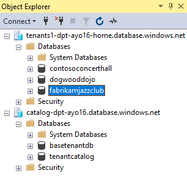

# General guidance for working with Wingtip Tickets sample SaaS apps

This article contains general guidance for running the Wingtip Tickets sample SaaS applications that use Azure SQL Database. 

## Download and unblock the Wingtip Tickets SaaS scripts

Executable contents (scripts, dlls) may be blocked by Windows when zip files are downloaded from an external source and extracted. When extracting the scripts from a zip file, **follow the steps below to unblock the .zip file before extracting**. This ensures the scripts are allowed to run.

1. Browse to the Wingtip Tickets SaaS GitHub repo for the database tenancy pattern you wish to explore: 
    - [WingtipTicketsSaaS-StandaloneApp](https://github.com/Microsoft/WingtipTicketsSaaS-StandaloneApp)
    - [WingtipTicketsSaaS-DbPerTenant](https://github.com/Microsoft/WingtipTicketsSaaS-DbPerTenant)
    - [WingtipTicketsSaaS-MultiTenantDb](https://github.com/Microsoft/WingtipTicketsSaaS-MultiTenantDb)
2. Click **Clone or download**.
3. Click **Download zip** and save the file.
4. Right-click the zip file, and select **Properties**. The zip file name will correspond to the repo name. (ex. _WingtipTicketsSaaS-DbPerTenant-master.zip_)
5. On the **General** tab, select **Unblock**.
6. Click **OK**.
7. Extract the files.

Scripts are located in the *..\\Learning Modules* folder.

## Working with the Wingtip Tickets PowerShell scripts

To get the most out of the sample you need to dive into the provided scripts. Use breakpoints and step through the scripts as they execute and examine how the different SaaS patterns are implemented. To easily step through the provided scripts and modules for the best understanding, we recommend using the [PowerShell ISE](https://msdn.microsoft.com/powershell/scripting/core-powershell/ise/introducing-the-windows-powershell-ise).

### Update the configuration file for your deployment

Edit the **UserConfig.psm1** file with the resource group and user value that you set during deployment:

1. Open the *PowerShell ISE* and load ...\\Learning Modules\\*UserConfig.psm1* 
2. Update *ResourceGroupName* and *Name* with the specific values for your deployment (on lines 10 and 11 only).
3. Save the changes!

Setting these values here simply keeps you from having to update these deployment-specific values in every script.

### Execute the scripts by pressing F5

Several scripts use *$PSScriptRoot* to navigate folders, and *$PSScriptRoot* is only evaluated when scripts are executed by pressing **F5**.  Highlighting and running a selection (**F8**) can result in errors, so press **F5** when running scripts.

### Step through the scripts to examine the implementation

The best way to understand the scripts is by stepping through them to see what they do. Check out the included **Demo-** scripts that present an easy to follow high-level workflow. The **Demo-** scripts show the steps required to accomplish each task, so set breakpoints and drill deeper into the individual calls to see implementation details for the different SaaS patterns.

Tips for exploring and stepping through PowerShell scripts:

- Open **Demo-** scripts in the PowerShell ISE.
- Execute or continue with **F5** (using **F8** is not advised because *$PSScriptRoot* is not evaluated when running selections of a script).
- Place breakpoints by clicking or selecting a line and pressing **F9**.
- Step over a function or script call using **F10**.
- Step into a function or script call using **F11**.
- Step out of the current function or script call using **Shift + F11**.

## Explore database schema and execute SQL queries using SSMS

Use [SQL Server Management Studio (SSMS)](https://docs.microsoft.com/sql/ssms/download-sql-server-management-studio-ssms) to connect and browse the application servers and databases.

The deployment initially has tenants and catalog SQL Database servers to connect to. The naming of the servers depends on the database tenancy pattern (see below for specifics). 

   - **Standalone application:** servers for each tenant (ex. *contosoconcerthall-&lt;User&gt;* server) and *catalog-sa-&lt;User&gt;*
   - **Database per tenant:** *tenants1-dpt-&lt;User&gt;*  and *catalog-dpt-&lt;User&gt;* servers
   - **Multi-tenant database:** *tenants1-mt-&lt;User&gt;* and *catalog-mt-&lt;User&gt;* servers

To ensure a successful demo connection, all servers have a [firewall rule](sql-database-firewall-configure.md) allowing all IPs through.

1. Open *SSMS* and connect to the tenants. The server name depends on the database tenancy pattern you've selected (see below for specifics):
    - **Standalone application:** servers of individual tenants (ex. *contosoconcerthall-&lt;User&gt;.database.windows.net*) 
    - **Database per tenant:** *tenants1-dpt-&lt;User&gt;.database.windows.net*
    - **Multi-tenant database:** *tenants1-mt-&lt;User&gt;.database.windows.net* 
2. Click **Connect** > **Database Engine...**:

   

3. Demo credentials are: Login = *developer*, Password = *P@ssword1*

    The image below demonstrates the login for the *Database per tenant* pattern. 
    
    
   

4. Repeat steps 2-3 and connect to the catalog server (see below for specific server names based on the database tenancy pattern selected)
    - **Standalone application:** *catalog-sa-&lt;User&gt;.database.windows.net*
    - **Database per tenant:** *catalog-dpt-&lt;User&gt;.database.windows.net*
    - **Multi-tenant database:** *catalog-mt-&lt;User&gt;.database.windows.net*

After successfully connecting you should see all servers. Your list of databases might be different, depending on the tenants you have provisioned.

The image below demonstrates the log in for the *Database per tenant* pattern.

## Next steps
- [Deploy the Wingtip Tickets SaaS Standalone Application](saas-standaloneapp-get-started-deploy.md)
- [Deploy the Wingtip Tickets SaaS Database per Tenant application](saas-dbpertenant-get-started-deploy.md)
- [Deploy the Wingtip Tickets SaaS Multi-tenant Database application](saas-multitenantdb-get-started-deploy.md)

