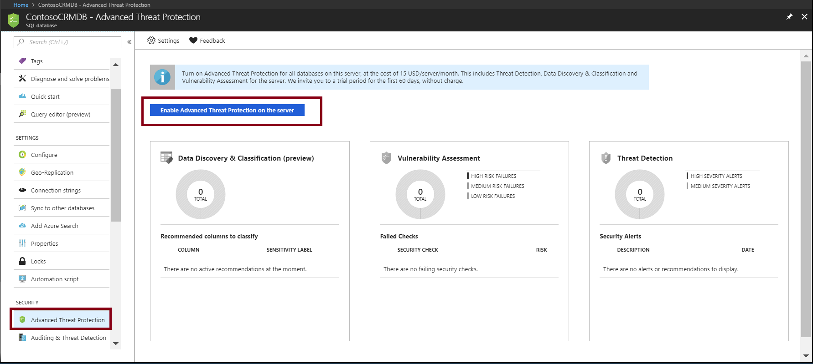
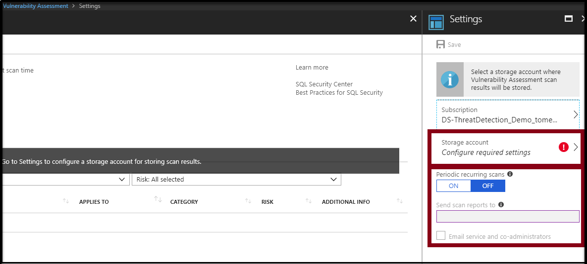

# Advanced Threat Protection for Azure SQL Database

SQL Advanced Threat Protection is a unified package for advanced SQL security capabilities. It includes functionality for discovering and classifying sensitive data, surfacing and mitigating potential database vulnerabilities, and detecting anomalous activities that could indicate a threat to your database. It provides a single go-to location for enabling and managing these capabilities. 

## Overview

SQL Advanced Threat Protection (ATP) provides a set of advanced SQL security capabilities, including Data Discovery & Classification, Vulnerability Assessment, and Threat Detection. 

- [Data Discovery & Classification](sql-database-data-discovery-and-classification.md) (currently in preview) provides capabilities built into Azure SQL Database for discovering, classifying, labeling & protecting the sensitive data in your databases. It can be used to provide visibility into your database classification state, and to track the access to sensitive data within the database and beyond its borders.
- [Vulnerability Assessment](sql-vulnerability-assessment.md) is an easy to configure service that can discover, track, and help you remediate potential database vulnerabilities. It provides visibility into your security state, and includes actionable steps to resolve security issues, and enhance your database fortifications.
- [Threat Detection](sql-database-threat-detection.md) detects anomalous activities indicating unusual and potentially harmful attempts to access or exploit your database. It continuously monitors your database for suspicious activities, and provides immediate security alerts on potential vulnerabilities, SQL injection attacks, and anomalous database access patterns. Threat Detection alerts provide details of the suspicious activity and recommend action on how to investigate and mitigate the threat.

Enable SQL ATP once to enable all of these included features. With one click, you can enable ATP on your entire database server, applying to all databases on the server. 

ATP pricing aligns with Azure Security Center standard tier at $15/node/month, where each protected SQL Database server is counted as one node. The first 60 days after enablement are considered a free trial period and are not charged. For more information, see the [Azure Security Center pricing page](https://azure.microsoft.com/pricing/details/security-center/).

## Getting Started with ATP 
The following steps get you started with ATP. 

## 1. Enable ATP

Enable ATP by navigating to **Advanced Threat Protection** under the **Security** heading in your Azure SQL Database pane. To enable ATP for all databases on the server, click **Enable Advanced Threat Protection on the server**.

 

> [!NOTE]
> The cost of ATP is $15/node/month, where a node is the entire SQL logical server. You are thus paying only once for protecting all databases on the server with ATP. The first 60 days are considered a free trial.

## 2. Configure Vulnerability Assessment

To start using Vulnerability Assessment, you need to configure a storage account where scan results are saved. To do so, click on the Vulnerability Assessment card.

 

Select or create a storage account for saving scan results. You can also turn on periodic recurring scans to configure Vulnerability Assessment to run automatic scans once per week. A scan result summary is sent to the email address(es) you provide.

 

## 3. Start classifying data, tracking vulnerabilities, and investigating threat alerts

Click the **Data Discovery and Classification** card to see recommended sensitive columns to classify and to classify your data with persistent sensitivity labels. Click the **Vulnerability Assessment** card to view and manage vulnerability scans and reports, and to track your security stature. If security alerts have been received, click the **Threat Detection** card to view details of the alerts and to see a consolidated report on all alerts in your Azure subscription via the Azure Security Center security alerts page.

## 4. Manage ATP settings on your SQL server

To view and manage Advanced Threat Protection settings, navigate to **Advanced Threat Protection** under the **Security** heading in your SQL server pane. On this page, you can enable or disable ATP, and modify Threat Detection settings for your entire SQL server.

 

## 5. Manage ATP settings for a SQL database

To override ATP Threat Detection settings for a particular database, check the **Enable Advanced Threat Protection at the database level** checkbox. Use this option only if you have a particular requirement to receive separate threat detection alerts for the individual database, in place of or in addition to the alerts received for all databases on the server. 

Once the checkbox is selected, click **Threat Detection settings for this database** and then configure the relevant settings for this database.

 

Advanced Threat Protection settings for your server can also be reached from the ATP database pane. Click **Settings** in the main ATP pane, and then click **View Advanced Threat Protection server settings**. 

 

## Next steps 

- Learn more about [Data Discovery & Classification](sql-database-data-discovery-and-classification.md) 
- Learn more about [Vulnerability Assessment](sql-vulnerability-assessment.md) 
- Learn more about [Threat Detection](sql-database-threat-detection.md)
- Learn more about [Azure Security Center](https://docs.microsoft.com/azure/security-center/security-center-intro)
