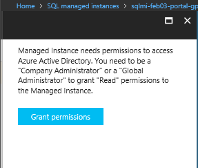
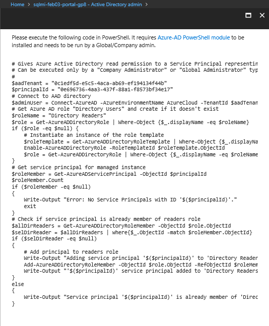
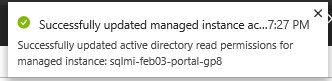
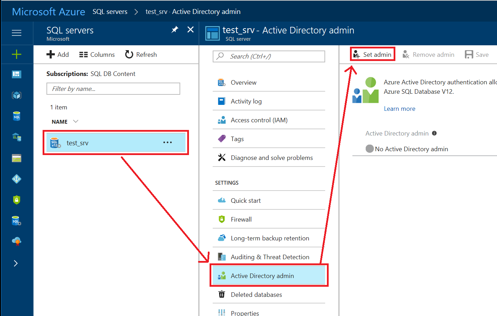
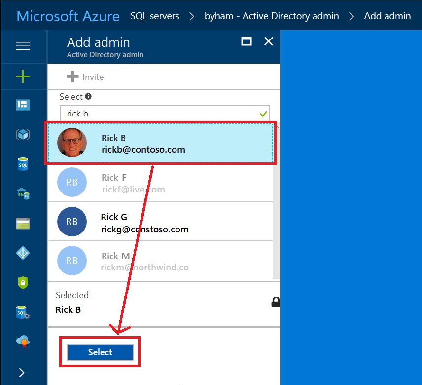

# Configure and manage Azure Active Directory authentication with SQL

This article shows you how to create and populate Azure AD, and then use Azure AD with Azure [SQL Database](sql-database-technical-overview.md) and [SQL Data Warehouse](../sql-data-warehouse/sql-data-warehouse-overview-what-is.md). For an overview, see [Azure Active Directory Authentication](sql-database-aad-authentication.md).

> [!NOTE]
> This topic applies to Azure SQL server, and to both SQL Database and SQL Data Warehouse databases that are created on the Azure SQL server. For simplicity, SQL Database is used when referring to both SQL Database and SQL Data Warehouse.
> [!IMPORTANT]  
> Connecting to SQL Server running on an Azure VM is not supported using an Azure Active Directory account. Use a domain Active Directory account instead.

## Create and populate an Azure AD

Create an Azure AD and populate it with users and groups. Azure AD can be the initial Azure AD managed domain. Azure AD can also be an on-premises Active Directory Domain Services that is federated with the Azure AD.

For more information, see [Integrating your on-premises identities with Azure Active Directory](../active-directory/hybrid/whatis-hybrid-identity.md), [Add your own domain name to Azure AD](../active-directory/active-directory-domains-add-azure-portal.md), [Microsoft Azure now supports federation with Windows Server Active Directory](https://azure.microsoft.com/blog/2012/11/28/windows-azure-now-supports-federation-with-windows-server-active-directory/), [Administering your Azure AD directory](../active-directory/fundamentals/active-directory-administer.md), [Manage Azure AD using Windows PowerShell](/powershell/azure/overview?view=azureadps-2.0), and [Hybrid Identity Required Ports and Protocols](../active-directory/hybrid/reference-connect-ports.md).

## Associate or add an Azure subscription to Azure Active Directory

1. Associate your Azure subscription to Azure Active Directory by making the directory a trusted directory for the Azure subscription hosting the database. For details, see [How Azure subscriptions are associated with Azure AD](../active-directory/fundamentals/active-directory-how-subscriptions-associated-directory.md).
2. Use the directory switcher in the Azure portal to switch to the subscription associated with domain.

   **Additional information:** Every Azure subscription has a trust relationship with an Azure AD instance. This means that it trusts that directory to authenticate users, services, and devices. Multiple subscriptions can trust the same directory, but a subscription trusts only one directory. This trust relationship that a subscription has with a directory is unlike the relationship that a subscription has with all other resources in Azure (websites, databases, and so on), which are more like child resources of a subscription. If a subscription expires, then access to those other resources associated with the subscription also stops. But the directory remains in Azure, and you can associate another subscription with that directory and continue to manage the directory users. For more information about resources, see [Understanding resource access in Azure](../active-directory/active-directory-b2b-admin-add-users.md). To learn more about this trusted relationship see [How to associate or add an Azure subscription to Azure Active Directory](../active-directory/fundamentals/active-directory-how-subscriptions-associated-directory.md).

## Create an Azure AD administrator for Azure SQL server

Each Azure SQL server (which hosts a SQL Database or SQL Data Warehouse) starts with a single server administrator account that is the administrator of the entire Azure SQL server. A second SQL Server administrator must be created, that is an Azure AD account. This principal is created as a contained database user in the master database. As administrators, the server administrator accounts are members of the **db_owner** role in every user database, and enter each user database as the **dbo** user. For more information about the server administrator accounts, see [Managing Databases and Logins in Azure SQL Database](sql-database-manage-logins.md).

When using Azure Active Directory with geo-replication, the Azure Active Directory administrator must be configured for both the primary and the secondary servers. If a server does not have an Azure Active Directory administrator, then Azure Active Directory logins and users receive a "Cannot connect" to server error.

> [!NOTE]
> Users that are not based on an Azure AD account (including the Azure SQL server administrator account), cannot create Azure AD-based users, because they do not have permission to validate proposed database users with the Azure AD.

## Provision an Azure Active Directory administrator for your Managed Instance

> [!IMPORTANT]
> Only follow these steps if you are provisioning a Managed Instance. This operation can only be executed by Global/Company administrator in Azure AD. Following steps describe the process of granting permissions for users with different privileges in directory.

Your Managed Instance needs permissions to read Azure AD to successfully accomplish tasks such as authentication of users through security group membership or creation of new users. For this to work, you need to grant permissions to Managed Instance to read Azure AD. There are two ways to do it: from Portal and PowerShell. The following steps both methods.

1. In the Azure portal, in the upper-right corner, select your connection to drop down a list of possible Active Directories.
2. Choose the correct Active Directory as the default Azure AD.

   This step links the subscription associated with Active Directory with Managed Instance making sure that the same subscription is used for both Azure AD and the Managed Instance.
3. Navigate to Managed Instance and select one that you want to use for Azure AD integration.

   

4. Select on banner on top of Active Directory admin page. If you are logged in as Global/Company administrator in Azure AD, you can do it from Azure portal or using PowerShell.

    

    

    If you are logged in as Global/Company administrator in Azure AD, you can do it from the Azure portal or execute a PowerShell script.

5. After operation is successfully completed, following notification will show up in top right corner:

    

6. Now you can choose your Azure AD admin for your Managed Instance. For that, on the Active Directory admin page, select **Set admin** command.

    

7. In the Add admin page, search for a user, select the user or group to be an administrator, and then select **Select**.

   The Active Directory admin page shows all members and groups of your Active Directory. Users or groups that are grayed out cannot be selected because they are not supported as Azure AD administrators. See the list of supported admins in [Azure AD Features and Limitations](sql-database-aad-authentication.md#azure-ad-features-and-limitations). Role-based access control (RBAC) applies only to the Azure portal and is not propagated to SQL Server.

    

8. At the top of the Active Directory admin page, select **Save**.

    

    The process of changing the administrator may take several minutes. Then the new administrator appears in the Active Directory admin box.

> [!IMPORTANT]
> When setting up the Azure AD admin, the new admin name (user or group) cannot already be present in the virtual master database as a SQL Server authentication user. If present, the Azure AD admin setup will fail and rolling back its creation, indicating that such an admin (name) already exists. Since such a SQL Server authentication user is not part of the Azure AD, any effort to connect to the server using Azure AD authentication fails.
> [!TIP]
> To later remove an Admin, at the top of the Active Directory admin page, select **Remove admin**, and then select **Save**.

## Provision an Azure Active Directory administrator for your Azure SQL Database server

> [!IMPORTANT]
> Only follow these steps if you are provisioning an Azure SQL Database server or Data Warehouse.

The following two procedures show you how to provision an Azure Active Directory administrator for your Azure SQL server in the Azure portal and by using PowerShell.

### Azure portal

1. In the [Azure portal](https://portal.azure.com/), in the upper-right corner, select your connection to drop down a list of possible Active Directories. Choose the correct Active Directory as the default Azure AD. This step links the subscription-associated Active Directory with Azure SQL server making sure that the same subscription is used for both Azure AD and SQL Server. (The Azure SQL server can be hosting either Azure SQL Database or Azure SQL Data Warehouse.)
    ![choose-ad][8]

2. In the left banner select **All services**, and in the filter type in **SQL server**. Select **Sql Servers**.

    

    >[!NOTE]
    > On this page, before you select **SQL servers**, you can select the **star** next to the name to *favorite* the category and add **SQL servers** to the left navigation bar.

3. On **SQL Server** page, select **Active Directory admin**.
4. In the **Active Directory admin** page, select **Set admin**.
      

5. In the **Add admin** page, search for a user, select the user or group to be an administrator, and then select **Select**. (The Active Directory admin page shows all members and groups of your Active Directory. Users or groups that are grayed out cannot be selected because they are not supported as Azure AD administrators. (See the list of supported admins in the **Azure AD Features and Limitations** section of [Use Azure Active Directory Authentication for authentication with SQL Database or SQL Data Warehouse](sql-database-aad-authentication.md).) Role-based access control (RBAC) applies only to the portal and is not propagated to SQL Server.
      

6. At the top of the **Active Directory admin** page, select **SAVE**.
    

The process of changing the administrator may take several minutes. Then the new administrator appears in the **Active Directory admin** box.

   > [!NOTE]
   > When setting up the Azure AD admin, the new admin name (user or group) cannot already be present in the virtual master database as a SQL Server authentication user. If present, the Azure AD admin setup will fail; rolling back its creation and indicating that such an admin (name) already exists. Since such a SQL Server authentication user is not part of the Azure AD, any effort to connect to the server using Azure AD authentication fails.

To later remove an Admin, at the top of the **Active Directory admin** page, select **Remove admin**, and then select **Save**.

### PowerShell

To run PowerShell cmdlets, you need to have Azure PowerShell installed and running. For detailed information, see [How to install and configure Azure PowerShell](/powershell/azure/overview). To provision an Azure AD admin, execute the following Azure PowerShell commands:

- Connect-AzureRmAccount
- Select-AzureRmSubscription

Cmdlets used to provision and manage Azure AD admin:

| Cmdlet name | Description |
| --- | --- |
| [Set-AzureRmSqlServerActiveDirectoryAdministrator](/powershell/module/azurerm.sql/set-azurermsqlserveractivedirectoryadministrator) |Provisions an Azure Active Directory administrator for Azure SQL server or Azure SQL Data Warehouse. (Must be from the current subscription.) |
| [Remove-AzureRmSqlServerActiveDirectoryAdministrator](/powershell/module/azurerm.sql/remove-azurermsqlserveractivedirectoryadministrator) |Removes an Azure Active Directory administrator for Azure SQL server or Azure SQL Data Warehouse. |
| [Get-AzureRmSqlServerActiveDirectoryAdministrator](/powershell/module/azurerm.sql/get-azurermsqlserveractivedirectoryadministrator) |Returns information about an Azure Active Directory administrator currently configured for the Azure SQL server or Azure SQL Data Warehouse. |

Use PowerShell command get-help to see more information for each of these commands, for example ``get-help Set-AzureRmSqlServerActiveDirectoryAdministrator``.

The following script provisions an Azure AD administrator group named **DBA_Group** (object id `40b79501-b343-44ed-9ce7-da4c8cc7353f`) for the **demo_server** server in a resource group named **Group-23**:

```powershell
Set-AzureRmSqlServerActiveDirectoryAdministrator -ResourceGroupName "Group-23"
-ServerName "demo_server" -DisplayName "DBA_Group"
```

The **DisplayName** input parameter accepts either the Azure AD display name or the User Principal Name. For example, ``DisplayName="John Smith"`` and ``DisplayName="johns@contoso.com"``. For Azure AD groups only the Azure AD display name is supported.

> [!NOTE]
> The Azure PowerShell  command ```Set-AzureRmSqlServerActiveDirectoryAdministrator``` does not prevent you from provisioning Azure AD admins for unsupported users. An unsupported user can be provisioned, but can not connect to a database.

The following example uses the optional **ObjectID**:

```powershell
Set-AzureRmSqlServerActiveDirectoryAdministrator -ResourceGroupName "Group-23"
-ServerName "demo_server" -DisplayName "DBA_Group" -ObjectId "40b79501-b343-44ed-9ce7-da4c8cc7353f"
```

> [!NOTE]
> The Azure AD **ObjectID** is required when the **DisplayName** is not unique. To retrieve the **ObjectID** and **DisplayName** values, use the Active Directory section of Azure Classic Portal, and view the properties of a user or group.

The following example returns information about the current Azure AD admin for Azure SQL server:

```powershell
Get-AzureRmSqlServerActiveDirectoryAdministrator -ResourceGroupName "Group-23" -ServerName "demo_server" | Format-List
```

The following example removes an Azure AD administrator:

```powershell
Remove-AzureRmSqlServerActiveDirectoryAdministrator -ResourceGroupName "Group-23" -ServerName "demo_server"
```

You can also provision an Azure Active Directory Administrator by using the REST APIs. For more information, see [Service Management REST API Reference and Operations for Azure SQL Database Operations for Azure SQL Database](https://msdn.microsoft.com/library/azure/dn505719.aspx)

### CLI  

You can also provision an Azure AD admin by calling the following CLI commands:
| Command | Description |
| --- | --- |
|[az sql server ad-admin create](https://docs.microsoft.com/cli/azure/sql/server/ad-admin#az-sql-server-ad-admin-create) |Provisions an Azure Active Directory administrator for Azure SQL server or Azure SQL Data Warehouse. (Must be from the current subscription.) |
|[az sql server ad-admin delete](https://docs.microsoft.com/cli/azure/sql/server/ad-admin#az-sql-server-ad-admin-delete) |Removes an Azure Active Directory administrator for Azure SQL server or Azure SQL Data Warehouse. |
|[az sql server ad-admin list](https://docs.microsoft.com/cli/azure/sql/server/ad-admin#az-sql-server-ad-admin-list) |Returns information about an Azure Active Directory administrator currently configured for the Azure SQL server or Azure SQL Data Warehouse. |
|[az sql server ad-admin update](https://docs.microsoft.com/cli/azure/sql/server/ad-admin#az-sql-server-ad-admin-update) |Updates the Active Directory administrator for an Azure SQL server or Azure SQL Data Warehouse. |

For more information about CLI commands, see [SQL - az sql](https://docs.microsoft.com/cli/azure/sql/server).  

## Configure your client computers

On all client machines, from which your applications or users connect to Azure SQL Database or Azure SQL Data Warehouse using Azure AD identities, you must install the following software:

- .NET Framework 4.6 or later from [https://msdn.microsoft.com/library/5a4x27ek.aspx](https://msdn.microsoft.com/library/5a4x27ek.aspx).
- Azure Active Directory Authentication Library for SQL Server (**ADALSQL.DLL**) is available in multiple languages (both x86 and amd64) from the download center at [Microsoft Active Directory Authentication Library for Microsoft SQL Server](http://www.microsoft.com/download/details.aspx?id=48742).

You can meet these requirements by:

- Installing either [SQL Server 2016 Management Studio](https://msdn.microsoft.com/library/mt238290.aspx) or [SQL Server Data Tools for Visual Studio 2015](https://msdn.microsoft.com/library/mt204009.aspx) meets the .NET Framework 4.6 requirement.
- SSMS installs the x86 version of **ADALSQL.DLL**.
- SSDT installs the amd64 version of **ADALSQL.DLL**.
- The latest Visual Studio from [Visual Studio Downloads](https://www.visualstudio.com/downloads/download-visual-studio-vs) meets the .NET Framework 4.6 requirement, but does not install the required amd64 version of **ADALSQL.DLL**.

## Create contained database users in your database mapped to Azure AD identities

Azure Active Directory authentication requires database users to be created as contained database users. A contained database user based on an Azure AD identity, is a database user that does not have a login in the master database, and which maps to an identity in the Azure AD directory that is associated with the database. The Azure AD identity can be either an individual user account or a group. For more information about contained database users, see [Contained Database Users- Making Your Database Portable](https://msdn.microsoft.com/library/ff929188.aspx).

> [!NOTE]
> Database users (with the exception of administrators) cannot be created using the Azure portal. RBAC roles are not propagated to SQL Server, SQL Database, or SQL Data Warehouse. Azure RBAC roles are used for managing Azure Resources, and do not apply to database permissions. For example, the **SQL Server Contributor** role does not grant access to connect to the SQL Database or SQL Data Warehouse. The access permission must be granted directly in the database using Transact-SQL statements.
>

To create an Azure AD-based contained database user (other than the server administrator that owns the database), connect to the database with an Azure AD identity, as a user with at least the **ALTER ANY USER** permission. Then use the following Transact-SQL syntax:

```sql
CREATE USER <Azure_AD_principal_name> FROM EXTERNAL PROVIDER;
```

*Azure_AD_principal_name* can be the user principal name of an Azure AD user or the display name for an Azure AD group.

**Examples:**
To create a contained database user representing an Azure AD federated or managed domain user:

```sql
CREATE USER [bob@contoso.com] FROM EXTERNAL PROVIDER;
CREATE USER [alice@fabrikam.onmicrosoft.com] FROM EXTERNAL PROVIDER;
```

To create a contained database user representing an Azure AD or federated domain group, provide the display name of a security group:

```sql
CREATE USER [ICU Nurses] FROM EXTERNAL PROVIDER;
```

To create a contained database user representing an application that connects using an Azure AD token:

```sql
CREATE USER [appName] FROM EXTERNAL PROVIDER;
```

> [!TIP]
> You cannot directly create a user from an Azure Active Directory other than the Azure Active
Directory that is associated with your Azure subscription. However, members of other Active Directories that are imported users in the associated Active Directory (known as external users) can be added to an Active Directory group in the tenant Active Directory. By creating a contained database user for that AD group, the users from the external Active Directory can gain access to SQL Database.

For more information about creating contained database users based on Azure Active Directory identities, see [CREATE USER (Transact-SQL)](http://msdn.microsoft.com/library/ms173463.aspx).

> [!NOTE]
> Removing the Azure Active Directory administrator for Azure SQL server prevents any Azure AD authentication user from connecting to the server. If necessary, unusable Azure AD users can be dropped manually by a SQL Database administrator.
> [!NOTE]
> If you receive a **Connection Timeout Expired**, you may need to set the `TransparentNetworkIPResolution`
parameter of the connection string to false. For more information, see [Connection timeout issue with .NET Framework 4.6.1 - TransparentNetworkIPResolution](https://blogs.msdn.microsoft.com/dataaccesstechnologies/2016/05/07/connection-timeout-issue-with-net-framework-4-6-1-transparentnetworkipresolution/).

When you create a database user, that user receives the **CONNECT** permission and can connect to that database as a member of the **PUBLIC** role. Initially the only permissions available to the user are any permissions granted to the **PUBLIC** role, or any permissions granted to any Azure AD groups that they are a member of. Once you provision an Azure AD-based contained database user, you can grant the user additional permissions, the same way as you grant permission to any other type of user. Typically grant permissions to database roles, and add users to roles. For more information, see [Database Engine Permission Basics](http://social.technet.microsoft.com/wiki/contents/articles/4433.database-engine-permission-basics.aspx). For more information about special SQL Database roles, see [Managing Databases and Logins in Azure SQL Database](sql-database-manage-logins.md).
A federated domain user account that is imported into a managed domain as an external user, must use the managed domain identity.

> [!NOTE]
> Azure AD users are marked in the database metadata with type E (EXTERNAL_USER) and for groups with type X (EXTERNAL_GROUPS). For more information, see [sys.database_principals](https://msdn.microsoft.com/library/ms187328.aspx).
>

## Connect to the user database or data warehouse by using SSMS or SSDT  

To confirm the Azure AD administrator is properly set up, connect to the **master** database using the Azure AD administrator account.
To provision an Azure AD-based contained database user (other than the server administrator that owns the database), connect to the database with an Azure AD identity that has access to the database.

> [!IMPORTANT]
> Support for Azure Active Directory authentication is available with [SQL Server 2016 Management Studio](https://msdn.microsoft.com/library/mt238290.aspx) and [SQL Server Data Tools](https://msdn.microsoft.com/library/mt204009.aspx) in Visual Studio 2015. The August 2016 release of SSMS also includes support for Active Directory Universal Authentication, which allows administrators to require Multi-Factor Authentication using a phone call, text message, smart cards with pin, or mobile app notification.

## Using an Azure AD identity to connect using SSMS or SSDT  

The following procedures show you how to connect to a SQL database with an Azure AD identity using SQL Server Management Studio or SQL Server Database Tools.

### Active Directory integrated authentication

Use this method if you are logged in to Windows using your Azure Active Directory credentials from a federated domain.

1. Start Management Studio or Data Tools and in the **Connect to Server** (or **Connect to Database Engine**) dialog box, in the **Authentication** box, select **Active Directory - Integrated**. No password is needed or can be entered because your existing credentials will be presented for the connection.

    ![Select AD Integrated Authentication][11]
2. Select the **Options** button, and on the **Connection Properties** page, in the **Connect to database** box, type the name of the user database you want to connect to. (The **AD domain name or tenant ID**” option is only supported for **Universal with MFA connection** options, otherwise it is greyed out.)  

    ![Select the database name][13]

## Active Directory password authentication

Use this method when connecting with an Azure AD principal name using the Azure AD managed domain. You can also use it for federated accounts without access to the domain, for example when working remotely.

Use this method to authenticate to SQL DB/DW with Azure AD  for native of federated Azure AD users.
A native user is one explicitly created in Azure AD and being authenticated using user name and password, while a federated user is a Windows user whose domain is federated with Azure AD. The latter method (using user & password) can be used when a user wants to use his windows credential, but his local machine is not joined with the domain ( i.e. using a remote access). In this case a Windows user can indicate his domain account and password and can authenticate to SQL DB/DW using  federated credentials.

1. Start Management Studio or Data Tools and in the **Connect to Server** (or **Connect to Database Engine**) dialog box, in the **Authentication** box, select **Active Directory - Password**.
2. In the **User name** box, type your Azure Active Directory user name in the format **username@domain.com**. This must be an account from the Azure Active Directory or an account from a domain federate with the Azure Active Directory.
3. In the **Password** box, type your user password for the Azure Active Directory account or federated domain account.

    ![Select AD Password Authentication][12]
4. Select the **Options** button, and on the **Connection Properties** page, in the **Connect to database** box, type the name of the user database you want to connect to. (See the graphic in the previous option.)

## Using an Azure AD identity to connect from a client application

The following procedures show you how to connect to a SQL database with an Azure AD identity from a client application.

### Active Directory integrated authentication

To use integrated Windows authentication, your domain’s Active Directory must be federated with Azure Active Directory. Your client application (or a service) connecting to the database must be running on a domain-joined machine under a user’s domain credentials.

To connect to a database using integrated authentication and an Azure AD identity, the Authentication keyword in the database connection string must be set to Active Directory Integrated. The following C# code sample uses ADO .NET.

```C#
string ConnectionString =
@"Data Source=n9lxnyuzhv.database.windows.net; Authentication=Active Directory Integrated; Initial Catalog=testdb;";
SqlConnection conn = new SqlConnection(ConnectionString);
conn.Open();
```

The connection string keyword ``Integrated Security=True`` is not supported for connecting to Azure SQL Database. When making an ODBC connection, you will need to remove spaces and set Authentication to 'ActiveDirectoryIntegrated'.

### Active Directory password authentication

To connect to a database using integrated authentication and an Azure AD identity, the Authentication keyword must be set to Active Directory Password. The connection string must contain User ID/UID and Password/PWD keywords and values. The following C# code sample uses ADO .NET.

```C#
string ConnectionString =
@"Data Source=n9lxnyuzhv.database.windows.net; Authentication=Active Directory Password; Initial Catalog=testdb;  UID=bob@contoso.onmicrosoft.com; PWD=MyPassWord!";
SqlConnection conn = new SqlConnection(ConnectionString);
conn.Open();
```

Learn more about Azure AD authentication methods using the demo code samples available at [Azure AD Authentication GitHub Demo](https://github.com/Microsoft/sql-server-samples/tree/master/samples/features/security/azure-active-directory-auth).

## Azure AD token

This authentication method allows middle-tier services to connect to Azure SQL Database or Azure SQL Data Warehouse by obtaining a token from Azure Active Directory (AAD). It enables sophisticated scenarios including certificate-based authentication. You must complete four basic steps to use Azure AD token authentication:

1. Register your application with Azure Active Directory and get the client id for your code.
2. Create a database user representing the application. (Completed earlier in step 6.)
3. Create a certificate on the client computer runs the application.
4. Add the certificate as a key for your application.

Sample connection string:

```c#
string ConnectionString =@"Data Source=n9lxnyuzhv.database.windows.net; Initial Catalog=testdb;"
SqlConnection conn = new SqlConnection(ConnectionString);
connection.AccessToken = "Your JWT token"
conn.Open();
```

For more information, see [SQL Server Security Blog](https://blogs.msdn.microsoft.com/sqlsecurity/2016/02/09/token-based-authentication-support-for-azure-sql-db-using-azure-ad-auth/). For information about adding a certificate, see [Get started with certificate-based authentication in Azure Active Directory](../active-directory/authentication/active-directory-certificate-based-authentication-get-started.md).

### sqlcmd

The following statements, connect using version 13.1 of sqlcmd, which is available from the [Download Center](http://go.microsoft.com/fwlink/?LinkID=825643).

```cmd
sqlcmd -S Target_DB_or_DW.testsrv.database.windows.net  -G  
sqlcmd -S Target_DB_or_DW.testsrv.database.windows.net -U bob@contoso.com -P MyAADPassword -G -l 30
```

## Next steps

- For an overview of access and control in SQL Database, see [SQL Database access and control](sql-database-control-access.md).
- For an overview of logins, users, and database roles in SQL Database, see [Logins, users, and database roles](sql-database-manage-logins.md).
- For more information about database principals, see [Principals](https://msdn.microsoft.com/library/ms181127.aspx).
- For more information about database roles, see [Database roles](https://msdn.microsoft.com/library/ms189121.aspx).
- For more information about firewall rules in SQL Database, see [SQL Database firewall rules](sql-database-firewall-configure.md).

<!--Image references-->

[1]: ./media/sql-database-aad-authentication/1aad-auth-diagram.png
[2]: ./media/sql-database-aad-authentication/2subscription-relationship.png
[3]: ./media/sql-database-aad-authentication/3admin-structure.png
[4]: ./media/sql-database-aad-authentication/4select-subscription.png
[5]: ./media/sql-database-aad-authentication/5ad-settings-portal.png
[6]: ./media/sql-database-aad-authentication/6edit-directory-select.png
[7]: ./media/sql-database-aad-authentication/7edit-directory-confirm.png
[8]: ./media/sql-database-aad-authentication/8choose-ad.png
[10]: ./media/sql-database-aad-authentication/10choose-admin.png
[11]: ./media/sql-database-aad-authentication/active-directory-integrated.png
[12]: ./media/sql-database-aad-authentication/12connect-using-pw-auth2.png
[13]: ./media/sql-database-aad-authentication/13connect-to-db2.png
