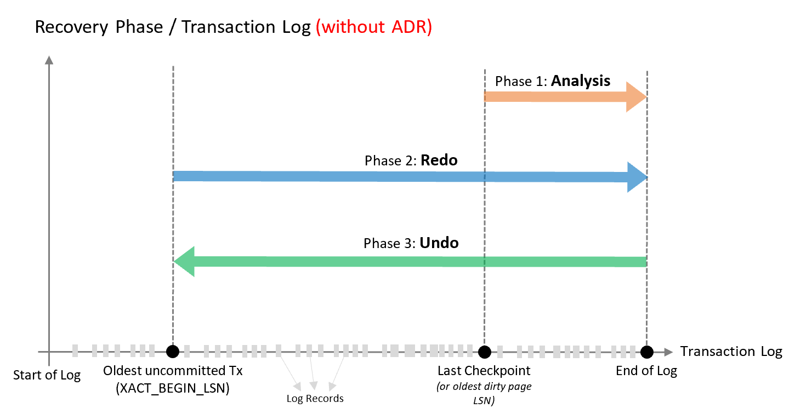
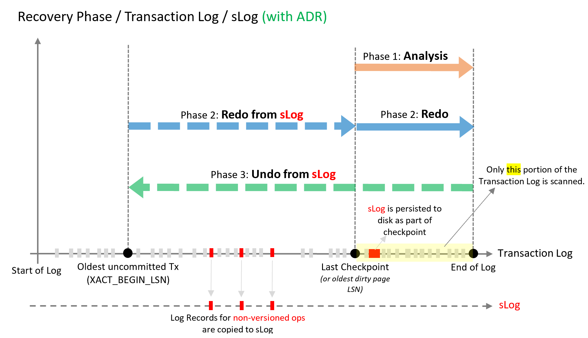

# Accelerated Database Recovery (preview)

**Accelerated Database Recovery (ADR)** is a new SQL database engine feature that greatly improves database availability, especially in the presence of long running transactions, by redesigning the SQL database engine recovery process. ADR is currently available for single databases, elastic pools, and Azure SQL Data Warehouse. The primary benefits of ADR are:

- **Fast and consistent database recovery**

  With ADR, long running transactions do not impact the overall recovery time, enabling fast and consistent database recovery irrespective of the number of active transactions in the system or their sizes.

- **Instantaneous transaction rollback**

  With ADR, transaction rollback is instantaneous, irrespective of the time that the transaction has been active or the number of updates that has performed.

- **Aggressive log truncation**

  With ADR, the transaction log is aggressively truncated, even in the presence of active long running transactions, which prevents it from growing out of control.

## The current database recovery process

Database recovery in SQL Server follows the [ARIES](https://people.eecs.berkeley.edu/~brewer/cs262/Aries.pdf) recovery model and consists of three phases, which are illustrated in the following diagram and explained in more detail following the diagram.

- **Analysis phase**

  Forward scan of the transaction log from the beginning of the last successful checkpoint (or the oldest page LSN) until the end, to determine the state of each transaction at the time SQL Server stopped.

- **Redo phase**

  Forward scan of the transaction log from the oldest uncommitted transaction until the end, to bring the database to the state it was at the time of the crash by redoing all operations.

- **Undo phase**

  For each transaction that was active as of the time of the crash, traverses the log backwards, undoing the operations that this transaction performed.

Based on this design, the time it takes the SQL database engine to recover from an unexpected restart is (roughly) proportional to the size of the longest active transaction in the system at the time of the crash. Recovery requires a rollback of all incomplete transactions. The length of time required is proportional to the work that the transaction has performed and the time it has been active. Therefore, the SQL Server recovery process can take a long time in the presence of long running transactions (such as large bulk insert operations or index build operations against a large table).

Also, cancelling/rolling back a large transaction based on this design can also take a long time as it is using the same Undo recovery phase as described above.

In addition, the SQL database engine cannot truncate the transaction log when there are long running transactions because their corresponding log records are needed for the recovery and rollback processes. As a result of this design of the SQL database engine, some customers face the problem that the size of the transaction log grows very large and consumes huge amounts of log space.

## The Accelerated Database Recovery process

ADR addresses the above issues by completely redesigning the SQL database engine recovery process to:

- Make it constant time/instant by avoiding having to scan the log from/to the beginning of the oldest active transaction. With ADR, the transaction log is only processed from the last successful checkpoint (or oldest dirty page Log Sequence Number(LSN). As a result, recovery time is not impacted by long running transactions.
- Minimize the required transaction log space since there is no longer a need to process the log for the whole transaction. As a result, the transaction log can be truncated aggressively as checkpoints and backups occur.

At a high level, ADR achieves fast database recovery by versioning all physical database modifications and only undoing logical operations, which are limited and can be undone almost instantly. Any transaction that was active as of the time of a crash are marked as aborted and, therefore, any versions generated by these transactions can be ignored by concurrent user queries.

The ADR recovery process has the same three phases as the current recovery process. How these phases operate with ADR is illustrated in the following diagram and explained in more detail following the diagram.

- **Analysis phase**

  The process remains the same as today with the addition of reconstructing sLog and copying log records for non-versioned ops.
- **Redo** phase

  Broken into two phases (P)
  - Phase 1

      Redo from sLog (oldest uncommitted transaction up to last checkpoint). Redo is a fast operation as it only needs to process a few records from the sLog.
  - Phase 2

     Redo from Transaction Log starts from last checkpoint (instead of oldest uncommitted transaction)
- **Undo phase**

   The Undo phase with ADR completes almost instantaneously by using sLog to undo non-versioned operations and Persisted Version Store (PVS) with Logical Revert to perform row level version-based Undo.

## ADR recovery components

The four key components of ADR are:

- **Persisted Version Store (PVS)**

  The persisted version store is a new SQL database engine mechanism for persisting the row versions generated in the database itself instead of the traditional `tempdb` version store. PVS enables resource isolation as well as improves availability of readable secondaries.

- **Logical Revert**

  Logical revert is the asynchronous process responsible for performing row level version based Undo - providing instant transaction rollback and undo for all versioned operations.

  - Keeps track of all aborted transactions
  - Performs rollback using PVS for all user transactions
  - Releases all locks immediately after transaction abort

- **sLog**

  sLog is a secondary in-memory log stream that stores log records for non-versioned operations (such as metadata cache invalidation, lock acquisitions, and so on). The sLog is:

  - Low volume and in-memory
  - Persisted on disk by been serialized during the checkpoint process
  - Periodically truncated as transactions commit
  - Accelerates redo and undo by processing only the non-versioned operations  
  - Enables aggressive transaction log truncation by preserving only the required log records

- **Cleaner**

  The cleaner is the asynchronous process that wakes up periodically and cleans page versions that are not needed.

## Who should consider Accelerated Database Recovery

The following types of customers should consider enabling ADR:

- Customers that have workloads with long running transactions.
- Customers that have seen cases where active transactions are causing the transaction log to grow significantly.  
- Customers that have experienced long periods of database unavailability due to SQL Server long running recovery (such as unexpected SQL Server restart or manual transaction rollback).

## To enable ADR during this preview period

During the preview period for this feature, send an email to [mailto:adr@microsoft.com](mailto:adr@microsoft.com) to learn more and try out Accelerated Database Recovery (ADR). In the e-mail, include the name of your logical server (for single databases, elastic pools, and Azure Data Warehouse). Since this is a preview feature, your testing server should be a non-production server.