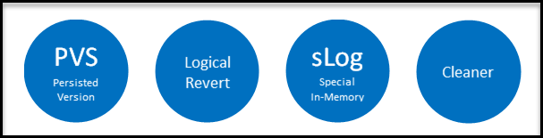

# Enable Accelerated Database Recovery (preview) for fast recovery and instantaneous transaction rollback

**Accelerated Database Recovery (ADR)** is a new SQL database engine feature that greatly improves database availability, especially in the presence of long running transactions, by redesigning the SQL recovery process. The primary benefits of Accelerated Database Recovery (ADR) are:

- Fast and consistent database recovery
- Instantaneous transaction rollback
- Aggressive log truncation

## The current database recovery process

Currently, the time it takes the SQL database engine (SQL Server and Azure SQL Database) to recover from an unexpected restart is (roughly) proportional to the size of the longest active transaction in the system at the time of the crash. Recovery requires a rollback of all incomplete transactions. The length of time required is proportional to the work that the transaction has performed and the time it has been active. Therefore, the SQL Server recovery process can take a long time in the presence of long running transactions (such as large bulk insert operations or index build operations against a large table).

In addition, the SQL database engine cannot truncate the transaction log in the presence of long running transactions because their corresponding log records are needed for the recovery and rollback processes. As a result of this design of the SQL database engine, some customers face the problem that the the size of the transaction log grows very large and consumes huge amounts of log space.

## The Accelerated Database Recovery (ADR) process

- **Fast and consistent database recovery**

  With ADR, long running transactions do not impact the overall recovery time, enabling fast and consistent database recovery irrespective of the number of active transactions in the system or their sizes.
- **Instantaneous Transaction rollback**

  With ADR, transaction rollback is instantaneous, irrespective of the time that the transaction has been active or the number of updates that has performed.
- **Aggressive Log Truncation**

  With ADR, the transaction log is aggressively truncated, even in the presence of long running transactions, which prevents it from growing out of control (especially when there are active long running transactions in the system).

## Who should consider Accelerated Database Recovery (ADR)

The following types of customers should consider enabling ADR:

- Customers that have workloads with long running transactions.
- Customers that have seen cases where their transaction log is growing fast.  
- Customers that have experienced long periods of database unavailability due to SQL Server long running recovery (unexpected SQL Server restart, manual transaction rollback).

## High-level architecture

The following diagram shows the four key architectural components of Accelerated Data Recovery feature:

- **Persisted Version Store (PVS)**

  The **persisted verion store** is a new SQL database engine mechanism for persisting the row versions generated in the database itself instead of the traditional `tempdb` version store. PVS enables resource isolation as well as improves availability of readable secondaries.

- **Logical Revert**

  **Logical revert** is the asynchronous process responsible for performing row level version based Undo - providing instant transaction rollback and undo for all versioned operations.

  - Keeps track of all aborted transactions
  - Performs rollback using PVS for all user transactions
  - Releases all locks immediately after transaction abort

- **sLog**

  **sLog** is a secondary in-memory log stream that stores log records for non-versioned operations (such as metadata cache invalidation, lock acquisitions, and so on). The sLog is:

  - Low volume and in-memory
  - Persisted on disk by been serialized during the checkpoint process
  - Periodically truncated as transactions commit
  - Accelerates redo and undo by processing only the non-versioned operations  
  - Enables aggressive transaction log truncation by preserving only the required log records

- **Cleaner**

  The cleaner is the asynchronous process that wakes up periodically and cleans page versions that are not needed.

## To enable ADR during this preview period

During the preview period for this feature, send an email to adr@microsoft.com to learn more and try out Accelerated Database Recovery (ADR). In thw e-mail, include the name of your managed instance or logical server (for single databases and elastic pools).